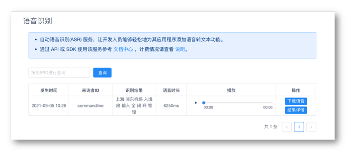

# 语音识别

Chatopera 机器人平台支持语音识别服务，将语言转化为文本内容。

## 支持语言

目前，Chatopera 机器人平台只支持简体中文（`zh_CN`）的语音识别，当机器人语言设置为 `zh_CN` 时可以使用。

## 查看语音识别历史

进入语音识别模块，查看语音识别请求历史。

<table class="image">
<caption align="bottom">图：语音识别列表</caption>
<tr><td></td></tr>
</table>

## 系统集成

使用 SDK 发送语音识别请求，[参考文档](https://docs.chatopera.com/products/chatbot-platform/integration/chatbot/asr.html)。

语音识别模块的服务费用参考[计费及发票](/products/chatbot-platform/billing.html)。

## 评论

