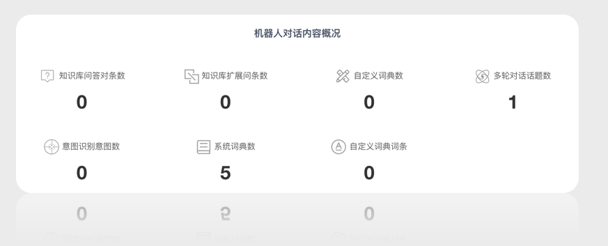

# 使用统计

在机器人的详情页面的第一栏，即默认打开详情页后，就可以看到机器人使用情况图表。

包括：机器人对话内容概况，机器人对话检索量，机器人对话效果分析等多种数据。

<table class="image">
<caption align="bottom">图：机器人对话内容概况</caption>
<tr><td></td></tr>
</table>

支持按任意时间段查询统计结果。

统计数据可指导 Chatopera 机器人平台用户计算投资回报率。

## 评论

