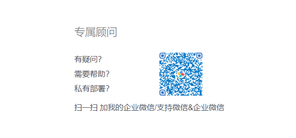
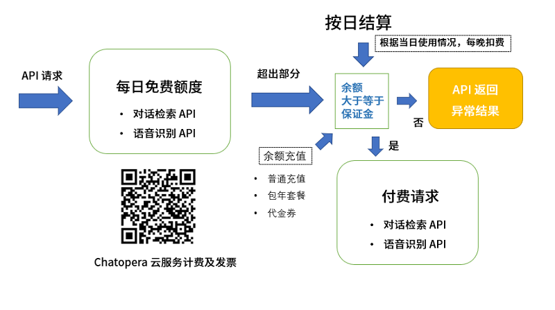
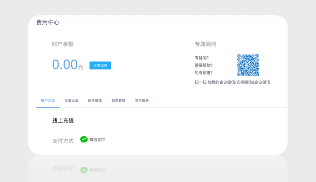
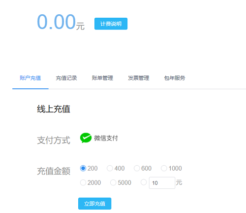

# 计费及发票

Chatopera 云服务的计费 API 包括：1）对话检索 API；2）语音识别 API。

## 对话检索

对话检索 API 包括内容参考[系统集成文档](/products/chatbot-platform/integration/api.html#对话检索)。

当前 Chatopera 云服务对话检索 API 有 **普通充值** 和 **包年套餐** 两种购买形式。

| 类型     | 适用对象               | 业务量                                      |
| -------- | ---------------------- | ------------------------------------------- |
| 普通充值 | 小型企业，初创公司     | 在线客服量每天不超过 50 人次，咨询量小      |
| 包年套餐 | 成长型企业，中大型公司 | 在线客服量每天超过 100 人次或更多，咨询量大 |

### 普通充值

**普通充值采用按日进行结算扣费的原则**，每日单个用户可以免费请求对话检索 API 100 次，即免费额度；单日 >100 次的部分按照每条 1 分钱计算，多出的部分按量收费，按日结算，每天生成账单。

### 包年套餐

包年，目前支持两个套餐类型。

| 简称   | 套餐（万条/年） | 费用（万元） | 相对于普通充值的优惠（万元） |
| ------ | --------------- | ------------ | -------------------------- |
| 套餐 A | 100             | 0.6          | 0.36                        |
| 套餐 B | 500             | 4            | 0.96                      |

- **套餐** 是记录总量，包含原**免费额度**;

- 超过**套餐**额度仍按照 1 分每条;

- **套餐**按年度计算，没有用完的额度过期作废;

- 可以从现有**套餐**升级到高级版本，但是不能从现有**套餐**降级，比如可以从套餐 A 升级到套餐 B，但是不能从套餐 B 降级到套餐 A;

- 购买一款套餐后，在使用期限内，不能重复重买同类型套餐;

- *相对于普通充值的优惠*是相对于**普通充值**的情况，前 100 条免费，超过后每条 1 分钱，购买套餐能省的钱;

- 购买套餐后，Chatopera 运营人员将套餐类型转化为普通充值金额更新到账户余额中。

购买 **包年套餐**，请联系 info@chatopera.com 或使用微信、企业微信添加专属顾问完成下单、获取发票。

## 语音识别

目前，语音识别 API 仅支持普通充值。

参考[语音识别 API 使用文档](/products/chatbot-platform/integration/api.html#语音识别)。

### 普通充值

每日单个用户可以免费请求语音识别 10 分钟，即免费额度；单日累积时长 >10 分钟的部分按照每秒 0.1 分钱（折合每小时 3.6 元）计算，多出的部分按量收费，按日结算，每天生成账单。

## 保证金机制

Chatopera 云服务计费包括每日**免费额度**和**付费请求**，当日超过免费额度部分收取费用，在`每晚 23:59`执行扣费。所以，对当日超过了免费额度的请求，Chatopera 云服务不会立即扣费。

为了保证 Chatopera 云服务为客户提供稳定连续的服务，尤其是付费用户的权益，Chatopera 云服务使用保证金机制：**Chatopera 云服务用户的对话检索或语音识别服务超过当日免费额度情况下，只有用户余额大于等于保证金的前提下，Chatopera 云服务才正常处理用户的请求；对于不满足这个条件的云服务用户，当日请求大于免费额度的部分将返回异常提醒。**

实行保证金机制的必要性：

- 提升 Chatopera 云服务的稳定性，避免了未付费用户突然占用大量系统资源；
- 区分付费用户和免费用户，为高级用户提供更有价值的服务；
- 预知系统使用情况，更好的制定系统升级扩容等维护计划。

**Chatopera 云服务完成当日结算，从余额中扣除付费部分时，账户余额会减少，这时可能会出现余额不足保证金或欠费的情况，这会影响第二天的付费请求，为此 Chatopera 云服务会根据用户的消费、余额情况，通过邮箱、短信等形式通知 Chatopera 云服务用户，请保证绑定手机号、提供正确的邮箱信息，因用户提供联系信息、认证信息而带来的损失，Chatopera 不承担任何赔偿。**

目前，**保证金** 金额是 _RMB 98 元_。

Chatopera 云服务用户注销账号时，可申请退回保证金，申请退回保证金请联系 info@chatopera.com。

> 提示：注销账号代表从 Chatopera 云服务删除账号信息及数据，该账号将无法使用 Chatopera 云服务或恢复账号，数据操作不可逆。

## 账单

登陆后，选择右上角头像，弹出菜单，在菜单中打开“费用中心”。 在费用中心可看到按时间段生成的账单。

<table class="image">
<caption align="bottom">图：费用中心</caption>
<tr><td></td></tr>
</table>

## 充值

Chatopera 云服务支持微信支付和企业银行账号汇款，在控制台右上角的导航栏进入“费用中心”进行相关操作。

## 发票

发票服务，在控制台右上角的导航栏进入“费用中心”进行申请，同时可发送邮件到 info@chatopera.com 中跟进发票开具状态。

## 私有部署

Chatopera 云服务是 Chatopera 机器人平台以“软件即服务(SaaS)”的方式提供给客户，同时企业可以获得 Chatopera 机器人平台以安装到企业的私有设备上，商定购买私有部署的版本，[联系我们](https://www.chatopera.com/mail.html)，私有部署版本只收取软件的商业授权证书费用，不按 API 请求量计费。

## 评论

