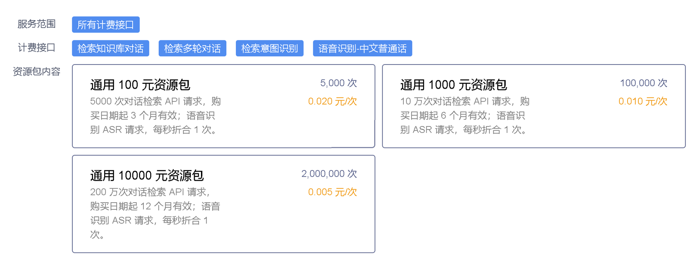
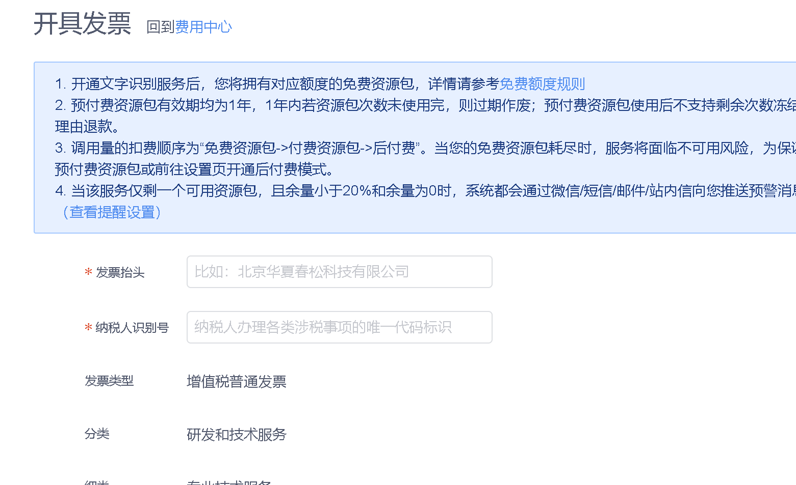
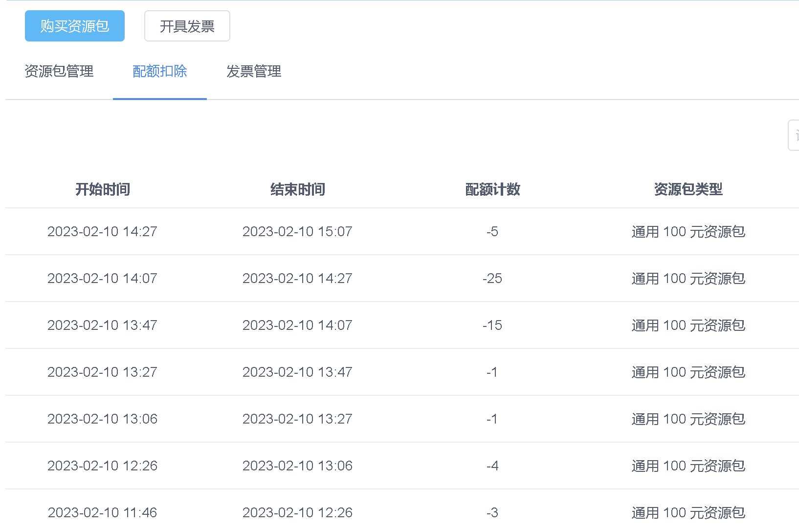

# 计费及发票

## 服务接口

Chatopera 云服务的计费接口包括：

1）对话检索 API，**按照 API 调用次数进行计费**

* 检索知识库对话，[说明文档](https://docs.chatopera.com/products/chatbot-platform/references/sdk/chatbot/chat.html#%E6%A3%80%E7%B4%A2%E7%9F%A5%E8%AF%86%E5%BA%93)

* 检索多轮对话，[说明文档](https://docs.chatopera.com/products/chatbot-platform/references/sdk/chatbot/chat.html#%E6%A3%80%E7%B4%A2%E5%A4%9A%E8%BD%AE%E5%AF%B9%E8%AF%9D)

* 检索意图识别，[说明文档](https://docs.chatopera.com/products/chatbot-platform/references/sdk/chatbot/chat.html#%E6%A3%80%E7%B4%A2%E6%84%8F%E5%9B%BE%E8%AF%86%E5%88%AB)

2）语音识别 API, **每秒折合为 1 次，按照 API 调用次数进行计费**

* 语音识别-中文普通话，[说明文档](https://docs.chatopera.com/products/chatbot-platform/references/sdk/chatbot/asr.html)

换算时，剩余的末尾时间不足一秒，则剩余时间按照 1 秒算。

## API 按次费用信息

**购买的资源包数额越大，则 API 调用配额次数越大、资源包周期越长、换算为单次请求越便宜。**

资源包包括次数额度，折合每次 API 请求的价格如下：

资源包购买地址 -

[https://bot.chatopera.com/billing/purchase](https://bot.chatopera.com/billing/purchase)

最终价格以【资源包购买地址】为准。

## 发票

发票管理地址 -

[https://bot.chatopera.com/billing/open-invoice](https://bot.chatopera.com/billing/open-invoice)

在控制台右上角的导航栏进入【费用中心-开具发票】进行申请，点击【发票管理】查看开具状态，在开票过程中，可能通过短信、邮件和电话方式联系，请保证填写正确信息和联系畅通。

提交申请发票如下图：

## 其它使用须知

### 1. 资源包

资源包有有效期和配额，用户在使用服务过程中，按照 API 调用次数或时长（ASR 语音识别）换算为计数，从配额中扣除。

### 2. 配额扣除

API 调用的计数定期从配额中扣除，记录查看【配额扣除】。配额扣除的顺序为“赠送资源包 > 购买资源包”。

[https://bot.chatopera.com/billing/quota](https://bot.chatopera.com/billing/quota)

配额扣除的记录如下图：

### 3. 注册送资源包

注册账户成功后，您将获得赠送资源包一个，请在其有效期内尽量使用：体验产品和上线服务。

### 4. 无资源包停服

当没有可用配额时，用户服务请求被拒绝，服务不可用，直至购买资源包后恢复。为保证业务不受影响，前往【购买资源包】页面购买。

### 5. 配额不足告警

资源包从下单支付后生效。若在有效期内配额未用尽，余量作废。仅剩一个可用资源包，且其余量小于 20% 时，平台会通过短信/邮件向您推送预警消息，消息通知可能有数小时延迟，收到通知后请尽快购买资源包。

### 6. 获得赠送资源包

反馈建议:

* 开发环境搭建、功能咨询和使用问题；
* 提交软件缺陷；
* 描述新需求、反馈建议；
* 瓶颈分析、性能优化建议和安全漏洞等。

打开链接 -

[https://github.com/chatopera/docs/issues/new/choose](https://github.com/chatopera/docs/issues/new/choose)

请在 issue 中填写您在 Chatopera 云服务的用户名，然后联系平台客服 info@chatopera.com 说明您的 Issue 地址和平台账户信息（用户名，手机号）。

根据反馈的内容的严重程度，合理程度等，给予 **【通用 100 元资源包】，【通用 1000 元资源包】 的赠送资源包**。
