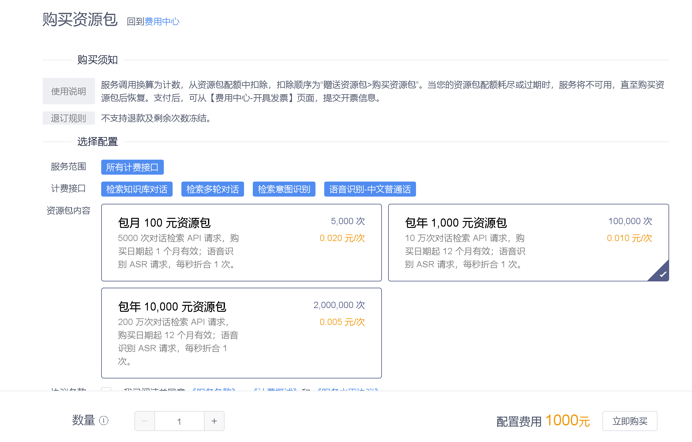

# 计费及发票

Chatopera 云服务的费用中心可以查询计费情况、资源包使用和购买、开具发票等信息。

[https://bot.chatopera.com/billing](https://bot.chatopera.com/billing)

以下是对使用该模块的进一步的介绍。

## API 计费预估

Chatopera 云服务的机器人平台消费情况，按照现有用户统计，90% 的用户的年使用费用在 ￥ 1000元  ~ ￥ 2000 元之间，这个区间可以帮助您做出适合的决策，因行业和用途的差异较大，不做进一步的分析。

您可以通过以下两个方式更准确的预估费用：

* 购买[￥ 100 元](https://bot.chatopera.com/billing/purchase)的资源包，评测使用的天数；

* 通过下文的内容详细了解计费标准，预估您的业务量，计算费用。

**在您获得了价格费用之后，只需要衡量产品是否满足了您的需求。您是不需要与之对比其他聊天机器人厂商的价格的**，因为 Chatopera 云服务的独创性、稳定性和开放性。

* 独创性：Chatopera 云服务的机器人平台在产品定位、功能设计、技术实现等方面具有**独创性**，率先定位于**为开发者提供定制多轮对话机器人的集成开发环境**，与其他厂商之间有产品差异，不具备比较的标准；
* 稳定性：Chatopera 云服务的机器人平台上线于 [2018 年 11 月](https://mp.weixin.qq.com/s/HMLjWN_ynpJWJx_OiL0GqQ)，持续迭代，为用户提供了多年持续稳定、可靠的服务；
* 开放性：Chatopera 云服务的机器人平台通过发布多项[开源技术](https://github.com/chatopera)和不断优化 SDK，来为用户提供开发者友好的产品，加速聊天机器人的应用和普及。

## API 计费服务接口

Chatopera 云服务的计费接口包括：

1）对话检索 API，**按照 API 调用次数进行计费**

* 检索知识库对话，[说明文档](https://docs.chatopera.com/products/chatbot-platform/references/sdk/chatbot/chat.html#%E6%A3%80%E7%B4%A2%E7%9F%A5%E8%AF%86%E5%BA%93)

* 检索多轮对话，[说明文档](https://docs.chatopera.com/products/chatbot-platform/references/sdk/chatbot/chat.html#%E6%A3%80%E7%B4%A2%E5%A4%9A%E8%BD%AE%E5%AF%B9%E8%AF%9D)

* 检索意图识别，[说明文档](https://docs.chatopera.com/products/chatbot-platform/references/sdk/chatbot/chat.html#%E6%A3%80%E7%B4%A2%E6%84%8F%E5%9B%BE%E8%AF%86%E5%88%AB)

2）语音识别 API, **每秒折合为 1 次，按照 API 调用次数进行计费**

* 语音识别-中文普通话，[说明文档](https://docs.chatopera.com/products/chatbot-platform/references/sdk/chatbot/asr.html)

换算时，剩余的末尾时间不足一秒，则剩余时间按照 1 秒算。

## API 计费标准

**购买的资源包数额越大，则 API 调用配额次数越大、资源包周期越长、换算为单次请求越便宜。**

资源包购买地址 -

[https://bot.chatopera.com/billing/purchase](https://bot.chatopera.com/billing/purchase)

最终价格以【资源包购买地址】为准。

## 发票

发票管理地址 -

[https://bot.chatopera.com/billing/open-invoice](https://bot.chatopera.com/billing/open-invoice)

在控制台右上角的导航栏进入【费用中心-开具发票】进行申请，点击【发票管理】查看开具状态，在开票过程中，可能通过短信、邮件和电话方式联系，请保证填写正确信息和联系畅通。

提交申请发票如下图：

## 其它使用须知

### 1. 资源包

资源包有有效期和配额，用户在使用服务过程中，按照 API 调用次数或时长（ASR 语音识别）换算为计数，从配额中扣除。

在购买同一款式的多件资源包时，只从配额数量上叠加，而有效期不改变。比如购买【包月 100 元资源包】3 件，那么配额容量就是 `5000 次 x 3`，而有效期依然是 1 个月有效。

### 2. 配额扣除

API 调用的计数定期从配额中扣除，记录查看【配额扣除】。配额扣除的顺序为“赠送资源包 > 购买资源包”。

[https://bot.chatopera.com/billing/quota](https://bot.chatopera.com/billing/quota)

配额扣除的记录如下图：

### 3. 注册送资源包

注册账户成功后，您将获得赠送资源包一个，请在其有效期内尽量使用：体验产品和上线服务。

### 4. 无资源包停服

当没有可用配额时，用户服务请求被拒绝，服务不可用，直至购买资源包后恢复。为保证业务不受影响，前往【购买资源包】页面购买。

### 5. 配额不足告警

资源包从下单支付后生效。若在有效期内配额未用尽，余量作废。仅剩一个可用资源包，且其余量小于 20% 时，平台会通过短信/邮件向您推送预警消息，消息通知可能有数小时延迟，收到通知后请尽快购买资源包。