# 多轮对话

## 概述

多轮对话基于规则，使用*对话脚本*，并结合 JavaScript*函数*实现固定话术和固定流程的聊天服务。聊天机器人开发者使用"多轮对话设计器"实现满足企业业务需求的聊天机器人。

<table class="image">
    <caption align="bottom">多轮对话管理</caption>
    <tr>
        <td>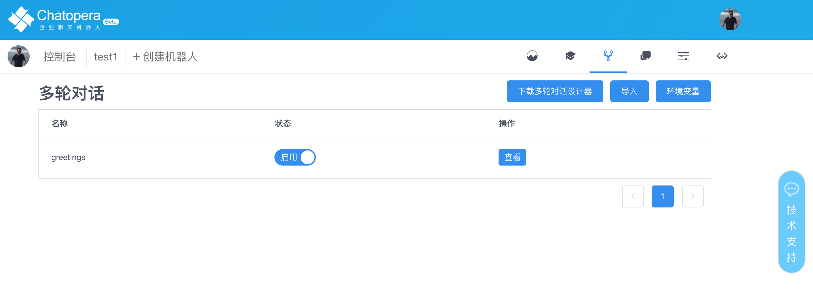</td>
    </tr>
</table>

在一些场景中，如导购、销售、邀约和筛选潜在客户等带有话术流程的需求中，使用**多轮对话**模块实现很方便，并且结合[知识库](/products/chatbot-platform/faq.html)和[意图识别](/products/chatbot-platform/intent.html)，可实现强大的智能问答服务。

## 术语

在多轮对话实现的过程中，解决的是一个复杂问题：能够让机器能分析和执行的自然语言的聊天过程。为此，不得不定义了一些专用的术语和概念：

| 中文                               | 英文                  | 描述                                                                                                                                     |
| ---------------------------------- | --------------------- | ---------------------------------------------------------------------------------------------------------------------------------------- |
| **多轮对话设计器**                 | Conversation Designer | 根据需求撰写对话脚本，对话函数的软件工具                                                                                                 |
| **对话、对话名称、对话主题、主题** | Topic / Topic Name    | 这几个词代表同一个概念：由一些脚本组成的、满足预期对话能力的单元。机器人的对话能力由多个对话主题组成，对话主题是对话脚本模块化管理的形式 |
| **输入**                           | Input                 | 用户向聊天机器人发送的消息的文字形式                                                                                                     |
| **匹配器**                         | Gambit                | 匹配用户输入文字的字符串，可以声明通配符，当用户的输入发生时，会按照算法顺序匹配                                                         |
| **通配符**                         | Star                  | 一些写法规则，约束字符串集合                                                                                                             |
| **回复**                           | Reply                 | 机器人回复用户输入的文字                                                                                                                 |
| **上次回复**                       | Last Reply            | 作为机器人给来访者回复的最近一次的内容                                                                                                   |
| **上下文钩子**                     | Conversation Hooks    | 通过**上次回复**，链接匹配器，形成多轮对话                                                                                               |
| **函数**                           | Function              | 可以从脚本中接受输入，并通过 JavaScript 执行任务返回结果的代码                                                                           |
| **对话状态**                       | Conversation Status   | 多轮对话是按照状态机的模型设计的，**对话状态**就是当前对话处于状态机的什么状态                                                           |

<table class="image">
<caption align="bottom">对话</caption>
<tr><td></td></tr>
</table>

### 多轮对话设计器

**多轮对话设计器** (Conversation Designer）是以自然语言为输入，定义聊天机器人逻辑思维的工具。它可以很方便的通过 Chatopera 支持的脚本语法描述复杂的对话逻辑，并且通过函数的形式集成企业的其它服务。**企业的业务人员**可以很容易的学习脚本语法，制作满足企业业务需求的聊天机器人。

**多轮对话设计器**是设计满足业务需求的对话机器人的 PC 端应用程序，现已支持 Windows 和 Mac OSX 平台。多轮对话能力是聊天机器人模仿人的对话能里的一大挑战，在复杂的上下文和需要很多背景知识的前提下，现有的人工智能技术是无能为力的，在 Chatopera，我们相信在企业服务中，当话术或流程固定的情况下，依赖 Chatopera 的产品可以输出用对话完成任务的服务，比如用对话完成点餐、报销、请假。这些对话可以在企业的聊天工具中，也可以通过智能音箱的等其他客户端。

#### 安装

支持 Mac OSX 或 Windows 操作系统。

下载地址：

| 版本   | 操作系统 | 下载                                                                                                                                                               |
| ------ | -------- | ------------------------------------------------------------------------------------------------------------------------------------------------------------------ |
| v1.0.1 | Mac OSX  | <a href="http://cdndownload.chatopera.com/sw/product/%E5%A4%9A%E8%BD%AE%E5%AF%B9%E8%AF%9D%E8%AE%BE%E8%AE%A1%E5%99%A8-1.0.0.dmg" target="_blank">链接</a>           |
| v1.0.1 | Windows  | <a href="http://cdndownload.chatopera.com/sw/product/%E5%A4%9A%E8%BD%AE%E5%AF%B9%E8%AF%9D%E8%AE%BE%E8%AE%A1%E5%99%A8%20Setup%201.0.0.exe" target="_blank">链接</a> |

- MacOS：`dmg`为文件后缀的安装文件，双击打开，根据安装向导安装。

- Windows：`exe`为文件后缀可执行文件，双击打开，根据安装向导安装。

#### 启动应用

- 安装完打开应用程序，如下图：

<table class="image">
<caption align="bottom">多轮对话设计器打开后页面</caption>
<tr><td></td></tr>
</table>

### 可能遇到的问题

**1. Macos 上首次启动警告**

<table class="image">
<caption align="bottom">MacOS权限问题</caption>
<tr><td>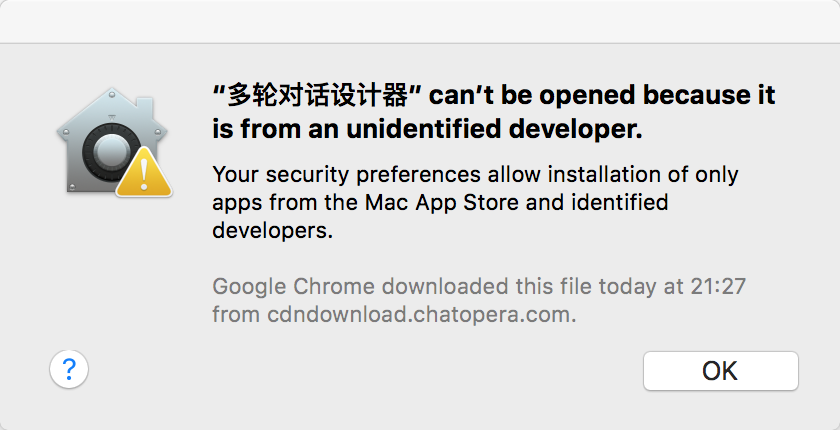</td></tr>
</table>

**解决方案**

在应用中心，找到“多轮对话设计器”：

<table class="image">
<caption align="bottom">应用中心</caption>
<tr><td></td></tr>
</table>

选择“多轮对话设计器”并且右键：

<table class="image">
<caption align="bottom">右键打开</caption>
<tr><td>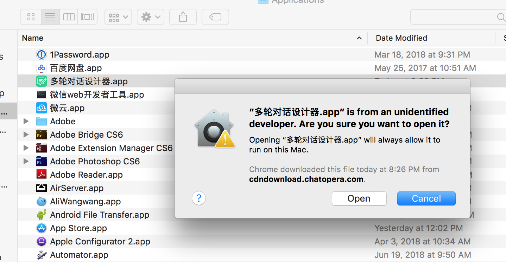</td></tr>
</table>

点击“打开”(“Open”)。

### 匹配器

**匹配器**是对话的基础，当用户向聊天机器人发送一条消息时，Chatopera 机器人平台会从所有定义的**匹配器**中找到匹配的一个。在 Chatopera 机器人平台中，**匹配器**用半角字符加号`+`开始，对应的回答是紧邻的下行，用半角字符减号`-`开始。

例如，我们可以这样定义一个对话：

```
+ 晚饭吃什么
- 北京烤鸭
```

**注意**：这里`+`和`-`和文字之间需要隔一个空格。

## 快速开始

本节读者可在不熟悉任何概念，只需要按照操作一步一步执行，就可以获得一个聊天机器人并熟悉工具使用，全面了解多轮对话不同工具的功能。

### 安装和启动应用

[下载安装包](/products/chatbot-platform/conversation.html#多轮对话设计器)后，双击打开，进入安装向导。

安装完打开应用图标后进入主面板，如下图：

<table class="image">
<caption align="bottom">应用主面板</caption>
<tr><td></td></tr>
</table>

### 导入示例程序

下载示例程序包文件：小叮当-1.0.0-conversations.c66

<a href="https://github.com/chatopera/conversation-sampleapp/raw/master/%E5%B0%8F%E5%8F%AE%E5%BD%93-1.0.0-conversations.c66" target="_blank"> https://github.com/chatopera/conversation-sampleapp</a>

<table class="image">
<caption align="bottom">示例程序下载地址</caption>
<tr><td></td></tr>
</table>

在主面板点击界面的右上方的“导入”按钮，选择刚才下载的示例程序*小叮当-1.0.0-conversations.c66*如图：

<table class="image">
<caption align="bottom">导入对话框</caption>
<tr><td></td></tr>
</table>

导入成功，可以看到在聊天机器人界面有一条数据显示，“名字 小叮当”等；点击小叮当的“管理”按钮，可以看到它的多轮对话列表，包括：chatopera，profile，weather。如下图：

<table class="image">
<caption align="bottom">多轮对话列表</caption>
<tr><td>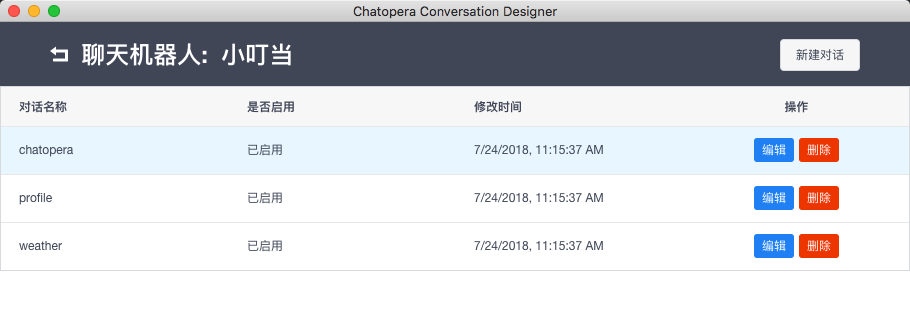</td></tr>
</table>

| 对话      | 功能                      |
| --------- | ------------------------- |
| chatopera | 关于 Chatopera 的公司信息 |
| profile   | 机器人的画像              |
| weather   | 提供天气查询功能的对话    |

### 测试示例程序

可以针对上面的三个多轮对话，进行一番聊天测试，下面测试主要以“问天气”为例子。

选择 “weather” 对话的编辑按钮，进入 weather 对话的编辑窗口，包括：

| 概念     | 描述                                                       |
| -------- | ---------------------------------------------------------- |
| **脚本** | 按照多轮对话语法规则来描述机器人对话逻辑                   |
| **函数** | 执行 JavaScript 代码的环境，声明的接口可以直接从脚本中调用 |
| **日志** | 函数中*debug*方法的输出                                    |
| **逻辑** | 聊天机器人的思维逻辑导图，保存脚本后自动生成               |
| **对话** | 实时测试聊天机器人的窗口                                   |

在“对话”区域的下方输入框输入：_你知道哪些天气信息_

<table class="image">
<caption align="bottom">多轮对话编辑窗口</caption>
<tr><td></td></tr>
</table>

点击“发送”按钮，可以看到对话区域有了问答的信息流，并且“逻辑”区域也有了对话状态，对话路径显示“绿色”高亮。

<table class="image">
<caption align="bottom">测试对话</caption>
<tr><td>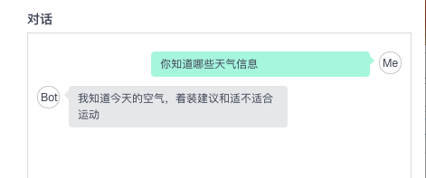</td></tr>
</table>

在此界面可以进行多轮对话测试，如下截图：

<table class="image">
<caption align="bottom">多轮对话</caption>
<tr><td>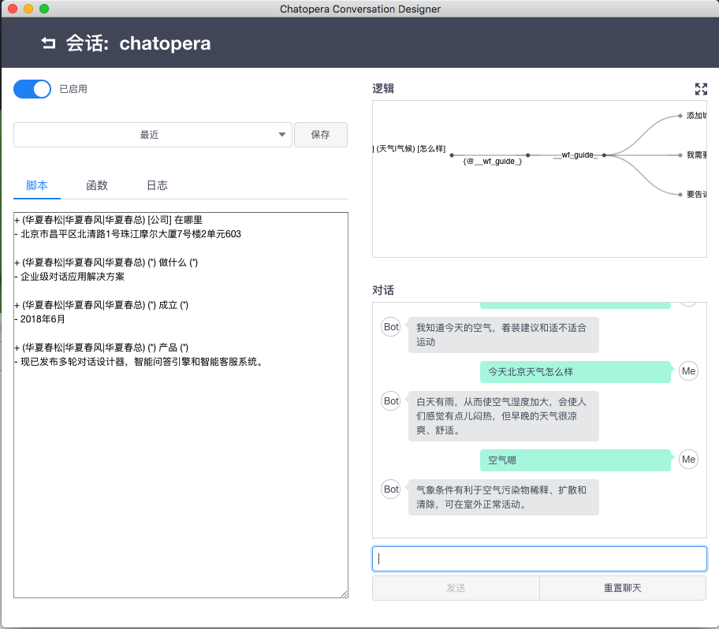</td></tr>
</table>

### 增加新的对话

> 测试新对话

```
我：今天北京适合游玩么？
机器人：风清气爽，当然可以啊～
```

在脚本区域可以自行设计脚本，非常简单，例如增加：

```
+ 今天 (*) 适合游玩么？
- 风清气爽，当然可以啊～
```

点击界面上方“保存”按钮，会使得刚才定义的对话生效，并且可以在聊天区域直接测试。

### 保存新版本

刚才点击“保存”按钮时，同时将 weather 的对话生成一个快照，我们随时可以回退到某个快照。

<table class="image">
<caption align="bottom">查看快照</caption>
<tr><td></td></tr>
</table>

回到聊天机器人列表页面，可以点击“发布”按钮，可以将当前聊天机器人生成新版本，相关的信息如图：

<table class="image">
<caption align="bottom">发布新版本</caption>
<tr><td></td></tr>
</table>

点击上图的“确认”按钮，发布新版本成功，点击“版本管理”，看到刚才发布的 1.0.1 版本的信息。

### 各个版本之间比较

对于聊天机器人的发布的各个版本差异，可以使用版本比较工具，比较具体的差异，包括：脚本比较和函数比较。
点击上图 1.0.1 对应的“对比差异”，可以“对比变化”界面，其中分为三个部分，

```
    - “左上”为被对比的参考版本；本例子为:1.0.0

    - “右上”为要对比的目标版本，本例子为:1.0.1

    - “下方”为两版本数据的差异，具体：

        * 绿色：新增的内容；

        * 红色：删除的内容；

        * 灰色：没有变化的内容；
```

刚进入“对比变化”界面，默认对比的是：函数，本例子请在选择“版本号”的右边切换“脚本”为“对话”，如图：

<table class="image">
<caption align="bottom">版本之间比较差异</caption>
<tr><td></td></tr>
</table>

对比的差异部分为绿色，表示新增。

### 导出特定版本

多轮对话设计器属于设计阶段，在机器人满足需求后，可以导出为对话应用.c66 文件，方便分发和部署。在生产环境，导入到<a href="https://docs.chatopera.com/chatbot-engine.html" target="_blank">智能问答引擎</a>中，作为多轮对话应用的运行时。

在“版本管理”界面，选择刚才发布的“1.0.1”的“导出”，可以选择一个路径存储该导出的文件，如图：

<table class="image">
<caption align="bottom">导出文件</caption>
<tr><td>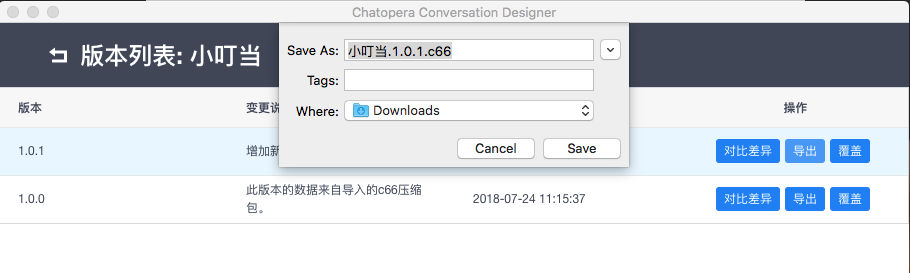</td></tr>
</table>

以上并没有给出程序实现的过程，阅读[使用进阶](https://docs.chatopera.com/products/chatbot-platform/conversation.html#%E6%9C%80%E4%BD%B3%E5%AE%9E%E8%B7%B5)相关内容可了解示例程序的来龙去脉。

## 通配符

为了让**匹配器**能适应复杂的需求，Chatopera 机器人平台使用通配符规则，通配符既能让规则具有更好的匹配能力，也能让回复和函数中使用不同通配符的值。

**注意**：下面的某些通配符左右带有空格，这些空格是必须的。

### 全能匹配

全能匹配通配符会匹配零到无穷个字符、单词。

<font color="blue"><b>(\*)</b></font>

此处的输入也会被系统捕获或者存储。

```
+ (*) 你好 (*)
- 欢迎光临
```

```
匹配：客服你好
匹配：你好
匹配：你好吗
```

### 固定长度通配符

如果你知道你想要的字符长度，使用固定长度通配符。

<font color="blue"><b>\*n</b></font>

其中 n 代表长度。

此处的通配符可以被系统捕获，而且可以在回答中使用。

```
+ 早安 *2
- 早安
```

```
匹配：早安北京
不匹配：早安乌鲁木齐
```

### 可变长度通配符

<font color="blue"><b>\*~n</b></font>

如果只想匹配一些字符，可控长度的通配符是个不错的选择。 n 代表你想匹配的最大长度。

```
+ 早安 *~4
- 早安
```

```
匹配：早安
匹配：早安北京
匹配：早安哈尔滨
匹配：早安乌鲁木齐
不匹配：早安君士坦丁堡
```

### 区间通配符

如果想匹配一个确定的区间，比如 2 到 4 个字符之间，区间通配符绝对可以满足需要。

<font color="blue"><b>\*(最短-最长)</b></font>

此通配符可以被系统捕获和用在回复中。

```
+ 早安 *(2-4)
- 早安
```

```
匹配：早安北京
匹配：早安乌鲁木齐
不匹配：早安
```

### 必选项

必选项用在你有一系列可选项，但是必须有一个被匹配。

<font color="blue"><b>(候选-1|候选-2|...|候选-n)</b></font>

输入中的可选项会被系统捕获和用在回复中。

```
+ 早安(北京|上海|天津)
- 早安
```

```
匹配：早安北京
不匹配：早安西安
不匹配：早安
```

### 可选项

可选项用来确定一些额外的内容。

<font color="blue"><b>[可能值-1|可能值-2]</b></font>

```
+ 早安 [美丽的] 北京
- 早安
```

**注意：此处 `[]` 前后的空格不可省略。**

```
匹配：早安北京
匹配：早安美丽的北京
不匹配：早安热闹的北京
```

## 回复

在**匹配器**中，我们已经学到了怎么添加一个回答。事实上你可以添加任意数量的回答。这里还有一些高级功能可以帮助你完成更多的任务。

### 简单形式

```
+ 在吗
- 你好，在的
```

如果添加了多个回答，系统会从中随机挑选一个作为回复, 然后丢掉这个回答。

```
+ 在吗
- 亲，在的
- 亲，有什么需要帮助
- 你好，请问遇到什么问题了吗？
```

所谓丢掉这个答案，是指机器人针对同一个用户，在半个小时内再次匹配上该**匹配器**时，选择回复时，不考虑使用过的回复。
在一个**匹配器**中声明多个回复后，保存，**逻辑**中将出现分支。

<table class="image">
<caption align="bottom">机器人对话逻辑</caption>
<tr><td></td></tr>
</table>

如果不想让系统丢掉使用过的回复，可以在回复前添加{keep}。

```
+ 在吗
- {keep} 亲，在的
- 亲，有什么需要帮助
- 你好，请问遇到什么问题了吗？
```

也可以在匹配器前添加*{keep}*，就不用在每个回答中都添加了

```
+ {keep} 在吗
- 亲，在的
- 亲，有什么需要帮助
- 你好，请问遇到什么问题了吗？
```

如果回答很长，可以通过“^”分割以方便可读性。可以通过“\n”实现换行

```
+ 在吗
- 你好，这里是客服中心，\n
^ 请问遇到什么问题了吗？
```

它等价于

```
+ 在吗
- 你好，这里是客服中心，请问遇到什么问题了吗？
```

### 上下文钩子

在实际应用中，和机器人聊天时，很可能要通过**上下文钩子**完成一个任务。我们用(**%**)来定位之前回复，声明新的匹配器，(**%**)后的内容是和某个回复内容一样的字符串，这里的(**%**)称之为“上下文钩子”。

```
+ *
- 您身高多少

  + *(3-5)
  % 您身高多少
  - 我的身高也是&#60;cap&#62;
```

让我们一起看看这个例子：

1. 当用户输入任何文字，我们用通用通配符触发回答,然后系统回复“您身高多少”。

2. 当用户继续输入时，系统会先从历史中查看之前的回复中是否有对应的上下文，在这里指的是“% 您身高多少”

3. 最后，如果用户输入 3 到 5 个字符，系统匹配匹配器“+ \*(3-5)”, 并且回复“我也是&#60;cap&#62;”。“&#60;cap&#62;”代表的就是用户输入的内容。

### 引用回复

有些时候，在问答对中重用一些回复能使编写脚本效率更高，这时可以定义一个问答对，并在脚本其它位置引用它。

```
+ 在吗
- {@__greeting__} 请问有什么能帮助您？

+ __greeting__
- 亲，在的。
- 你好，客服小美为您服务
- 亲亲，稍等，客服马上就到
```

引用的方式就是 `{@匹配器}`，匹配器中的下划线不是必须的，上面例子中的匹配器`__greeting__`的命名是为了增强脚本的可读性。

将一些常用的回复以约定的匹配器命名方式命名，不但方便复用回复，使脚本可读性好，方便维护，而且更方便使用**上下文钩子**实现多轮对话。

```
+ 在吗
- {@__greeting__}

    + (*) 问路 (*)
    % {@__greeting__}
    - 请使用地图APP

    + (*) 打车 (*)
    % {@__greeting__}
    - 出租车在门口挥手示意停车

    + (*)
    % {@__greeting__}
    - {@__greeting__}

+ __greeting__
- 亲，在的。请问有什么能帮助您？
- 你好，客服小美为您服务
- 亲亲，稍等，客服马上就到
```

### 通配符取值

有些时候，在回答中需要使用输入中的通配符值，这时可以使用&#60;cap&#62;达到目的。

```
+ 我是 *~3
- 你好，&#60;cap&#62;
```

```
匹配：小明比小红高
回答：你确定小明比小红高吗？
```

如果用户输入，“我是张三”，那么系统将回复“你好，张三”，当有多个槽时，可以使用多个&#60;cap&#62;。

```
+ *2 比 *2 高
- 你确定&#60;cap1&#62;比&#60;cap2&#62;高吗？
```

在对话中，我们有时候会需要以前的通配符值，看一下下面这个例子：

```
+ 我叫 *~3
- 你好，&#60;cap1&#62;

    + 你猜我叫什么？
    % 你好，&#60;cap1&#62;
    - 你刚说了，你叫&#60;p1cap1&#62;
```

&#60;pNcapM&#62;代表了以前的通配符。其中*N*代表在在对话中之前的问答，*M*代表捕获的位移。

<table class="image">
<caption align="bottom">通配符取值</caption>
<tr><td></td></tr>
</table>

此处，上下文钩子，即`%`开头的句子，代表匹配器“你猜我叫什么？”只服务于“你好，&#60;cap1&#62;”作为回复时，它会被优先匹配。上一轮对话的回复通过(%)的方式指定了接下来的逻辑，形成多轮对话。

**提示：+/%/- 前的空格不是必须的，在多轮对话中，空格可以增强脚本的可读性，比如使用上下文钩子中的段首缩进。**

## 函数

函数是一个强大而有趣的设计。在回复中，可以使用函数来获取整条消息对象，用户对象或者其它资源，比如数据库。

### 函数定义

把通配符值当做变量传给函数，例如下面这个例子：

```
+ 我的用户名是 *(2-10)
- ^getUserAccount(<cap>)
```

所以，调用函数的方式就是使用“^”。在函数的编辑窗口中，可以这样定义：

```
exports.getUserAccount = function(account, cb) {
  cb(null, "对不起，系统没有找到" + account);
}
```

函数的声明中，参数列表首先是通配符的值，可以传多个，然后最后一个参数始终是回调函数(cb)，cb 的参数列表为`(error, text)`，`text` 作为文本添加到回复中，`error`是指处理中发生异常。

函数的定义也同样支持`async/await`语法，例子如下：

```
exports.getUserAccount = async function(account) {
    return "对不起，系统没有找到" + account;
}
```

使用`async/await`时，需要抛出异常时，通过 `throw new Error("ERROR MESSAGE")` 完成。

在系统集成时，业务系统的需求千差万别，为了灵活的支持各种需求，在函数中也可以自定义返回值。

```
exports.getUserAccount = function(account, cb) {
  cb(null, {
      text: "对不起，系统没有找到" + account,
      params: {
          resetPasswd: "http://example.com/reset-account"
      }
  });
}
```

其中，`params`可定义为`[]`或`{}`对象，该用法同样适用于`async/await`函数。

```
exports.getUserAccount = async function(account) {
    return {
      text: "对不起，系统没有找到" + account,
      params: {
          resetPasswd: "http://example.com/reset-account"
      }
}
```

在[系统集成/多轮对话检索](https://docs.chatopera.com/products/chatbot-platform/integration.html#%E6%A3%80%E7%B4%A2%E5%A4%9A%E8%BD%AE%E5%AF%B9%E8%AF%9D)时，返回值`data`内将增加`params`属性，与以上设定的值相同。

### 复合函数

在回复中，可以添加任意多的函数，比如

```
+ ...
- 联合 ^callFunction1() 和 ^callFunction2(&#60;cap1&#62;)
```

### 嵌套函数

在函数的回调函数中，函数名会被解析成对应的函数，所以放心的在回复中添加任意合法的函数，比如在脚本中这样写：

```
+ ...
- ^nestedAFunction()
```

然后，在函数中，定义如下：

```
exports.nestedAFunction = function(cb) {
  cb(null, "张三 ^nestedBFunction()");
}
exports.nestedBFunction = function(cb) {
  cb(null, "和李四");
}
```

### 函数工具

在开发中，进一步提供系统灵活性，在`函数`定义中，系统预置了以下几个工具对象，方便聊天机器人开发者实现各种功能的聊天机器人。以下内容假设读者已经掌握了`JavaScript`编程语言。

> 提示：以下使用 `this` 前缀的变量代表该变量依赖于在函数内部的 `this` 对象。

#### this.user.id

当前对话用户标识，在 [知识库检索](https://docs.chatopera.com/products/chatbot-platform/integration.html#%E6%A3%80%E7%B4%A2%E7%9F%A5%E8%AF%86%E5%BA%93)、 [意图识别检索](https://docs.chatopera.com/products/chatbot-platform/integration.html#%E6%A3%80%E7%B4%A2%E6%84%8F%E5%9B%BE%E8%AF%86%E5%88%AB) 和 [多轮对话检索](https://docs.chatopera.com/products/chatbot-platform/integration.html#%E6%A3%80%E7%B4%A2%E5%A4%9A%E8%BD%AE%E5%AF%B9%E8%AF%9D)传入的`userId`信息。

在函数中，获取该唯一标识信息：

```
this.user.id
```

比如：

```
exports.myUserId = function(cb){
    cb(null, {
        text: "Your id is " + this.user.id
    })
}
```

#### this.user.history

当前用户与机器人对话的历史

```
this.user.history 类型：数组
```

其中，每个元素内容如下：

```
{
    "input" : {
        "timestamp" : ISODate("2020-07-28T17:06:01.458Z"),
        "original" : "hello"
    },
    "reply" : {
        "createdAt" : 1595955961672.0,
        "string" : "#in-params#",
        "topicName" : "greetings",
        "clearConversation" : false,
        "props" : {
            "params" : [
                {
                    "hyperlink" : "http://",
                    "thumbnail" : "http://xx.png",
                    "summary" : "描述",
                    "title" : "标题",
                    "type" : "card"
                }
            ]
        },
    }
}
```

其中，*original*就是来访者的输入，*reply*是上一轮对话中机器人的回复。

历史对话按照降序排列，即最近发生的对话在上面，最多存储 100 轮历史对话数据。

#### config

获取**环境变量**，环境变量在**多轮对话设计器**和**聊天机器人多轮对话控制台**都可以定义，目的是在设计阶段和运行阶段，多轮对话使用不同的配置。

<table class="image">
<caption align="bottom">配置环境变量</caption>
<tr><td>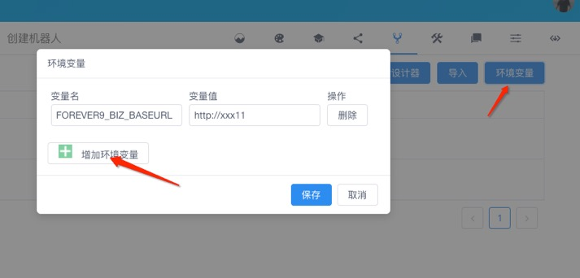</td></tr>
</table>

`config`作为函数中的全局常量，不需要用户定义，不支持改变该值，只能作为读取用途，并且`config`只是键值对，值只是`string`类型。

```
exports.print_key_value = function(key, cb){
    // 通过通配符获得key, 查看其在环境变量中对应对值
    cb(null, "Ok, value is " + config[key]);
}
```

`环境变量`常用来配置一些生产环境对应的信息。

#### http

用于在函数内部，通过 HTTP 协议集成外部系统。

`http`作为函数中的全局常量，不需要用户定义。

```
http.get(url[, config])
http.delete(url[, config])
http.head(url[, config])
http.options(url[, config])
http.post(url[, data[, config]])
http.put(url[, data[, config]])
http.patch(url[, data[, config]])
```

Chatopera 机器人平台中，函数内置`http`常量使用[axios](https://www.npmjs.com/package/axios)包实例化，`http`即`axios`，详细使用文档参考

[https://github.com/axios/axios](https://github.com/axios/axios)

#### debug

打印调试日志。

`debug`作为函数中的全局常量，不需要用户定义。

```
debug("hello")
debug("hello %s", stringVar)
debug("hello %s, %j", stringVar, jsonVar)
debug("hello %s, %o", stringVar, objVar)
```

#### this.maestro

maestro 是管理对话状态存储和自然语言处理的高级接口，在函数中，使用 this.maestro 来引用。

**注意事项：**

1. 对于返回值是 Promise 的接口，使用 try catch, await 进行调用可读性更好。

2. 该对象不是全局函数，作用域在函数内部，使用时依赖于函数内`this`变量。

- 存储键值对

```
this.maestro.set(KEY, VALUE [, EXPIRES]) 返回值: Promise
```

存储键值对，支持过期时间，过期时间以秒为单位。VALUE 可以是时间，字符串，数字。

该命令也可以用于更新键值对，或者更新 EXPIRES 时间，让该信息不过期。

- 获得键值对有效时间

键值对是存储在 Redis 服务中，如果设定键值对时同时对`EXPIRES`赋值，那么到达过期时刻，该键值对将被删除。使用`ttl`接口获得一个键值对有效存在时间，返回值是有效的秒数，如果返回值为`-1`则代表该值不存在。

```
this.maestro.ttl(KEY) 返回值: Promise(number)
```

- 增加键的值

```
this.maestro.incrby(KEY, NUMBER) 返回值: Promise
```

对于 Number 类型的键，增加一定值。

- 获得一个键的值

```
this.maestro.get(KEY) 返回值: Promise
```

获得一个键的值。

- 删除一个键和其值

```
this.maestro.del(KEY) 返回值：Promise
```

删除一个键和其值。

- 获得绝对时间

获得绝对时间，比如 来访者提到 “明天”，“后天”，“下周一”等相对时间，会被计算出正确的绝对时间，时区为北京时间。

```
let time = await this.maestro.extractTime(cap1)
this.maestro.formatTime(time[0].toString(), "YYYY年MM月DD日") # 从返回值中格式化日期，formatTime返回值 String
```

- 发送邮件

通过邮件服务器发送邮件, 使用 [nodemailer](https://nodemailer.com/) 实现。

```
exports.sendMail = async function(argvs) {

let mailSettings = {
        service: config['MAIL_SERVICE'],
        auth: {
            user: config['MAIL_ACCOUNT'],
            pass: config['MAIL_PASSWORD']
        }
    };
    let transporter = this.maestro.nodemailer.createTransport(mailSettings);
    // setup e-mail data with unicode symbols
    let mailOptions = {
        from: `HR<${config['MAIL_ACCOUNT']}>`, // sender address
        to: config['MAIL_RECEP'], // list of receivers
        subject: `【应聘】小主，新增候选人了，岗位${openning}`, // Subject line
        text: '', // plaintext body
        html: content, // html body
    };
    // send mail with defined transport object
    transporter.sendMail(mailOptions, function(error, info) {
        if (error) {
            debug(error);
        }
    });
```

以上 SMTP 邮件服务的配置需要定义在环境变量中，支持的邮箱服务参考[nodemailer](https://nodemailer.com/smtp/well-known/)，可配置 QQ 企业邮箱、163 邮箱等。

- 设置用户画像

```
await this.maestro.profile(userId, property, value) 返回值 Promise
```

_userId_: 用户唯一标识

_property_: 用户的属性

_value_: 属性值

该接口用于持久化一个用户的信息，此处 userId 可以使用当前用户的信息`this.user.id`；`property`和`value`是根据业务灵活定义。

该信息被持久化到数据库里，该接口的目的是设置用户画像，比如用户对一个产品是否有兴趣。

用户画像可以通过[系统集成/用户管理/获取用户画像信息 API](/products/chatbot-platform/integration.html#%E8%8E%B7%E5%8F%96%E7%94%A8%E6%88%B7%E7%94%BB%E5%83%8F%E4%BF%A1%E6%81%AF)获得。

## 对话状态管理

在多轮对话中，来访者和机器人对话的过程可以想像成来访者使用地图游览，每个时刻，来访者的位置都可以映射到地图上。地图有一定的行走路径，来访者下一步所能选择的方向是由当前状态提供的。

现在，来访者与机器人对话的状态会保持 30 分钟，比如来访者想要点餐，但是说了一句“我要点晚餐”，然后半个小时没有继续发送信息，那么等来访者再次发送信息时，机器人已经不记得上文了。

上下文状态和机器人记忆，都是让机器人有更强的对话处理能力：通过**上下文钩子**和**通配符取值**，设计对话流程，满足各种定制化业务。

在实际应用中，对话状态按照匹配器、上下文钩子和时间作用改变外，还有哪些办法影响对话状态呢？以下介绍三种方法，改变对话状态。

### 清除状态

所谓清除状态，就是在处理完某次回复，不再需要用户处于当前对话状态，而恢复默认对话状态。

解决办法：设置回复的文本以 `{CLEAR}` 开头。比如：

```
+ 再见
- {CLEAR} 感谢您选择我们，期待再次光临！
```

`{CLEAR}` 可以添加在 **回复** 或 **函数返回值**中。在 Chatopera 机器人平台返回给来访者时，文本内容会去掉这个前缀。

这个方法很实用，尤其是在**全能匹配器**，对话可能进入死循环，因为所有的输入都被全能匹配拦截，那么在对应的回复中使用`{CLEAR}`就达到了下一次对话进入默认状态，不优先匹配**全能匹配器**的目的。

### 切换话题

在多轮对话中，开发者可以定义多个**对话主题**，对话主题的名字是字母组成的字符串，使用回复在不同对话主题间跳转。

```
+ 你好
- ^topicRedirect("greetings","你好")
```

_topicRedirect_ 是内置的函数，第一个参数是目标主题名字，第二个参数是目标匹配器。

### 知识库路由

设置知识库问答对，在答案中按照特定格式书写，直接路由到多轮对话的主题和匹配器。

在 Chatopera 机器人平台中，多轮对话检索过程中，使用[洋葱模型](https://www.infoq.cn/article/2014/11/ddd-onion-architecture)。[多轮对话检索接口](/products/chatbot-platform/integration.html#检索多轮对话)时，会先检索知识库，参考知识库的检索结果执行回复逻辑。此处进一步参考：

[多轮对话检索逻辑](/products/chatbot-platform/integration.html#服务器端逻辑)

## 使用进阶

以上是多轮对话设计器 v1.x 版本中支持的脚本语法，这些语法能够保证业务人员实现满足需求的聊天机器人，除了函数部分的有一点门槛外，其它内容是非常容易掌握的。对于函数，只需要一点 `JavaScript` 基础知识，就可以掌握。

本节介绍使用多轮对话设计器实现一个“聊天机器人”的具体过程。我们以实现天气问答机器人为例，我们选择这个场景并不是因为它简单，而是因为它容易理解，使用多轮对话设计器可以实现更复杂，更有价值的应用。我们先一睹为快，这个机器人是什么样子的。

<video controls="" style="width:480px;height:400px" poster="../../images/products/platform/weather-bot-demo-cover.jpg" >
  <source
    src="https://static-public.chatopera.com/bot/videos/weather-bot-demo.mp4"
    type="video/mp4;codecs=&quot;avc1.42E01E, mp4a.40.2&quot;"
  >
</video>
</br>
</br>

是不是很实用？如果你掌握了多轮对话设计器，就可以实现聊天机器人。

### 需求分析

首先，我们需要梳理一下需求：

1. 我想知道任意城市的天气信息，比如“今天上海天气怎么样”；

2. 我还比较关心空气，我可以通过“今天上海空气怎么样”获得空气质量信息；

3. 我想知道今天适不适合户外运动，就问“今天上海适合运动么”；

4. 如果我问了一个城市的天气状况，我还想继续询问这个城市更多信息，这样我不用每次都告诉机器人城市名称。

当然，我的每个意图都有多种表述方式，机器人能支持一些变化的问法。如果我的问题不够严谨，机器人还应该提醒我合理的表达。

### 调研提供天气信息查询的 API

现在很多服务以 API 的形式提供，从搜索引擎中查找“天气查询服务 API”，我们就能得到一些供应商，经过一些比较，我选择了和风天气，它数据丰富，免费额度大方。

<table class="image">
<caption align="bottom">和风天气</caption>
<tr><td></td></tr>
</table>

### AI 音箱

Chatopera 与杭州任你说科技达成战略合作伙伴关系，所以，我们的对话系统产品与任你说音箱可以直接集成。

<table class="image">
<caption align="bottom">任你说官网</caption>
<tr><td>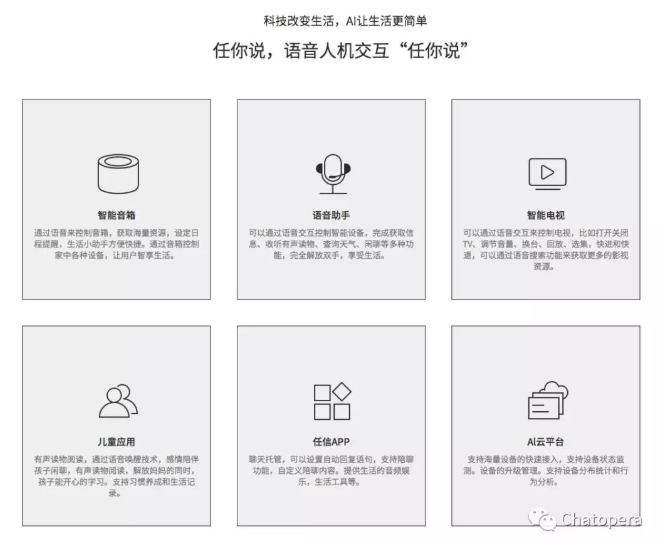</td></tr>
</table>

### 第一条规则

第一次打开多轮对话设计器后，我们看到如下的面板，我们称之为主面板。

<table class="image">
<caption align="bottom">和风天气</caption>
<tr><td></td></tr>
</table>

点击新建按钮，弹出创建机器人的表单：

<table class="image">
<caption align="bottom">创建聊天机器人</caption>
<tr><td></td></tr>
</table>

填入“小叮当”，当前多轮对话设计器支持中文(zh_CN)和英文(en_US)，我们选择“zh_CN”，点击“确认”。然后我们就得到了一个聊天机器人。

<table class="image">
<caption align="bottom">聊天机器人</caption>
<tr><td></td></tr>
</table>

在操作中，有几个按钮：

- 管理：管理聊天机器人的多轮对话。

- 版本管理：管理不同版本的机器人，导出机器人和在不同版本之间进行比对。

- 环境变量：机器人函数中依赖的全局变量，这些变量在“设计对话”的阶段和在 IT 人员“部署到生产环境”下的值是不同的，比如一些接口服务的认证键值对。

- 发布：发布当前机器人为最新版本。

- 删除：将机器人删除。

点击“管理”，进入多轮对话管理页面，点击“新建对话”，在弹出的窗口中，填写“对话名称”为“weather”，点击“确认”。这时，我们看到了新建的对话，我们将修改它的内容完成天气对话服务。

<table class="image">
<caption align="bottom">创建对话</caption>
<tr><td>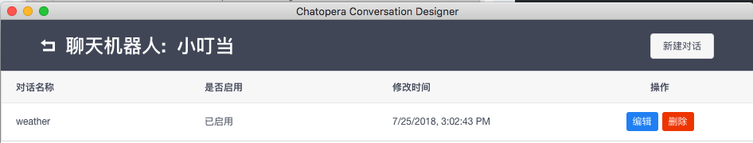</td></tr>
</table>

点击“编辑”，进入**对话编辑窗口**。在左侧的“脚本区域”，写下第一条规则。

```
+ 今天 (*) 天气 [怎么样]
- {keep} &#60;cap1&#62;天气挺好的
```

点击“保存”，这时右侧的“逻辑区域”有了变化，出现了一个线条，在线条左右两端分别是问题和答案。在“对话区域”，我们输入“今天北京天气怎么样”，点击发送，这时机器人回复了。

<table class="image">
<caption align="bottom">对话编辑窗口</caption>
<tr><td></td></tr>
</table>

从我们需求上看，这没什么用，但是它工作了，我们就一点点优化它。对于在这条规则中，我们使用的语法，(\*)代表一个通配符，<cap1>代表在回复中取通配符的值，[怎么样]是可有的字符串，{keep}代表这条规则始终生效，keep 涉及到对话的状态管理，我们将在文档中提供更多规则的描述，现在，读者看懂本示例就可以了。

### 添加函数

在多轮对话设计器中，怎么请求和风天气的数据呢？使用函数。函数是多轮对话支持的使用 JavaScript 实现的程序。

我们在“对话编辑窗口”点击函数，粘贴如下代码：

```
var WForewast = function (apiKey) {

    if (!apiKey) throw new Error('Invalid token, get it from http://www.heweather.com/my/service');
    this.key = apiKey;
}


WForewast.prototype.getWeatherByCity = function (city) {
    return new Promise((resolve, reject)=>{
        let url =  "https://free-api.heweather.com/v5/weather?city=" + encodeURIComponent(city) + "&key=" + this.key
        http
            .get(url)
            .then((res)=>{
                resolve(res.data.HeWeather5[0].suggestion);
            })
            .catch(function (err) {
                if (err) return reject(err);
            });
    })
}

const wf = new WForewast('182f1b6826d94c6285a489d2414f3ad0');


exports.getWeatherByCity = function(city, cb){
    debug("getWeatherByCity: %s", city);
    wf.getWeatherByCity(city)
        .then((suggestions)=>{
            cb(null, {
                text: suggestions["comf"]["txt"]
            })
        }, (err)=>{
            debug("error:%j", err)
            cb(null, {
                text: `很抱歉，没有获得${city}的天气信息。`
            })
        })
}

exports.getAirByCity = function(city, cb){
    debug("getAirByCity: %s", city);
    wf.getWeatherByCity(city)
        .then((suggestions)=>{
            cb(null, {
                text: suggestions["air"]["txt"]
            })
        }, (err)=>{
            cb(null, {
                text: `很抱歉，没有获得${city}的空气信息。`
            })
        })
}


exports.getSportByCity = function(city, cb){
    debug("getSportByCity: %s", city);
    wf.getWeatherByCity(city)
        .then((suggestions)=>{
            cb(null, {
                text: suggestions["sport"]["txt"]
            })
        }, (err)=>{
            cb(null, {
                text: `很抱歉，没有获得${city}的信息。`
            })
        })
}

exports.getDresscodeByCity = function(city, cb){
    debug("getDresscodeByCity: %s", city);
    wf.getWeatherByCity(city)
        .then((suggestions)=>{
            cb(null, {
                text: suggestions["drsg"]["txt"]
            })
        }, (err)=>{
            cb(null, {
                text: `很抱歉，没有获得${city}的信息。`
            })
        })
}
```

在函数中，我们实现了根据城市请求天气、空气质量、着装建议和运动建议的接口，分别是`getWeatherByCity`，`getAirByCity`，`getDresscodeByCity`和`getSportByCity`。

细心的读者会发现，在函数中，多轮对话设计器直接支持了 http，debug 作为工具类，发起网络请求和输出日志信息。这两个接口极大的扩展了函数的能力，我们也会在函数中详细描述它们的使用。

然后，回到“脚本区域”，修改一下规则，更新如下：

```
+ 今天 (*) 天气 [怎么样]
- {keep} ^getWeatherByCity(&#60;cap1&#62;)
```

在回复中，我们调用了`getWeatherByCity`，并且传入了城市名称。
接着，在“对话区域”，输入“今天北京天气怎么样”，回复与上次不一样了。

<table class="image">
<caption align="bottom">测试对话</caption>
<tr><td></td></tr>
</table>

这次，我们看到了期望的回复，正是从和风天气返回的北京今天的天气状况。

### 使用环境变量

在上面的函数中，我们有一个敏感的信息：和风天气的 API 密钥。在实际应用中，我们希望设**计阶段**和**部署阶段**，它的值是不同的。这时，就需要使用**环境变量**，环境变量正是为解决这个问题而设计的。

回到主面板，在“小叮当”操作中，点击环境变量，创建如下键值对：

<table class="image">
<caption align="bottom">设置环境变量</caption>
<tr><td>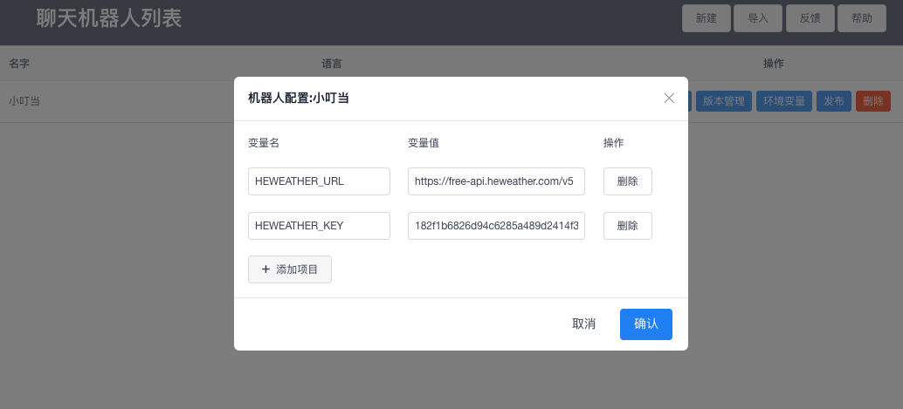</td></tr>
</table>

读者可以从和风天气获得该密钥，为验证用途，可以粘贴下面的值：

```
"HEWEATHER_URL": "https://free-api.heweather.com/v5",
"HEWEATHER_KEY": "182f1b6826d94c6285a489d2414f3ad0"
```

保存后，回到天气对话脚本的“对话编辑窗口”，在函数中，使用下面的脚本：

```
var WForewast = function (apiKey) {
    if (!apiKey) throw new Error('Invalid token, get it from http://www.heweather.com/my/service');
    this.key = apiKey;
}


WForewast.prototype.getWeatherByCity = function (city) {
    return new Promise((resolve, reject)=>{
        let url = config["HEWEATHER_URL"] + "/weather?city=" + encodeURIComponent(city) + "&key=" + this.key
        http
            .get(url)
            .then((res)=>{
                resolve(res.data.HeWeather5[0].suggestion);
            })
            .catch(function (err) {
                if (err) return reject(err);
            });
    })
}

const wf = new WForewast(config["HEWEATHER_KEY"]);


exports.getWeatherByCity = function(city, cb){
    debug("getWeatherByCity: %s", city);
    wf.getWeatherByCity(city)
        .then((suggestions)=>{
            cb(null, {
                text: suggestions["comf"]["txt"]
            })
        }, (err)=>{
            debug("error:%j", err)
            cb(null, {
                text: `很抱歉，没有获得${city}的天气信息。`
            })
        })
}


exports.getAirByCity = function(city, cb){
    debug("getAirByCity: %s", city);
    wf.getWeatherByCity(city)
        .then((suggestions)=>{
            cb(null, {
                text: suggestions["air"]["txt"]
            })
        }, (err)=>{
            cb(null, {
                text: `很抱歉，没有获得${city}的空气信息。`
            })
        })
}


exports.getSportByCity = function(city, cb){
    debug("getSportByCity: %s", city);
    wf.getWeatherByCity(city)
        .then((suggestions)=>{
            cb(null, {
                text: suggestions["sport"]["txt"]
            })
        }, (err)=>{
            cb(null, {
                text: `很抱歉，没有获得${city}的信息。`
            })
        })
}

exports.getDresscodeByCity = function(city, cb){
    debug("getDresscodeByCity: %s", city);
    wf.getWeatherByCity(city)
        .then((suggestions)=>{
            cb(null, {
                text: suggestions["drsg"]["txt"]
            })
        }, (err)=>{
            cb(null, {
                text: `很抱歉，没有获得${city}的信息。`
            })
        })
}
```

这次，代码内容和前一版本相比，使用了`config`对象，`config`是一个包含环境变量的 JSON 数据。所以，我们更加利于将来部署对话应用了。

### 支持更多对话

回想我们需要的几种天气信息，我们根据需求变更脚本，一个满足需求的脚本呈现如下：

```
// 技能介绍

+ 你知道哪些天气信息
- 我知道今天的空气，着装建议和适不适合运动

// 天气

+ 今天 (*) 天气 [怎么样]
- {keep} ^getWeatherByCity(&#60;cap1&#62;)

+ [今天] (天气|气候) [怎么样]
- {@__wf_guide_}

+ (*) 今天天气 [怎么样]
- {keep} ^getWeatherByCity(&#60;cap1&#62;)

    + (*) 空气 (*)
    % ^getWeatherByCity(&#60;cap1&#62;)
    - {keep} ^getAirByCity(&#60;p1cap1&#62;)


+ __wf_guide_
- {keep} 添加城市名哦，比如“今天北京天气怎么样”或者“北京天气怎么样”
- 我需要知道城市名称，比如“今天北京天气怎么样”或者“北京天气怎么样”
- 要告诉我城市名，比如“今天北京天气怎么样”或者“北京天气怎么样”


// 空气

+ [今天] 空气 [怎么样]
- {@__wf_guide_air}

+ (*) 今天空气 [怎么样]
- {keep} ^getAirByCity(&#60;cap1&#62;)

+ 今天 (*) 空气 [怎么样]
- {keep} ^getAirByCity(&#60;cap1&#62;)

+ __wf_guide_air
- {keep} 添加城市名哦，比如“今天北京空气怎么样”或者“北京空气怎么样”
- 我需要知道城市名称，比如“今天北京空气怎么样”或者“北京空气怎么样”
- 要告诉我城市名，比如“今天北京空气怎么样”或者“北京空气怎么样”


// 运动

+ [今天] 适(合|宜)运动(么|吗)
- {@__wf_guide_sport}

+ (*) 今天适(合|宜)运动(么|吗)
- {keep} ^getSportByCity(&#60;cap1&#62;)

+ 今天 (*) 适(合|宜)运动(么|吗)
- {keep} ^getSportByCity(&#60;cap1&#62;)

+ __wf_guide_sport
- {keep} 添加城市名哦，比如“今天北京适合运动么”或者“北京今天适合运动么”
- 我需要知道城市名称，比如“今天北京适合运动么”或者“北京今天适合运动么”
- 要告诉我城市名，比如“今天北京适合运动么”或者“北京今天适合运动么”


// 衣着

+ [今天] 适(合|宜)穿什么
- {@__wf_guide_dresscode}

+ (*) 今天适(合|宜)穿什么
- {keep} ^getDresscodeByCity(&#60;cap1&#62;)

+ [今天] (*) 适(合|宜)穿什么
- {keep} ^getDresscodeByCity(&#60;cap1&#62;)


+ __wf_guide_dresscode
- {keep} 添加城市名哦，比如“今天北京适合穿什么”或者“北京今天适合穿什么”
- 我需要知道城市名称，比如“今天北京适合穿什么”或者“北京今天适合穿什么”
- 要告诉我城市名，比如“今天北京适合穿什么”或者“北京今天适合穿什么”
```

这也就是我们在天气查询机器人 Demo 中看到的机器人的脚本，在设计过程中，我们通过对话区域来测试机器人的回复是否符合预期，我们通过逻辑窗口来查看当前机器人的思维逻辑导图，当前机器人对话的状态会被高量，被命中的规则呈现为路径。

<table class="image">
<caption align="bottom">机器人思维逻辑</caption>
<tr><td>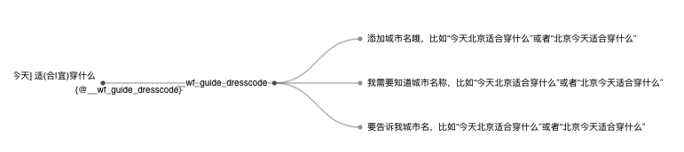</td></tr>
</table>

另外，在设计过程中，每次保存自动为脚本和函数生成快照，使用快照下拉列表，我们能方便的回退。

<table class="image">
<caption align="bottom">快照管理</caption>
<tr><td>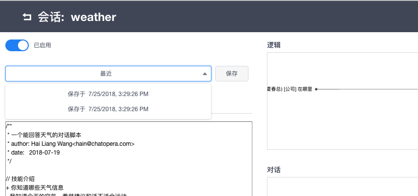</td></tr>
</table>

在**多轮对话设计器**中，业务人员可以更专注于对话机器人的对话逻辑满足需求。

### 发布机器人

现在，有了可以工作的脚本，我们想发布一个版本，这时回到主面板，点击“发布”，填入如下信息，点击“确认”。

<table class="image">
<caption align="bottom">发布机器人</caption>
<tr><td>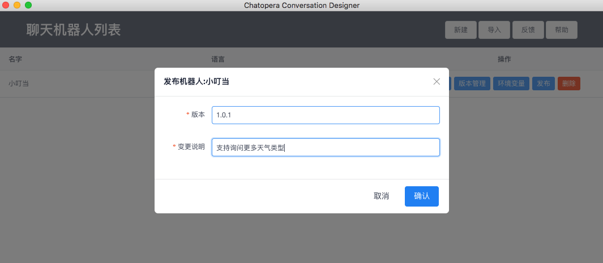</td></tr>
</table>

### 导出机器人

最终，我们需要得到一个“服务”，它能时刻被访问，以及和 AI 音箱集成。我们需要将天气机器人导出为对话应用，然后部署到<a href="https://docs.chatopera.com/chatbot-engine.html" target="_blank">智能问答引擎</a>。在主面板，点击**版本管理**，我们看到操作中有三项。

- 对比差异:在多个版本中比较差异，包括脚本和函数。

- 导出：将机器人导出为对话应用文件。

- 覆盖：使用这个版本覆盖当前机器人，包括脚本和函数等。

多轮对话设计器支持导出机器人后，极大的方便了分发和部署。

## 系统集成

经过一系列的工作，多轮对话终于准备妥当，可以为业务系统提供机器人问答服务了，下一步参考[系统集成](/products/chatbot-platform/integration.html)接入上线吧！

## 评论

<script src="https://utteranc.es/client.js"
        repo="chatopera/docs"
        issue-term="pathname"
        label="Comment"
        theme="github-light"
        crossorigin="anonymous"
        async>
</script>
