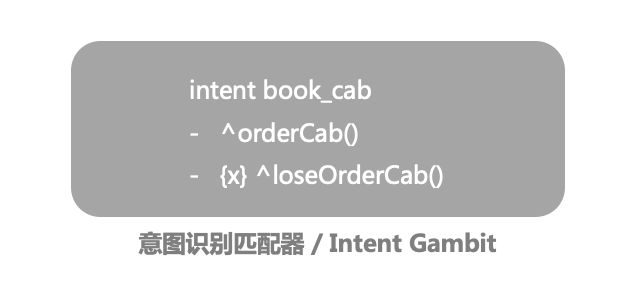
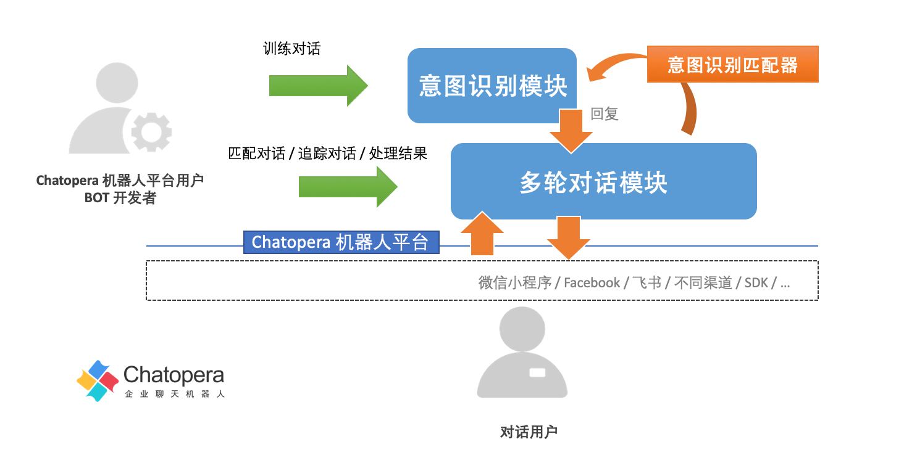
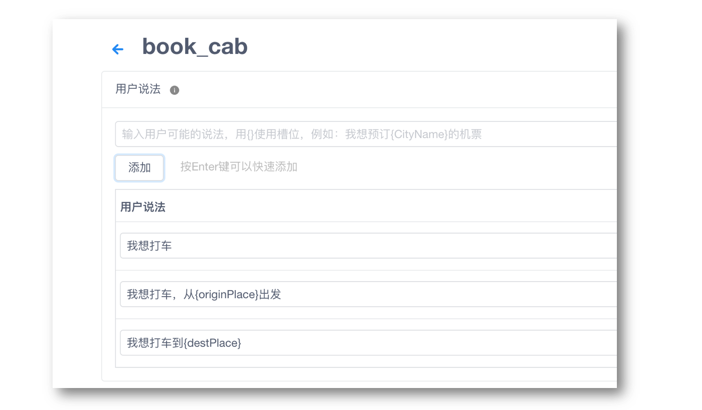
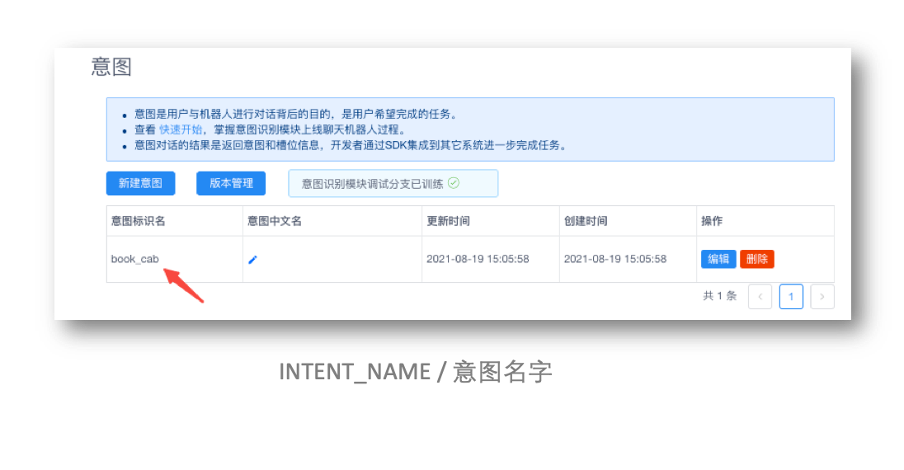
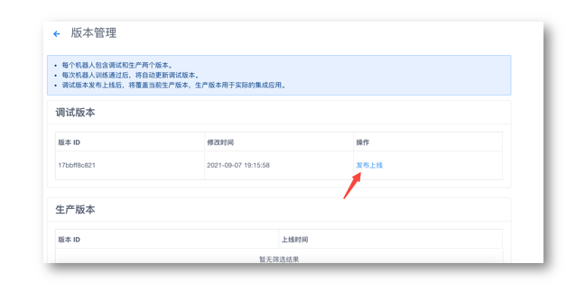
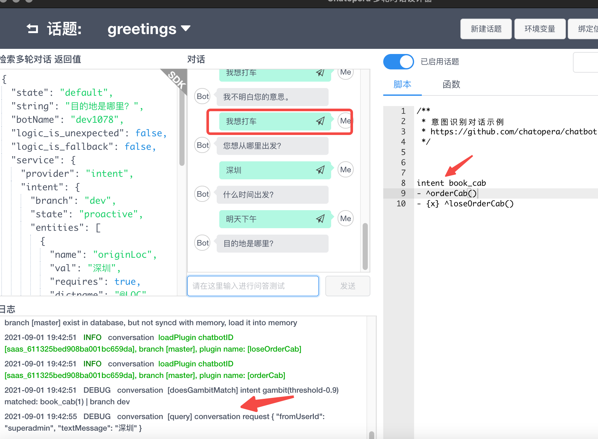
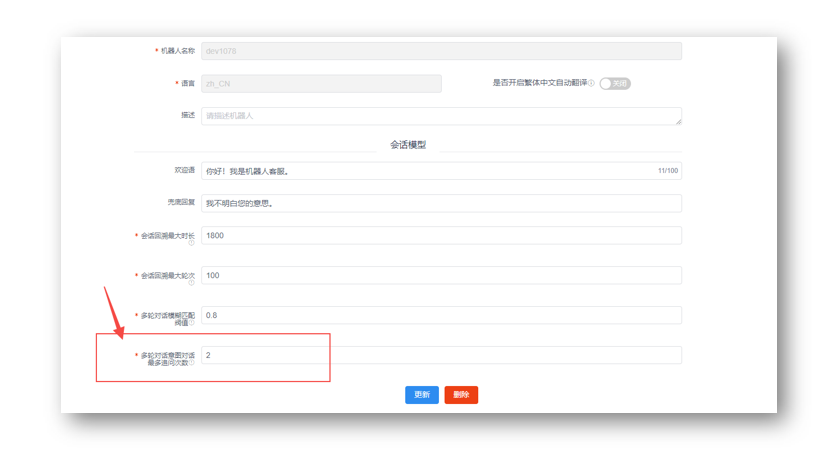

# 意图匹配器



也称为 Intent Gambit，在多轮对话脚本中使用[意图识别模块](/products/chatbot-platform/intent/index.html)实现任务型对话。

## 设计初衷

Chatopera 机器人平台 2019 年就发布了意图识别模块。意图识别模块使用机器学习技术，通过少量的数据标注，就可以匹配很多种用户说法，实现智能的任务型对话机器人，意图识别模块基于大规模的通用语料，内置多个预训练模型，以适应不同行业应用。在过去两年，Chatopera 团队一直在探索，将脚本对话和意图识别结合，促成更为强大的多轮对话定制能力。现在，一系列最佳实践通过意图匹配器的形式实现并发布了。

在没有意图匹配器以前，脚本对话，是按照一个个固定的流程进行的，通过上下轮钩子，比如用户说：我想打车，写好了开始的规则，并匹配上以后，按照脚本顺序问打车的数据：时间、出发地、目的地等。如果机器人问“您想从哪里出发？”，而对话用户发送了时间“今天下午 5 点”，那么在脚本中，处理起来费事，还需要增加学习成本。而针对于类似的场景，机器人需要能识别时间，然后继续追问出发地。智能的处理任务中的关键信息，是普遍存在的需求。而 Chatopera 意图识别对话，就是解决这个问题的。

<table class="image">
    <caption align="bottom">识别用户意图获取任务信息</caption>
    <tr>
        <td></td>
    </tr>
</table>

**意图识别模块，简单说就是识别并分析意图信息，根据意图需要的关键信息进行追问，直到获取到所有必须的关键信息或超过追问限制次数。**

以前，在 Chatopera 机器人平台内，意图识别模块和多轮对话模块，是两个独立模块，Chatopera 提供了[开源项目](https://github.com/chatopera/webchat)的形式提供最佳实践：在业务端，BOT 开发者用 SDK 灵活的使用不同模块。这样的形式，学习成本加大，怎么样通过无代码或低代码的方式上线有意图识别能力的机器人呢？现在，这个答案就是意图匹配器。在多轮对话脚本中，借助意图匹配器很好的融合了脚本、函数和意图识别。Chatopera 机器人平台用户，可以用更为简单和快捷的方式，上线更为强大的智能对话机器人。

<table class="image">
    <caption align="bottom">意图识别模块和多轮对话模块的关系</caption>
    <tr>
        <td></td>
    </tr>
</table>

脚本对话和意图识别二者的结合，至少获得了如下几点好处：

1）会话周期在多轮对话中管理，以前意图识别需要 BOT 开发者自行维护会话周期，机器人管理控制台提供参数进行配置；

2）增加对话灵活性，识别意图后，转入意图识别对话，但是对于一个意图中关键信息，没有获取到，则追问；对一个关键信息连续追问一定设置次数，则继续查询知识库和脚本，提升了处理的能力（这个继续查找行为也称为“穿透”）；

3）意图识别得到的意图信息，在多轮对话脚本的函数可以读取，可处理意图识别成功或者意图识别槽位追问次数超过设定最大值，两种情况的信息；

4）利用多轮对话函数中，内置的高级 NLP 函数，继续分析意图信息，比如使用 [extractTime](/products/chatbot-platform/conversation/functions/builtin.html#%E8%8E%B7%E5%BE%97%E7%BB%9D%E5%AF%B9%E6%97%B6%E9%97%B4) 将相对时间转化为绝对时间，也就是“今天”识别为具体的日期 2021-08-31；

5）利用多轮对话函数中，[http](/products/chatbot-platform/conversation/functions/builtin.html#http) 工具类，和业务系统、互联网服务等集成。

**以上的这些好处，让 Chatopera 机器人平台可以诞生更多的创新的对话机器人，帮助 BOT 开发者尽情的释放创造力！**

欲了解更多 Chatopera 多轮对话工作机制，查看[详情链接](/products/chatbot-platform/conversation/mechanism.html)，您也可以阅读完本篇后再阅读多轮对话工作机制。

## 意图匹配器的功能

在对话机器人中，一个常见的应用场景是通过自然语言形式，自动化的完成流程，比如：“我想打车”、“我想看病挂号”和“我想点外卖”等。对话用户说了这些后，就是要明确的希望机器人帮助完成一个任务：查询信息、下单或管理智能家居等。这个任务和这个任务里的关键信息，比如时间、地点和专有名词，就是机器人需要捕捉的，机器人通过追问的形式交互。

在 Chatopera 机器人平台上，也使用如下的术语表达这些概念。

<table class="image">
    <caption align="bottom">意图识别术语及其概念</caption>
    <tr>
        <td></td>
    </tr>
</table>

这些对话内容的管理，就在意图识别模块中：**开发者或业务人员，提供说法；在说法中可以写槽位；槽位对应的是不同类型的词典。**

那么对话用户的哪些说法对应了意图呢？哪些词对应了槽位呢？在 Chatopera 意图识别模块中，提供维护意图、说法、槽位和词典的页面。

<table class="image">
    <caption align="bottom">标注意图</caption>
    <tr>
        <td></td>
    </tr>
</table>

词典建设，是意图识别中很重要的方面，在 Chatopera 机器人平台上，词典管理非常完善。词典包括系统词典，自定义词典。系统词典是 Chatopera 机器人平台上开箱即用的词典，包括人名、组织机构名、时间和地点的。自定义词典有词汇表词典和正则表达式词典，是 Chatopera 机器人平台用户自行维护的。

**训练意图识别对话机器人的工作，不需要开发技能，无代码工作；不管是开发者，还是业务人员，只要熟悉上述的几个概念就可以训练。**

那么，训练好了意图识别对话，那么要上线就还存在两个问题：

1）该如何处理识别结果，比如“我想打车”，得到了对话用户的出发地、目的地和时间等信息，如何发布订单呢？

2）如果对话要被集成到一个客服机器人里，这个客服机器人也可以回答常见问题，在 Chatopera 知识库里设定了，如何让不同模块的对话融合起来呢？

**上述两个问题的解决方案，就是使用意图匹配器。** 另外一个解决方案就是 BOT 开发者用 [Chatopera SDK](/products/chatbot-platform/integration/index.html#sdk) 自行管理。

## 意图匹配器语法

语法<font color="blue">（注意语法中存在的空格）</font>：

```
intent INTENT_NAME
- ^succHandlerFn()
- {x} ^loseHandlerFn()
```

在之前，不管是通配符匹配器，还是模糊匹配器，都是使用 "`+`" 开始，但是在意图匹配器中，开始必须是 "`intent`"，用来标志后面的内容是面向意图匹配器。

`intent INTENT_NAME` 就是意图匹配器，`INTENT_NAME` 是意图识别模块中，意图的名字，大小写不敏感，这意味着 `book_cab` 和 `BOOK_CAB` 是一样的。



然后，在下一行，使用 "`-`" 开始设定回复，因为需要处理意图识别信息，而该信息是传递给函数的，所以，回复设置为自定义的函数。在本文后面的部分，会详细说明在函数中取值。

在意图匹配器下，有两种类型的回复：

**1）识别到意图，并在对话交互中得到所有的必须的槽位信息，调用“`成功函数`”；**

**2）识别到意图，但是追问交互中，在限定的追问次数下，没有得到必须的槽位信息，在这种情况下，会使用对话用户最后的检索，从知识库和脚本对话中，继续检索，如果得到答案，则回复该答案；如果没有得到答案，则调用“`失败函数`”。**

“失败函数”有一个特殊的标记：`{x}`。即一对大括号内写入小写字母 `x`。**失败函数是选填的**，如果没有定义则会回复兜底回复。在失败函数内，也是可以取得当前意图识别的信息。

举例

```
intent book_cab
- ^orderCab()
- {x} ^loseOrderCab()
```

`成功函数`和`失败函数`的执行时刻的更多信息，参考 [多轮对话工作机制](/products/chatbot-platform/conversation/mechanism.html)。

以上就是意图匹配器的脚本语法，接下来介绍函数中，使用意图识别信息、配置意图识别分支等更高级功能点。

## 意图会话生命周期

当一个意图被识别到，对话进入意图识别对话，就会创建一个**意图会话**。意图会话，在下面四种情况下会失效：

### 空闲时间太久而过期

对话用户在【会话回溯最大时长】时间下未发送请求，意图会话因为**空闲时间太久而过期**；

即【`会话回溯最大时长`】，当对话用户，超过一段时间不和机器人交互，那么会话状态被清空，包括意图会话。同样，进入 BOT 管理控制台的设置页面调整该值，默认为半个小时。

### 新识别到的意图覆盖意图会话

对话从意图识别模块识别新的意图，**就是又匹配上了新的意图**，旧的会话周期被覆盖；

### 意图识别调试分支重新训练

意图匹配器，通过在多轮对话脚本中的环境变量 `@SYS_INTENT_BRANCH` 的值来指定集成[意图识别的版本](https://docs.chatopera.com/products/chatbot-platform/intent/releases.html)，即调试版本或生产版本，二者的值分别是`pro`和`dev`，默认为 `dev`。

调试版本，顾名思义，是开发测试时使用，每次重新训练，其对应的意图会话都会被删除，在使用意图匹配器时，就会造成多轮对话在上下文处理上的失败。所以，每次意图识别重新训练，如果多轮对话集成的是调试分支，则意图会话的逻辑就失败了。

因为意图匹配器默认就是使用调试分支，所以，对于生产环境的 BOT，有如下建议：

1）发布训练好的意图识别调试版本为生产版本，进入机器人意图管理页面，点击【版本管理】，点击【发布上线】。



2）在多轮对话设计器或 Chatopera 机器人平台管理控制台，进入环境变量设置。

修改`@SYS_INTENT_BRANCH` 的值为`pro`。

```
@SYS_INTENT_BRANCH=pro
```

这时，因为使用了意图识别生产版本，不会因为调试分支的变动而影响意图会话。

### 函数内处置

在多轮对话函数中，包括**成功函数、失败函数或其它的匹配到的脚本函数**，使用 **`this.intent.drop = true`** 设置后。

对于第三条，这意味着，需要 BOT 开发者在成功的处理了意图信息后，设置 `this.intent.drop = true`，就是放弃当前意图信息。

采用这个设计的原因是，**意图会话**的信息处理，这项权利尽量的保留给 BOT 开发者，在函数中实现，可以满足更多业务需求，让 BOT 更智能。

## 调试和设置

### 使用调试

意图识别可以在多轮对话设计器 v2.2.0+ 中使用，但是基于对多轮对话设计器用户体验的升级，建议使用 v2.3.0+ 版本的多轮对话设计器，最新版本[下载地址链接](/products/chatbot-platform/conversation/cde.html)。

编辑意图识别对话窗口如下：

<table class="image">
    <caption align="bottom">多轮对话设计器</caption>
    <tr>
        <td></td>
    </tr>
</table>

在脚本和函数编辑区域，使用语法匹配意图识别和处理意图识别信息；对话窗口进行测试，在日志中查看日志和 `debug` 信息；在 SDK 中查看返回值 JSON 数据。

### 意图匹配器取值

如上文，有一个例子：

```
intent book_cab
- ^orderCab()
- {x} ^loseOrderCab()
```

当对话用户的发送文本匹配上了“book_cab”中的说法，比如“我想打车“。多轮对话即启用【book_cab】内的对话流程，意图识别对话在成功获得该意图的必须的槽位信息，或超过了设置的最大追问次数，则会进入多轮对话函数，前者会调用【成功函数】，后者会调用【失败函数】。前文，做过相关描述。那么，成功函数和失败函数的内，如何获得意图识别对话的信息呢？

#### 成功函数

成功函数，比如上文例子中的 `orderCab` 不需要在对话脚本中设定任何参数，函数执行的时候，会将意图识别信息，加入该函数的 `this` 命名空间下，使用 `this.intent` 读取。

`this.intent` 是一个 JSON 数据，数据格式如下：

```

{
  "name": "{{INTENT_NAME}}",
  "topicName": "{{TOPIC_NAME}}",
  "branch": "{{INTENT_BRANCH}}",
  "entities": [
    {
      "name": "{{ENTITY_NAME}}",
      "val": "{{ENTITY_VALUE}}",
      "requires": true,
      "dictname": "{{DICT_NAME}}"
    },
  ],
  "state": "{{STATE}}"
}
```

_INTENT_NAME_: 意图识别的名字

_TOPIC_NAME_：脚本对话话题的名字

_INTENT_BRANCH_：集成意图识别的版本的分支，默认为 `dev`，如果使用意图识别生产版本分支，在多轮对话中设置环境变量 `@SYS_INTENT_BRANCH` 为 `pro`

`ENTITY_NAME`, `ENTITY_VALUE`, `DICT_NAME`：该意图下的关键的参数，槽位信息；`requires` 为 `true` 时，代表该槽位是必填的

`STATE`：状态，包括 `resovled`, `proactive`, `losed` 三个状态，分别代表意图全部必填参数识别完成，正在追问参数信息和追问超过最大次数

除了增加了 `this.intent`，其它成功函数的使用和多轮对话函数是一致的。比如，设定回复：

```
// 回复只有文本
exports.orderCab = async function() {
    debug("[orderCab] intent %s", JSON.stringify(this.intent));
    // 处理下单信息
    // ...
    this.intent.drop = true; // 成功下单，设置当前意图会话过期
    return "下单成功，订单编号：SE111."; // 设定回复

}


// 回复包含自定义业务字段
exports.orderCabExt = async function() {
    debug("[orderCab] intent %s", JSON.stringify(this.intent));
    // 处理下单信息
    // ...
    this.intent.drop = true; // 成功下单，设置当前意图会话过期
    return {text:"下单成功，订单编号：SE111."; // 设定回复,
            params: { YOUR_KEY: YOUR_VALUE}}   // 自定义业务字段

}
```

`this.intent` 的一个实际数据示例：

```

{
  "name": "book_cab",
  "topicName": "greetings",
  "branch": "dev",
  "entities": [
    {
      "name": "originLoc",
      "val": "天津",
      "requires": true,
      "dictname": "@LOC"
    },
    {
      "name": "date",
      "val": "明天下午四点",
      "requires": true,
      "dictname": "@TIME"
    },
    {
      "name": "destLoc",
      "val": "北京",
      "requires": true,
      "dictname": "@LOC"
    }
  ],
  "state": "resolved"
}
```

#### 失败函数

失败函数中，`this.intent` 的信息和使用，和成功函数是一致的，这是调用的实际不一致，同时它是可选的。

### 设置最大追问次数

匹配意图识别对话之后，机器人会根据槽位信息情况，必填的槽位是否都获取到，进行追问，这个追问可以设定一个最大次数，当达到最多的追问时，机器人就放弃检索意图识别，而是继续从知识库和脚本对话中查询回复。

对于每个机器人，BOT 开发者可以自定义设置，进入 BOT 设置页面，找到【`多轮对话意图对话最多追问次数`】，默认为 2。

<table class="image">
    <caption align="bottom">多轮对话意图对话最多追问次数</caption>
    <tr>
        <td></td>
    </tr>
</table>

### 设置集成意图识别分支

在意图识别模块，包括两个分支：调试分支；生产分支。生产分支，就是指发布到生产环境，实际上线的 BOT 服务。

设计两个分支，主要是考虑到，一个机器人的意图识别数据可以不断的优化，那么每个阶段优化好以后再选择上线到生产分支，这样在调试和优化的时候不影响生产分支的对话。

该设置为，在多轮对话设计器或 BOT 管理控制台的多轮对话页面，设置【`环境变量`】来调整，默认为调试分支，设置参数为：`@SYS_INTENT_BRANCH`，使用 `dev` 代表集成调试分支，使用 `pro` 代表集成生产分支；默认为调试分支。

## 进阶用法

在使用意图匹配器时，还有一些重要的知识点。它们属于使用的细节，以及需要特殊说明。

在通过前文了解了意图匹配器的使用场景和语法后，下面的知识可以帮助您在生产环境更好的发布智能对话机器人。

### SDK 返回意图识别信息

当对话用户，有匹配到意图，正在进行意图识别的对话时，使用多轮对话检索 API，返回值中，`service.provider` 的值是 `intent`，并且 `service.intent` 是当前意图信息。示例数据如下：

```
{
  "string": "您想从哪里出发？",
  "topicName": "greetings",
  "subReplies": [],
  "service": {
    "provider": "intent",
    "intent": {
      "name": "book_cab",
      "threshold": 0.9,
      "branch": "dev",
      "state": "proactive",
      "entities": [
        {
          "name": "originLoc",
          "val": "",
          "requires": true,
          "dictname": "@LOC"
        },
        {
          "name": "date",
          "val": "",
          "requires": true,
          "dictname": "@TIME"
        },
        {
          "name": "destLoc",
          "val": "",
          "requires": true,
          "dictname": "@LOC"
        }
      ]
    }
  },
  "logic_is_unexpected": false,
  "logic_is_fallback": false,
  "botName": "dev1078",
  "faq": [],
  "profile": {}
}
```

可见，`service.intent` 的数据与函数中的 `this.intent` 是一致的。

### 快速读取 intent.entities

默认情况下，`intent.entities` 是一个数组，如果需要用槽位的名称去取值，要便利，不方便，使用以下方法快速使用 `intent.entities` 生成一个 JSON Object，然后使用槽位名称取值。

```
let entities = _.keyBy(this.intent.entities, 'name');
```

比如，有一个槽位名字为 `date`，则接下来获得这个槽位的值：

```
let dateRawString = entities["date"]["val"];
```

### 转化相对时间为绝对时间

加入一个日期槽位 `dateRawString` 值为“明天下午 5 点”，那么如何从这个字符串提取出时间“2021-09-03 17:00”呢？

```
let extractedDates = await this.maestro.extractTime(dateRawString);
debug("extracted date", extractedDates);
if(extractedDates.length > 0){
    // 目标时间就是：extractedDates[0]  '2021/09/03 17:00'
    debug("Target date", extractedDates[0]);
}
```

更多关于 `extractTime` 的介绍[参考链接](/products/chatbot-platform/conversation/functions/builtin.html#获得绝对时间)。

### 保存变量信息到意图会话

函数执行的时候，如果有意图会话存在，就会被加载到函数的 `this.intent` 中。在两个或多个连续的多轮对话中，可以通过 `this.intent.extras` (JSON Object) 来保存变量。该信息会和该意图会话周期一致。比如：

```
/**
 * 提取时间实体
 */
async function extractTimeEntity(maestro, entities, property) {
    let dates = await maestro.extractTime(entities[property]["val"], "YYYY年MM月DD日 HH:mm");
    return dates.length > 0 ? dates[0] : "";
}

exports.handleAirplaneTicketOrder = async function() {

    debug("[handleAirplaneTicketOrder] this.intent", JSON.stringify(this.intent))

    let entities = _.keyBy(this.intent.entities, 'name');
    // 获得信息
    let date = await extractTimeEntity(this.maestro, entities, "date");
    // 保存到 this.intent.extras
    this.intent.extras = {
        date: date
    }

  ...
}

```

`handleAirplaneTicketOrder` 函数保存了一个变量到 `this.intent.extras` 中，稍后另外一次对话时，调用了另外一个函数 `placeAirplaneTicketOrder`，就可以直接用这个变量。

```
exports.placeAirplaneTicketOrder = async function() {
    // 直接取值
    // this.intent.extras.date

    ...
```

### 在回复中跳转到指定意图

**假设在多轮对话脚本中，已经设定了一个意图的意图匹配器。** 然后在多轮对话中，还可这样开始该意图的对话：使用 [`topicRedirect`](/products/chatbot-platform/conversation/state.html#切换话题) 切换话题。

#### 文本回复

```
+ ${0.5}{自定义的文本}
- ^topicRedirect("intents", "book_airplane_ticket", true)
```

注意：此处 `topicRedirect` 的第三个参数设置为 `true`，代表目标匹配器是一个[意图匹配器](/products/chatbot-platform/conversation/gambits/intent.html)。

#### 函数回复

文本中，定义了函数

```
+ ${0.5}{自定义的文本}
- ^handleXXFn()
```

函数 `handleXXFn`:

```
exports.handleXXFn = async function() {
    // do your magic
    return "^topicRedirect(\"intents\", \"book_airplane_ticket\", true)"
}
```

### 升级生产环境的多轮对话脚本

<font color="blue">通过多轮对话设计器，或 Chatopera 机器人平台的机器人多轮对话管理页面，上传多轮对话脚本，因为刷新的缘故，正在进行中的意图会话失效，这会给对话用户造成体验上的困扰，所以，对于生产环境的更新，建议在业务低分时间进行！</font>

## 下一步

- [函数：使用 http 模块请求外部系统 API 服务](/products/chatbot-platform/conversation/functions/builtin.html#http)

- [了解多轮对话工作机制](/products/chatbot-platform/conversation/mechanism.html)

- [查看示例程序：预约机票](https://github.com/chatopera/chatbot-samples/blob/master/projects/%E9%A2%84%E5%AE%9A%E6%9C%BA%E7%A5%A8)

- [通配符匹配器：使用语法建立规则](/products/chatbot-platform/conversation/gambits/star.html)

- [模糊匹配器：容错能力更强和智能的匹配器](/products/chatbot-platform/conversation/gambits/like.html)

## 评论

<script src="https://utteranc.es/client.js"
        repo="chatopera/docs"
        issue-term="pathname"
        label="Comment"
        theme="github-light"
        crossorigin="anonymous"
        async>
</script>
