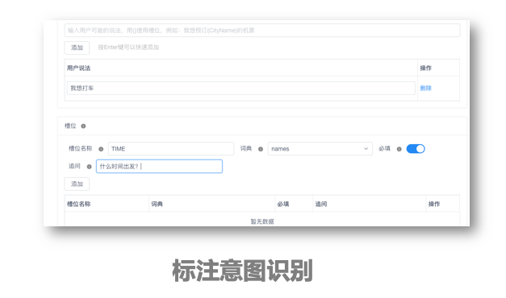
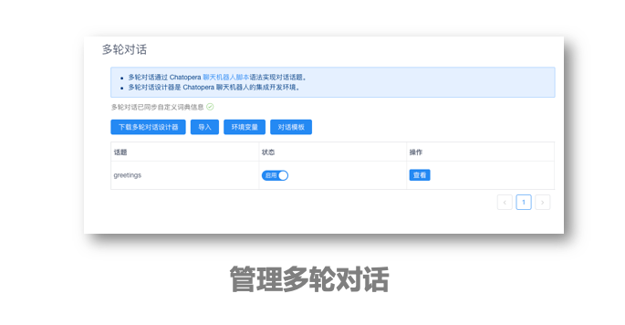
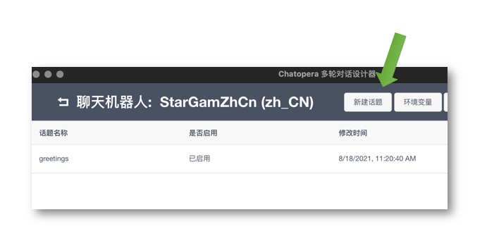
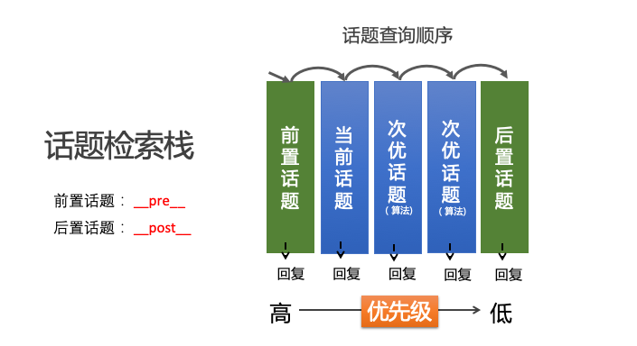

# 工作机制

本篇的主要目的是帮助 Chatopera 机器人平台用户从系统的角度理解 Chatopera 的多轮对话解决方案，尤其是刚刚开始认识 Chatopera 服务的新用户，待阅读本篇后，相信大家可以使用 Chatopera 机器人平台快速定制出满足各种需求的聊天机器人。

## 多轮对话的定义

Chatopera 的智能对话机器人解决方案主要面向企业在客户服务、营销和企业内部协作中使用自然语言交互完成信息查询、任务和自动化流程。目前，市场中比较常见的智能对话机器人解决方案主要是一问一答：设定问答对，使用信息检索形式，提供信息查询功能，在 Chatopera 看来，这不是智能对话机器人的体验。

在 Chatopera，我们认为多轮对话是在一定时间内，一定交互次数内，考虑对话的上下文，每次人发送聊天内容时，机器人具备从上下文情境中分析最合理的回答，准确的为人提供回复。

## 什么场景下使用多轮对话

Chatopera 的智能对话机器人解决方案是工具，用于设计、实现和发布聊天机器人。从价值提供上，Chatopera 所面向的是封闭域聊天，更关注智能对话机器人在生产、消费和制造等领域的聊天机器人应用；在开放域聊天，尤其是以闲聊为主的应用，不是 Chatopera 智能对话机器人的关注点，虽然我们提供了标准的通用的工具，但是作为开放域聊天，在目前还没有好的技术方案，强人工智能还没有成熟，对于实际应用上，还不能大规模的提供价值。

Chatopera 的多轮对话服务，可以面向不同行业，比如教育、电商、游戏和生产制造等。尤其是客服和企业内部协作中，将以前通过表单、人工等的服务使用自然语言对话的形式实现。应用场景比如智能客服、智能招聘面试、智能提交工单、智能提交请假、智能分析潜在客户意向等。

## Chatopera 多轮对话

Chatopera 多轮对话解决方案的一个主要目标是以无代码、低代码的形式上线智能对话机器人，为了实现这个目标，Chatopera 将不同形式的问答技术打造为基础模块，提供每个模块的管理工具、APIs，Chatopera 机器人平台用户可以单独使用。在基础模块之上，再融合为一个多轮对话方案。目前，基础模块包括：1）以搜索引擎技术为主的 FAQ 知识库；2）以机器学习为主的意图识别，实现任务型对话；3）以脚本规则为主的对话脚本，设定对话规则同时融合 FAQ 和意图识别。因为以对话脚本为中心融合知识库和意图识别，形成最佳实践，实现为标准的产品工具，是 Chatopera 机器人平台的主要特色。

在使用 Chatopera 机器人平台时，理解基础模块的工作原理，并熟悉多轮对话的检索机制，是非常重要的，掌握了这些知识可以帮助您实现具有强大对话能力的智能对话机器人。

目前，基础模块包括：知识库、意图识别和脚本对话。

### 知识库

通过设定问答对实现问答，对话用户的请求文本和问答对里的标准问或扩展问比较，计算相似度，当相似度高于阀值时，即认定该问答对的答案是对话用户需要的回复。

在 Chatopera 知识库中，支持扩展问、近义词词典、多答案和答案类型。

### 意图识别

通过为每个意图添加说法和槽位，训练机器学习模型。对话用户的文本被分析为某一个意图，如果识别了意图，则计算槽位信息，并且对于没有识别到的槽位进行追问。槽位可以绑定到某个词典，Chatopera 机器人平台提供自定义词典和系统词典。自定义词典包括词汇表词典和正则表达式词典，词汇表词典主要用于处理业务上的关键字段、同义词和专有名词；正则表达式词典则用于识别手机号、身份证号、订单号、邮箱等一些具有规则的信息。系统词典是用机器学习训练的命名实体提取判定的信息，比如人名、地名、组织机构和时间等。

### 脚本对话

脚本对话是通过书写 Chatopera 多轮对话脚本语法建立的规则组合实现问答。对话脚本将对话分为匹配器，即和对话用户的输入进行比较的规则；回复，匹配规则后的回复内容，支持文本和函数；上下轮钩子，将规则与规则进行关联。对话脚本中的函数，使用 JavaScript 方式低代码编程，内置函数库，即方便了系统集成，同时也提供大量自然语言处理帮助函数，不需要掌握自然语言处理 NLP 的知识，开发者可以专注的实现业务逻辑。

在脚本匹配器语法和函数中，融合知识库和意图识别，所以，脚本对话是多轮对话的中心，围绕脚本实现不同问答技术的融合。所以，很多时候，文档和产品中，也用【多轮对话】表述脚本对话，就是这个原因。但是脚本独立构成了一个模块，在 Chatopera 机器人平台内部，实现了对话脚本引擎。

以上为各个问答模块的概述，待阅读本页内容后，可以从左侧导航菜单了解每个模块的使用详情说明。

## 多轮对话的检索

在 Chatopera 多轮对话中，理解检索顺序是熟悉多轮对话原理的关键知识点。首先是基础模块间的检索顺序，然后是对话脚本中的话题的检索顺序。

### 模块间检索

对话用户请求时，多轮对话会先检查是否有进行中的意图识别对话，然后是知识库检索，匹配知识库问答对，当有问答对高于知识库阀值时，机器人回复问答对中的答案内容；未匹配知识库，进入脚本对话，从话题中匹配，匹配上则回复内容；否则则回复兜底回复。从概念上有下图关系。

之所以说是从概念上，是因为整个检索过程更为复杂，不方便理解，先用概念图从直观上快速理解 Chatopera 多轮对话的框架。一个更为详细的检索机制说明见下图。

详细说明图虽然更为复杂，其中的要点是模块间有更多的状态检查和穿透行为（从一个模块进入另外一个模块）。在检索的过程中，涉及到一些参数，这些参数可以在 Chatopera 机器人平台对话机器人设置页面设定或者在 SDK 中传入参数。比如知识库阀值默认为 `0.9`，该阈值可以通过在请求中设定参数来调整，[介绍链接](/products/chatbot-platform/integration/chatbot/chat.html#检索多轮对话)。

关于知识库、脚本对话和意图识别的相互之间的调用关系，后文会有更多介绍。

### 创建脚本对话的话题

聊天机器人的多轮对话主要就是很多对话规则的组合，可以设想这些对话规则组成了一个个的话题，在对话时，可以聊一个话题，可以跳跃到其它的话题。那么，每次获得了聊天用户的文本，机器人进行答案的检索就是选择最合理的话题并找到匹配的规则，计算回复内容。

在创建好机器人后，下载多轮对话设计器，在多轮对话设计器中，创建话题。

话题里使用脚本实现对话逻辑，用一个简单的例子说明脚本语法非常容易掌握。

`+` 开始的是匹配器，目前 Chatopera 多轮对话支持通配符匹配器和模糊匹配器；`-` 开始的是回复，目前支持文本和函数，函数是 JavaScript 脚本；`%` 开始的是上下轮钩子，用以关联规则。

使用多轮对话设计器撰写对话脚本的用户体验，经过了多年的打磨，已经非常成熟和稳定。

在多轮对话设计内调试对话，现在对于多轮对话设计器还不需要详细了解，本节内容旨在介绍原理，而话题作为重要的概念，需要先介绍如何创建以及在哪里编辑。

### 话题检索顺序

每个话题包含名字和一些规则，每个规则包括了匹配器和回复，业务上有明确的上下轮依赖的规则使用上下轮钩子进行关联。

话题检索也是有顺序的，匹配到了某一个话题的规则，后续的话题就被跳过。匹配从高优先级到低优先级进行，最高优先级是【前置话题】，话题名称为系统约定：`__pre__`；最低优先级是【后置话题】，话题名称为系统约定：`__post__`。优先级仅低于前置话题的话题是当前话题，就是上一次对话用户匹配到的规则所在的话题；其余的话题根据算法动态的排序。

如果使用了上下轮钩子，则最先匹配携带有上下文钩子（就是 `% 上次回复内容`）的规则。

整体上，脚本对话在检索时，检索栈是动态变化的。

### 对话状态机

现在，我们从另一个角度，状态机的角度思考多轮对话，因为是在多个连续的交互中，完成一个对话目标，那么就存在一个状态的问题，状态机是状态可以转移的图，两个状态之间的关系通过状态机约束。比如，某个活动通知的对话状态机如下：

这是个图示，仅为了说明原理。“请求”节点代表每次对话用户发送了文本，“回复”节点代表机器人处理结果，回复文本。因为知识库在检索中最先发生，可以放入一些一问一答的问答对，而一些全局的关键词放入前置话题【`__pre__`】中，图中右侧方框内，则是由其他话题组成的脚本对话，整个对话构成了状态机。

这个问题在脚本对话中，尤其需要注意：Chatopera 对话脚本引擎会考虑过去一段时间内，一定对话轮次的历史，机器人会回看这些记录来分析最合理的回复。这个时间长度和轮次的约束，在 Chatopera 机器人平台管理控制台内可以设定，是每个机器人的属性：`会话回溯最大时长`和`会话回溯最大轮次`。

当对话用户的输入匹配到脚本对话的规则时，即是对话到达了一个状态。

### 擦除状态

开发者在多轮对话脚本的函数中，也可以擦除这个状态，这样到下次对话用户再请求时，话题检索的栈回到初始状态，状态机回到原始，这个擦除的方法是在回复或函数中添加 `{CLEAR} ` 前缀，关于这个知识点的使用说明见[文档](/products/chatbot-platform/conversation/state.html#清除状态)。

### 使用函数切换状态

如果想从一个话题，切换到另外一个话题获得回复。那么可以在函数中使用 `"topicRedirect(TOPIC_NAME, TOPIC_GAMBIT_ID)"`。将 `TOPIC_NAME` 替换为话题名字，`TOPIC_GAMBIT_ID` 替换为匹配器。就可以切换到该规则下获得回复。

topicRedirect 函数的更多介绍，[参考文档](/products/chatbot-platform/conversation/state.html#切换话题)。

### 知识库路由

对于状态机的状态跳转，Chatopera 多轮对话方案中，还有一个高级方法，通过知识库路由对话到对话状态机任意状态。

设定知识库的问答对中的答案，内容使用上述格式，将 `TOPIC_NAME` 替换为话题名字，`TOPIC_GAMBIT_ID` 替换为匹配器。就可以切换到该规则下获得回复。

关于知识库路由的更多介绍，[参考文档](/products/chatbot-platform/conversation/state.html#知识库路由)。

## 总结

恭喜您，看到文档的最后，多轮对话是不是简单易学，并且很强大？现在就开始下载多轮对话设计器，并使用 Chatopera 提供的对话模板实现您的智能对话机器人吧！

## 下一步

- [多轮对话设计器：下载和安装](https://docs.chatopera.com/products/chatbot-platform/conversation/cde.html)

- [多轮对话匹配器：意图识别匹配器、模糊匹配器和通配符匹配器等](https://docs.chatopera.com/products/chatbot-platform/conversation/gambits/index.html)

- [示例程序：Chatopera 机器人对话模板](https://github.com/chatopera/chatbot-samples)

## 评论

