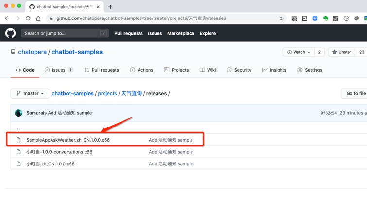

## 快速开始

本节读者可在不熟悉任何概念，只需要按照操作一步一步执行，就可以获得一个聊天机器人并熟悉工具使用，全面了解多轮对话不同工具的功能。

## 安装和启动应用

[下载安装包](/products/chatbot-platform/conversation/cde.html)后，双击打开，进入安装向导。

安装完打开应用图标后进入主面板，如下图：

<table class="image">
<caption align="bottom">应用主面板</caption>
<tr><td></td></tr>
</table>

## 导入示例程序

下载示例程序包文件：SampleAppAskWeather.zh_CN.1.0.0.c66

<a href="https://github.com/chatopera/chatbot-samples/blob/master/projects/%E5%A4%A9%E6%B0%94%E6%9F%A5%E8%AF%A2/releases/SampleAppAskWeather.zh_CN.1.0.0.c66" target="_blank"> https://github.com/chatopera/chatbot-samples</a>

<table class="image">
<caption align="bottom">示例程序下载地址</caption>
<tr><td></td></tr>
</table>

在主面板点击界面的右上方的“导入”按钮，选择刚才下载的示例程序*SampleAppAskWeather.zh_CN.1.0.0.c66*如图：

<table class="image">
<caption align="bottom">导入对话框</caption>
<tr><td></td></tr>
</table>

导入成功，可以看到在聊天机器人界面有一条数据显示，“名字 SampleAppAskWeather”等；点击 SampleAppAskWeather 的“管理”按钮，可以看到它的多轮对话列表，包括：chatopera，profile，weather。如下图：

<table class="image">
<caption align="bottom">多轮对话列表</caption>
<tr><td></td></tr>
</table>

| 对话      | 功能                      |
| --------- | ------------------------- |
| chatopera | 关于 Chatopera 的公司信息 |
| profile   | 机器人的画像              |
| weather   | 提供天气查询功能的对话    |

更多示例程序，查看 [Chatopera 聊天机器人对话模板](https://github.com/chatopera/chatbot-samples)。

## 测试示例程序

可以针对上面的三个多轮对话，进行一番聊天测试，下面测试主要以“问天气”为例子。

选择 “weather” 对话的编辑按钮，进入 weather 对话的编辑窗口，包括：

| 概念     | 描述                                                       |
| -------- | ---------------------------------------------------------- |
| **脚本** | 按照多轮对话语法规则来描述机器人对话逻辑                   |
| **函数** | 执行 JavaScript 代码的环境，声明的接口可以直接从脚本中调用 |
| **日志** | 函数中*debug*方法的输出                                    |
| **逻辑** | 聊天机器人的思维逻辑导图，保存脚本后自动生成               |
| **对话** | 实时测试聊天机器人的窗口                                   |

在“对话”区域的下方输入框输入：_你知道哪些天气信息_

<table class="image">
<caption align="bottom">多轮对话编辑窗口</caption>
<tr><td></td></tr>
</table>

点击“发送”按钮，可以看到对话区域有了问答的信息流，并且“逻辑”区域也有了对话状态，对话路径显示“绿色”高亮。

<table class="image">
<caption align="bottom">测试对话</caption>
<tr><td></td></tr>
</table>

在此界面可以进行多轮对话测试，如下截图：

<table class="image">
<caption align="bottom">多轮对话</caption>
<tr><td></td></tr>
</table>

## 增加新的对话

> 测试新对话

```
我：今天北京适合游玩么？
机器人：风清气爽，当然可以啊～
```

在脚本区域可以自行设计脚本，非常简单，例如增加：

```
+ 今天 (*) 适合游玩么？
- 风清气爽，当然可以啊～
```

点击界面上方“保存”按钮，会使得刚才定义的对话生效，并且可以在聊天区域直接测试。

## 保存新版本

刚才点击“保存”按钮时，同时将 weather 的对话生成一个快照，我们随时可以回退到某个快照。

<table class="image">
<caption align="bottom">查看快照</caption>
<tr><td></td></tr>
</table>

回到聊天机器人列表页面，可以点击“发布”按钮，可以将当前聊天机器人生成新版本，相关的信息如图：

<table class="image">
<caption align="bottom">发布新版本</caption>
<tr><td></td></tr>
</table>

点击上图的“确认”按钮，发布新版本成功，点击“版本管理”，看到刚才发布的 1.0.1 版本的信息。

## 各个版本之间比较

对于聊天机器人的发布的各个版本差异，可以使用版本比较工具，比较具体的差异，包括：脚本比较和函数比较。
点击上图 1.0.1 对应的“对比差异”，可以“对比变化”界面，其中分为三个部分，

```
    - “左上”为被对比的参考版本；本例子为:1.0.0

    - “右上”为要对比的目标版本，本例子为:1.0.1

    - “下方”为两版本数据的差异，具体：

        * 绿色：新增的内容；

        * 红色：删除的内容；

        * 灰色：没有变化的内容；
```

刚进入“对比变化”界面，默认对比的是：函数，本例子请在选择“版本号”的右边切换“脚本”为“对话”，如图：

<table class="image">
<caption align="bottom">版本之间比较差异</caption>
<tr><td></td></tr>
</table>

对比的差异部分为绿色，表示新增。

## 导出特定版本

多轮对话设计器属于设计阶段，在机器人满足需求后，可以导出为对话应用 c66 文件，方便分发和部署。在生产环境，导入到<a href="https://docs.chatopera.com/products/chatbot-platform/index.html" target="_blank">Chatopera 机器人平台</a>中，作为多轮对话应用的运行时。

在“版本管理”界面，选择刚才发布的“1.0.1”的“导出”，可以选择一个路径存储该导出的文件，如图：

<table class="image">
<caption align="bottom">导出文件</caption>
<tr><td></td></tr>
</table>

以上并没有给出程序实现的过程，阅读[使用进阶](/products/chatbot-platform/conversation/expertise.html)相关内容可了解示例程序的来龙去脉。

## 评论

<script src="https://utteranc.es/client.js"
        repo="chatopera/docs"
        issue-term="pathname"
        label="Comment"
        theme="github-light"
        crossorigin="anonymous"
        async>
</script>
