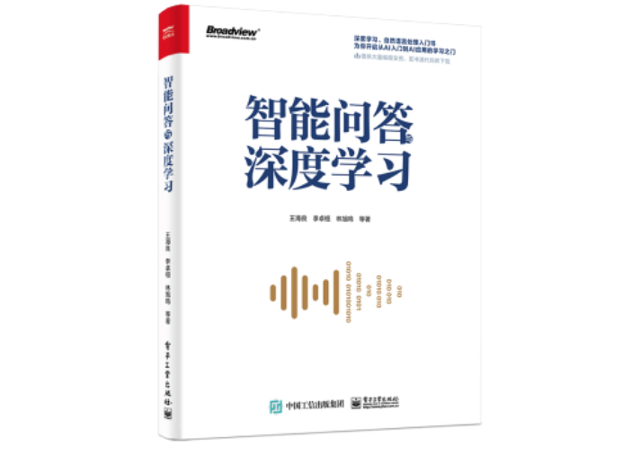

# 深度学习

## 智能问答技术及开源项目

Chatopera 云服务使用深度神经网络。深度学习技术应用于以下任务：

* 近义词匹配，Chatopera 开放相关技术参考 [中文近义词：聊天机器人，智能问答工具包](https://github.com/chatopera/Synonyms)
* 句子相似度，词向量距离预训练模型
* 依存关系分析，Chatopera 开放相关技术参考 [text-dependency-parser](https://github.com/chatopera/text-dependency-parser)
* 词性标注和命名实体识别
* 意图识别，Chatopera 开放相关技术参考 [Clause 中文语义理解引擎]()
* 聚类分析

## 出版物

2018 年底，Chatopera 会同行业内其他工作于智能问答与深度学习领域的专家、研究员，与电子工业出版社合作，出版《智能问答与深度学习》一书，该书部分内容是 Chatopera 探索智能问答领域的分享。目前在京东等电商平台图书中有售。

快速查看本书链接：[《智能问答与深度学习》](https://search.jd.com/Search?keyword=%E6%99%BA%E8%83%BD%E9%97%AE%E7%AD%94%E4%B8%8E%E6%B7%B1%E5%BA%A6%E5%AD%A6%E4%B9%A0&enc=utf-8&wq=%E6%99%BA%E8%83%BD%E9%97%AE%E7%AD%94%E4%B8%8E%E6%B7%B1%E5%BA%A6%E5%AD%A6%E4%B9%A0&pvid=2c76ce5dc6b546a8a8dcebaf49fcad1c)

### 内容概述

对于需要了解 Chatopera 云服务实现原理的用户，该书将会大有帮助，本书是智能问答的知识介绍，也可以作为入门、工具书。该书介绍的内容相对丰富，目前在京东售出逾 7,000 册，好评 98%。

### 开源代码

该书中介绍的示例程序的源码，已经已开源项目的形式发布：

[https://github.com/chatopera/book-of-qna-code](https://github.com/chatopera/book-of-qna-code)

## 开放语料

随着 Chatopera 云服务的不断优化，在研发过程中，形成了一些语料，Chatopera 也以开放数据的形式开放，这增加了我们的工作量，而得到的回报是不多的。这个工作的主要目的是回馈给客户、开源社区的同仁们，以及期待更多的研究者可以用这些数据做出技术上的突破、创新，Chatopera 竭诚与业内同仁们一起做好智能问答，早日实现聊天机器人的普及，让科技使我们的生活更美好。

* [保险行业中文语料库](https://github.com/chatopera/insuranceqa-corpus-zh)
* [心理咨询问答语料库](https://github.com/chatopera/efaqa-corpus-zh)

## 更多开源项目

* [DeepQA](https://github.com/chatopera/deep-qa): Chatopera 于生成式智能问答的探索、实践
* [docsbot](https://github.com/chatopera/docsbot): 将使用 Markdown 的文档转化为问答服务

更多开源项目，敬请通过 Chatopera GitHub 主页了解：

[https://github.com/chatopera](https://github.com/chatopera)