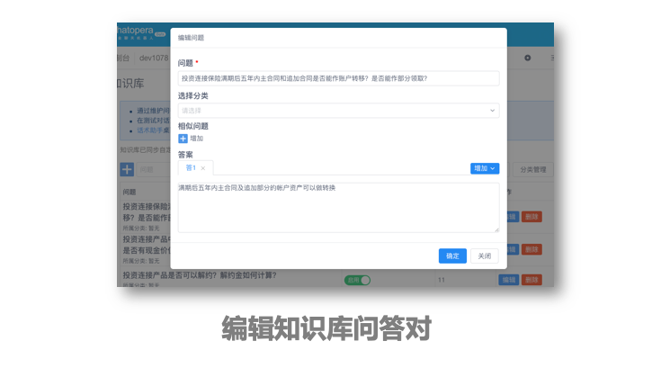

# 知识库

在智能问答需求中，有一些问题可以提前设置好答案，不涉及上下文环境，是一问一答。对于这类问答，就可以使用**知识库**模块。

## 实现原理

知识库通过标准问、相似问、自定义词典和答案维护对话内容，为 Chatopera 机器人平台用户提供标准的、快速的对话检索服务。对话用户的请求文本和问答对里的标准问或扩展问比较，计算相似度，当相似度高于阀值时，即认定该问答对的答案是对话用户需要的回复。

## 应用场景

尤其是在客服场景中，来访者有大量的问题都是重复的一问一答的问题，答案相对来说固定，或者在一段时间内固定，这样最适合通过完善**知识库**提升客服工作效率。

> **提示：一问一答是指一个问题对应固定的答案。** 比如“世界上有几个大洲？”就属于这类为题；但是如果问“今天股市大盘走势如何？”，答案不是固定的，该类对话使用 **意图识别模块** 和 **多轮对话** 脚本解决。

## 使用过程

学习使用**知识库**的过程也很简单，历史数据也不是必需的。通常先由业务人员整理一些常见问题，并在**知识库管理页面**添加问答对，在**对话测试**页面进行简单的验证就可以集成上线了。

进阶优化知识库包括：

1）设置自定义词典，增强知识库检索时处理近义词的能力；

2）为标准问增加扩展问；

3）在对话**历史记录**页面查看沉寂问题和兜底回复，创建新的问答对；

4）使用**聚类分析**服务，进行大规模的对话历史的自动机器人学习分析。

增强知识库的智能水平，知识库的优化，知识库的优化也是长期的过程，也是企业重要的很有价值的资产。

## 评论

