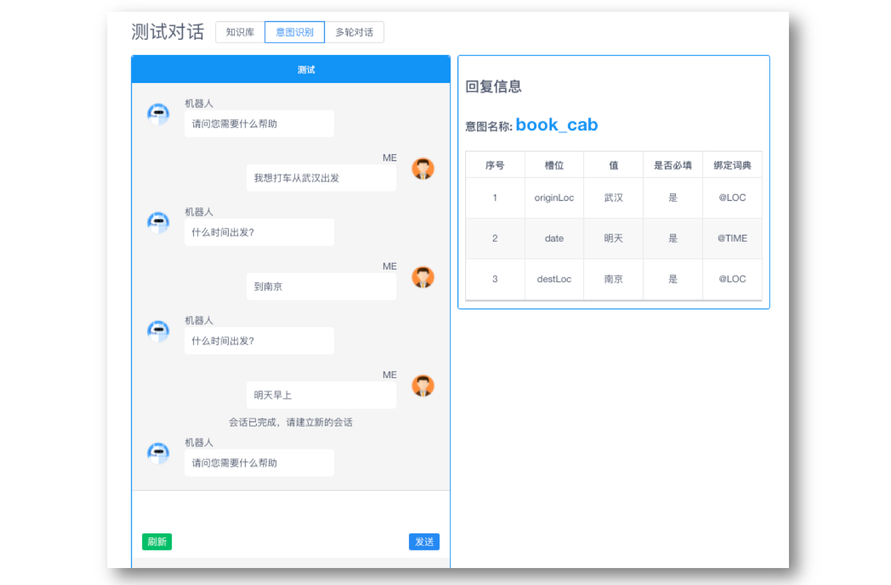
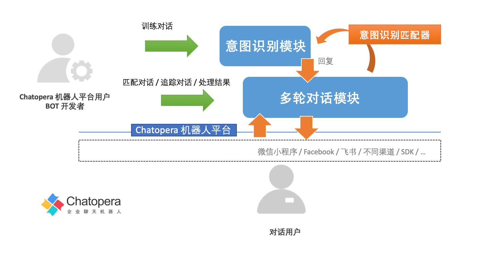
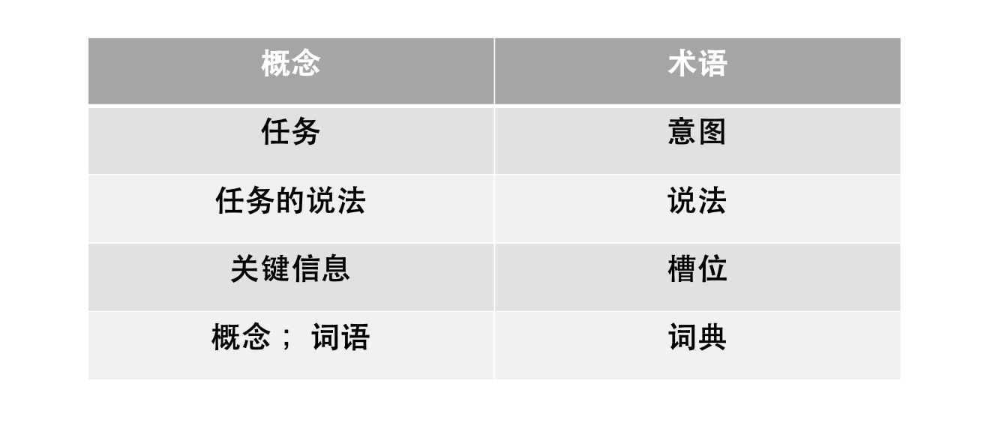
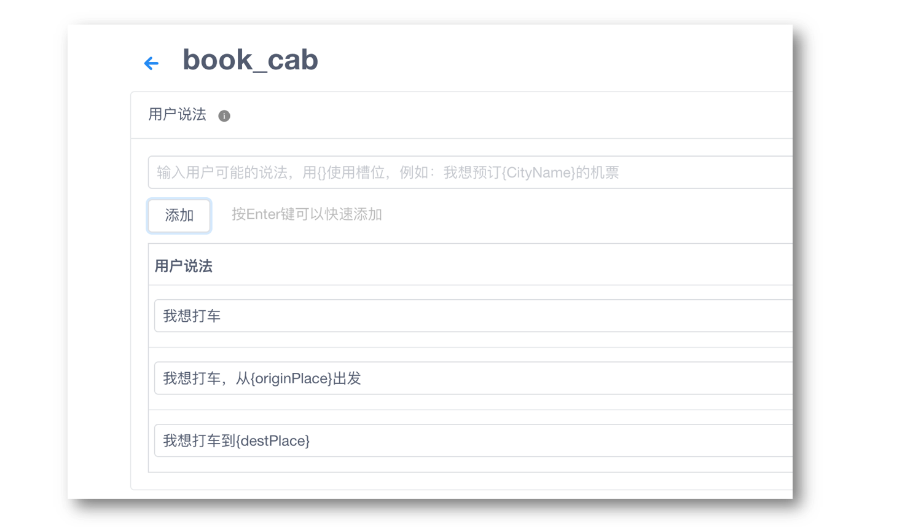

# 意图匹配器

## 设计初衷

Chatopera 机器人平台 2019 年就发布了意图识别模块。意图识别模块使用机器学习技术，通过少量的数据标注，就可以匹配很多种用户说法，实现智能的任务型对话机器人，意图识别模块基于大规模的通用语料，内置多个预训练模型，以适应不同行业应用。在过去两年，Chatopera 团队一直在探索，将对话脚本和意图识别结合，促成更为强大的多轮对话定制能力。现在，一系列最佳实践通过意图匹配器的形式实现并发布了。

在没有意图匹配器以前，对话脚本，是按照一个个固定的流程进行的，通过上下轮钩子，比如用户说：我想打车，写好了开始的规则，并匹配上以后，按照脚本顺序问打车的数据：时间、出发地、目的地等。如果机器人问“您想从哪里出发？”，而对话用户发送了时间“今天下午 5 点”，那么在脚本中，处理起来费事，还需要增加学习成本。而针对于类似的场景，机器人需要能识别时间，然后继续追问出发地。智能的处理任务中的关键信息，是普遍存在的需求。而 Chatopera 意图识别对话，就是解决这个问题的。

<table class="image">
    <caption align="bottom">识别用户意图获取任务信息</caption>
    <tr>
        <td></td>
    </tr>
</table>

**意图识别模块，简单说就是识别并分析意图信息，根据意图需要的关键信息进行追问，直到获取到所有必须的关键信息或超过追问限制次数。**

以前，在 Chatopera 机器人平台内，意图识别模块和多轮对话模块，是两个独立模块，Chatopera 提供了[开源项目](https://github.com/chatopera/webchat)的形式提供最佳实践：在业务端，BOT 开发者用 SDK 灵活的使用不同模块。这样的形式，学习成本加大，怎么样通过低代码的方式上线有意图识别能力的机器人呢？现在，这个答案就是意图匹配器。在多轮对话脚本中，借助意图匹配器很好的融合了脚本、函数和意图识别。Chatopera 机器人平台用户，可以用更为简单和快捷的方式，上线更为强大的智能对话机器人。

<table class="image">
    <caption align="bottom">意图识别模块和多轮对话模块的关系</caption>
    <tr>
        <td></td>
    </tr>
</table>

对话脚本和意图识别二者的结合，至少获得了如下几点好处：

1）会话周期在多轮对话中管理，以前意图识别需要 BOT 开发者自行维护会话周期，机器人管理控制台提供参数进行配置；

2）增加对话灵活性，识别意图后，转入意图识别对话，但是对于一个意图中关键信息，没有获取到，则追问；对一个关键信息连续追问一定设置次数，则继续查询知识库和脚本，提升了处理的能力（这个继续查找行为也称为“穿透”）；

3）意图识别得到的意图信息，在多轮对话脚本的函数可以读取，可处理意图识别成功或者意图识别槽位追问次数超过设定最大值，两种情况的信息；

4）利用多轮对话函数中，内置的高级 NLP 函数，继续分析意图信息，比如使用 [extractTime](https://docs.chatopera.com/products/chatbot-platform/references/func-builtin/maestro.html#extracttime) 将相对时间转化为绝对时间，也就是“今天”识别为具体的日期 2021-08-31；

5）利用多轮对话函数中，[http](https://docs.chatopera.com/products/chatbot-platform/references/func-builtin/basics.html#http) 工具类，和业务系统、互联网服务等集成。

**以上的这些好处，让 Chatopera 机器人平台可以诞生更多的创新的对话机器人，帮助 BOT 开发者尽情的释放创造力！**

欲了解更多 Chatopera 多轮对话工作机制，查看[详情链接](https://docs.chatopera.com/products/chatbot-platform/explanations/query.html)，您也可以阅读完本篇后再阅读多轮对话工作机制。

## 意图匹配器的功能

在对话机器人中，一个常见的应用场景是通过自然语言形式，自动化的完成流程，比如：“我想打车”、“我想看病挂号”和“我想点外卖”等。对话用户说了这些后，就是要明确的希望机器人帮助完成一个任务：查询信息、下单或管理智能家居等。这个任务和这个任务里的关键信息，比如时间、地点和专有名词，就是机器人需要捕捉的，机器人通过追问的形式交互。

在 Chatopera 机器人平台上，也使用如下的术语表达这些概念。

<table class="image">
    <caption align="bottom">意图识别术语及其概念</caption>
    <tr>
        <td></td>
    </tr>
</table>

这些对话内容的管理，就在意图识别模块中：**开发者或业务人员，提供说法；在说法中可以写槽位；槽位对应的是不同类型的词典。**

那么对话用户的哪些说法对应了意图呢？哪些词对应了槽位呢？在 Chatopera 意图识别模块中，提供维护意图、说法、槽位和词典的页面。

<table class="image">
    <caption align="bottom">标注意图</caption>
    <tr>
        <td></td>
    </tr>
</table>

词典建设，是意图识别中很重要的方面，在 Chatopera 机器人平台上，词典管理非常完善。词典包括系统词典，自定义词典。系统词典是 Chatopera 机器人平台上开箱即用的词典，包括人名、组织机构名、时间和地点的。自定义词典有词汇表词典和正则表达式词典，是 Chatopera 机器人平台用户自行维护的。

**训练意图识别对话机器人的工作，不需要开发技能，无代码工作；不管是开发者，还是业务人员，只要熟悉上述的几个概念就可以训练。**

那么，训练好了意图识别对话，那么要上线就还存在两个问题：

1）该如何处理识别结果，比如“我想打车”，得到了对话用户的出发地、目的地和时间等信息，如何发布订单呢？

2）如果对话要被集成到一个客服机器人里，这个客服机器人也可以回答常见问题，在 Chatopera 知识库里设定了，如何让不同模块的对话融合起来呢？

**上述两个问题的解决方案，就是使用意图匹配器。**

## 下一步

* [在多轮对话中使用意图匹配器](https://docs.chatopera.com/products/chatbot-platform/howto-guides/conv-gambit-intent.html)
