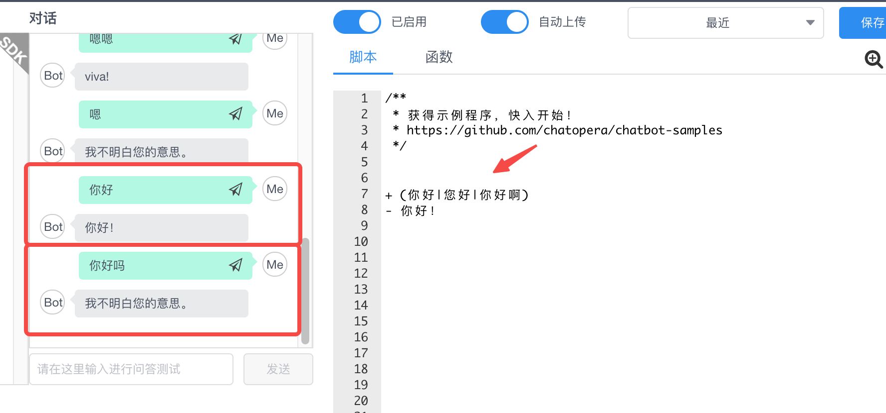

# 模糊匹配器

## 通配符匹配器的不足

以前，在多轮对话中，使用通配符匹配器存在一个问题：匹配器规则的书写要尽量和输入的对话文本一致。使用通配符，用一些特殊符号，比如 `*n` 去定义一些目标词汇的集合，然而这依然在构建对话流程时显得不够智能，对于目标词汇的识别以及按照位置匹配，是通配符匹配器的优势。

举一个例子：

<table class="image">
    <caption align="bottom">通配符匹配器</caption>
    <tr>
        <td></td>
    </tr>
</table>

在上面的脚本中，定义了一个通配符匹配器 "_+（你好|您好|你好啊）_", 它支持三种问法，但是用户可能用更为多变的说法，为了支持这些说法，可以选择使用更宽松的通配符，但很多时候并不好把握：

1）使用枚举的思路，当要支持所有相关意图的说法时，耗时费力；

2）使用通用通配符，太过灵活，有的时候匹配到了期望以外的词语。

为了解决“容错”和表达能力不足的问题，需要提供更多形式的匹配器来解决。

## 下一步

* [在多轮对话中使用模糊匹配器](/products/chatbot-platform/howto-guides/conv-gambit-like.html)

