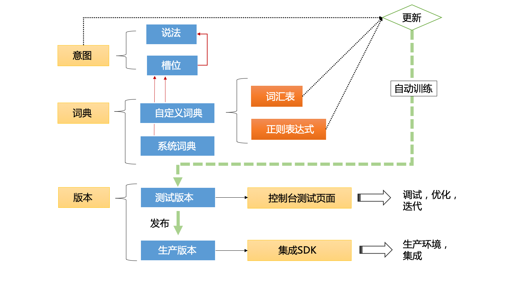
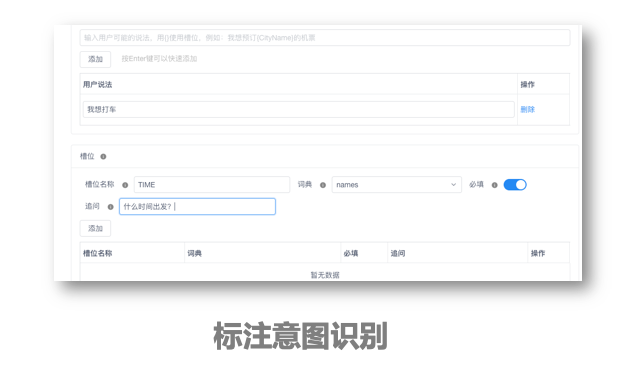

# 意图识别

在应用聊天机器人的场景中，有一大类是任务驱动型的问答，比如来访者说“我想购买车票”，那么接下来机器人围绕订票这个需求，询问出行时间、目的地等信息，并将收集到的信息返回给聊天机器人开发者，完成订单确认、支付和下单订票等。这就是一个典型的任务驱动的问答：以识别意图并根据意图收集相关信息为目的。类似的对话需求，在 Chatopera 云服务中，是通过**意图识别**模块支持。

- 使用说法定义意图分类模型
- 利用序列标注识别槽位信息

## 产品特色

- 高性能算法
- 支持小规模数据量训练
- 在线标注和训练

## 实现原理

**意图识别**是语义理解的一个重要话题：与机器人对话时，是需要机器首先理解人的意图的；然后，根据这个意图，机器人继续与人进行问答；得到了这个意图的相关信息，机器才去执行这个意图代表的任务。

## 使用过程

意图：通过为每个意图添加说法和槽位，训练机器学习模型。对话用户的文本被分析为某一个意图，如果识别了意图，则计算槽位信息，并且对于没有识别到的槽位进行追问。

槽位：和一个意图相关的关键信息，比如时间、地点和专有名词等。槽位可以绑定到某个词典。

Chatopera 机器人平台提供自定义词典和系统词典：

        * 自定义词典包括词汇表词典和正则表达式词典；
        * 词汇表词典主要用于处理业务上的关键字段、同义词和专有名词；
        * 正则表达式词典则用于识别手机号、身份证号、订单号、邮箱等一些具有规则的信息；
        * 系统词典是用机器学习训练的命名实体提取判定的信息，比如人名、地名、组织机构和时间等。

## 意图匹配器

在 Chatopera 机器人平台，意图识别模块也是集成进入了多轮对话模块，参考使用[意图匹配器](https://docs.chatopera.com/products/chatbot-platform/howto-guides/convs/conv-gambits/intent.html)。

<!-- 待补充 -->
<!-- https://github.com/chatopera/clause/wiki/%E7%B3%BB%E7%BB%9F%E8%AE%BE%E8%AE%A1%E4%B8%8E%E5%AE%9E%E7%8E%B0 -->
