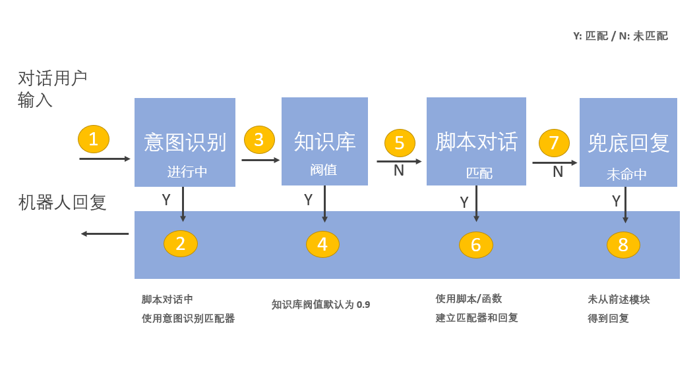
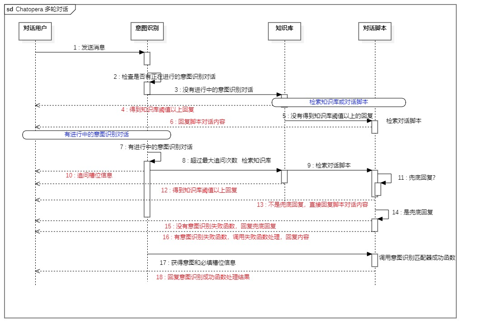
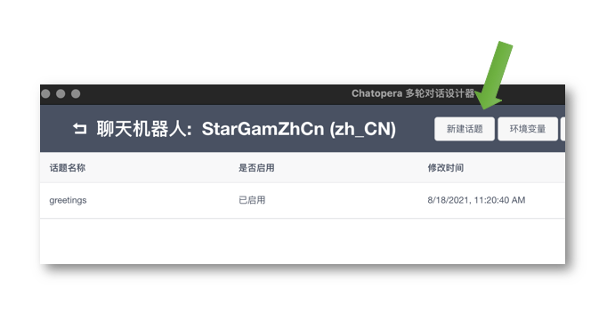
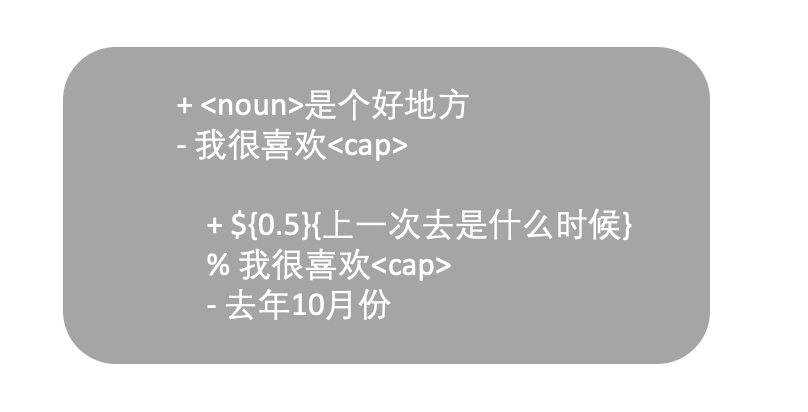
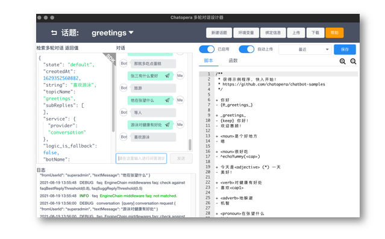
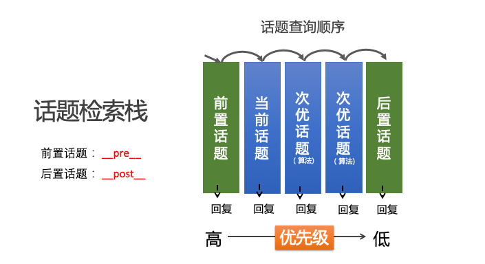
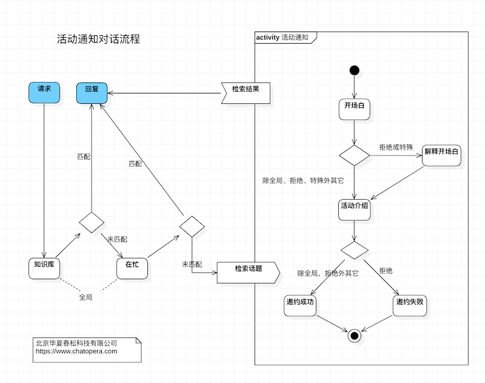
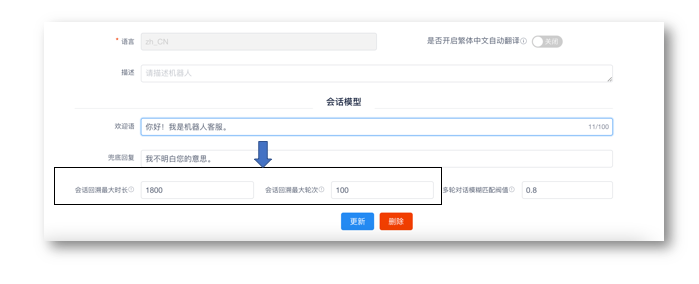
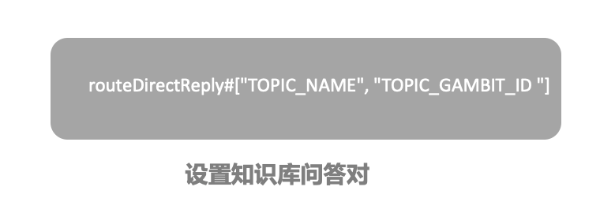

# 多轮对话的检索

在 Chatopera 多轮对话中，理解检索顺序是熟悉多轮对话原理的关键知识点。首先是基础模块间的检索顺序，然后是对话脚本中的话题的检索顺序。

## 模块间检索

对话用户请求时，多轮对话会先检查是否有进行中的意图识别对话，然后是知识库检索，匹配知识库问答对，当有问答对高于知识库阀值时，机器人回复问答对中的答案内容；未匹配知识库，进入对话脚本，从话题中匹配，匹配上则回复内容；否则则回复兜底回复。从概念上有下图关系。

之所以说是从概念上，是因为整个检索过程更为复杂，不方便理解，先用概念图从直观上快速理解 Chatopera 多轮对话的框架。一个更为详细的检索机制说明见下图。

[详细说明图（查看大图）](/images/products/platform/mechanism/conversations.jpg) 虽然更为复杂，但和概念图含义基本一致，其中的要点是模块间有更多的状态检查和穿透行为（从一个模块进入另外一个模块）。在检索的过程中，涉及到一些参数，这些参数可以在 Chatopera 机器人平台对话机器人设置页面设定或者在 SDK 中传入参数。比如知识库阀值默认为 `0.9`，该阈值可以通过在请求中设定参数来调整，[介绍链接](/products/chatbot-platform/references/sdk/chatbot/chat.html#检索多轮对话)。

关于知识库、对话脚本和意图识别的相互之间的调用关系，后文会有更多介绍。

## 创建对话脚本的话题

聊天机器人的多轮对话主要就是很多对话规则的组合，可以设想这些对话规则组成了一个个的话题，在对话时，可以聊一个话题，可以跳跃到其它的话题。那么，每次获得了聊天用户的文本，机器人进行答案的检索就是选择最合理的话题并找到匹配的规则，计算回复内容。

在创建好机器人后，下载多轮对话设计器，在多轮对话设计器中，创建话题。

话题里使用脚本实现对话逻辑，用一个简单的例子说明脚本语法非常容易掌握。

`+` 开始的是匹配器，目前 Chatopera 多轮对话支持通配符匹配器和模糊匹配器；`-` 开始的是回复，目前支持文本和函数，函数是 JavaScript 脚本；`%` 开始的是上下轮钩子，用以关联规则。

使用多轮对话设计器撰写对话脚本的用户体验，经过了多年的打磨，已经非常成熟和稳定。

在多轮对话设计内调试对话，现在对于多轮对话设计器还不需要详细了解，本节内容旨在介绍原理，而话题作为重要的概念，需要先介绍如何创建以及在哪里编辑。

## 话题检索顺序

每个话题包含名字和一些规则，每个规则包括了匹配器和回复，业务上有明确的上下轮依赖的规则使用上下轮钩子进行关联。

话题检索也是有顺序的，匹配到了某一个话题的规则，后续的话题就被跳过。匹配从高优先级到低优先级进行，最高优先级是【前置话题】，话题名称为系统约定：`__pre__`；最低优先级是【后置话题】，话题名称为系统约定：`__post__`。优先级仅低于前置话题的话题是当前话题，就是上一次对话用户匹配到的规则所在的话题；其余的话题根据算法动态的排序。

如果使用了上下轮钩子，则最先匹配携带有上下文钩子（就是 `% 上次回复内容`）的规则。

整体上，对话脚本在检索时，检索栈是动态变化的。

## 对话状态机

现在，我们从另一个角度，状态机的角度思考多轮对话，因为是在多个连续的交互中，完成一个对话目标，那么就存在一个状态的问题，状态机是状态可以转移的图，两个状态之间的关系通过状态机约束。比如，某个活动通知的对话状态机如下：

这是个图示，仅为了说明原理。“请求”节点代表每次对话用户发送了文本，“回复”节点代表机器人处理结果，回复文本。因为知识库在检索中最先发生，可以放入一些一问一答的问答对，而一些全局的关键词放入前置话题【`__pre__`】中，图中右侧方框内，则是由其他话题组成的对话脚本，整个对话构成了状态机。

这个问题在对话脚本中，尤其需要注意：Chatopera 对话脚本引擎会考虑过去一段时间内，一定对话轮次的历史，机器人会回看这些记录来分析最合理的回复。这个时间长度和轮次的约束，在 Chatopera 机器人平台管理控制台内可以设定，是每个机器人的属性：`会话回溯最大时长`和`会话回溯最大轮次`。

当对话用户的输入匹配到对话脚本的规则时，即是对话到达了一个状态。

## 擦除状态

开发者在多轮对话脚本的函数中，也可以擦除这个状态，这样到下次对话用户再请求时，话题检索的栈回到初始状态，状态机回到原始，这个擦除的方法是在回复或函数中添加 `{CLEAR} ` 前缀，关于这个知识点的使用说明见[文档](/products/chatbot-platform/howto-guides/conv-state.html#清除状态)。

## 使用函数切换状态

如果想从一个话题，切换到另外一个话题获得回复。那么可以在函数中使用 `"topicRedirect(TOPIC_NAME, TOPIC_GAMBIT_ID)"`。将 `TOPIC_NAME` 替换为话题名字，`TOPIC_GAMBIT_ID` 替换为匹配器。就可以切换到该规则下获得回复。

topicRedirect 函数的更多介绍，[参考文档](/products/chatbot-platform/howto-guides/conv-state.html#切换话题)。

## 知识库路由

对于状态机的状态跳转，Chatopera 多轮对话方案中，还有一个高级方法，通过知识库路由对话到对话状态机任意状态。

设定知识库的问答对中的答案，内容使用上述格式，将 `TOPIC_NAME` 替换为话题名字，`TOPIC_GAMBIT_ID` 替换为匹配器。就可以切换到该规则下获得回复。

关于知识库路由的更多介绍，[参考文档](/products/chatbot-platform/howto-guides/conv-state.html#知识库路由)。

