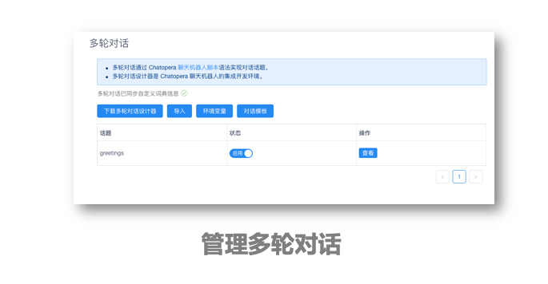

# 对话脚本

- 以语法规则定义对话
- 融合知识库问答和意图识别
- 可执行自定义的 JavaScript 函数

## 产品特色

- 规范、灵活的脚本语法
- 语法支持编程语言，内置 NLP 函数
- 对话脚本可共享分发，Chatopera 提供了[对话模板](https://github.com/chatopera/chatbot-samples)供快速定制对话服务

## 实现原理

对话脚本是通过书写 Chatopera 多轮对话脚本语法建立的规则实现问答。

- 对话脚本将对话分为**匹配器**，即和对话用户的输入进行比较的规则

- **回复**，匹配规则后的回复内容，支持文本和函数

- **上下轮钩子**，将规则与规则进行关联

- 对话脚本中的**函数**，使用 JavaScript 方式低代码编程，内置函数库，即方便了系统集成，同时也提供大量自然语言处理帮助函数，不需要掌握自然语言处理 NLP 的知识，开发者可以专注的实现业务逻辑

## 使用过程

**匹配器**是对话的基础，当用户向聊天机器人发送一条消息时，Chatopera 机器人平台会从所有定义的**匹配器**中找到匹配的规则。**匹配器**用半角字符加号`+`开始，对应的**回复**是紧邻的下行，用半角字符减号`-`开始。

例如，我们可以这样定义一个对话：

```脚本
+ 晚饭吃什么
- 烤鸭
```

**注意**：这里`+`和`-`和文字之间需要隔一个空格。

匹配器有多种，分别通过不同形式建立匹配规则，以适应不同场景的灵活使用。

- [通配符匹配器：使用语法建立规则](https://docs.chatopera.com/products/chatbot-platform/references/gambit-star.html)

- [模糊匹配器：容错能力更强和智能的匹配器](https://docs.chatopera.com/products/chatbot-platform/howto-guides/conv-gambit-like.html)

- [意图匹配器：借助意图识别模块，轻松实现任务型对话](https://docs.chatopera.com/products/chatbot-platform/howto-guides/conv-gambit-intent.html)

在脚本匹配器语法和函数中，融合知识库和意图识别，所以，对话脚本是多轮对话的中心，围绕脚本实现不同问答技术的融合。所以，很多时候，文档和产品中，也用【多轮对话】表述对话脚本，就是这个原因。对话脚本独立构成了一个模块，在 Chatopera 机器人平台内部，实现了对话脚本引擎。


