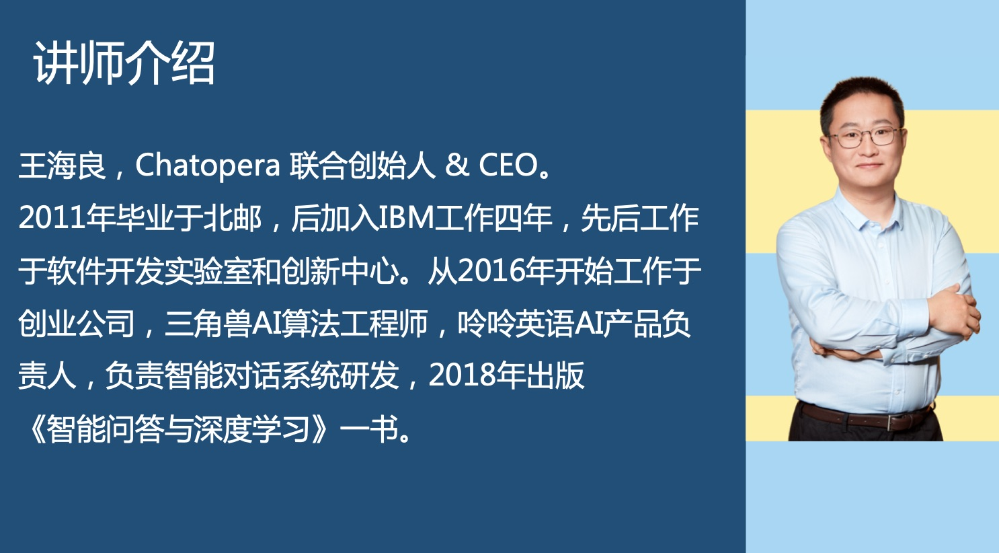

# 在线视频

本系列视频帮助企业在 Chatopera 机器人平台上开发聊天机器人，通过自然语言交互的形式，定制开发聊天机器人，提升业务流程自动化。Chatopera 机器人平台包括知识库、多轮对话、意图识别和语音识别等组件，标准化聊天机器人开发，支持企业 OA 智能问答、HR 智能问答、智能客服和网络营销等场景。

<table class="image">
    <tr>
        <td></td>
    </tr>
</table>

[【免费视频课程】《Chatopera 机器人平台使用指南》](http://ke.chatopera.com/course/2994143)

  <b><a href="http://ke.chatopera.com/course/2994143" target="_blank">上线聊天机器人！</a></b> 
  

该系列视频和产品迭代一起更新，部分内容大纲：

### 1.1 自然语言交互的当下与未来

- 自动化、就业和生产力

- 聊天机器人的商业应用

- Chatopera 机器人平台概览

- 从入门到精通

### 1.2 聊天机器人应用场景及前提准备

- 需求、场景设定、系统组成

- 对话流程设计

- 建模工具介绍

- 设计“聊天机器人实现工具”的思考

### 1.3 实现对话应用：活动通知

- 知识库用途和管理

- 脚本实现话题

- 多轮对话的检索顺序

- 动手完成活动通知话题

- 更多对话模板及总结

### 1.4 深入理解聊天机器人实现和更多实用技巧

- 信息检索系统概述

- 话题脚本引擎

- 多轮对话：从知识库路由到脚本引擎

- Chatopera 文档中心的使用

### 1.5 系统集成

- SDK 语言及安装

- 实例化 Chatbot

- Command 接口介绍

- 对话检索：知识库、多轮对话

### 1.6 聊天机器人上线后优化

- 分析投资回报率（RoI）

- 优化沉寂问题和错误回复

- 总结

- 后续分享计划

打开[课程](http://ke.chatopera.com/course/2994143)查看完整内容 ...

## 评论

