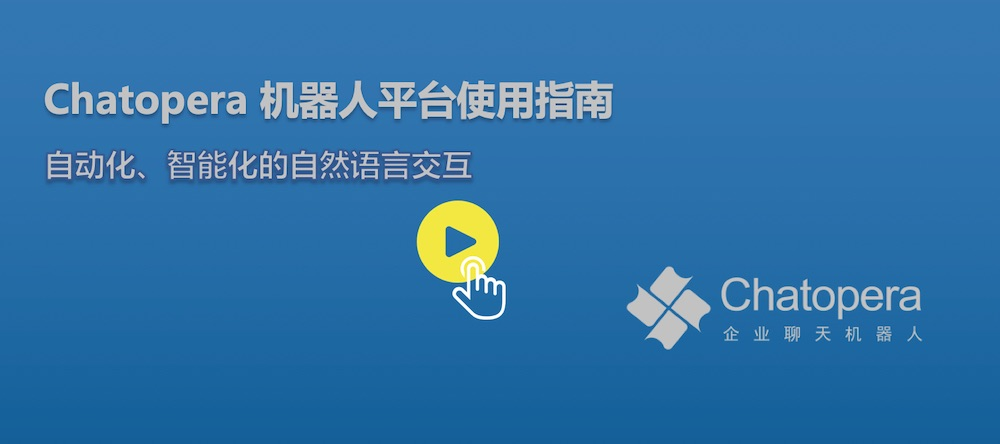

# 视频教程

本系列视频帮助企业在 Chatopera 机器人平台上开发聊天机器人，通过自然语言交互的形式，定制开发聊天机器人，提升业务流程自动化。Chatopera 机器人平台包括知识库、多轮对话、意图识别和大语言模型等组件，标准化聊天机器人开发，支持企业 OA 智能问答、HR 智能问答、智能客服和网络营销等场景。

课程内容分为两大部分：

* [【初级入门】《Chatopera 机器人平台使用指南》](https://www.bilibili.com/read/cv7526530)

* [【高级深入】《Chatopera 机器人平台 Deep Dive》](https://www.bilibili.com/video/BV1tz4y1S78k)

## 内容大纲(部分)

### 1.1 自然语言交互的当下与未来

* 自动化、就业和生产力

* 聊天机器人的商业应用

* Chatopera 机器人平台概览

* 从入门到精通

### 1.2 聊天机器人应用场景及前提准备

* 需求、场景设定、系统组成

* 对话流程设计

* 建模工具介绍

* 设计“聊天机器人实现工具”的思考

### 1.3 实现对话应用：活动通知

* 知识库用途和管理

* 脚本实现话题

* 多轮对话的检索顺序

* 动手完成活动通知话题

* 更多对话模板及总结

### 1.4 深入理解聊天机器人实现和更多实用技巧

* 信息检索系统概述

* 话题脚本引擎

* 多轮对话：从知识库路由到脚本引擎

* Chatopera 文档中心的使用

### 1.5 系统集成

* SDK 语言及安装

* 实例化 Chatbot

* Command 接口介绍

* 对话检索：知识库、多轮对话

### 1.6 聊天机器人上线后优化

* 分析投资回报率（RoI）

* 优化沉寂问题和错误回复

* 总结

* 后续分享计划

课程地址：[https://www.bilibili.com/read/cv7526530](https://www.bilibili.com/read/cv7526530)

