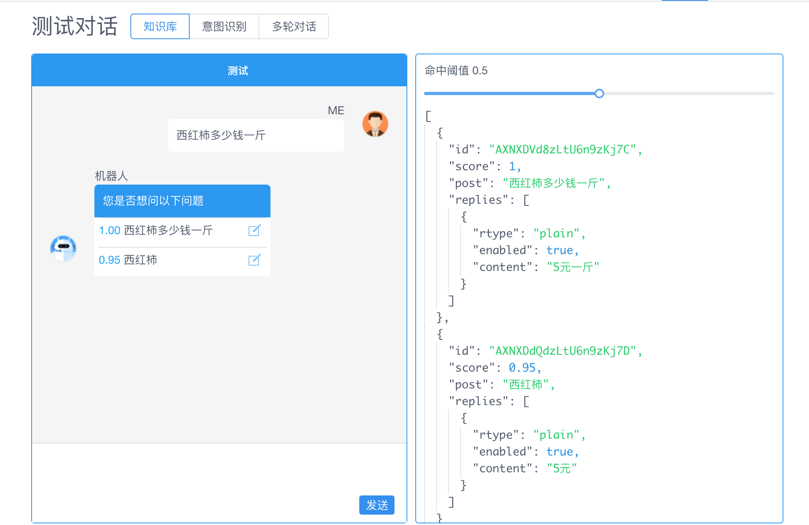
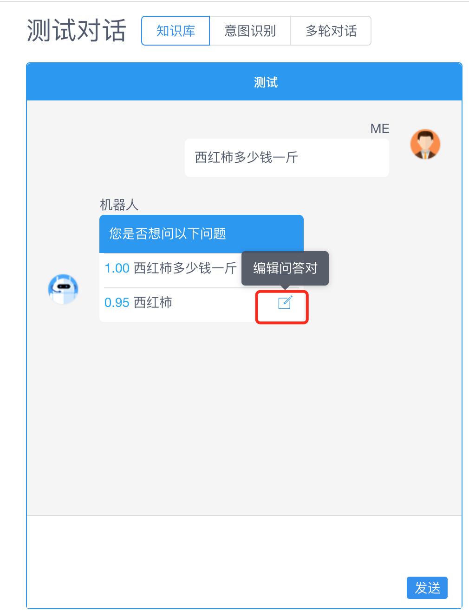
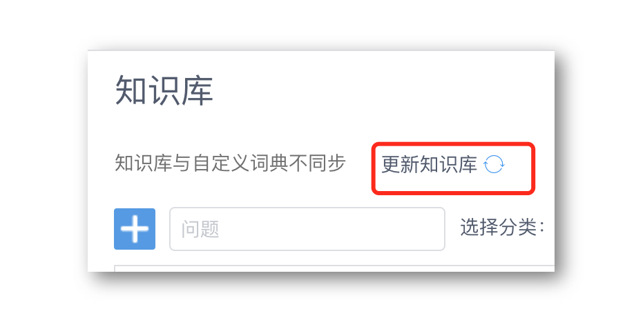
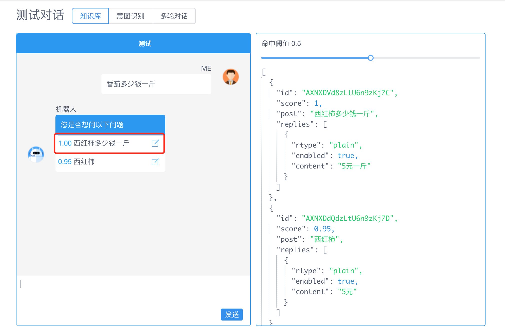

# 知识库

## 概述

在智能问答需求中，有一些问题可以提前设置好答案，并且是一问一答，不涉及上下文环境，对于这类问题，就可以使用**知识库**模块。知识库通过标准问、扩展问、自定义词典和答案维护了一套知识体系，为用户提供标准的、快速的对话检索服务。

尤其是在客服场景中，来访者有大量的问题都是重复的一问一答的问题，答案相对来说固定，或者在一段时间内固定，这样最适合通过完善**知识库**提升客服工作效率。

学习使用**知识库**的过程也很简单，历史数据也不是必需的。通常先由业务人员整理一些常见问题，并在**知识库管理页面**添加问答对，在**对话测试**页面进行简单的验证就可以集成上线了。进阶优化知识库包括设置自定义词典，增强知识库检索时处理近义词的能力，以及为标准问增加扩展问，或者在对话**历史记录**页面查看沉寂问题和兜底回复，创建新的问答对，增强知识库的智能水平，知识库的优化，可以认为只能回答提前编辑好的问题，知识库的优化也是长期的过程，也是企业重要的很有价值的资产。

<table class="image">
    <caption align="bottom">知识库管理</caption>
    <tr>
        <td></td>
    </tr>
</table>

> **提示：一问一答是指一个问题对应固定的答案。** 比如“世界上有几个大洲？”就属于这类为题；但是如果问“今天股市大盘走势如何？”，则答案不是固定的，该类问题可以通过 **意图识别模块** 或 **多轮对话** 脚本实现。

### 什么是问答对

能回答问题的前提要了解**问题**是什么。比如用户问：土豆多少钱一斤？如果知识库中没有这个问题，机器人就无法回复给用户，我们需要把这个用户的**输入**添加到知识库中，下次用户再问这个问题，机器人就可以把答案回复给用户。**问题**就是预期用户会**发送的文字**，机器人使用**答案**回复。

问题、相似问题和答案组成了**问答对**。建立问答对时，支持添加多个**相似问题** - 不同的用户说法不同，但都是同一个意思，相似问也被称为**扩展问**，二者表达同一个概念。相似问题和**自定义词典**大大加强了问答对适应用户各种问法的能力，自定义词典支持维护近义词。下面进行详细介绍。

## 新建问答对

在知识库页面点击「+」

<table class="image">
    <caption align="bottom">创建问答对</caption>
    <tr>
        <td></td>
    </tr>
</table>

在机器人管理面板中，还有其它地方可以创建问答对，比如历史记录页面点击「+」创建问答对。这些创建或修改问答对的快捷方式提升了维护知识库的便捷性。

## 设定答案

### 问答对支持多答案

针对用户业务的特点，每个问答对中，可以包含 1-10 个答案。多答案的设定，对于**业务系统**集成知识库更友好。这是因为，业务系统将保持更大的灵活性，选择最合适的策略推送给来访者。

> “业务系统”是一个宽泛的概念，因为知识库是通用的，比如电商、教育等行业都可以使用，在 Chatopera 机器人平台被来访者访问到前，通常会有一个集成渠道或处理业务逻辑的软件，这个软件统一的称之为“业务系统”。

比如，电商类的问题，有一个鞋帽类产品介绍，包含了多个图片，那么知识库中关联多个图文消息，每个图文消息可以每隔 3 秒钟发送一个，消费者收到消息时，对缩略图都形成印象。

又比如，客户端涉及**答案 1**推送给微信渠道用户，**答案 2**推送给微博渠道用户，多答案的设定，可以满足更多复杂需求。

以上举例只是为了说明多答案给应用知识库带来的灵活性，同时，知识库问答对支持多种答案类型。

### 纯文本

以一段文本内容作为答案。
步骤：新建问题页面点击「增加」下拉框，选择「文本」

### 富文本

使用富文本编辑器，最终答案将保存为 HTML 格式。

步骤：新建问题页面点击「增加」下拉框，选择「HTML」

<table class="image">
    <caption align="bottom">富文本类型</caption>
    <tr>
        <td></td>
    </tr>
</table>

### 图文消息

由标题、描述、图片和超链接组成的答案，适合展示为缩略图并配合文字，来访者点击后打开超链接。

步骤：新建问题页面点击「增加」下拉框，选择「图文」

<table class="image">
    <caption align="bottom">图文消息类型</caption>
    <tr>
        <td></td>
    </tr>
</table>

## 机器人置信度

设置问答对后，知识库能回答哪些问题了呢？如果用户问法不一样，机器人的“理解”能力怎么样呢？

### 置信度

机器人在检索知识库时，有一个判断来访者输入的问题和知识库中哪个问答对最匹配的时候，使用“置信度”为衡量标准。置信度*score*（也称为命中域值、相似度），它的值在[0~1]区间，值越大代表机器人越确定回复的准确性。

### 最佳回复和建议回复

当置信度高于某数值时，机器人就认为置信度最高的答案匹配上了来访者的问题，可以将该问答对的答案回复给来访者，该数值称为**最佳回复阀值**；当没有问答对的相似度高于最佳回复阀值，但是有一些问答对可以作为建议回复发送给来访者，展示为“您是想咨询一下问题吗”，然后列一个列表，请来访者选择，那么可以进入这个列表的问答对，需要高于某数值，该数值称为**建议回复阀值**。

<table class="image">
    <caption align="bottom">调试命中率</caption>
    <tr>
        <td></td>
    </tr>
</table>

对知识库的评测，常常用一系列测试问题查询返回结果，进而计算机器人回答的准确率评价检索系统。调试结果可以指导合理设置**最佳回复阀值**和**建议回复阀值**，这两个值对于业务系统集成知识库具有很重要的意义。

在熟悉了置信度的概念以后，就可以开始调试知识库了。

## 调试知识库

### 测试知识库问答

在机器人管理面板，通过**测试对话**页，测试知识库。

步骤：测试对话页面输入问题，查看机器人的回复

<table class="image">
    <caption align="bottom">调试命中率</caption>
    <tr>
        <td></td>
    </tr>
</table>

### 快速编辑问答对

如果机器人回复的问题命中阈值不高，可以直接点击问题，进行编辑

<table class="image">
    <caption align="bottom">调试命中率</caption>
    <tr>
        <td></td>
    </tr>
</table>

如果有大量而频繁的评价知识库准确率的需求，可以使用 [系统集成/SDK](/products/chatbot-platform/integration.html) 实现。

## 配置自定义词典

近义词是另一种增加机器人智能化水平的手段。比如：

创建**知识库问答对**，标准问：“**土豆多少钱一斤**”。不添加相似问题。此时，用户问：“**马铃薯多少钱一斤**”。

这个时候机器人处理“马铃薯多少钱一斤”时，知识库里匹配不到置信度很高的问题。

那么，怎样才能让机器人的回复与“马铃薯多少钱一斤”一样的答案呢？因为**它们可是同一个意思啊**。

这种情况下就需要配置近义词，我们找到包含「土豆」词条的自定义词典，为土豆添加近义词「马铃薯」，然后再去测试知识库，机器人的回复与“马铃薯多少钱一斤”一样的答案。

### 自定义词典定义

自定义词典就是用户添加自己的词典，支持创建：**词汇表**和**正则表达式**两种类型的词典。自定义词典通常用来管理**近义词**，**新词**，**专有名词**。

> **提示：知识库中应用自定词典只支持词汇表类型的自定义词典。**

### 创建自定义词典

创建自定义词典步骤：词典管理页面点击「新建自定义词典」词典类型选择「词汇表」

<table class="image">
    <caption align="bottom">新建自定义词典</caption>
    <tr>
        <td></td>
    </tr>
</table>

### 增加词条

添加词条步骤：自定义词典列表点击「编辑」进入添加词条页面

<table class="image">
    <caption align="bottom">添加词条</caption>
    <tr>
        <td></td>
    </tr>
</table>

有关[自定义词典](/products/chatbot-platform/dicts.html)的详细介绍，参考[词典管理](/products/chatbot-platform/dicts.html)。

### 知识库同步自定义词典

在保存了自定义词典后，知识库并没有立即应用变更的自定义词典，近义词并没有立刻生效。**只有在自定义词典管理页面或知识库管理页面，点击“更新知识库索引”后，知识库才会同步自定义词典，近义词才会生效。**

步骤：知识库页面点击「更新知识库」

<table class="image">
    <caption align="bottom">知识库同步自定义词典</caption>
    <tr>
        <td></td>
    </tr>
</table>

### 验证近义词

“番茄多少钱一斤”有结果了！

用户的问题中包含有「西红柿」的同义词「番茄」，机器人可以识别到。

<table class="image">
    <caption align="bottom">验证近义词</caption>
    <tr>
        <td></td>
    </tr>
</table>

**近义词**，**新词**，**专有名词**都可以通过自定义词典进行维护，维护好自定义词典对机器人智能化水平有着至关重要的作用。

## 批量导出或导入

导入和导出是对知识库的数据进行批量管理，导出的数据可以导入到其它机器人知识库中，导出的内容包括知识库分类信息、标准问、相似问和答案和启用状态。

应用场景：

1）备份机器人知识库；
2）新建机器人快速导入。

### 批量导出

步骤：知识库页面点击「导出」

<table class="image">
    <caption align="bottom">导出知识库</caption>
    <tr>
        <td></td>
    </tr>
</table>

文件导出格式为 json 格式，json 是一种节省空间、灵活的、方便用文本编辑器处理和代码处理的流行格式。

### 批量导入

注意事项：

- 导入的知识库仅支持 json 格式，内容定义参考**示例数据**
- 点击「下载示例数据」之后，可以对示例数据进行编辑保存，再导入到知识库
- 导入时可设置问题的状态，问题状态为「禁用」在测试知识库时检索不到

<table class="image">
    <caption align="bottom">导入知识库</caption>
    <tr>
        <td></td>
    </tr>
</table>

## 集成知识库

经过一系列的工作，知识库终于准备妥当，可以为业务系统提供机器人问答服务了，下一步参考[系统集成](/products/chatbot-platform/integration.html)接入上线吧！

## 知识库小助手

Chatopera 知识库小助手（简称“小助手”）是面向企业的客户服务人员发布的一款从**知识库**检索建议回复的桌面软件。长期以来，客户服务占据着企业运营的重要位置，因为回复不及时、不标准和不准确都会给企业造成损失，对于常见问题集的管理，主要使用的工具是 Excel，客服人员想要快速回复客户消息非常困难，同时也有不容易维护的问题，小助手就是专门用于解决这个问题而开发的。

### 产品亮点

易于配合其他应用，通过复制面板和粘贴面板工作。

悬浮窗口，占用很小空间。

设计简洁，和桌面背景百搭。

### 下载和安装

> 提示：

```
目前，小助手只支持Windows客户端。
```

下载地址：

| 版本 | 操作系统             | 下载                                                                                                      |
| ---- | -------------------- | --------------------------------------------------------------------------------------------------------- |
| v1.1 | Windows 7 或更高版本 | <a href="https://static-public.chatopera.com/bot/xiaozhushou/ChatoperaSetup.msi" target="_blank">链接</a> |

在下载后，浏览器可能提示“这种类型的文件可能会损坏您的计算机”或者“Windows Defender SmartScreen 已组织启动一个未识别的应用。”，这时请点击“保留”及“更多信息”进行下一步。

<table class="image">
<caption align="bottom">点击“仍要运行”</caption>
<tr><td></td></tr>
</table>

### 配置

<table class="image">
<caption align="bottom">Chatopera小助手</caption>
<tr><td></td></tr>
</table>

双击图标，启动小助手，看到如下配置界面。

<table class="image">
<caption align="bottom">配置小助手</caption>
<tr><td></td></tr>
</table>

邮箱一栏填写正确的电子邮箱地址。

- 获取应用 ID 和密钥

> 提示

```
Chatopera云服务:
Client ID对应"应用ID"
Secret 对应"密钥"
```

安装完成后，可以在启动菜单和桌面看到“Chatopera 小助手”的快捷方式。

已经具备了应用 ID 和密钥的用户跳过此步。作为团队组长/企业主管等角色使用或作为个人用途，可以通过注册<a href="https://bot.chatopera.com" target="_blank">Chatopera 云服务</a>，然后创建聊天机器人获得。

<table class="image">
<caption align="bottom">获得应用ID和密钥</caption>
<tr><td></td></tr>
</table>

这三项都属于必填项，填写好后点击“保存”。

### 获得智能建议回复

保存设置后，小助手是置顶在桌面的，在小助手的最右侧是切换*启用*和*停用*状态的按钮。

<table class="image">
<caption align="bottom">悬浮状态下的小助手</caption>
<tr><td></td></tr>
</table>

工作时，您可能处于不同的聊天软件中，甚至是文档中，都可以通过复制文本获得建议回复。比如，下面是在 QQ 群中，快速回复一个问题，就把这个问题复制到粘贴板，通常是通过【Ctrl + C】完成。

<table class="image">
<caption align="bottom">复制问题</caption>
<tr><td></td></tr>
</table>

这时，小助手就从机器人的知识库中查询相似问题，并按照*问题相似度*展开一个智能建议回复列表。**点击一个相似问题，就将该问题*答案*复制到粘贴板**，再粘贴该答案到聊天窗口，通常通过 【Ctrl + V】完成。

所以，这个过程可以简单的描述为*复制->点击->粘贴*。

### 临时停用

小助手处于*启用*状态时，每次执行文本复制操作都会做智能建议回复的查询，被复制内容会被发送到远程服务，为了保护用户隐私，您可以临时停用小助手，这时并不执行智能建议回复，您的隐私数据也就得到保护。**在任何状态，任何理由下，Chatopera 不会在未取得用户允许的情况下，获取或利用用户的隐私数据。**

<table class="image">
<caption align="bottom">停用状态下的小助手</caption>
<tr><td></td></tr>
</table>

### 退出

彻底关闭小助手，在小助手的悬浮区域右键，在弹出的菜单中点击“退出”。

<table class="image">
<caption align="bottom">退出小助手</caption>
<tr><td></td></tr>
</table>

## 评论

<script src="https://utteranc.es/client.js"
        repo="chatopera/docs"
        issue-term="pathname"
        label="Comment"
        theme="github-light"
        crossorigin="anonymous"
        async>
</script>
