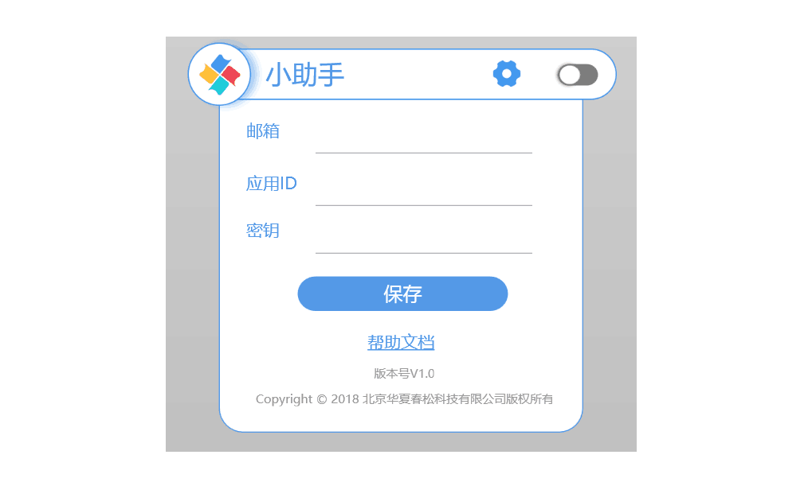

# 知识库

知识库是基于信息检索系统的一问一答的问答服务，通过建立【问题-扩展问-答案】和近义词实现智能问答，常用于常见问题集的机器人对话。

<table class="image">
    <caption align="bottom">知识库管理</caption>
    <tr>
        <td></td>
    </tr>
</table>

## 问答对

- 新建

<table class="image">
    <caption align="bottom">创建问答对</caption>
    <tr>
        <td></td>
    </tr>
</table>

- 编辑

- 调试知识库

<table class="image">
    <caption align="bottom">调试命中率</caption>
    <tr>
        <td></td>
    </tr>
</table>

系统集成聊天机器人时，发送的知识库检索或多轮对话检索，会返回置信度*score*（也称为命中域值），该值在[0~1]区间，值越大代表机器人越确定回复的准确性。

对知识库的评测，常常用一系列测试问题查询返回结果，进而计算机器人回答的准确率评价检索系统。

在系统集成时，常常设定一个置信度，在高于该值时，可以将机器人的回复返回给消费者。或在某个区间时，询问消费者*是否问以下问题*，这是目前智能客服常见的场景。

通过知识库管理页面的命中率调试窗口，开发者可以调整置信度（也称为命中域值）来调试知识库。

- 启用/禁用问答对

在问答对列表，使用*拨动开关*切换状态。

## 导入知识库

Chatopera 云服务支持导入一个文件，批量创建问答对。

<table class="image">
    <caption align="bottom">导入知识库</caption>
    <tr>
        <td></td>
    </tr>
</table>

目前，该文件格式必须为**.xlsx**，并且在表头注名各列的含义。

| 列     | 含义       | 说明                                                                                                                            |
| ------ | ---------- | ------------------------------------------------------------------------------------------------------------------------------- |
| 第一列 | 是否开启   | 问答对在知识库中有*启用/禁用*两个状态，只有*启用*的问答对在检索时有效。*禁用*状态的问答对可以是草稿，被废弃但是不想删除等情况。 |
| 第二列 | 问题       | 用文本描述的问题                                                                                                                |
| 第三列 | 答案       | 用文本描述的答案                                                                                                                |
| 第四列 | \*扩展问 1 | 问题的另一种问法                                                                                                                |
| 第五列 | \*扩展问 2 | 问题的另一种问法                                                                                                                |
| 第六列 | \*扩展问 3 | 问题的另一种问法                                                                                                                |

其中，_第一列_，_第二列_，_第三列_ 是必填项，扩展问不是必填项，但是扩展问越多，机器人越智能。

另外，*\*扩展问 N*必须出现在当列有值的时候，用户可以添加多个扩展问。

在知识库管理页面，也有下载*知识库模版*文件的链接。

## 导出知识库

用户可以随时将知识库文件导出，导出文件可以更好的使用其他工具编辑，或作为备份，导出文件的格式为 Excel。

### 近义词

> 提示：目前添加近义词是可以优化命中率的，但近期会升级优化这部分，得到更显著的提升。

近义词是另一种增加聊天机器人智能化水平的另外一个手段。

- 新建

在知识库管理页面，点击*近义词*，就可以看到*新建*按钮。

- 编辑

<table class="image">
    <caption align="bottom">创建近义词</caption>
    <tr>
        <td></td>
    </tr>
</table>

## 知识库小助手

Chatopera 知识库小助手（简称“小助手”）是面向企业的客户服务人员发布的一款从**知识库**检索建议回复的桌面软件。长期以来，客户服务占据着企业运营的重要位置，因为回复不及时、不标准和不准确都会给企业造成损失，对于常见问题集的管理，主要使用的工具是 Excel，客服人员想要快速回复客户消息非常困难，同时也有不容易维护的问题，小助手就是专门用于解决这个问题而开发的。

### 产品亮点

易于配合其他应用，通过复制面板和粘贴面板工作。

悬浮窗口，占用很小空间。

设计简洁，和桌面背景百搭。

### 下载和安装

> 提示：

```
目前，小助手只支持Windows客户端。
```

下载地址：

| 版本   | 操作系统             | 下载                                                                                                                                   |
| ------ | -------------------- | -------------------------------------------------------------------------------------------------------------------------------------- |
| v1.0.0 | Windows 7 或更高版本 | <a href="http://cdndownload.chatopera.com/sw/product/Chatopera%E5%B0%8F%E5%8A%A9%E6%89%8B-v1.0.0-Windows.msi" target="_blank">链接</a> |

在下载后，浏览器可能提示“这种类型的文件可能会损坏您的计算机”或者“Windows Defender SmartScreen 已组织启动一个未识别的应用。”，这时请点击“保留”及“更多信息”进行下一步。

<table class="image">
<caption align="bottom">点击“仍要运行”</caption>
<tr><td></td></tr>
</table>

### 配置

<table class="image">
<caption align="bottom">Chatopera小助手</caption>
<tr><td></td></tr>
</table>

双击图标，启动小助手，看到如下配置界面。

<table class="image">
<caption align="bottom">配置小助手</caption>
<tr><td></td></tr>
</table>

邮箱一栏填写正确的电子邮箱地址。

- 获取应用 ID 和密钥

> 提示

```
Chatopera云服务:
Client ID对应"应用ID"
Secret 对应"密钥"
```

安装完成后，可以在启动菜单和桌面看到“Chatopera 小助手”的快捷方式。

已经具备了应用 ID 和密钥的用户跳过此步。作为团队组长/企业主管等角色使用或作为个人用途，可以通过注册<a href="https://bot.chatopera.com" target="_blank">Chatopera 云服务</a>，然后创建聊天机器人获得。

<table class="image">
<caption align="bottom">获得应用ID和密钥</caption>
<tr><td></td></tr>
</table>

这三项都属于必填项，填写好后点击“保存”。

### 获得智能建议回复

保存设置后，小助手是置顶在桌面的，在小助手的最右侧是切换*启用*和*停用*状态的按钮。

<table class="image">
<caption align="bottom">悬浮状态下的小助手</caption>
<tr><td></td></tr>
</table>

工作时，您可能处于不同的聊天软件中，甚至是文档中，都可以通过复制文本获得建议回复。比如，下面是在 QQ 群中，快速回复一个问题，就把这个问题复制到粘贴板，通常是通过【Ctrl + C】完成。

<table class="image">
<caption align="bottom">复制问题</caption>
<tr><td></td></tr>
</table>

这时，小助手就从机器人的知识库中查询相似问题，并按照*问题相似度*展开一个智能建议回复列表。**点击一个相似问题，就将该问题*答案*复制到粘贴板**，再粘贴该答案到聊天窗口，通常通过 【Ctrl + V】完成。

所以，这个过程可以简单的描述为*复制->点击->粘贴*。

### 临时停用

小助手处于*启用*状态时，每次执行文本复制操作都会做智能建议回复的查询，被复制内容会被发送到远程服务，为了保护用户隐私，您可以临时停用小助手，这时并不执行智能建议回复，您的隐私数据也就得到保护。**在任何状态，任何理由下，Chatopera 不会在未取得用户允许的情况下，获取或利用用户的隐私数据。**

<table class="image">
<caption align="bottom">停用状态下的小助手</caption>
<tr><td></td></tr>
</table>

### 退出

彻底关闭小助手，在小助手的悬浮区域右键，在弹出的菜单中点击“退出”。

<table class="image">
<caption align="bottom">退出小助手</caption>
<tr><td></td></tr>
</table>

## 评论

<script src="https://utteranc.es/client.js"
        repo="chatopera/docs"
        issue-term="pathname"
        label="Comment"
        theme="github-light"
        crossorigin="anonymous"
        async>
</script>
