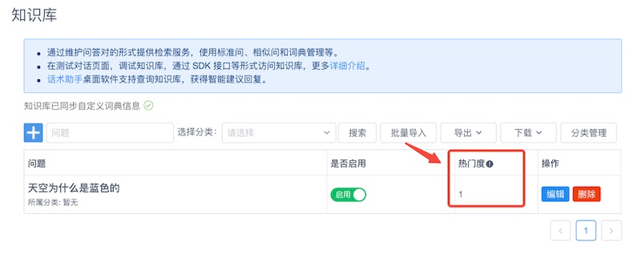
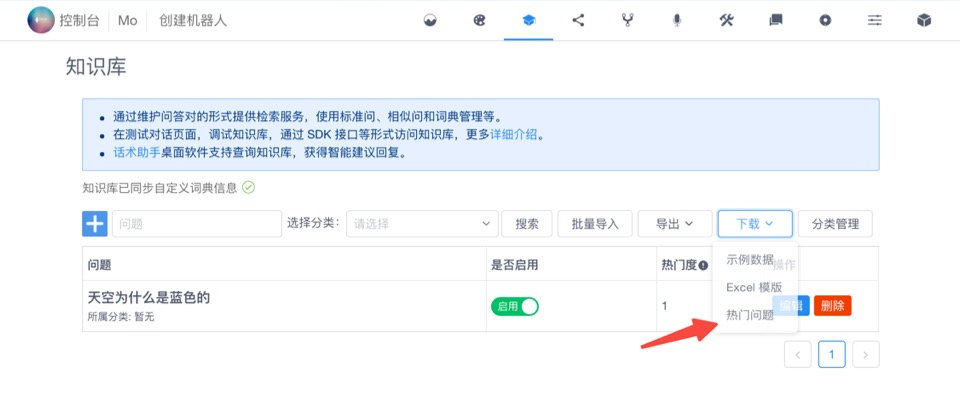

## 热门问题

热门问题评分是知识库中的问答对的相对热门程度。问题的热门度是一个分数，分数值代表某一个问答对作为回复结果出现在客户端的次数，可能是作为最佳答案，也可能是作为建议答案。

具体来说，就是在系统集成时，使用[知识库检索接口](/products/chatbot-platform/integration/api.html#检索知识库)或[多轮对话检索接口](/products/chatbot-platform/integration/api.html#检索多轮对话)时，该问答对出现在结果中的次数。

### 查看问答对热门度

在 Chatopera 机器人管理控制台上，每个机器人的知识库管理页面，每个问答对增加【热门度】一列。

<table class="image">
    <caption align="bottom">热门度</caption>
    <tr>
        <td></td>
    </tr>
</table>

### 下载热门问题

如何获得所有知识库问答对的按热门度排名信息？在知识库管理页面，【下载】下拉菜单中，增加【热门问题】。

<table class="image">
    <caption align="bottom">下载热门问题排行</caption>
    <tr>
        <td></td>
    </tr>
</table>

点击后将下载到按热门度降序排名的 Excel 汇总信息。

## 评论

