# CDE Quick Start

CDE, namely [Chatbot Development Env](https://marketplace.visualstudio.com/items?itemName=chatopera.chatbot-dev-env), is a developer tool released by Chatopera cloud service for developers. Use CDE to customize the conversational skills of the chatbot and improve its intelligence.


Overview of the installation process:

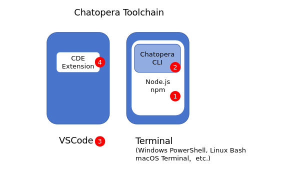

* Install Node.js: To use CDE, you need to combine it with Chatopera CLI. To install CLI, you need Node.js.
* Install Chatopera CLI: After installing and configuring Node.js, use the `npm` command to install it in the console
* Install VSCode: CDE is a VSCode plug-in, so you need to install VSCode first

## Install Node.js

You need to use Node.js v18 or higher, download the installation package from [Nodejs official website](https://nodejs.org/zh-cn/download). Node.js installation packages support different forms, and it is recommended to use independent installation packages.

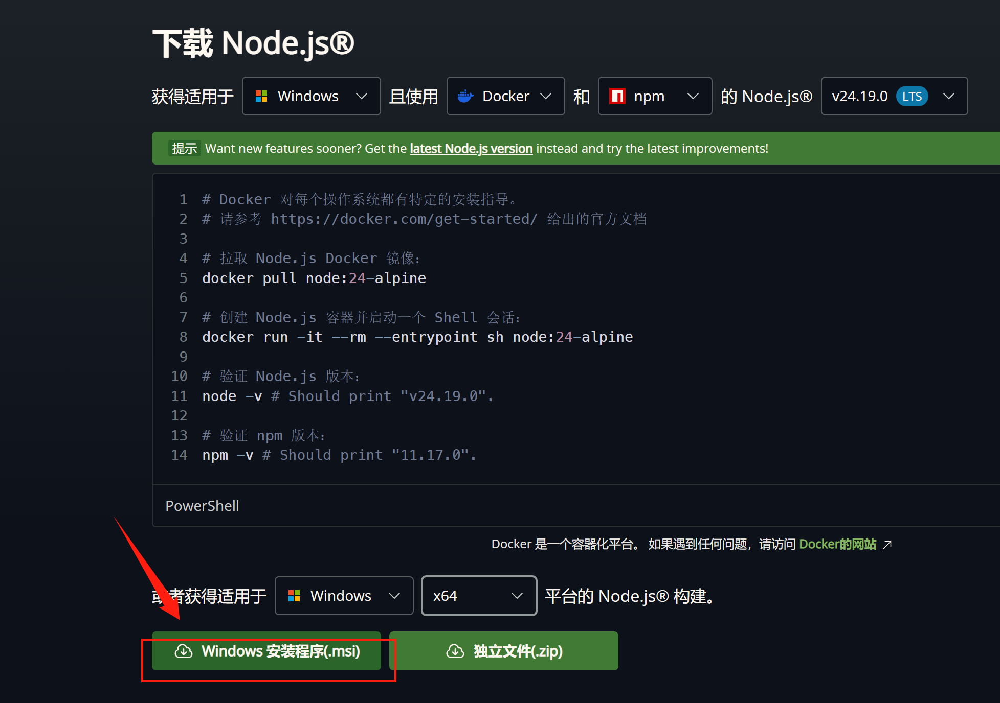

For example, [MSI installation package](https://nodejs.org/dist/v24.19.0/node-v24.19.0-x64.msi) for Windows platform.

**Set environment variable Path**: Note that during the installation process, set the following options.

> Set Node and npm to the Path environment variable.

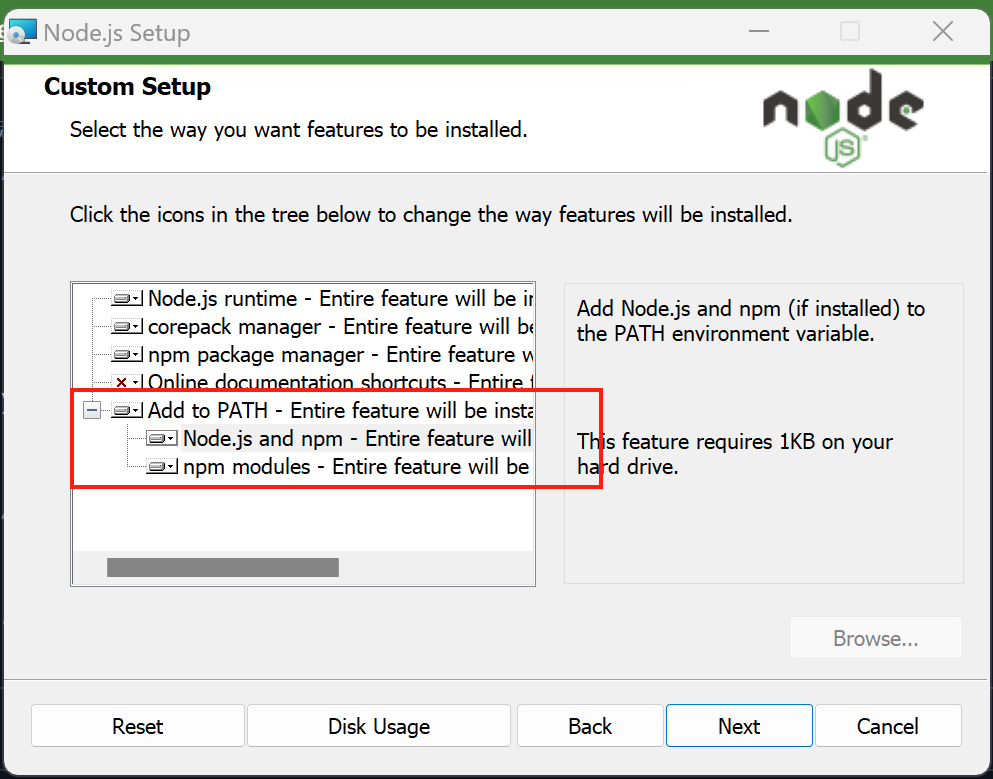

After the installation is complete, check whether the installation was successful.

* Mac/Linux users: Start a command line console, execute `echo $PATH`, check whether the installation path of node is in `PATH`, and then execute `node --version` and `npm --version` to confirm whether the installed version is correct.

* Windows users: Start a CMD Prompt, execute `echo %Path%` to check whether the installation path of node is in `Path`, and then execute `node --version` and `npm --version` in CMD to confirm whether the installed version is correct.

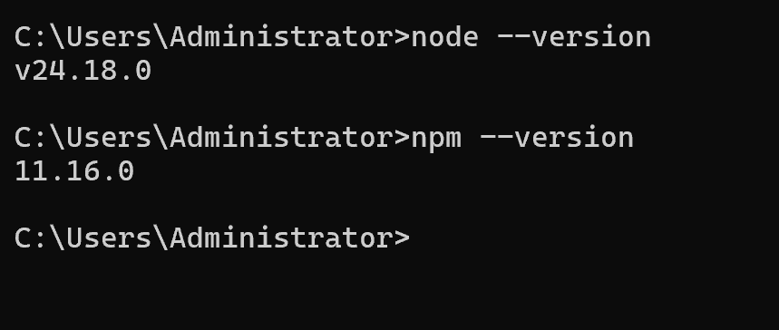

## Install Chatopera CLI

After installing Nodejs, execute the following command in the command line terminal:

```bash
npm install -g @chatopera/sdk
```

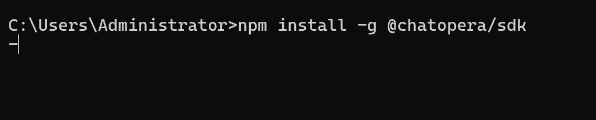

After the above command exits, execute the following command to test whether the installation is successful:

```
bot --help
```

If you can see the following output, it means that the Chaopera CLI has been installed successfully.

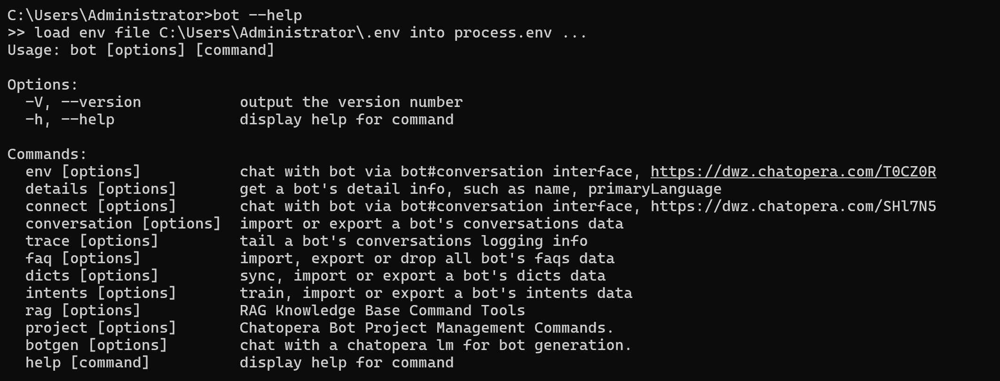

## Install VSCode

Enter the VSCode official website: [https://code.visualstudio.com/Download](https://code.visualstudio.com/Download)

Download the installation package of your operating system and then install it. After successful installation, you can find VSCode in the Start Center.

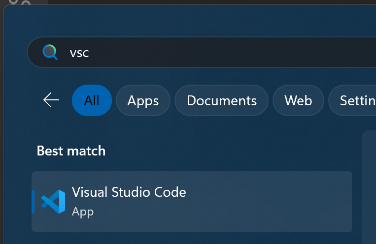

## Install CDE plug-in

Open VSCode and install the following image:

1. Enter plug-in management

2. Search for `chatbot-dev-env`

3. Click the Chatopera icon to enter the plug-in details

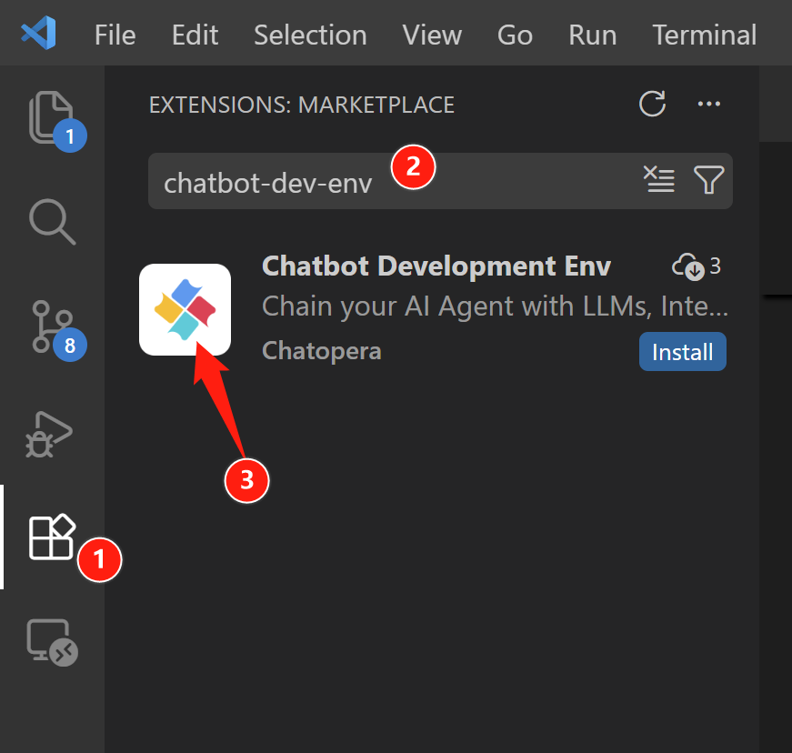

4. Click `Install` / `Install`

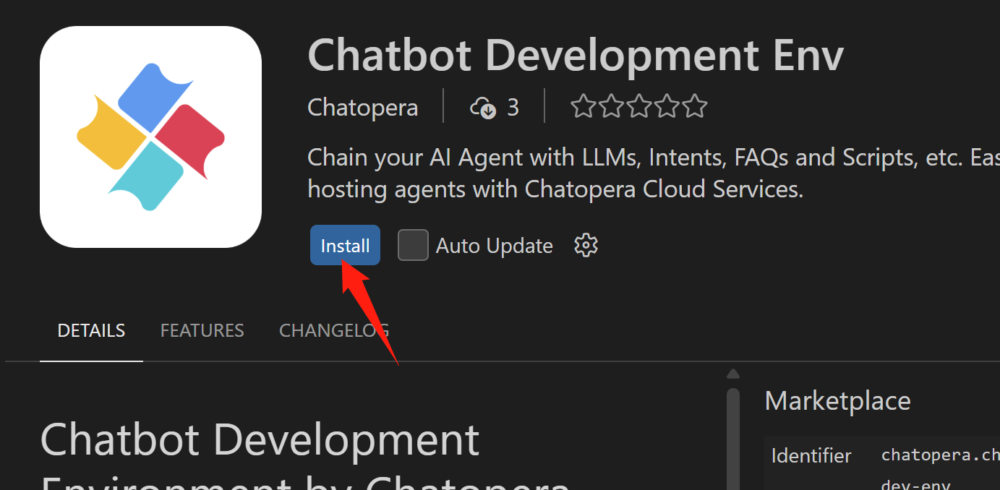

5. Click [Trust]

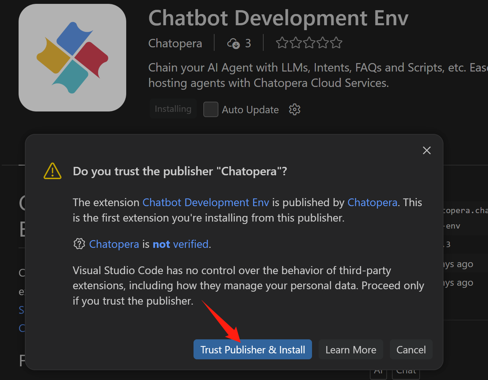

After installation, you can see the CDE plug-in icon on the left.

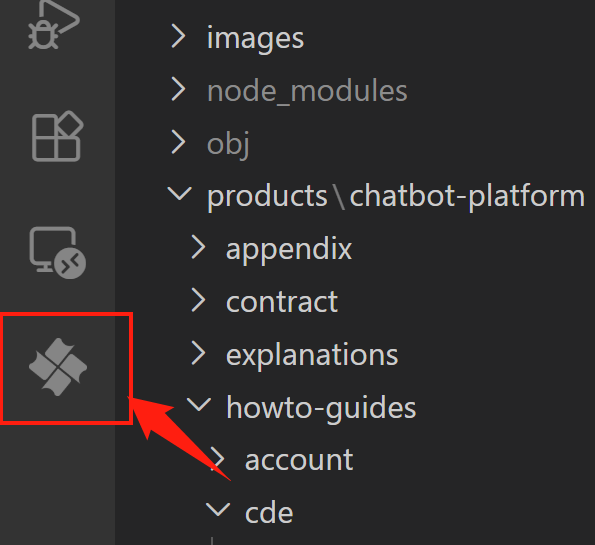

The installation is completed.

## Next step

* For specific use of CDE, refer to: [Introductory Tutorial](https://docs.chatopera.com/products/chatbot-platform/tutorials/index.html)
* When the Chatbot is released, it can be integrated into other software using SDK/API, reference: [Chatopera SDK and APIs](https://docs.chatopera.com/products/chatbot-platform/references/sdk/index.html)