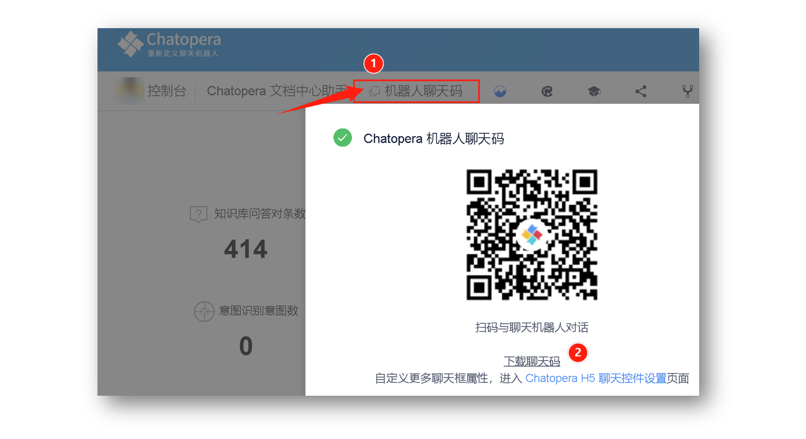

# 机器人聊天码

如何快速的让消费者与聊天机器人对话，在客户服务中，提升自动化业务流程？

在线下，最好的方式莫过于消费者可以扫码，然后立即与聊天机器人对话。Chatopera 机器人聊天码，就是用来满足这一需求的。

## 获得聊天码

作为 Chatopera 云服务用户，您可以在机器人的管理控制台获得聊天码，在机器人导航菜单中，点击【机器人聊天码】即可。

现在，您就可以将聊天码打印粘贴了，是不是很简单？

## 配置聊天框属性

Chatopera 机器人聊天码，就是 Chatopera H5 聊天控件的 URL 地址的二维码。因此，聊天框的属性，可以使用机器人 Chatopera H5 聊天控件的配置进行设置。

详情[参考链接](https://docs.chatopera.com/products/chatbot-platform/howto-guides/channels/webim-setup.html)。