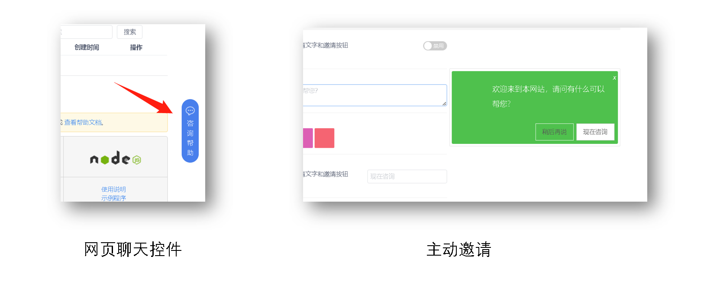
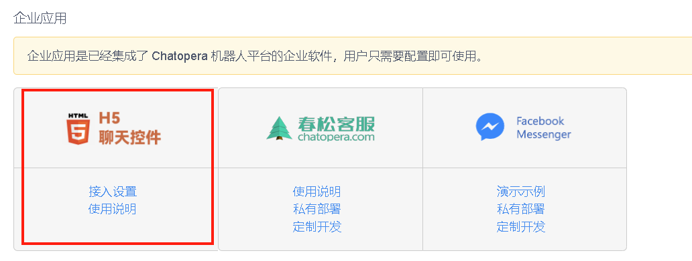

# H5 聊天控件

Chatopera 云服务支持将聊天机器人立即发布到网页，这项功能就是 H5 聊天控件，具体功能和使用见下。

## 支持网页聊天窗口

网页聊天窗口是 Chatopera 云服务为每个机器人提供的一个 URL 地址，打开该地址可以直接作为访客和机器人进行对话。

* 支持通过 URL 超链接打开一个网页聊天窗口，与机器人进行会话
* 打开的网页聊天窗口支持手机客户端和电脑客户端，自适应布局
* 打开的网页聊天窗口支持自定义形象、欢迎语、品牌标识
* 支持电脑客户端的网页中，自定义介绍信息、广告图片

## 支持网页聊天控件

H5 聊天控件另外一项能力是支持在已有的网页中添加浮动的按钮，点击按钮即跳转到网页聊天窗口。

* 支持自定义聊天控件在网页中的位置
* 支持延时加载聊天控件
* 支持自定义聊天控件中的文本
* 支持配置聊天控件的颜色
* 支持邀请功能及自定义邀请展示的信息

## 管理入口

以上信息，可通过【机器人管理控制台-系统集成】找到 H5 渠道的信息及配置。

