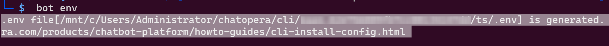
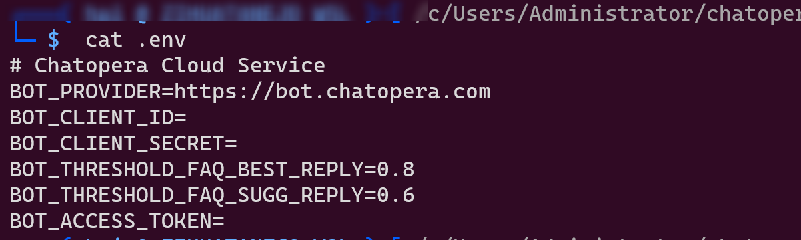
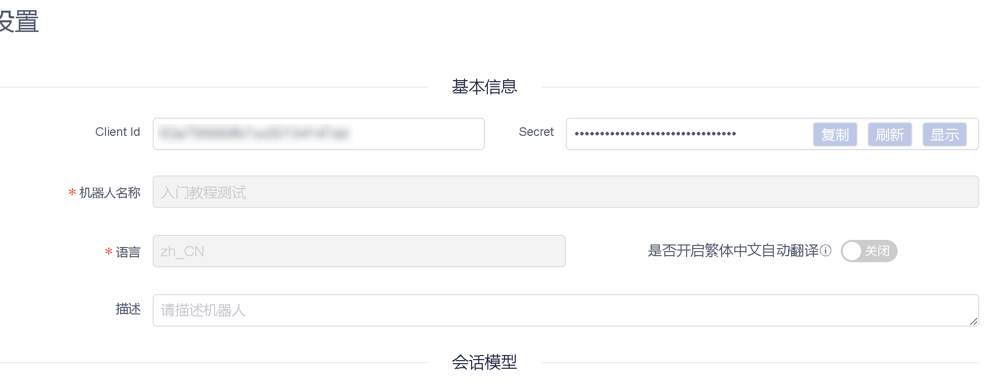
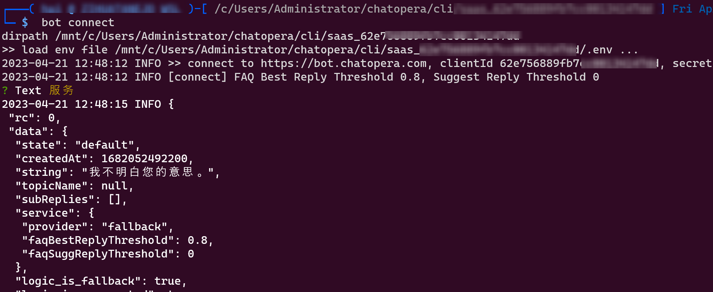

# CLI 连接多轮对话

Chatopera CLI 是命令行终端工具，[参考安装文档](/products/chatbot-platform/howto-guides/integration/cli-install-config.html)。在测试 Chatopera BOT 多轮对话时，可以使用 CLI 连接到机器人的多轮对话服务，进行测试验证，使用 CLI 可以：

* 提升自动化任务
* 查看接口融合的返回值
* 快速验证对话技能

以下的代码是在命令行终端中运行，比如 Windows CMD、PowerShell、Git Bash、Linux Bash 等 Shell 环境。

以下的代码使用 CLI 版本是 [@chatopera./sdk 2.8.12](https://www.npmjs.com/package/@chatopera/sdk)。

* 检查 Chatopera CLI 版本：`bot --version`
* 升级执行命令 `npm install -g @chatopera/sdk`

## 初始化

```bash
mkdir YOUR_FOLDER_NAME # 自定义一个目录
cd YOUR_FOLDER_NAME
bot env
```

运行后的日志如下：



此时在目录下生成了配置文件 `.env`:




设置 `.env` 里的值：

| 值 | 描述 |
| --- | --- |
| BOT_PROVIDER | Chatopera BOT 平台地址，默认为 http://bot.chatopera.com/ |
| BOT_CLIENT_ID | 机器人的 ClientID，在机器人控制台的设置界面获得 |
| BOT_CLIENT_SECRET | 机器人的 secret，在机器人控制台的设置界面获得 |
| BOT_THRESHOLD_FAQ_BEST_REPLY | 机器人知识库最佳回复阈值，默认为 0.8 |
| BOT_THRESHOLD_FAQ_SUGG_REPLY | 机器人知识库建议回复阈值，默认为 0 |

机器人控制台的设置界面：




## 连接

在完成配置后，在 `.env` 文件所在文件夹下，执行下面命令，进行对话：

```bash
bot connect
```


发送问题：



在回复中，展示返回值 JSON 数据。