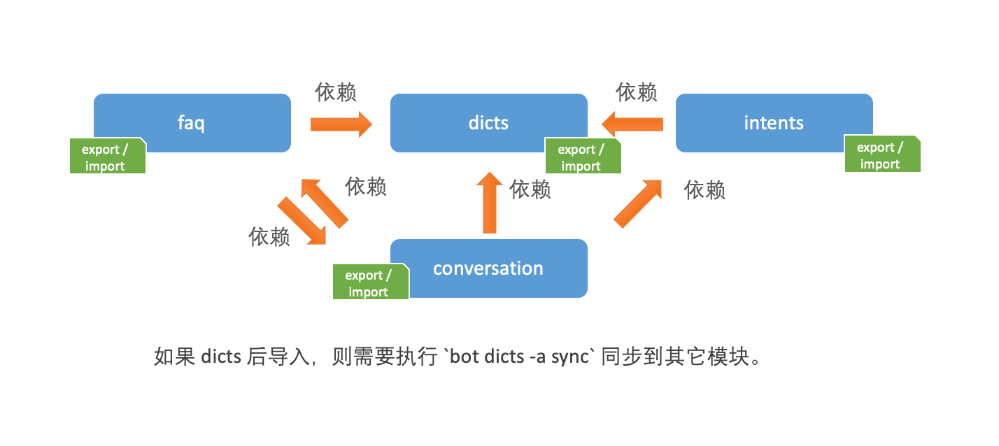

# 使用 CLI 导入和导出对话语料

[Chatopera CLI](cli-install-config.md) 支持的功能就是对不同[对话语料](/products/chatbot-platform/references/glossary.html#对话语料)的数据导入和导出；外加一些其他命令，辅助自动化管理机器人。

## 准备工作

* 安装 Chatopera CLI，参考文档 [Chatopera CLI](/products/chatbot-platform/references/cli.html);

* 配置 Chatopera CLI，使用 `.env` 文件，参考文档 [Chatopera CLI](/products/chatbot-platform/references/cli.html)。

<font color="blue">为简化说明，以下各示例配置使用了 `.env` 文件，因为略去了从命令行传入的一些参数。</font>

## 导入和导出命令规范

针对于不同模块的导入和导出命令，CLI 命令是遵循同一个规范的。

```
bot [dicts|faq|intents|conversation] --action [import|export] --filepath {{FILE_PATH}}
```



如果是导出（`export`），没有加入`--filepath`部分，则会默认保存文件到当前工作目录（`cwd` 目录）。

## 导出对话语料

对话语料指词典、知识库、意图识别和多轮对话的内容，它们包括了机器人的所有对话技能。

```
# 删除文件
rm -rf bot.dicts.json bot.faqs.json bot.intents.json bot.conversations.c66
# 执行导出，以下命令并无顺序依赖关系
bot dicts -a export -f bot.dicts.json
bot faq -a export -f bot.faqs.json
bot intents -a export -f bot.intents.json
bot conversation -a export -f bot.conversations.c66
```

## 导入对话语料

将到处的对话语料上传给指定的机器人（比如通过 `.env` 设置）。

```
# 以下命令有顺序依赖关系
bot dicts -a import -f bot.dicts.json
bot faq -a import -f bot.faq.json
bot intents -a import -f bot.intents.json
bot conversation -a import -f bot.conversation.c66
```

这样，目标机器人就具备从之前导出的机器人的技能，更多命令介绍，参考文档 [Chatopera CLI](/products/chatbot-platform/references/cli.html)。


## 评论

<script src="https://utteranc.es/client.js"
        repo="chatopera/docs"
        issue-term="pathname"
        label="Comment"
        theme="github-light"
        crossorigin="anonymous"
        async>
</script>
