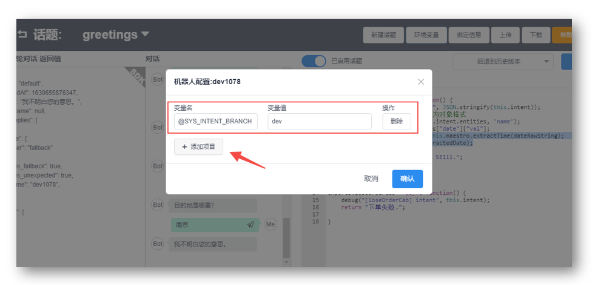
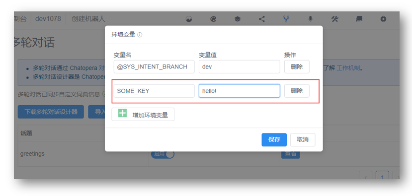

# 在多轮对话中配置环境变量

多轮对话支持配置环境变量，在开发过程中，设定对话可配置的信息。

## 设置环境变量

在多轮对话设计器配置环境变量。

<table class="image">
    <caption align="bottom">在多轮对话设计器配置环境变量</caption>
    <tr>
        <td></td>
    </tr>
</table>


在函数中，使用全局变量 `config` 从环境变量读取值。

比如：

```
exports.someFunction = async function(){
    return config["SOME_KEY"];
}
```

这样就方便了分发多轮对话，从多轮对话设计器中导出对话应用 c66，Chatopera 机器人平台用户可以将该 c66 文件导入另外一个机器人，并使用环境变量配置属性。

<table class="image">
    <caption align="bottom">在机器人控制台多轮对话管理页面配置环境变量</caption>
    <tr>
        <td></td>
    </tr>
</table>

## 系统环境变量

在多轮对话中，也存在系统环境变量，这些变量属于 Chatopera 机器人平台约定的，以 "@" 开头，其值可以被 Chatopera 机器人平台用户修改，但它们往往存在默认值和合法值的约束。

| 系统环境变量 | 默认值 | 取值说明 | 描述 |
| --- | --- | --- | --- |
| `@SYS_INTENT_BRANCH` | `dev` | `dev` 或 `pro` | 多轮对话集成意图识别的分支，`dev` 代表调试分支，`pro` 代表生产分支 | 


## 评论

<script src="https://utteranc.es/client.js"
        repo="chatopera/docs"
        issue-term="pathname"
        label="Comment"
        theme="github-light"
        crossorigin="anonymous"
        async>
</script>
