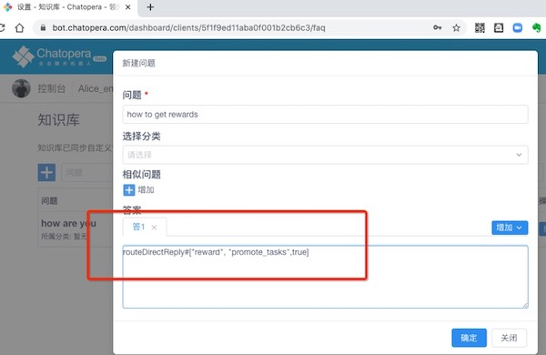

# 在多轮对话中管理对话状态

在多轮对话中，来访者和机器人对话的过程可以想像成来访者使用地图游览，每个时刻，来访者的位置都可以映射到地图上。地图有一定的行走路径，来访者下一步所能选择的方向是由当前状态提供的。

现在，来访者与机器人对话的状态会保持 30 分钟，比如来访者想要点餐，但是说了一句“我要点晚餐”，然后半个小时没有继续发送信息，那么等来访者再次发送信息时，机器人已经不记得上文了。

上下文状态和机器人记忆，都是让机器人有更强的对话处理能力：通过**上下轮钩子**和**通配符取值**，设计对话流程，满足各种定制化业务。

在实际应用中，对话状态按照匹配器、上下轮钩子和时间作用改变外，还有哪些办法影响对话状态呢？以下介绍几种方法，影响对话状态。

## 匹配器及回复复用

在机器人检索多轮对话时，会考虑到 30 分钟内的 100 轮对话（此处 30 分钟和 100 轮分别对应机器人设置界面参数：**会话回溯最大时长**，**会话回溯最大轮次**），我们称这样的一个限定条件是机器人的记忆。假如一个对话如下：

```脚本
+ 你好
- 你好！
- 欢迎光临！
```

它使用了通配符匹配器，有两个回复：“你好！”和“欢迎光临！”。假设在记忆周期内，发送两次“你好”给机器人，得到的回复分别是“你好！”和“欢迎光临！”。这时，再次发送“你好”，机器人则会回复兜底回复。

这是因为，机器人对“你好”的回复都消耗尽了。如果想让机器人在记忆周期内，保证可以重复的使用某一个回复，就需要加上 `{keep}` 标记，使用方法如下。

### 通配符匹配器

```脚本
+ 你好
- {keep} 你好！
- 欢迎光临！
```

也可以在匹配器前，使用 `{keep}`，这样就相当于在每个回复前都加了 `{keep}`，比如：

```脚本
+ {keep} 你好
- 你好！
- 欢迎光临！
```

当匹配器的有多个回复时，会按照记忆过滤，再从后选中随机选择一个作为回复，如果在回复上使用了 `{keep}` 则起到了：保证该匹配器在记忆中重复使用，标记该回复作为默认回复。

注意: 此处 `{` 和 `}` 是半角符号。

### 模糊匹配器

模糊匹配器中，`{keep}` 的使用也有两种形式，形式与通配符匹配器一致。

```脚本
+ {keep} ${0.6}{喜欢夏天还是冬天}
- 都喜欢
```

或者

```脚本
+ ${0.6}{喜欢夏天还是冬天}
- {keep} 都喜欢
```

### 意图匹配器

意图匹配器在 `intent` 后添加 `{keep}`，注意 `{keep}` 前后有空格。

```脚本
// 预约机票 
intent {keep} book_airplane_ticket
- ^handleAirplaneTicketOrder()
```

意图匹配器中，使用 `{keep}` 只有一种形式。

## 清除状态

所谓清除状态，就是在处理完某次回复，不再需要用户处于当前对话状态，而恢复默认对话状态。

解决办法：设置回复的文本以 `{CLEAR}` 开头。比如：

```脚本
+ 再见
- {CLEAR} 感谢您选择我们，期待再次光临！
```

`{CLEAR}` 可以添加在 **回复** 或 **函数返回值**中。在 Chatopera 机器人平台返回给来访者时，文本内容会去掉这个前缀。

这个方法很实用，尤其是在**全能匹配器**，对话可能进入死循环，因为所有的输入都被全能匹配拦截，那么在对应的回复中使用`{CLEAR}`就达到了下一次对话进入默认状态，不优先匹配**全能匹配器**的目的。

## 切换话题

在多轮对话中，开发者可以定义多个**对话主题**，对话主题的名字是字母组成的字符串，使用回复在不同对话主题间跳转。

### 跳转到通配符匹配器或模糊匹配器

```脚本
+ 你好
- ^topicRedirect("greetings","你好")
```

_topicRedirect_ 是内置的函数，第一个参数是目标主题名字，第二个参数是目标匹配器。

### 跳转到意图匹配器

在函数中，跳转到指定的意图匹配器有一点特殊，参考[使用说明](https://docs.chatopera.com/products/chatbot-platform/howto-guides/conv-gambit-intent.html#在回复中跳转到指定意图)。

## 知识库路由

在知识库的答案或多轮对话的函数中设置回复时，可以用 **routeDirectReply** 来检索一个指定的话题和匹配器，直接路由到多轮对话的主题和匹配器。

```语法
routeDirectReply#["TOPIC_NAME", "TOPIC_GAMBIT_ID" [,INHERIT_PARAMS]]
```

_TOPIC_NAME_: 话题名称

_TOPIC_GAMBIT_ID_: 匹配器

其中，_INHERIT_PARAMS_ 是可选参数，决定当前对话取得的 `params` 是否覆盖接下来对话的 `params`，值为`[true|false]`，默认为 `false`。

另外，当 `TOPIC_GAMBIT_ID` 的值为 `$ctx.textMessage$` 时，则使用当前对话的用户输入，在 `TOPIC_NAME` 中进行检索。

比如

```文本
routeDirectReply#["class_001_pre", "__C1PRE_GAMBIT_003",true]
```

<table class="image">
<caption align="bottom">【知识库或函数】路由多轮对话</caption>
<tr><td></td></tr>
</table>

提示：**routeDirectReply**需要设定为知识库问答对里的第一个答案，答案类型为 纯文本`plain`。
