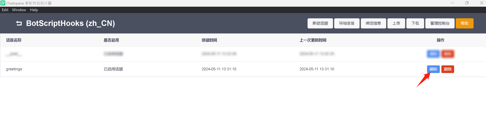
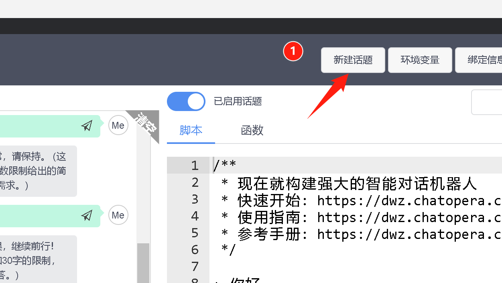

# 集成自定义外部对话系统

## 概述

作为用户，我想在 Chatopera 云服务内集成外部的对话系统，外部对话系统包括但不限于：
* 大语言模型
* 其它知识库

一个外部的系统，可以视为：一个接受对话请求的 API。
* API 有约定 HTTP Method
* Request Params 或 BODY
* Response 结果，比如 JSON 格式

<!-- 描述需求 -->

## 解决方案概述

以下为不同方案，可以选择其中一种。

### 多轮对话脚本 Hooks
使用该方案，需要您了解 JavaScript，下面也提供相关示例代码，任何编程经验都可以很快入门。

首先，了解 Chatopera 云服务的工作原理，尤其是检索的顺序，参考文档：https://docs.chatopera.com/products/chatbot-platform/explanations/query.html

其次，当前面没有得到答案，对话引擎进入多轮对话脚本检索，在检索中，话题也是排序的。排在最后的话题是 `__post__`，检索有下图。


利用 `__post__` 可以实现集成自定义的外部的对话系统。 

## 使用 `__post__` 脚本实现自定义外部对话系统集成

### 下载安装多轮对话设计器
参考文档[《多轮对话设计器安装》](https://docs.chatopera.com/products/chatbot-platform/howto-guides/convs/cde-install.html)。

### 导入机器人

* 打开多轮对话设计器，点击【添加】

* 在浏览器中，进入机器人设置页面，获得 ClientID 和 secret

* 在多轮对话设计器【添加】表单中，填入 ClientID 和 secret


### 打开话题 greetings

在多轮对话设计器中，打开新添加的机器人。在机器人话题列表页面，点击编辑。



### 新建话题



话题名称，填写 `__post__`，点击确认。


此处话题名称必须是 `__post__`。

### 编辑话题

编辑 `__post__` 话题


```脚本
+ (*)
- {CLEAR} ^getMyChatSystemReply()
```

此处，`getMyChatSystemReply` 是函数名，可以自定义，比如改成 `getAnyChatSystemReply`。


### 编辑函数

进入函数编辑页面。

首先，定义函数体。

```JavaScript
exports.getMyChatSystemReply = async function() {
    return {
        string: ""
    }
}
```

点击保存。


其中，返回值中 "string" 字段就是机器人回复的文本，如果设定为空字符串，则代表没有检索到答案，多轮对话检索将进入 LLM 大语言模型（如果开启）或兜底回复。

下面，实现和外部对话系统集成的关键环节：使用 `http` 库发送请求，处理回复。

更新函数 `getMyChatSystemReply `，内容如下：

```JavaScript
exports.getMyChatSystemReply = async function() {
    debug("[getMyChatSystemReply] %s %s", this.user.id, this.message.clean)
    // this.user.id: 当前对话访客的唯一标识
    // this.message.clean: 当前对话访客的请求文本

    // 使用 http 库请求 API
    let resp = await http.get("https://www.chatopera.com/files/botplt/miscs/dummy.chatsystem.json");
    debug("[getMyChatSystemReply] http response %j", resp.data);

    // 使用 resp 进一步的处理逻辑
    let reply = "";
    if (resp.data.reply) {
        reply = resp.data.reply;
    }

    return {
        string: reply
    }
}
```

保存，然后进行测试。


最终，得到答案是【今天是个好日子】，是因为 http response data 的内容如下：

```JavaScript
{
    "req": "",
    "reply": "今天是个好日子"
}
```

## 相关链接

* 脚本对话检索顺序，[https://dwz.chatopera.com/7C91Oz](https://dwz.chatopera.com/7C91Oz)
* 脚本中 keep 的作用：让该规则永久有效
* 脚本中 clear 的作用：清楚状态，下一轮对话依旧走全技能域的检索
* 更多 http 库使用的例子，[https://dwz.chatopera.com/0P46fh](https://dwz.chatopera.com/0P46fh)
* 更多函数多轮对话语法，[https://dwz.chatopera.com/1882VM](https://dwz.chatopera.com/1882VM)
