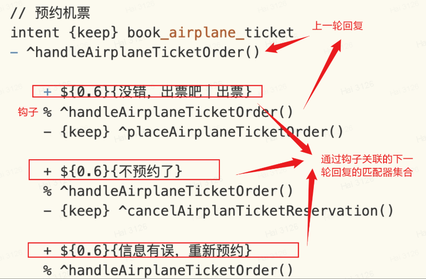

# 使用上下轮钩子

## 上下轮钩子的语法

在实际应用中，和机器人聊天时，很可能要通过**上下轮钩子**完成一个任务。我们用(**%**)来定位之前回复，声明新的匹配器，(**%**)后的内容是和某个回复内容一样的字符串，这里的(**%**)称之为“上下轮钩子”。

```脚本
+ (*)
- 您身高多少

  + *(3-5)
  % 您身高多少
  - 我的身高也是<cap1>
```

让我们一起看看这个例子：

1. 当用户输入任何文字，我们用通用通配符触发回答，然后系统回复“您身高多少”。

2. 当用户继续输入时，系统会先从历史中查看之前的回复中是否有对应的上下文，在这里指的是“% 您身高多少”

3. 最后，如果用户输入 3 到 5 个字符，系统匹配匹配器“+ \*(3-5)”, 并且回复“我也是&#60;cap&#62;”。“&#60;cap&#62;”代表的就是用户输入的内容。

## 理解钩子在多轮对话中的作用

“访客发送给机器人，机器人回答一次”，就是一轮对话。其中，访客发送给机器人的文本，就是加号后面的规则，机器人因此进行匹配。匹配上了，就通过减号后面的生成答案。

那么，如果有多个匹配器(`+` 加号定义的规则)，那么选择哪些进行匹配呢？默认就是都匹配。但是如果上一轮对话中，可以限定下一轮的匹配器集合，这样就仅在这个集合中寻找匹配器。 如何限定呢？就是定义上下轮对话的钩子。这个钩子就通过 `% 上一轮回复的字符串` 确定。

