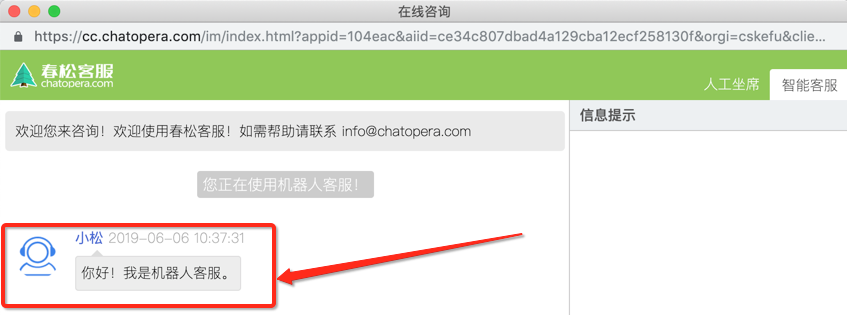
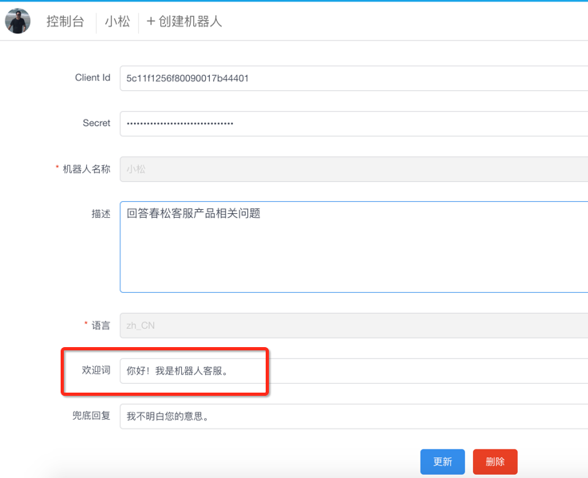
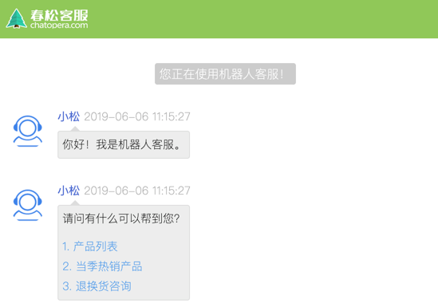
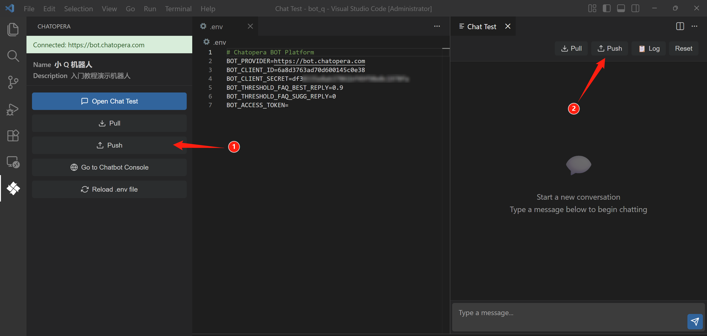

# 回复富文本内容

使用富文本消息类型，提升了用户体验，这些回复的设定，需要借助 CDE。

* CDE 的[安装链接](https://docs.chatopera.com/products/chatbot-platform/howto-guides/cde/guide101_zh.html)
* 快速入门 [CDE 的使用](https://docs.chatopera.com/products/chatbot-platform/tutorials/index.html)

简而言之，就是使用函数回复约定的数据格式，在客户端会“渲染”成不同的样式。

## 热门问题问候语



在默认情况下，机器人的问候语是在 Chatopera 云服务的机器人属性页面进行设置，该设置只支持纯文本。



访客登录进入客服聊天窗口往往是有一些问题要咨询的，所以更为合理的用户体验是将一些常见问题作为导航用途显示在问候语下面，比如这样：



### 具体的使用方法

具体的使用方法是，找到 greetings 话题，或创建一个新的话题，设置脚本和函数：

* 脚本

```脚本
// FAQ Hotlist
+ __faq_hot_list
- {keep} ^get_greetings()
```

* 函数

```JavaScript
// 问候语中关联常见问题
exports.get_greetings = async function() {
    return {
        text: "请问有什么可以帮到您？",
        params: [{
            label: "1. 产品列表",
            type: "qlist",
            text: "产品列表"
        }, {
            label: "2. 当季热销产品",
            type: "qlist",
            text: "当季热销产品"
        }, {
            label: "3. 退换货咨询",
            type: "qlist",
            text: "退换货咨询"
        }]
    };
}  
```


然后，保存，使用 【Push】推送给机器人。



### 解释说明

该规则 `__faq_hot_list` 将保证在访客和机器人连接成功后， 机器人发送函数`get_greetings` 返回的内容。此处 `__faq_hot_list` 是固定的，`get_greetings` 函数名和下面的技能函数名保持一致便可。

`__faq_hot_list` 是春松客服与 [Chatopera 机器人平台](https://bot.chatopera.com/)之间约定的一个钩子。

`{keep}` 的作用是机器人记忆中，可重复的使用一个回复，参考[文档](https://docs.chatopera.com/products/chatbot-platform/howto-guides/convs/conv-state.html#%E5%8C%B9%E9%85%8D%E5%99%A8%E5%8F%8A%E5%9B%9E%E5%A4%8D%E5%A4%8D%E7%94%A8)。


## 按钮消息

## 图文消息
