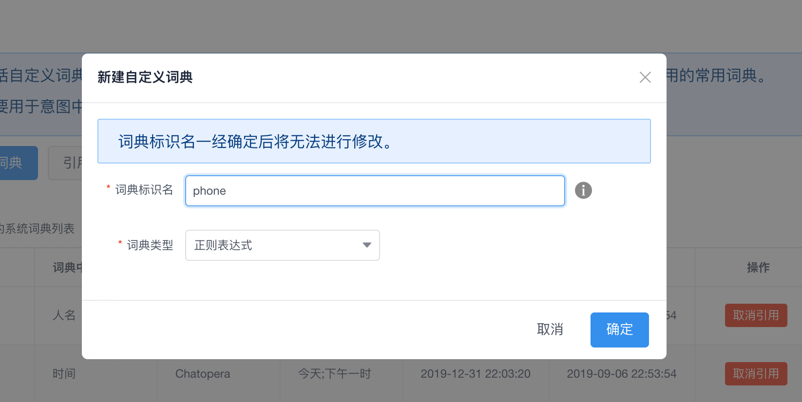
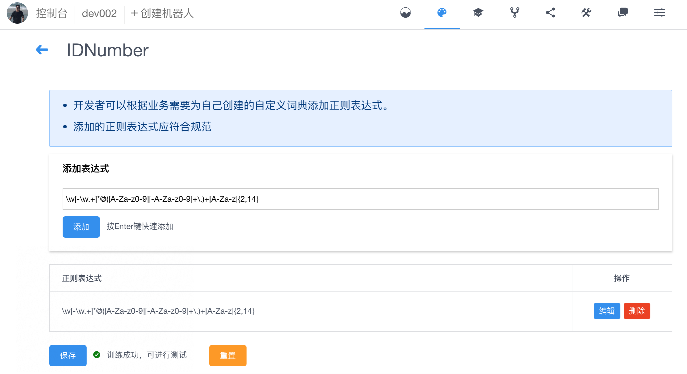
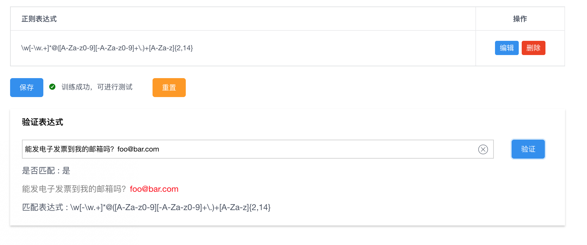

# 管理正则表达式词典

正则表达式词典是通过正则表达式的形式约束一个词汇的集合，正则表达式是以一定语法作为规则的语法。

## 创建

命名规则：

- 词典标识名为字母、数字、下划线的组合，1-32 位，如：RailTypes
- 同一个机器人下的词典标识名不能重复
- 词典标识名一经确认后无法进行修改

在词典管理页面点击新建自定义词典，在弹出的对话框里输入正确的自定义词典名称，词典类型选择"正则表达式"，点击确定

<table class="image">
<caption align="bottom">图：新建正则表达式词典</caption>
<tr><td></td></tr>
</table>

<table class="image">
<caption align="bottom">图：新建正则表达式词典</caption>
<tr><td></td></tr>
</table>

如果创建的自定义词典名称不符合要求，会有相应的提示

<table class="image">
<caption align="bottom">图：不符合要求</caption>
<tr><td></td></tr>
</table>

## 编辑

Chatopera 机器人平台中，正则表达式词典支持的表达式规范为[PCRE](#PCRE) 标准。

添加正则表达式定义，进入【词典管理>>自定义词典】列表，选择正则表达式词典，点击"编辑"。

<table class="image">
<caption align="bottom">图：添加正则表达式定义</caption>
<tr><td></td></tr>
</table>

在"添加表达式"项目下，写入表达式，点击"添加"，然后点击"保存"。保存成功后会重新训练机器人，如果遇到错误会弹出提示消息，对于没有意图或意图中没有说法的情况，训练机器人会失败，这时候保存正则表达式词典是成功的，该错误可忽略，后续在添加了意图和说法后，就正常了。

正则表达式定义支持多个表达式，在使用正则表达式词典时，会按照正则表达式列表的顺序进行匹配，如果匹配到词汇，就跳过其它表达式，否则继续匹配，直到遍历表达式列表。

保存成功后，还需要确认表达式是能按照预期工作，这个验证的过程通过【验证表达式】完成，该项目在表达式列表的下面。

<table class="image">
<caption align="bottom">图：验证表达式</caption>
<tr><td></td></tr>
</table>

验证表达式过程就是输入一段测试文本，点击"验证"，验证结果将显示在下面。

## 常用正则表达式

正则表达式是一个易学难精的技能，一方面是介绍材料众多，另一方面是网络上有很多写好的常用的表达式。以下定义三个常用的表达式。

| 项目     | 表达式                                                   |
| -------- | -------------------------------------------------------- |
| 邮箱     | `\w[-\w.+]*@([A-Za-z0-9][-A-Za-z0-9]+\.)+[A-Za-z]{2,14}` |
| 身份证号 | `\d{15}(\d\d[0-9xX])?`                                   |
| QQ 号    | `[1-9][0-9]{4,}`                                         |

正则表达式的基础知识参考[链接](https://www.runoob.com/regexp/regexp-tutorial.html)，更多关于正则表达式材料在网络上自行查找，**相关 Perl 正则表达式或 PCRE 正则表达式的适用于 Chatopera 机器人平台的正则表达式词典**。

## 表达式注意事项

上文提到了 Chatopera 机器人平台的正则表达式词典是基于 C++ Boost Regex 库的，并使用 PCRE 规范，实际上和 PCRE 有细微出入，以下内容进行介绍。

1. 如果在`[]`之间需要包含`-`，并且不代表区间，而是`-`代表本身，那么需要将`-`放在末尾或开头，否则会报错；
2. 在表达式使用中只取第一个匹配的值，如果一个表达式能匹配到输入语句的多个值，其它的值被忽略。

## PCRE

[PCRE](https://www.pcre.org/original/doc/html/pcrepattern.html) 是"Perl-compatible regular expressions"的缩写，广泛的被各种编程语言支持，虽然在不同语言支持时，会有微小的不同，实际使用中仍可参考 PCRE 的说明，Chatopera 机器人平台使用 C++开发，底层的正则表达式接口使用[Boost Regex 库](https://www.boost.org/doc/libs/1_70_0/libs/regex/doc/html/boost_regex/syntax/perl_syntax.html)

## 评论

