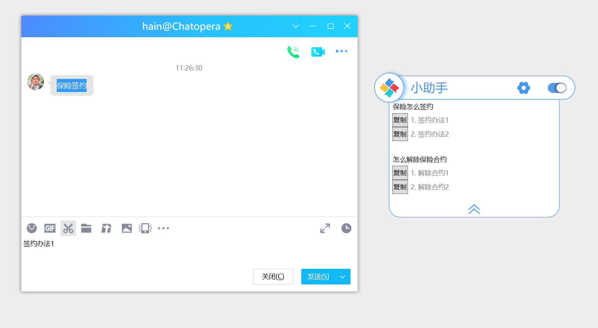

# 使用话术助手快速检索话术

快速从机器人知识库检索的输入法！

关键词：快捷语、网络聊天快捷语、网络销售快捷语、知识库快捷、企业输入法、定制知识库、聊天助手、营销话术快捷语、营销话术助手、客服话术助手

Chatopera 知识库话术助手（简称“话术助手”）是面向企业的客户服务人员发布的一款从**知识库**检索建议回复的**桌面软件**。长期以来，客户服务占据着企业运营的重要位置，因为回复不及时、不标准和不准确都会给企业造成损失，对于常见问题集的管理，主要使用的工具是 Excel，客服人员想要快速回复客户消息非常困难，同时也有不容易维护的问题，话术助手就是专门用于解决这个问题而开发的。

## 产品亮点

- 易于配合其他应用，通过复制面板和粘贴面板工作；

- 话术助手工作条支持输入关键词检索，提升话术、问答对检索的便捷性；

- 悬浮窗口，占用很小空间；

- 设计简洁，和桌面背景百搭。

## 使用教程

<iframe src="//player.bilibili.com/player.html?aid=244552646&bvid=BV1dv41117sH&cid=235511554&page=1" scrolling="no" border="0" frameborder="no" framespacing="0" allowfullscreen="true" width=600 height=350> </iframe>
 

## 下载和安装

> 提示：目前，话术助手只支持Windows客户端。

下载地址：

| 版本 | 操作系统             | 下载                                                                                                                                 |
| ---- | -------------------- | ------------------------------------------------------------------------------------------------------------------------------------ |
| v1.5 | Windows 7 或更高版本 | <a href="https://gitee.com/chatopera/cskefu/attach_files/972109/download/Chatopera%E5%B0%8F%E5%8A%A9%E6%89%8B-v1.5.msi" target="_blank">链接</a> |

在下载后，浏览器可能提示“这种类型的文件可能会损坏您的计算机”或者“Windows Defender SmartScreen 已组织启动一个未识别的应用。”，这时请点击“保留”及“更多信息”进行下一步。

## 配置

双击图标，启动话术助手，看到如下配置界面。

“邮箱”一栏填写有效的电子邮箱地址，该邮箱属于从该 PC 客户端使用 话术助手的人员，比如客服坐席。客服主管可以从 Chatopera 机器人平台的对话历史中看到该邮箱访问机器人知识库的使用情况。

- 获取应用 ID 和密钥

> 提示：进入 Chatopera 云服务，机器人管理控制台，设置页面，获得 Client ID 和 Secret。

安装完成后，可以在启动菜单和桌面看到“话术助手”的快捷方式。

已经具备了应用 ID 和密钥的用户跳过此步。作为团队组长/企业主管等角色使用或作为个人用途，可以通过注册<a href="https://bot.chatopera.com" target="_blank">Chatopera 云服务</a>，然后创建聊天机器人获得。

这三项都属于必填项，填写好后点击“保存”。

使用 话术助手获得智能建议回复，有两种形式：1）利用系统粘贴板；2）在话术助手工具条里输入关键词。

### 复制到系统粘贴板

保存设置后，话术助手是置顶在桌面的，在话术助手的最右侧是切换*启用*和*停用*状态的按钮。

工作时，您可能处于不同的聊天软件中，甚至是文档中，都可以通过复制文本获得建议回复。比如，下面是在 QQ 群中，快速回复一个问题，就把这个问题复制到粘贴板，通常是通过【Ctrl + C】完成。

这时，话术助手就从机器人的知识库中查询相似问题，并按照*问题相似度*展开一个智能建议回复列表。**点击一个相似问题，就将该问题*答案*复制到粘贴板**，再粘贴该答案到聊天窗口，通常通过 【Ctrl + V】完成。

所以，这个过程可以简单的描述为*复制->点击->粘贴*。

### 输入关键词

保存设置后，话术助手工具条内显示“请输入搜索关键字”，在此录入文本后，通过回车键或右侧放大镜都可以提交搜索。获得建议回复。

点击取得的答案，答案内容被复制找系统粘贴板，然后可以再粘贴到其它地方，通过【Ctrl + V】完成。

## 临时停用

话术助手处于*启用*状态时，每次执行文本复制操作都会做智能建议回复的查询，被复制内容会被发送到远程服务，为了保护用户隐私，您可以临时停用话术助手，这时并不执行智能建议回复，您的隐私数据也就得到保护。**在任何状态，任何理由下，Chatopera 不会在未取得用户允许的情况下，获取或利用用户的隐私数据。**

## 退出

彻底关闭话术助手，在话术助手的悬浮区域右键，在弹出的菜单中点击“退出”。

