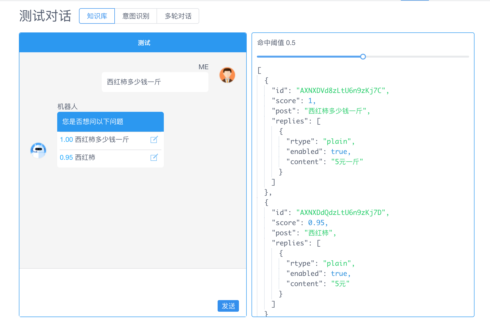
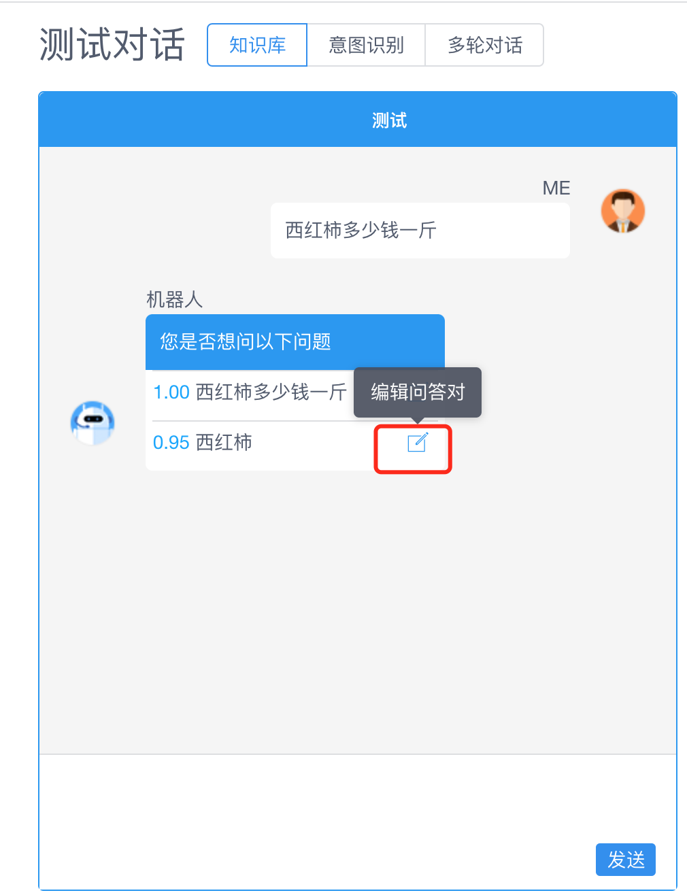

## 标注对话历史优化知识库

### 测试知识库问答

在机器人管理面板，通过**测试对话**页，测试知识库。

步骤：测试对话页面输入问题，查看机器人的回复

<table class="image">
    <caption align="bottom">调试命中率</caption>
    <tr>
        <td></td>
    </tr>
</table>

### 快速编辑问答对

如果机器人回复的问题命中阈值不高，可以直接点击问题，进行编辑

<table class="image">
    <caption align="bottom">调试命中率</caption>
    <tr>
        <td></td>
    </tr>
</table>

如果有大量而频繁的评价知识库准确率的需求，可以使用 [系统集成/SDK](/products/chatbot-platform/integration/index.html) 实现。

## 评论

