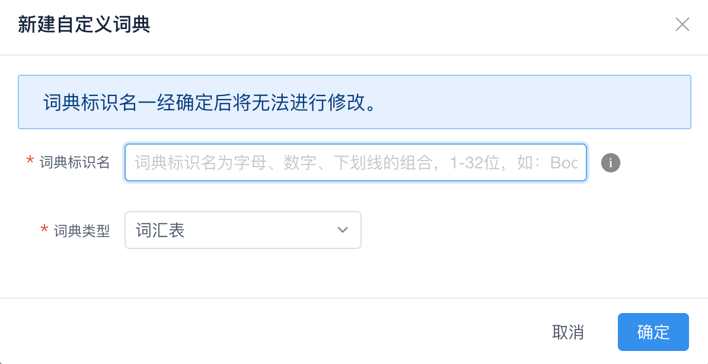

## 使用自定义词典增强知识库

近义词是另一种增加机器人智能化水平的手段。比如：

创建**知识库问答对**，标准问：“**土豆多少钱一斤**”。不添加相似问题。此时，用户问：“**马铃薯多少钱一斤**”。

这个时候机器人处理“马铃薯多少钱一斤”时，知识库里匹配不到置信度很高的问题。

那么，怎样才能让机器人的回复与“马铃薯多少钱一斤”一样的答案呢？因为**它们可是同一个意思啊**。

这种情况下就需要配置近义词，我们找到包含「土豆」词条的自定义词典，为土豆添加近义词「马铃薯」，然后再去测试知识库，机器人的回复与“马铃薯多少钱一斤”一样的答案。

### 自定义词典定义

自定义词典就是用户添加自己的词典，支持创建：**词汇表**和**正则表达式**两种类型的词典。自定义词典通常用来管理**近义词**，**新词**，**专有名词**。

> **提示：知识库中应用自定词典只支持词汇表类型的自定义词典。**

### 创建自定义词典

创建自定义词典步骤：词典管理页面点击「新建自定义词典」词典类型选择「词汇表」

<table class="image">
    <caption align="bottom">新建自定义词典</caption>
    <tr>
        <td></td>
    </tr>
</table>

### 增加词条

添加词条步骤：自定义词典列表点击「编辑」进入添加词条页面

<table class="image">
    <caption align="bottom">添加词条</caption>
    <tr>
        <td></td>
    </tr>
</table>

### 知识库同步自定义词典

在保存了自定义词典后，知识库并没有立即应用变更的自定义词典，近义词并没有立刻生效。**只有在自定义词典管理页面或知识库管理页面，点击“更新知识库索引”后，知识库才会同步自定义词典，近义词才会生效。**

步骤：知识库页面点击「更新知识库」

<table class="image">
    <caption align="bottom">知识库同步自定义词典</caption>
    <tr>
        <td></td>
    </tr>
</table>

### 验证近义词

“番茄多少钱一斤”有结果了！

用户的问题中包含有「西红柿」的同义词「番茄」，机器人可以识别到。

<table class="image">
    <caption align="bottom">验证近义词</caption>
    <tr>
        <td></td>
    </tr>
</table>

**近义词**，**新词**，**专有名词**都可以通过自定义词典进行维护，维护好自定义词典对机器人智能化水平有着至关重要的作用。

