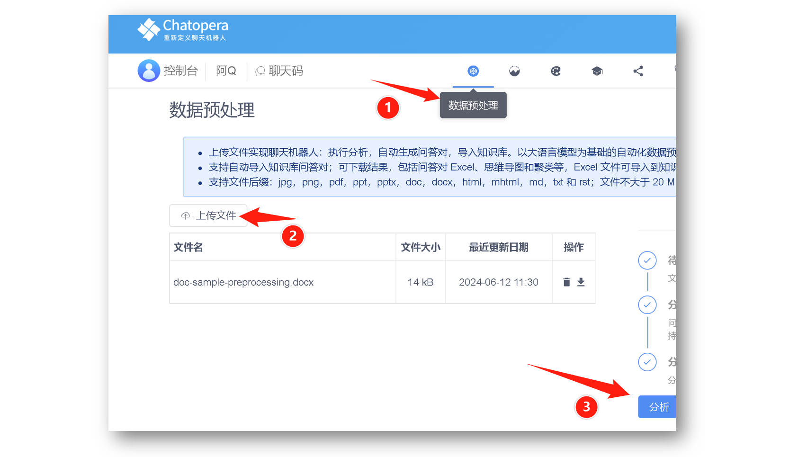
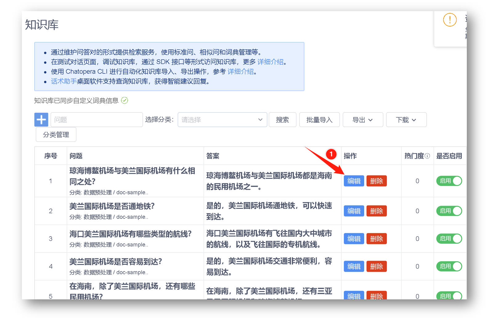

# 知识库问答自动生成

## 数据预处理服务

Chatopera 机器人支持数据预处理，并通过大语言模型自动生成问答对，支持实时的导入到知识库。

上传文件，通过点击 【分析】，并在弹出的对话窗口中，开启【实时导入知识库】即可。

## 编辑知识库

在数据预处理任务进行过程中，就会自动的创建知识库问答对。同时，数据预处理服务基于大语言模型机器学习的概率模型，所以，您有必要进入机器人知识库，对生成的知识库问答对做校对，在答案不完善、有错误的情况下，进行适当的编辑优化。

