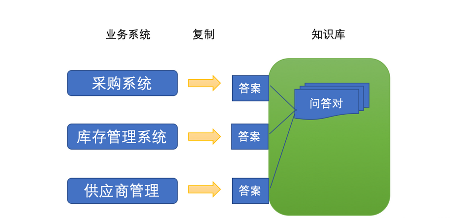
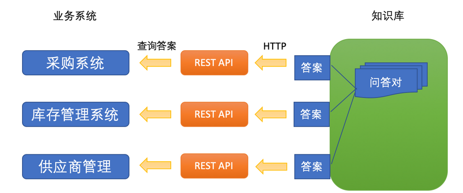
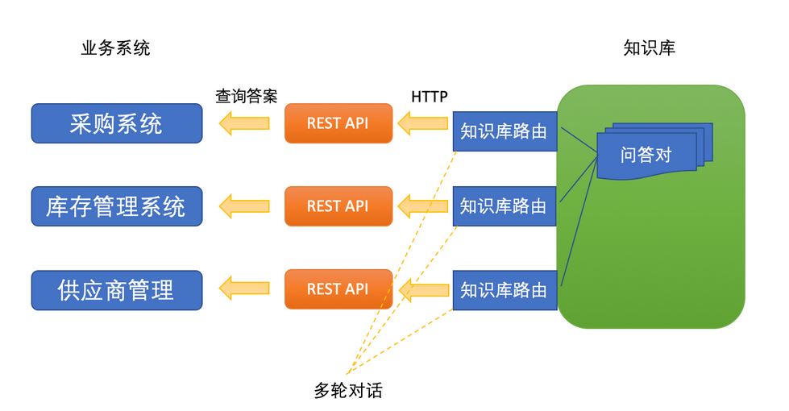
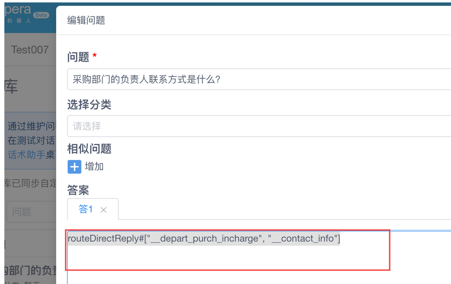
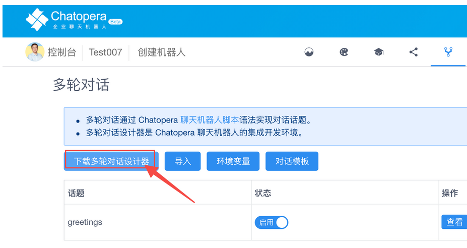
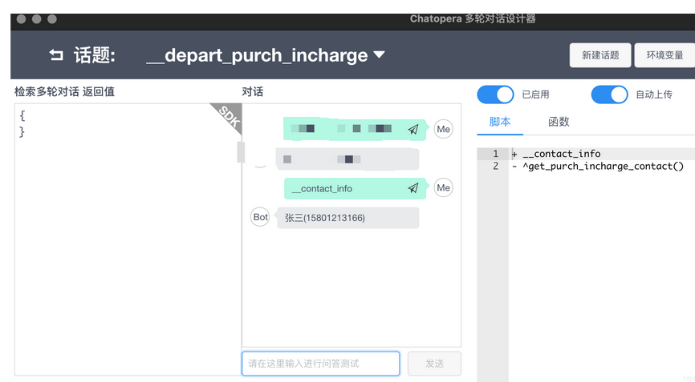
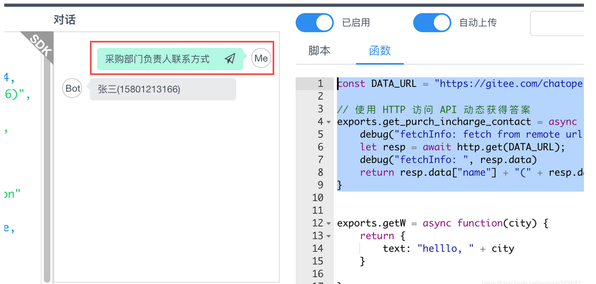
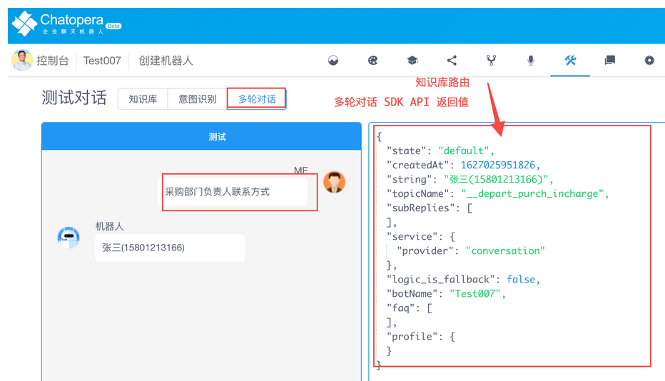
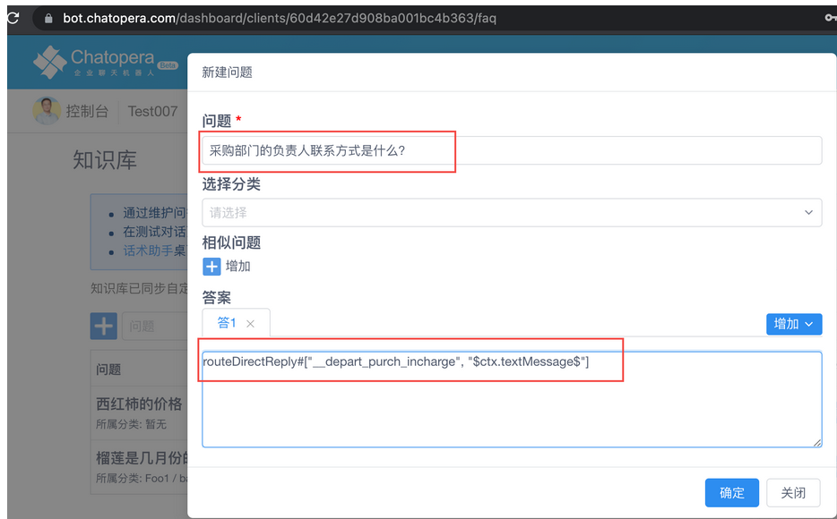
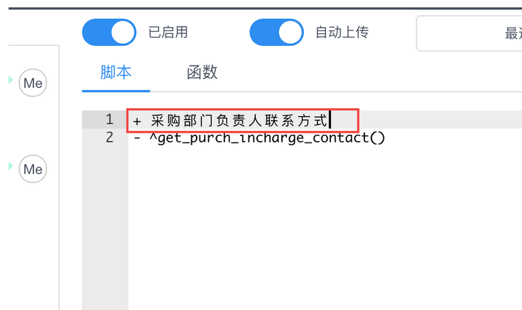

# 使用函数获得动态答案

## 目标

通过使用动态答案，联合多轮对话与知识库的整体使用，使机器人更智能。

## 问题描述

在智能对话机器人中，知识库管理可能涉及到从业务系统获得答案，实时的同步答案一个是造成延迟，一个是成本高：在多个地方维护。 比如，在业务场景中，有三个子业务系统，分别是【采购系统】/【库存管理系统】/【供应商管理】。每个系统都有一些常见问题，比如**采购部门的负责人及联系方式，库存管理系统的负责人及联系方式，这些信息在不同子系统的某个网页上，或者通过 API 调用可以查询到。**

在传统方案中，知识库的答案通过手动复制同步，而且这个过程几乎都需要人工完成。



但是，因为有 HTTP API 存在，这个过程可以更简单。一个可行的方案如下：



目前，Chatopera 机器人平台支持这样的使用场景，接下来具体说明。

## 解决方案

在 [Chatopera 机器人平台](https://bot.chatopera.com/)管理控制台上 BOT 开发者可以维护知识库的不同类型的答案，除了录入固定的答案，Chatopera 机器人平台知识库也支持通过调用[多轮对话的话题](https://docs.chatopera.com/products/chatbot-platform/explanations/query.html)来从多轮对话获得答案。在多轮对话中，支持自定义 JavaScript 函数，就使得知识库设置动态抓取的答案可行，称之为：知识库路由。



### 知识库路由

在知识库的答案或多轮对话的函数中设置回复时，可以用 **routeDirectReply** 来指定一个话题和匹配器获得答案。

### 语法

将知识库答案按照如下语法设置：

```语法
routeDirectReply#["TOPIC_NAME", "TOPIC_GAMBIT_ID"]
```

_TOPIC_NAME_: [对话话题](https://docs.chatopera.com/products/chatbot-platform/references/glossary.html#对话话题)

_TOPIC_GAMBIT_ID_: [匹配器](https://docs.chatopera.com/products/chatbot-platform/references/glossary.html#匹配器)

## 使用示例

下面我们用一个示例介绍这个功能的使用。

1）知识库问题 -

```语法
采购部门的负责人联系方式是什么？
```

2）知识库答案 -

```语法
routeDirectReply#["__depart_purch_incharge", "__contact_info"]
```

在控制台设置如下 -



3）在多轮对话设计器中，设置机器人的回复内容

在机器人管理控制台，打开【多轮对话】版块，点击【下载多轮对话设计器】。



安装后，启动应用并通过机器人设置页面的 clientId 和 secret 导入机器人。
创建新的技能：`__depart_purch_incharge`
在新的技能中，添加用户说法：

```语法
+ __contact_info
- ^get_purch_incharge_contact()
```



在函数中，添加新的函数。

```JavaScript
const DATA_URL = "https://gitee.com/chatopera/chatbot-samples/raw/master/assets/demo-contact.json"

// 使用 HTTP 访问 API 动态获得答案
exports.get_purch_incharge_contact = async function() {
    debug("fetchInfo: fetch from remote url %s ...", DATA_URL);
    let resp = await http.get(DATA_URL);
    debug("fetchInfo: ", resp.data)
    return resp.data["name"] + "(" + resp.data["phone"] + ")";
}
```

在多轮对话设计器中进行测试：



4）在机器人控制台进行测试



下一步，就可以接入到业务系统，比如春松客服。在返回结果中，除了使用文本的形式，还可以支持自定义的数据结构，在春松客服中，返回结果支持展示为卡片、图文、按钮、列表的形式，详细参考（[https://docs.cskefu.com/docs/work-chatbot/message-types](https://docs.cskefu.com/docs/work-chatbot/message-types)）。

## 高级进阶

### 使用用户输入作为触发器

在一些情况下，按照用户的输入进入多轮对话匹配器更方便，那么在设置路由答案时，使用如下方法。

当 `TOPIC_GAMBIT_ID` 的值为 `$ctx.textMessage$` 时，则使用当前对话的用户输入，在 `TOPIC_NAME` 中进行检索。

**举例**

1）知识库问题 -

```
采购部门的负责人联系方式是什么？
```

2）知识库答案 -

```语法
routeDirectReply#["__depart_purch_incharge", "$ctx.textMessage$"]
```

在控制台设置如下 -



那么，在多轮对话设计器中，这个规则可以更新为：


