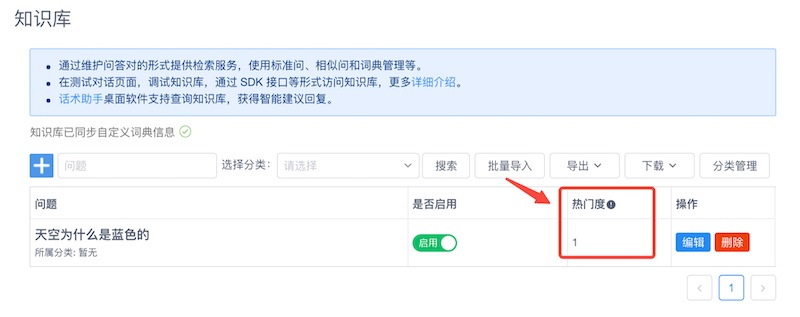
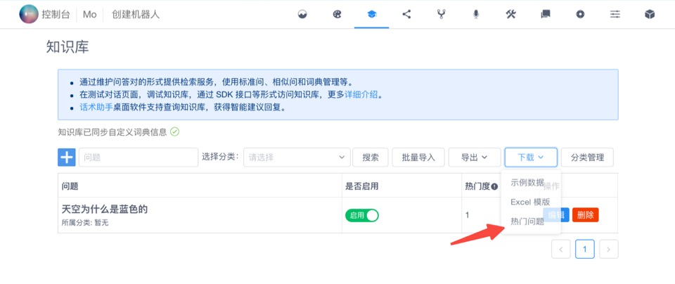

# 知识库热门问题查看和导出

热门问题评分是知识库中的问答对的相对热门程度。问题的热门度是一个分数，分数值代表某一个问答对作为回复结果出现在客户端的次数，可能是作为最佳答案，也可能是作为建议答案。

具体来说，就是在系统集成时，使用[知识库检索接口或多轮对话检索接口](https://docs.chatopera.com/products/chatbot-platform/references/sdk/chatbot/chat.html)时，该问答对出现在结果中的次数。

## 查看问答对热门度

在 Chatopera 机器人管理控制台上，每个机器人的知识库管理页面，每个问答对增加【热门度】一列。

## 下载热门问题

如何获得所有知识库问答对的按热门度排名信息？在知识库管理页面，【下载】下拉菜单中，增加【热门问题】。

点击后将下载到按热门度降序排名的 Excel 汇总信息。
