# 设置欢迎语热门问题

对于一个新创建的机器人，在 H5 聊天控件中，热门问题列表是根据被检索出来的次数排序的，即热门度。了解更多热门度，[参考文档](/products/chatbot-platform/howto-guides/faq/faq-hot.html)。

因此，默认情况下，欢迎语中的热门问题，是动态变化的。但是在应用场景中，**希望将欢迎语中的热门问题固定**，有以下两个方案：

* 联系客服平台设置
* 使用多轮对话设计器设置

## 联系客服平台设置

使用注册时，使用的邮箱发送邮件到： [info@chatopera.com](mailto:info@chatopera.com?subject=%5BChatopera%20%E4%BA%91%E6%9C%8D%E5%8A%A1%5D%20%E8%AE%BE%E7%BD%AE%E6%AC%A2%E8%BF%8E%E8%AF%AD%E7%83%AD%E9%97%A8%E9%97%AE%E9%A2%98&body=%E6%82%A8%E5%A5%BD%EF%BC%8C%E6%88%91%E6%98%AF%0D%0A%0D%0A%E6%88%91%E7%9A%84%E6%9C%BA%E5%99%A8%E4%BA%BA%20clientID%20%E6%98%AF%0D%0A%E6%88%91%E6%83%B3%E4%BD%BF%E7%94%A8%E4%B8%8B%E9%9D%A2%E7%9A%84%E7%83%AD%E9%97%A8%E9%97%AE%E9%A2%98%EF%BC%8C%E6%8C%89%E7%85%A7%E9%A1%BA%E5%BA%8F%EF%BC%9A%0D%0A%0D%0A1.%20...%0D%0A2.%20...%0D%0A3.%20...)

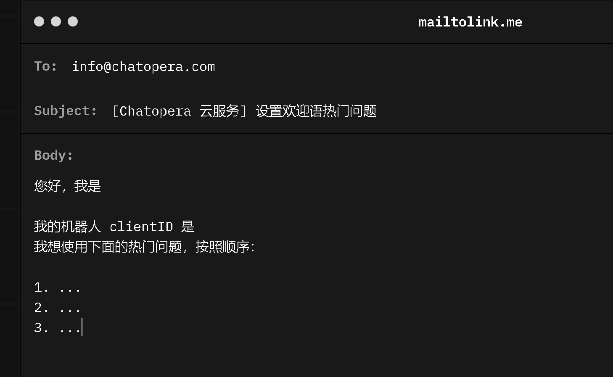

Chatopera 云服务工作人员会在 1 个工作日内进行处理，回复您。

## 使用多轮对话设计器设置

这种方法是自助完成，稍微麻烦一点。为什么 Chatopera 云服务提供了这样的方案？因为这样帮助您了解 Chatopera 低代码定制聊天机器人的能力，借助多轮对话设计器，您就掌握了更多的开启定制智能对话技能的秘籍，掌握 Chatopera 云服务的高级玩法。

### 下载多轮对话设计器

[参考文档](/products/chatbot-platform/howto-guides/convs/cde-install.html)。

### 多轮对话设计器添加机器人

安装好多轮对话设计器后，启动多轮对话设计器，可以看到类似如下的界面：

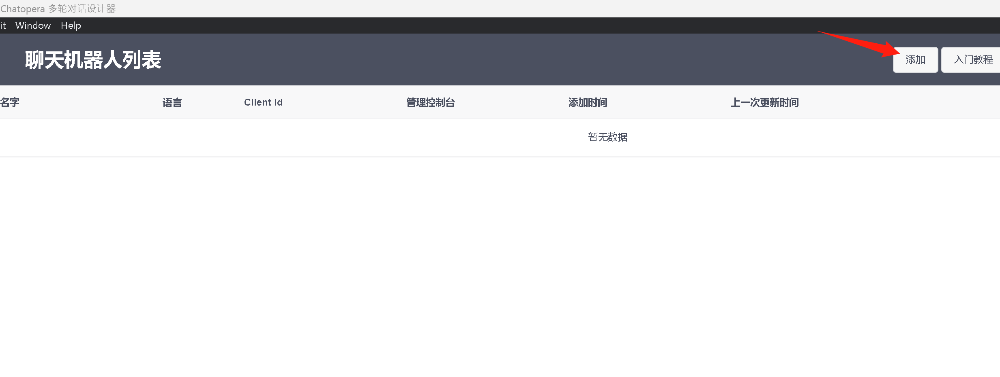

在右上角的菜单中，找到【添加】并点击。

这是可以看到填写 【clientId】 和 【secret】的表单，在 Chatopera 云服务中，进入机器人的管理控制台，比如下图。

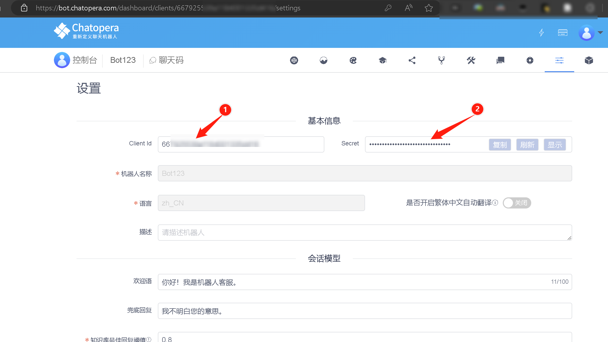

分别复制【clientId】和【secret】并填写到添加表单中，点击【确认】。

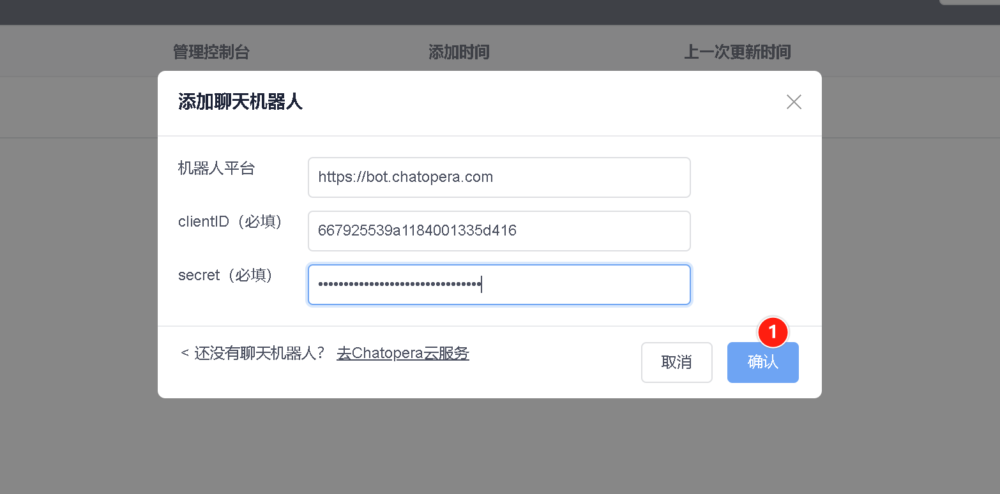


### 设置欢迎语热门问题

接下来，就开始真正的编写热门问题欢迎语。首先，在多轮对话设计器中，打开刚刚添加的机器人。

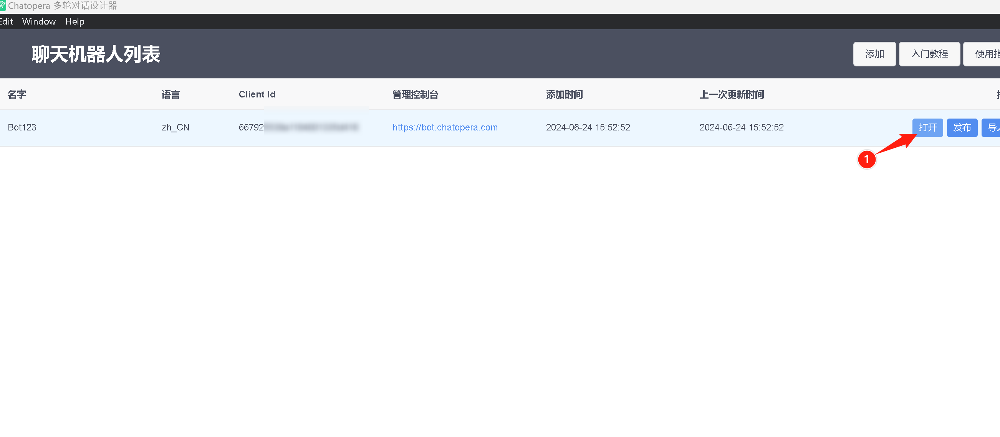

然后点击，`greetings` 话题对应的【编辑】按钮。

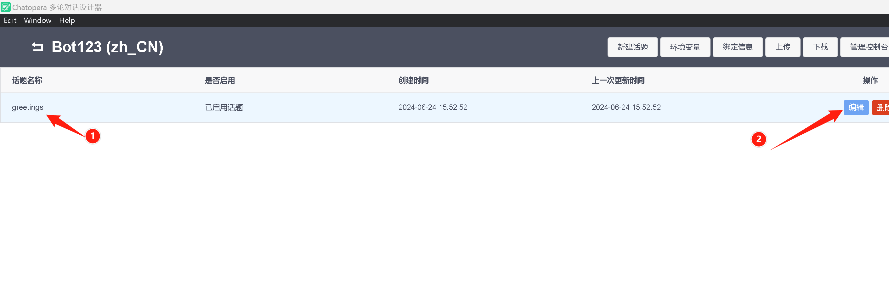

接下来，点击【函数】，进入函数编辑窗口。

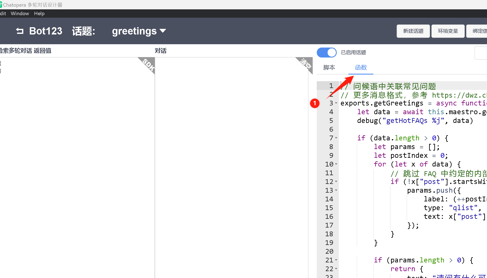

鼠标左键点击函数区域，使光标作用域函数区域，如下图：

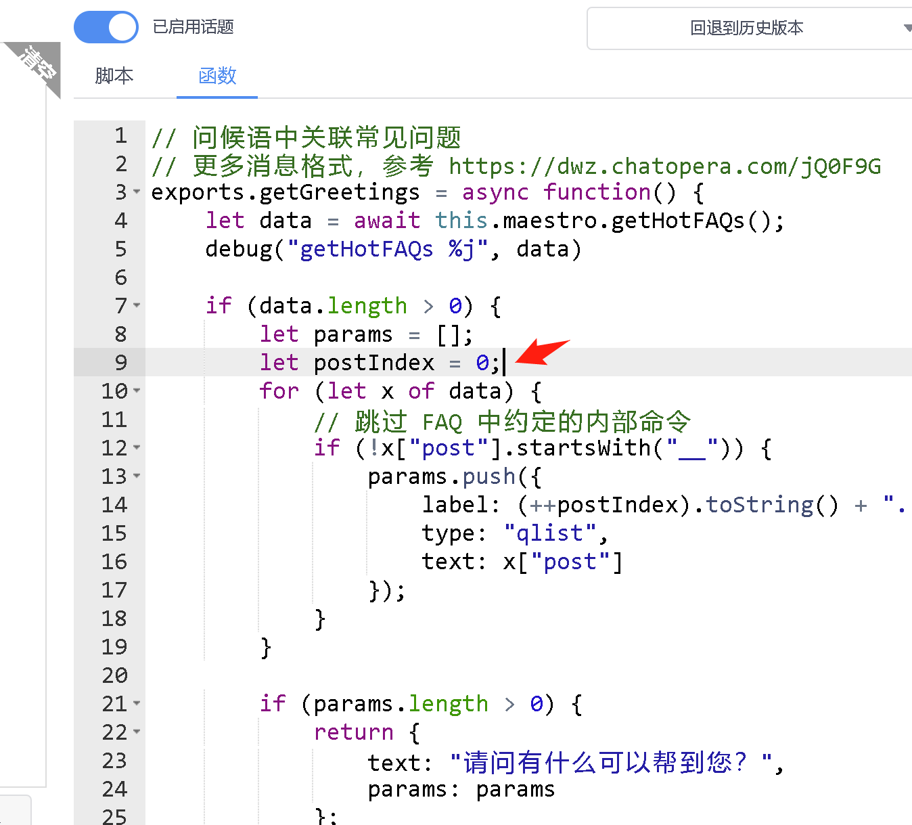

然后进行全选：1）Windows 执行 Ctrl + A; 2) Mac 执行 Command + A。

全选后删除：使用键盘的 Delete 或 Backspace 键。这样，就清空了函数中的内容，类似如下：

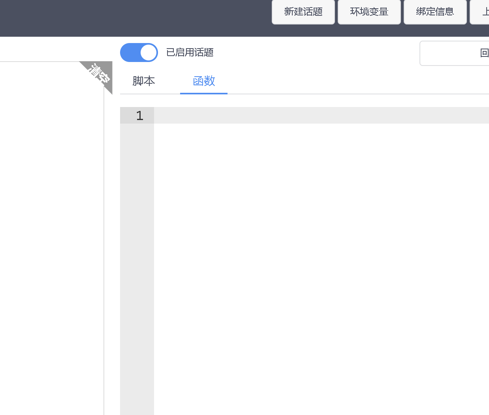

下一步，复制下面的函数到函数编辑窗口。

```函数
// 问候语中关联常见问题
// 更多消息格式，参考 https://dwz.chatopera.com/jQ0F9G
exports.getGreetings = async function() {
    let data = [
        "自定义1",
        "自定义2",
        "自定义3",
    ];

    if (data.length > 0) {
        let params = [];
        let postIndex = 0;
        for (let x of data) {
            params.push({
                // 展示的文本
                label: (++postIndex).toString() + ". " + x,
                type: "qlist",
                // 点击后，发送给机器人的文本
                text: x
            });
        }

        if (params.length > 0) {
            return {
                text: "请问有什么可以帮到您？",
                params: params
            };
        } else {
            return {
                string: ""
            };
        }
    } else {
        return {
            string: ""
        };
    }
}
```

**按照需要，调整 `data` 数组元素即可设置固定的欢迎语热门问题。**

比如，希望固定为问题：1. 发送课程资料；2. 发送课程价格。那么，`data` 设置为：

```函数
    let data = [
        "发送课程资料",
        "发送课程价格",
    ];
```

点击【保存】，类似下图：

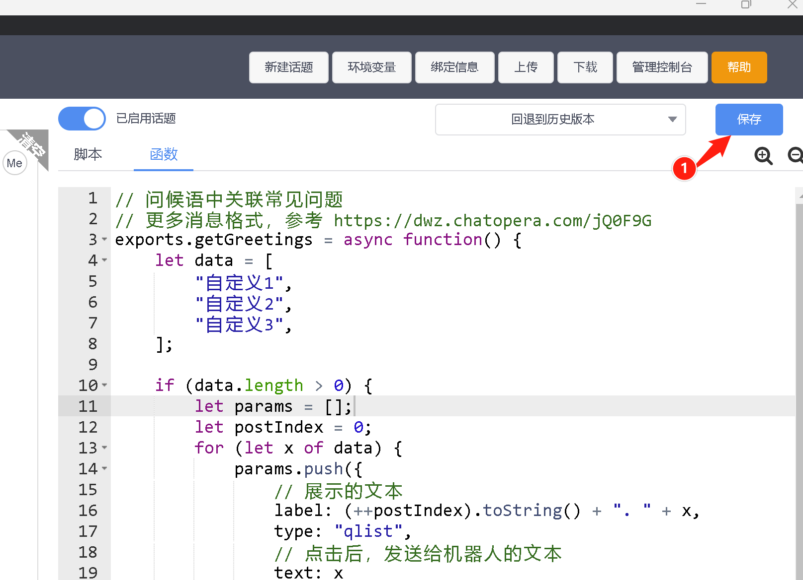

这时，在中间的测试对话窗口，发送：

```脚本
__faq_hot_list
```

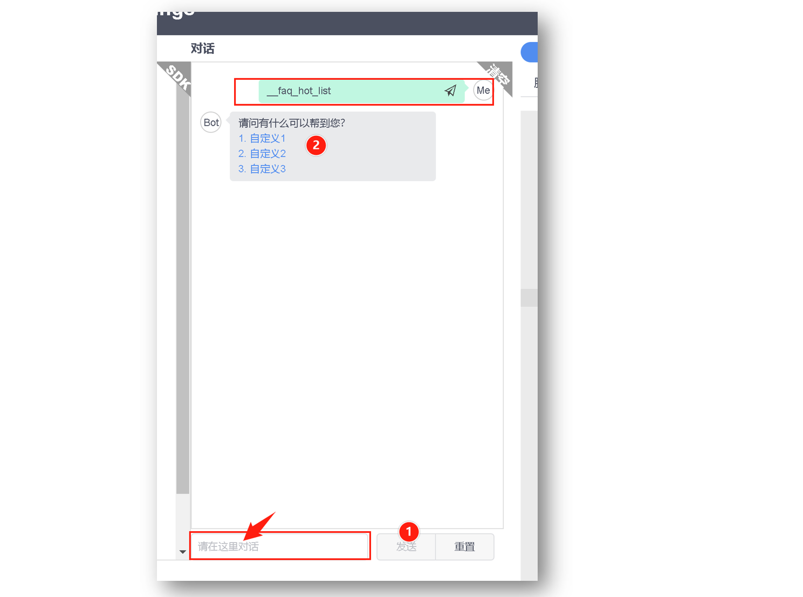

这时，设置完成。