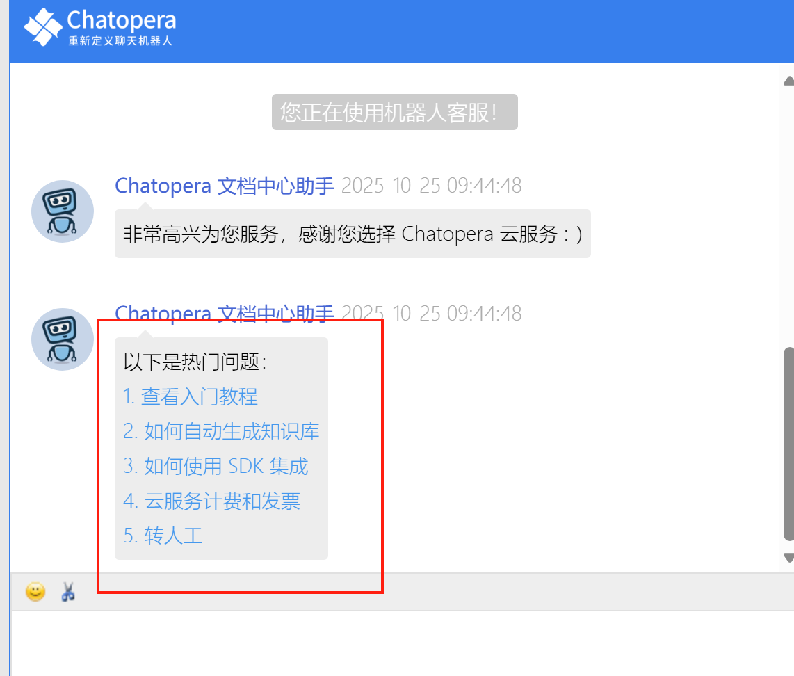
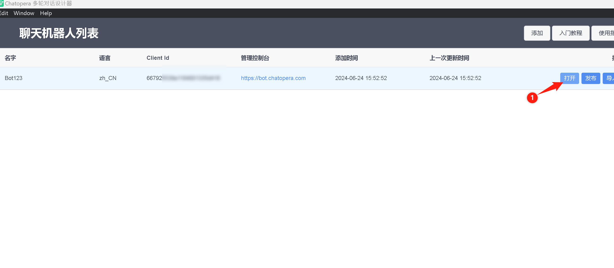
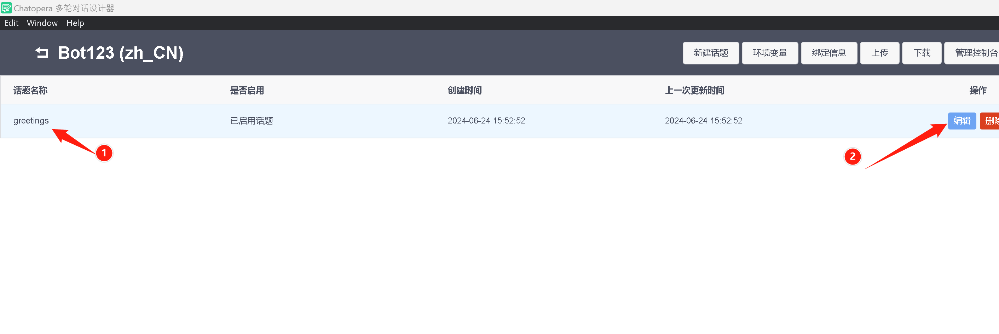
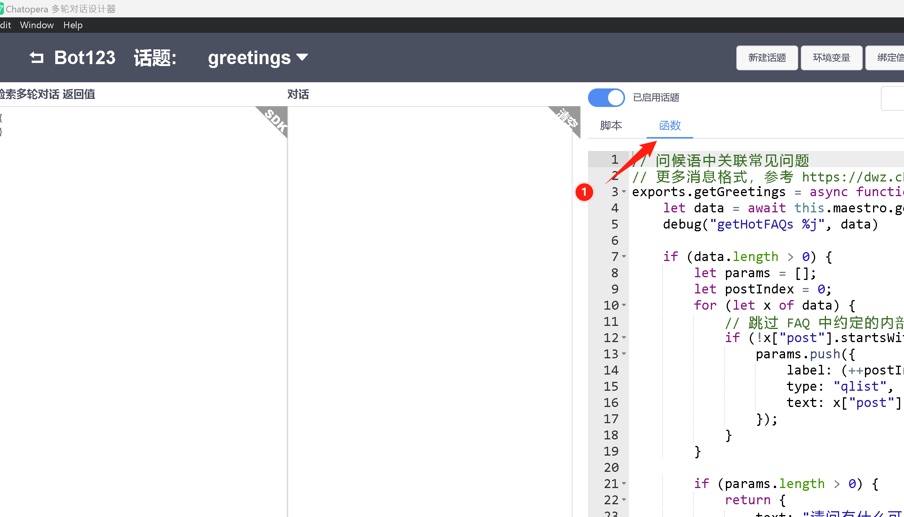
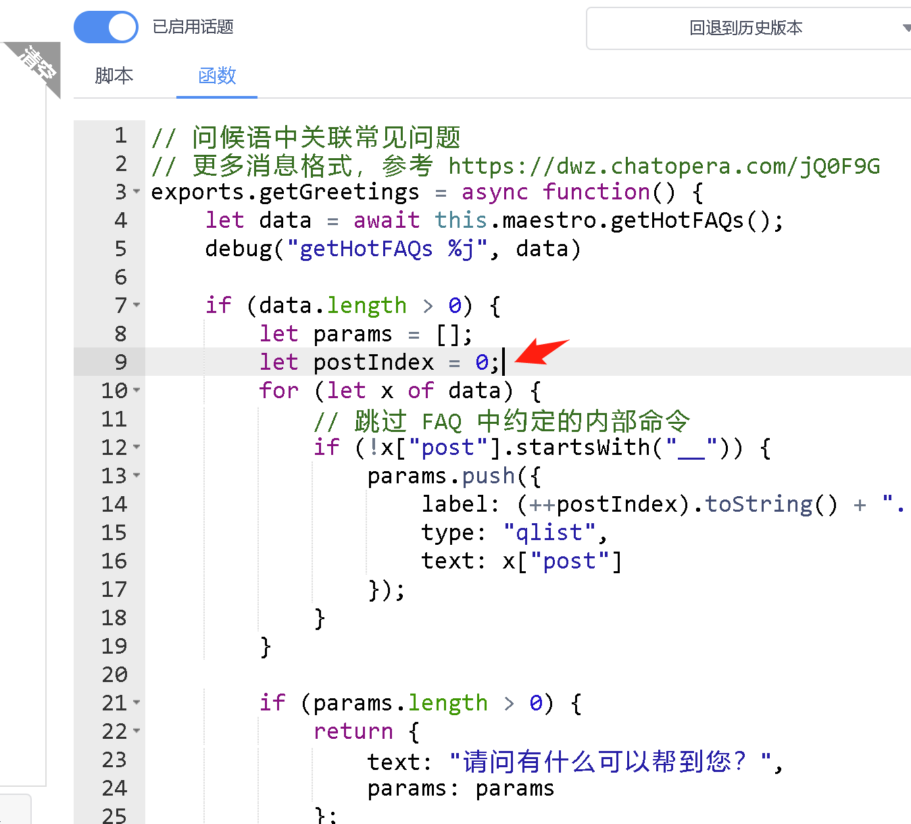
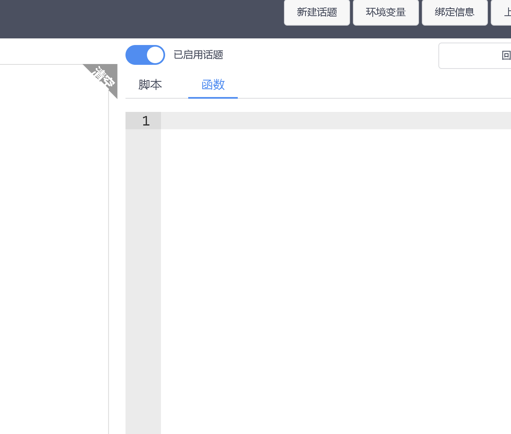
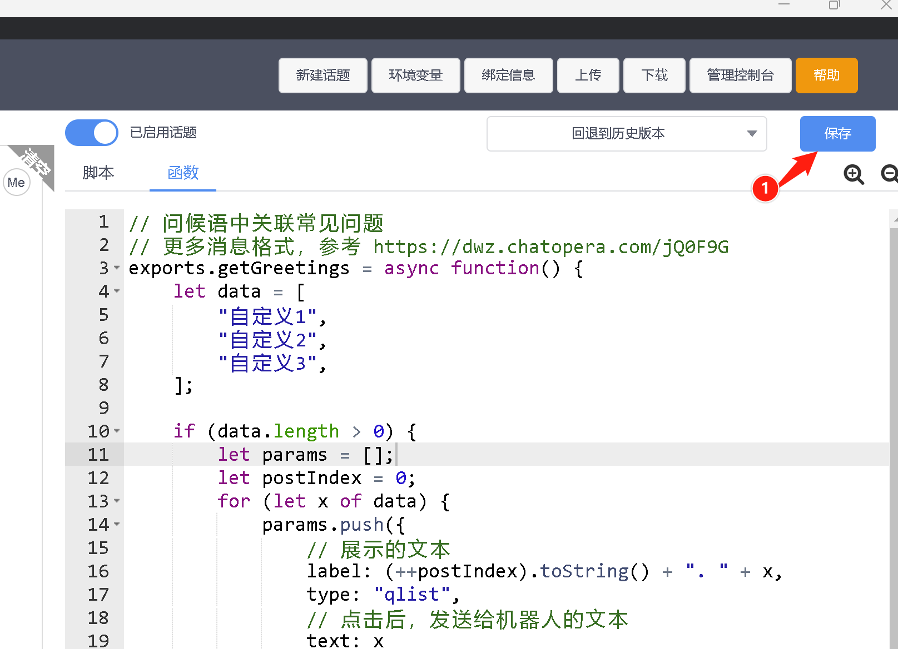
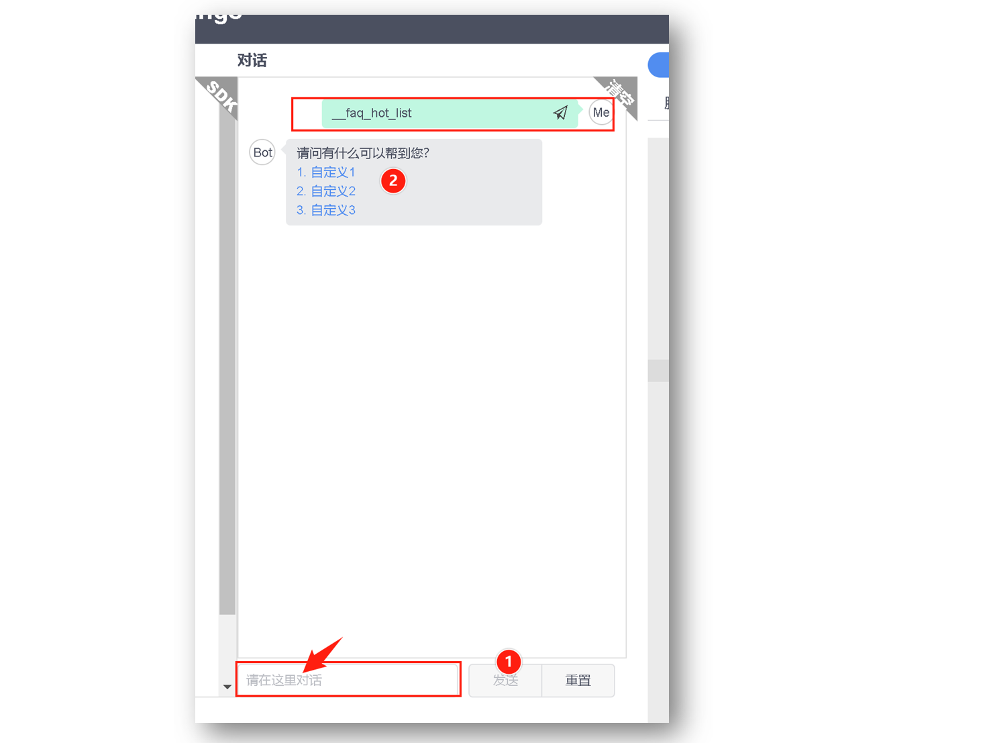

# 设置欢迎语热门问题

欢迎语热门问题，就是进入 Chatopera H5 网页渠道或机扫一扫聊天码以后，进入访客对话窗口后，机器人发送的打招呼信息包含的热门问题列表。



使用多轮对话设计器，可以绑定欢迎语中的热门问题，有两种形式：

* 自动关联热门问题
* 手动关联热门问题

## 完成入门教程

阅读和理解以下内容，需要您先完成入门教程：[进入链接](https://docs.chatopera.com/products/chatbot-platform/tutorials/index.html)。

## 自动关联热门问题

在机器人平台的知识库，每个问答对会根据被检索出现的次数计算热度，被检索出的次数越高，热度越高。

为了支持在欢迎语中，展示热门问题列表，可以用下面的【脚本】和【函数】，根据知识库问题热度，动态的获取。


* 脚本：在脚本中，添加如下内容

```
// FAQ 热门问题展示
+ __faq_hot_list
- {keep} ^getGreetings()
```


* 函数：在函数中，添加如下内容


```JavaScript
// 问候语中关联常见问题
// 更多消息格式，参考 https://dwz.chatopera.com/jQ0F9G
exports.getGreetings = async function() {
    let data = await this.maestro.getHotFAQs();
    debug("getHotFAQs %j", data)

    if (data.length > 0) {
        let params = [];
        let postIndex = 0;
        for (let x of data) {
            // 跳过 FAQ 中约定的内部命令
            if (!x["post"].startsWith("__")) {
                params.push({
                    label: (++postIndex).toString() + ". " + x["post"],
                    type: "qlist",
                    text: x["post"]
                });
            }
        }

        if (params.length > 0) {
            return {
                text: "请问有什么可以帮到您？",
                params: params
            };
        } else {
            return {
                string: ""
            };
        }
    } else {
        return {
            string: ""
        };
    }
}
```

在多轮对话设计器中保存，并进行测试。

## 手动关联热门问题

手动设置热门问题作为欢迎语，就是通过编辑【脚本】和【函数】，**固定**欢迎语中的热门问题。

首先，在多轮对话设计器中，打开刚刚添加的机器人。



然后点击，`greetings` 话题对应的【编辑】按钮。



接下来，点击【函数】，进入函数编辑窗口。



鼠标左键点击函数区域，使光标作用域函数区域，如下图：



然后进行全选：1）Windows 执行 Ctrl + A; 2) Mac 执行 Command + A。

全选后删除：使用键盘的 Delete 或 Backspace 键。这样，就清空了函数中的内容，类似如下：



下一步，复制下面的函数到函数编辑窗口。

```函数
// 问候语中关联常见问题
// 更多消息格式，参考 https://dwz.chatopera.com/jQ0F9G
exports.getGreetings = async function() {
    let data = [
        "自定义1",
        "自定义2",
        "自定义3",
    ];

    if (data.length > 0) {
        let params = [];
        let postIndex = 0;
        for (let x of data) {
            params.push({
                // 展示的文本
                label: (++postIndex).toString() + ". " + x,
                type: "qlist",
                // 点击后，发送给机器人的文本
                text: x
            });
        }

        if (params.length > 0) {
            return {
                text: "请问有什么可以帮到您？",
                params: params
            };
        } else {
            return {
                string: ""
            };
        }
    } else {
        return {
            string: ""
        };
    }
}
```

**按照需要，调整 `data` 数组元素即可设置固定的欢迎语热门问题。**

比如，希望固定为问题：1. 发送课程资料；2. 发送课程价格。那么，`data` 设置为：

```函数
    let data = [
        "发送课程资料",
        "发送课程价格",
    ];
```

点击【保存】，类似下图：



这时，在中间的测试对话窗口，发送：

```脚本
__faq_hot_list
```



这时，设置完成。