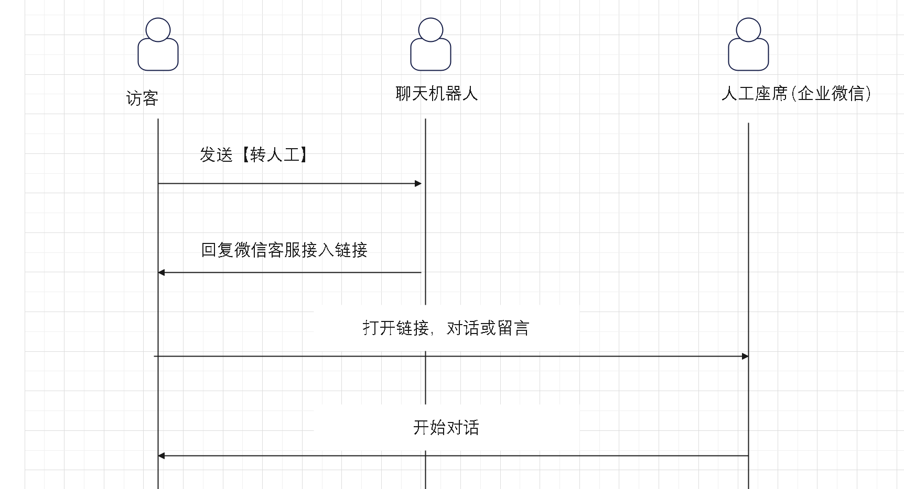
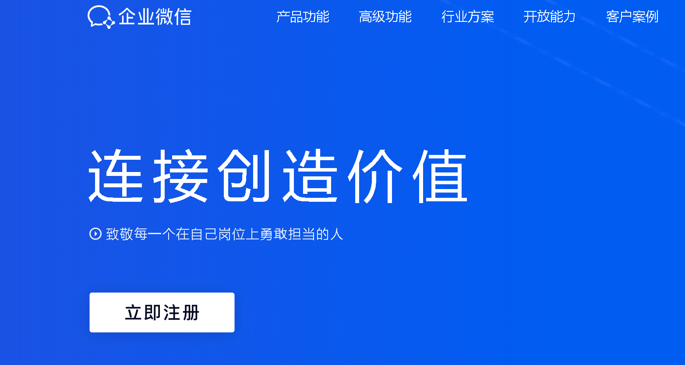
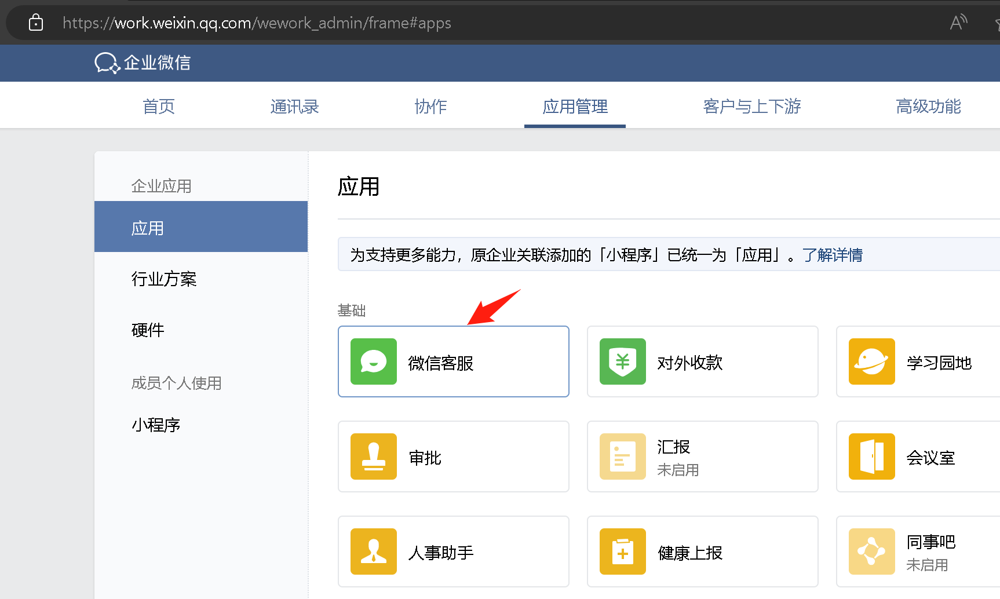
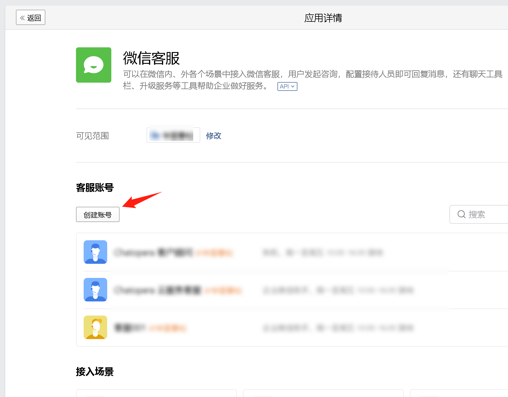
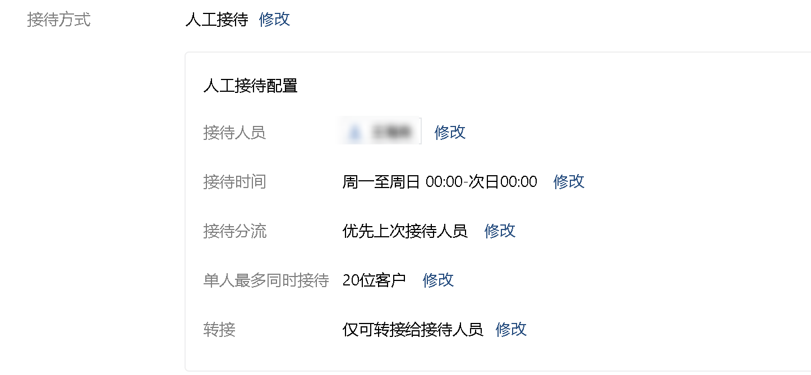
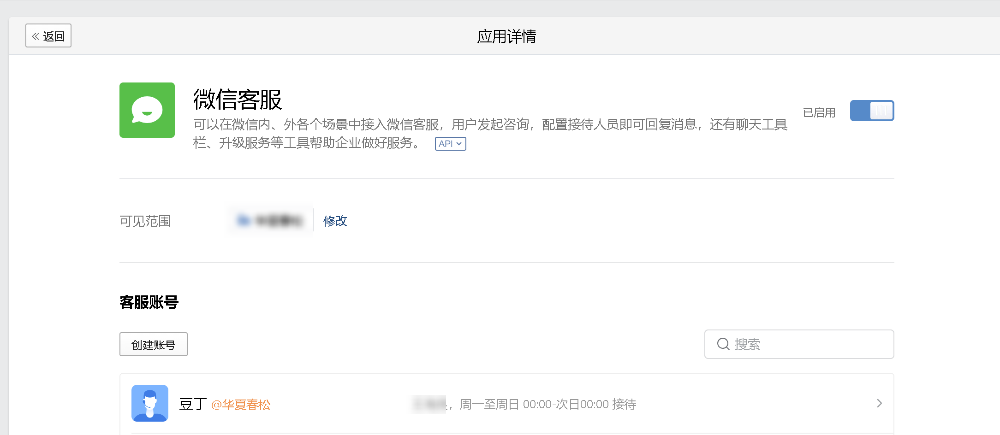
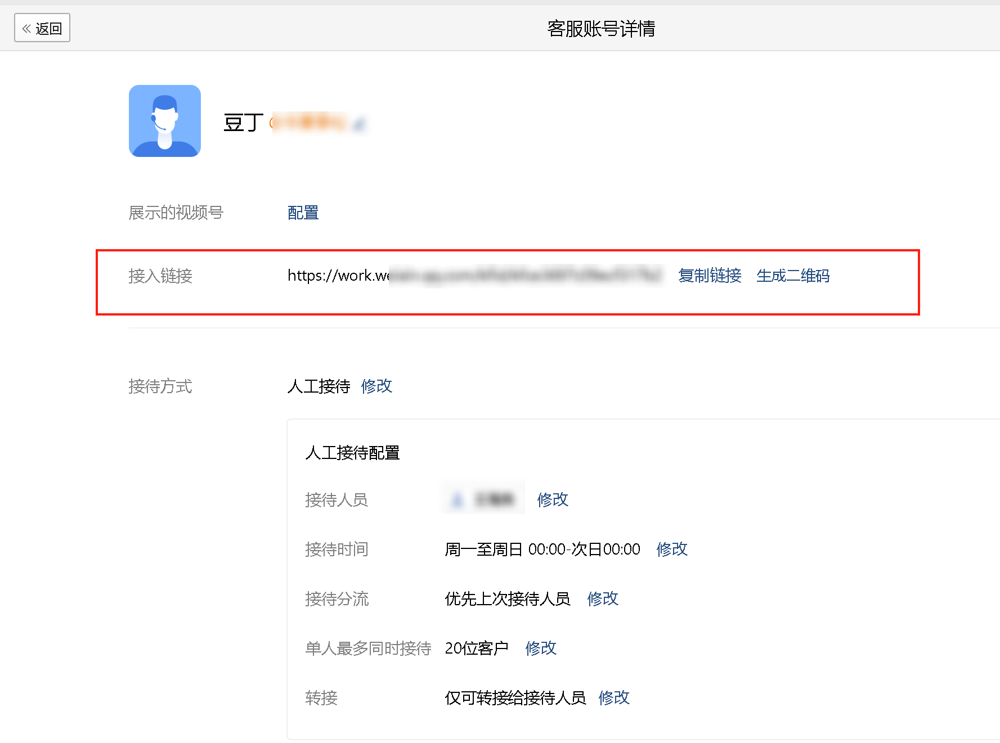
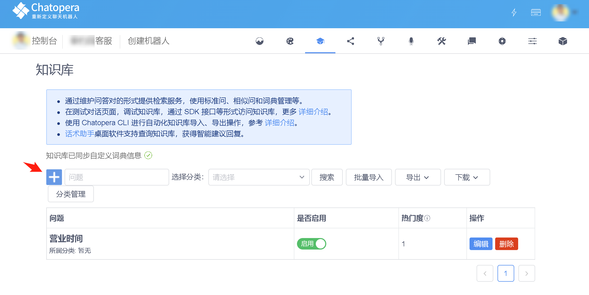
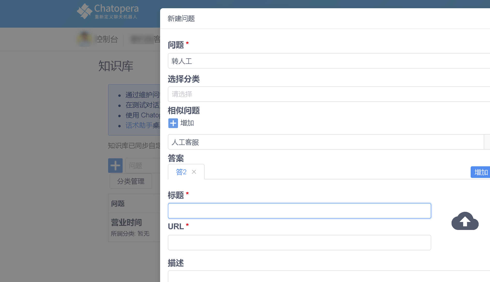
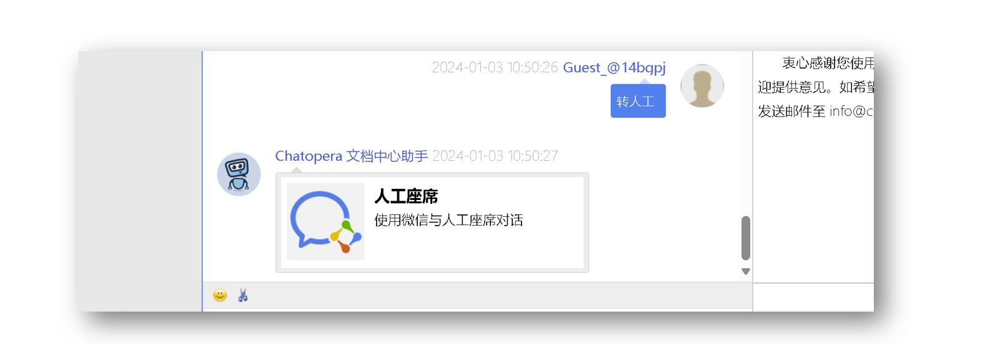

# 集成微信实现转人工客服

访客在和聊天机器人对话的过程中，可能需要和人工座席对话，以此咨询机器人解答不了的问题。这时候，访客会习惯性的发送”转人工“，”人工座席“等表达这个诉求，以下内容介绍一个快速、低成本的基于微信的方案：使用企业微信的微信客服完成人工座席咨询。

该方案具备以下优势：

* 低成本，使用企业微信的免费版本即可
* 符合用户习惯，访客使用微信，人工座席使用企业微信
* 移动客户端友好，访客和企业服务人员都可以使用微信
* 人工座席可以在 48 小时内连续反馈到访客
* 支持工作时间设置，非工作时间可以留言
* 支持分配到多座席，忙时按状态自动分配
* 支持发送语音、图片等

以下为具体的配置过程。

## 注册企业微信

打开链接 [https://work.weixin.qq.com/](https://work.weixin.qq.com/)，点击【立即注册】。

## 设置企业微信应用

登录企业微信： [https://work.weixin.qq.com](https://work.weixin.qq.com)

然后，打开链接：[https://work.weixin.qq.com/wework_admin/frame#apps](https://work.weixin.qq.com/wework_admin/frame#apps)

看到如下的界面，找到【微信客服】并点击。

## 设置微信客服

在上一步，进入了【微信客服】，接着点击【创建账号】

在新的页面，设置账号信息 -

名称：自定义，比如`豆丁`

接待方式：修改为【仅人工接待】

接待人员：选择企业微信中的联系人，或您自己。接待时间、接待分流等其它设置按照您的业务需要设定。

点击【创建】。

## 获得微信客服链接

完成上一步后，自动回到了微信客服管理页面，找到刚刚创建的客服账号，点击进入如下。

此时，可见微信客服的【接入链接】，复制接入链接。

## 设置机器人转人工问答对

进入 Chatopera 机器人知识库，创建问答对。

问答对的表单设置如下：

* 问题：`转人工`
* 相似问题：`人工客服`
* 答案：1）选择增加图文消息答案，2）删除 `答案1`，3）此时界面上仍保留了`答案2`，设置`答案2`的图文消息
* 标题：`人工座席`
* URL：即接入链接，类似 `https://work.weixin.qq.com/kfid/xxxx`
* 描述：使用微信与人工座席对话
* 上传缩略图：在问答对的右侧有上传图标，点击上传图标，上传图文消息的图片。

保存，接下来，访客就可以与您定义的人工座席通过微信对话了。

