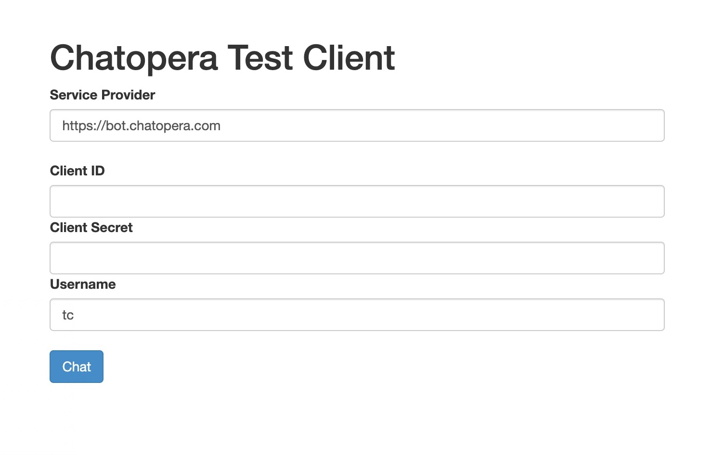

# 使用 SDK 集成 Chatopera BOT

本节以[Node.js SDK](https://www.npmjs.com/package/@chatopera/sdk) 为例子演示使用流程，更多 SDK 下载参考[链接](https://docs.chatopera.com/products/chatbot-platform/references/sdk/index.html)。

## 基础知识

[Node.js](https://nodejs.org/en/) 是 JavaScript 运行时环境，面向服务器端应用开发，底层使用 Google V8 引擎。[Node.js](https://nodejs.org/en/) 尤其被前端开发者偏爱，因为它让前端开发者以“熟悉”的方式开发后端应用。[Node.js](https://nodejs.org/en/) 的出现一度降低了开发成本，并且成为“快应用”开发趋势出现，[Node.js](https://nodejs.org/en/) 包管理工具 [Npm 站点](https://www.npmjs.com/) 是开源领域最大的包管理服务。不同语言的 SDK 使用细节大同小异， 因为它们都是调用**Chatopera 机器人平台**的[RestAPIs](https://baike.baidu.com/item/RESTful)，这些 RestAPIs 是标准一致的。每种语言的 SDK 使用流程按照顺序包括：下载 SDK，实例化[`Chatbot`类](https://docs.chatopera.com/products/chatbot-platform/references/sdk/chatbot/index.html)为对象，请求接口和处理返回结果。

## 获取 *ClientId* 和 *Secret*

`SDK`中每个机器人实例需要通过*ClientId*和*Secret*初始化，这两个字段是认证和授权用途。打开机器人【设置】页面，拷贝*ClientId*和*Secret*。


## 安装 SDK

```Bash
npm install @chatopera/sdk --save
```

## 实例化`Chatbot`类为对象

```JavaScript
var Chatbot = require("@chatopera/sdk").Chatbot;
var chatbot = new Chatbot(clientId, secret [, serviceProvider]);
```

<h4><font color="purple">参数说明</font></h4>

| name            | type   | required | description                                                                                                                      |
| --------------- | ------ | -------- | -------------------------------------------------------------------------------------------------------------------------------- |
| clientId        | string | &#10004; | 在[机器人控制台/机器人/设置](https://bot.chatopera.com/dashboard)中获取                                                          |
| secret          | string | &#10004; | 获取办法同上                                                                                                                     |
| serviceProvider | string | &#10008; | Chatopera 机器人平台地址，<br><font color="green">当使用 Chatopera 云服务时，该值为 <https://bot.chatopera.com>，也是默认值</font> |

<!--  对号和差号， https://www.w3schools.com/charsets/ref_utf_dingbats.asp -->

> **提示：** 参数列表中，写在 `[]` 内的部分是选填参数，如果不填写使用默认值，下同。

## 调用接口示例

得到`Chatbot`实例后，怎么样请求接口服务呢？假设对该机器人的基本信息感兴趣，获取基本信息方式如下：

```JavaScript
var response = await chatbot.command("POST", "/faq/query", {
  query: "不锈钢板现在是什么价格",
  fromUserId: "sdktest1",
});
console.log("response: ", response)
```

或者获取 `Promise` 返回

```JavaScript
chatbot.command("GET", "/").then(
  (response) => {
    console.log("机器人名称：", response.data.name);
  },
  (err) => {}
);
```

此处，不深入探讨`await`和`Promise`的相关知识，它们是和 JavaScript 语言相关的内容。在这个例子中，我们请读者注意，给定一个机器人类的实例，再请求 API 服务是多么的简单，`Chatbot#command`接口提供了一系列的方法，也是下文给您详细介绍的重点。

## 示例程序

示例程序代码库: [https://github.com/chatopera/webchat](https://github.com/chatopera/webchat)

通过系统集成的示例程序，快速掌握 SDK 使用，尤其是对话检索 API；系统集成示例程序也可以用来调试和检查机器人，在和业务系统集成前测试相关接口。与 Chatopera 机器人平台的测试页面不同，系统集成示例程序更侧重上线前，对 SDK 相关接口的测试。

在系统集成示例程序中，使用 Chatopera 机器人平台地址，clientId 和 secret 立刻连接聊天机器人，开始对话。

功能：

- 提供对话页面，方便系统集成测试
- 使用 Bot Provider 地址，clientId 和 secret 连接机器人
- 实现 Dialogue Management: 融合意图识别检索、多轮对话检索和知识库检索
- [app.js](https://github.com/chatopera/webchat/blob/master/app/app.js) 使用 [Chatopera Node.js SDK](https://www.npmjs.com/package/@chatopera/sdk)，可作为系统集成参考

### 启动应用

本示例程序提供 Docker 容器镜像，使用 Docker 启动服务进行体验

```Bash
docker run -it --rm -p 8668:8668 chatopera/webchat:develop
```


