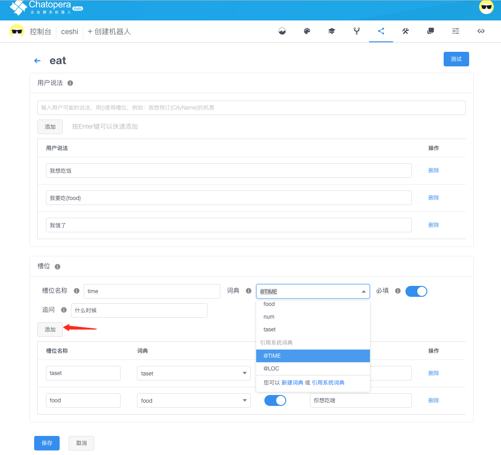
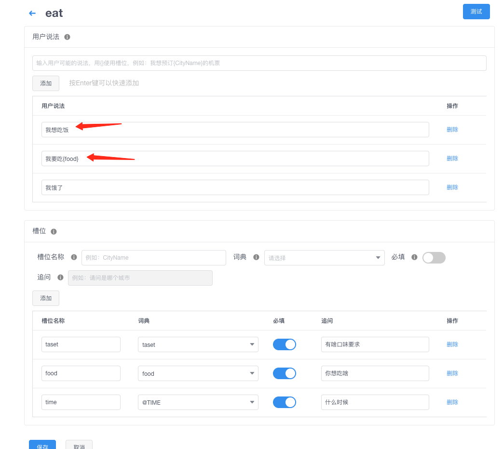
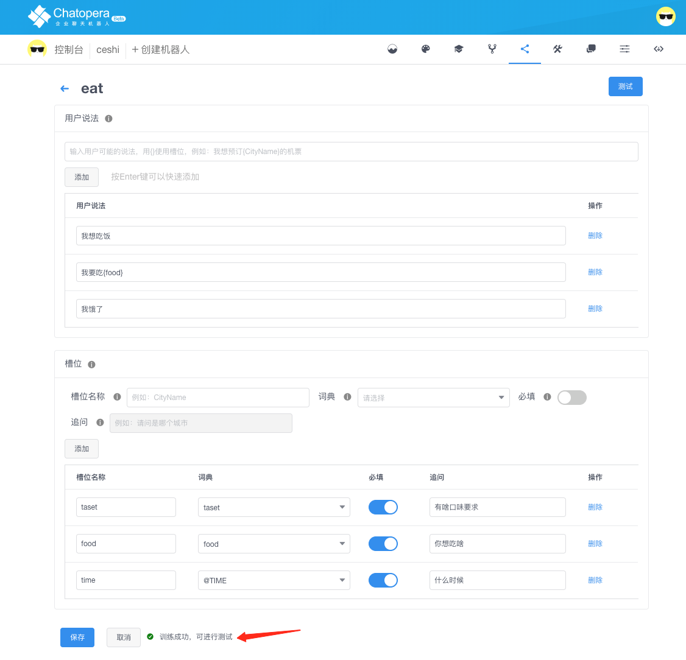

# 创建和训练意图识别模型

## 意图和词典的关系

进入机器人意图管理页面，新建意图，意图的编辑包括用户说法和槽位。在添加意图的槽位时需要对词典进行配置，包括新建自定义词典或引用系统词典，参考[词典的管理文档](https://docs.chatopera.com/products/chatbot-platform/howto-guides/dicts/index.html#词典管理)。

需要强调的是，在词表表词典创建后，默认是没有词条的，这种情况会导致训练失败；相似的，正则表达式词典也需要有表达式定义，否则会导致机器人训练失败。在遇到训练失败时，通过错误提示消息进行解决，在保存词典，保存意图时，会进行**训练**。

## 意图命名规则

- 意图标识名为字母、数字、下划线的组合，1-32 位，如：RailTypes
- 同一个机器人下的意图标识名不能重复
- 意图标识名一经确认后无法进行修改

创建：

在意图管理页面点击新建自定义词典，在弹出的对话框里输入正确的自定义词典名称，点击确定。与新建自定义词典一样

## 编辑意图和槽位

添加槽位：添加槽位时可以选择应用系统词典或自定义词典，可以设置是否必填和追问，必填的话必须设置追问。

删除槽位：对于不需要的槽位可以进行删除，点击删除按钮即可。

修改槽位：对于需要修改的槽位，直接进行编辑和修改即可。

添加说法：对于用户的说法，可以添加没有槽位的说法，也可以用{}关联槽位，把槽名称放到{}里面即可，一个说法可以绑定多个槽位。

删除说法：点击删除按钮即可。

修改说法：直接进行编辑和修改即可。

## 保存意图

在编辑完所有说法和槽位之后，需要进行保存。保存并且训练成功有提示。成功就可以到测试对话页面进行测试。

## 测试和发布机器人

保存机器人词典，意图等信息后，Chatopera 云服务会提示开始重新训练机器人，训练会有成功或失败两种结果，训练会持续一段时间，时间长短取决于意图、词表、槽位的数量；完成训练后，代表机器人测试版本已经用最新的数据更新，在测试页面，导航至"意图识别"，和测试版本进行对话。
