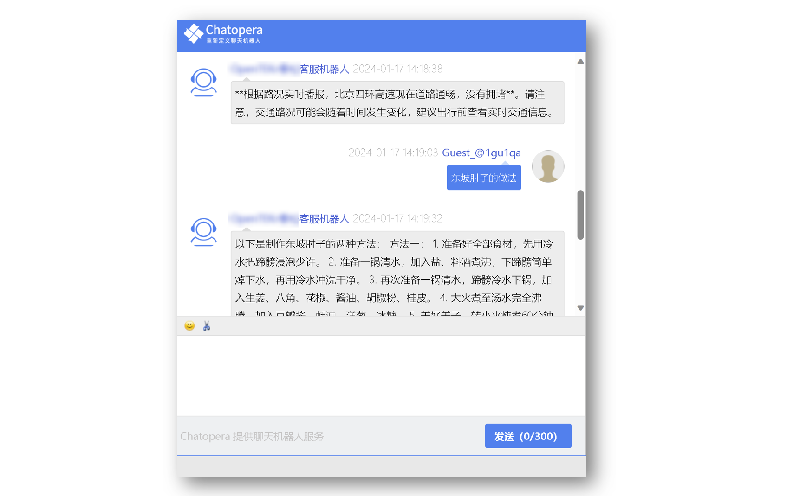
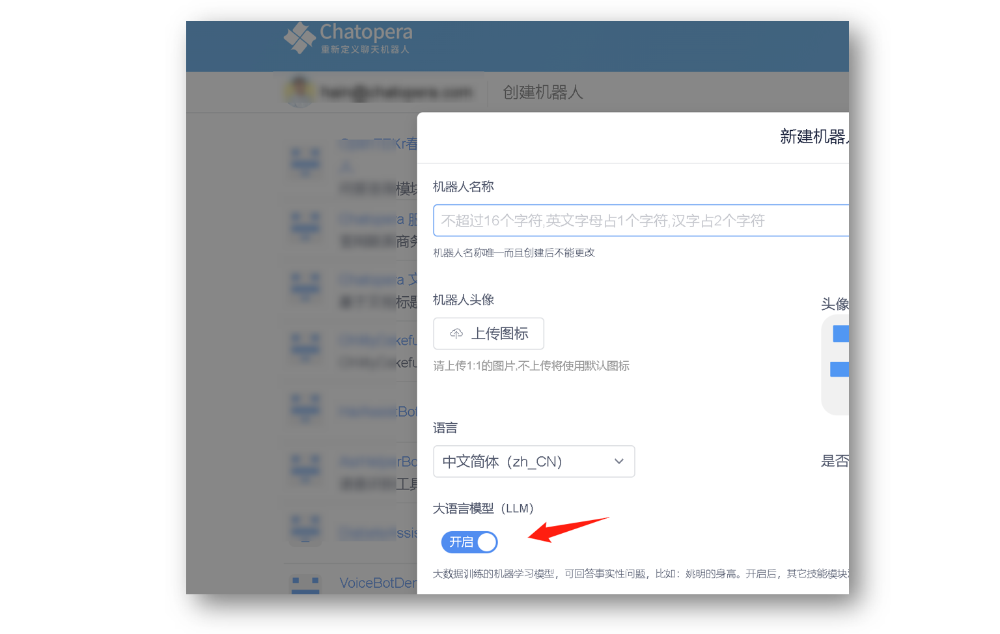
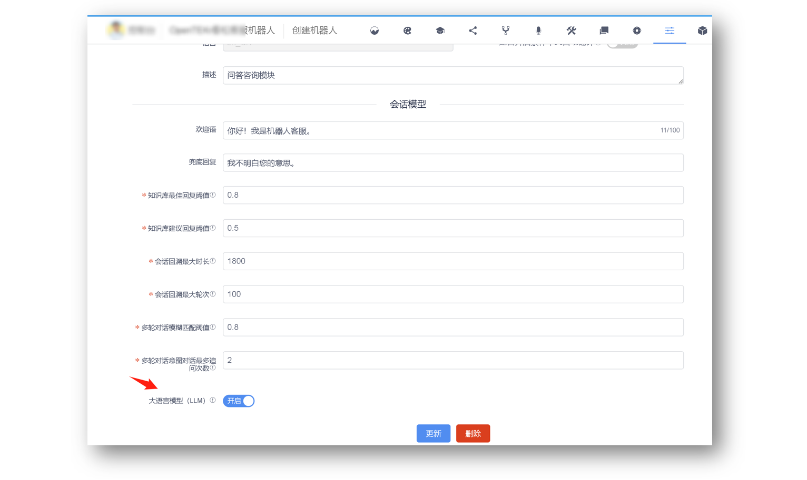

# 使用大语言模型（LLM）

**Chatopera 云服务支持在知识库、多轮对话和意图识别均没有命中回复的时候，请求大语言模型（LLM）以进一步的获得答案**。Chatopera 的大语言模型底层服务使用百度文心一言，实现方式和 ChatGPT 类似。

## 应用场景

* 回答事实性问题，比如“珠穆朗玛峰的海拔是多少？”
* 回答生活、天气、出行信息，比如“今天北京的天气怎么样？”，“北京四环现在拥堵吗”，“东坡肘子的做法”
* 艺术创作，比如“作一首七言绝句”

## 注意事项

* Chatopera 云服务用户可以选择针对机器人开启或关闭大语言模型的检索；
* 在 Chatopera 的检索算法中，大语言模型排在兜底回复之前，具体参考[多轮对话的检索](https://docs.chatopera.com/products/chatbot-platform/explanations/query.html);
* 大语言模型会消耗时间，并且因为其返回值较慢（大约 5s ~ 20s），造成了对话的延迟；
* 推荐优先通过 [Chatopera H5 聊天控件](https://docs.chatopera.com/products/chatbot-platform/howto-guides/channels/webim-setup.html)进行机器人的发布，在 Chatopera H5 中优化了交互体验以适应返回值较慢的问题。

## 开启配置

以下为不同情况下，让机器人支持大语言模型检索的方法。

### 新建聊天机器人

登录 Chatopera 云服务后，在首页点击【创建机器人】，确认表单中【大语言模型（LLM）】是开启状态。继续填写表单，点击【确认】。

### 配置已有聊天机器人

进入聊天机器人配置页面，在【会话模型】中，找到【大语言模型（LLM）】, 设置开关状态至【开启】。点击【更新】。

## 关闭配置

进入聊天机器人配置页面，在【会话模型】中，找到【大语言模型（LLM）】, 设置开关状态至【关闭】。点击【更新】。

