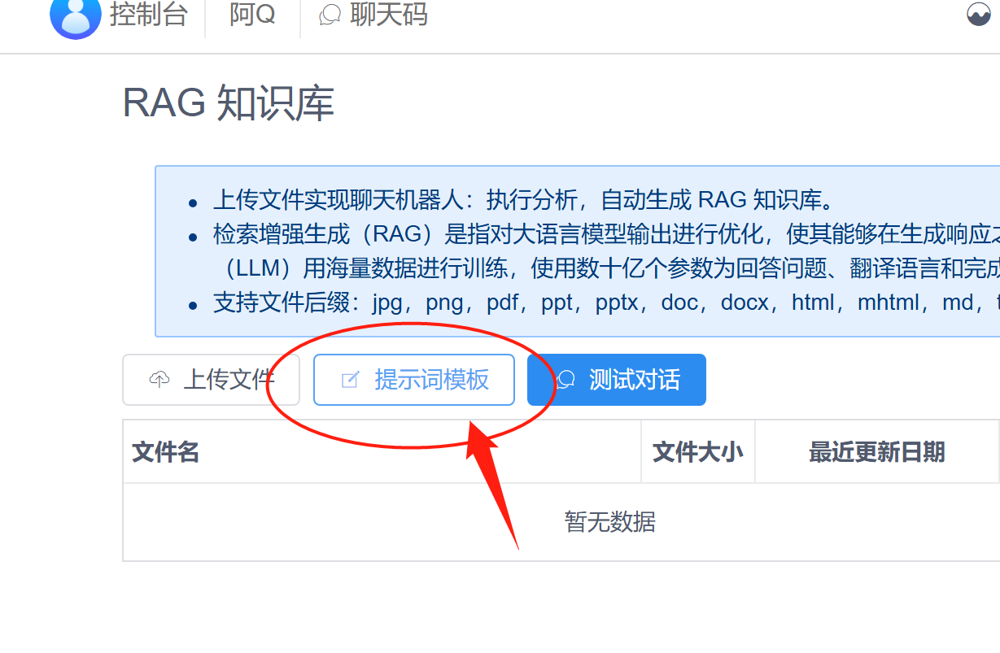
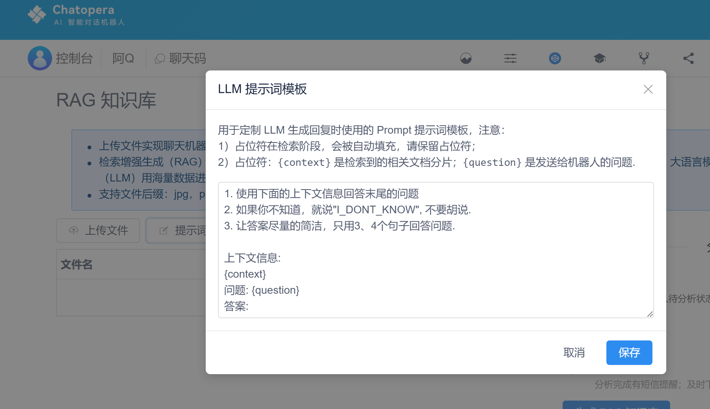
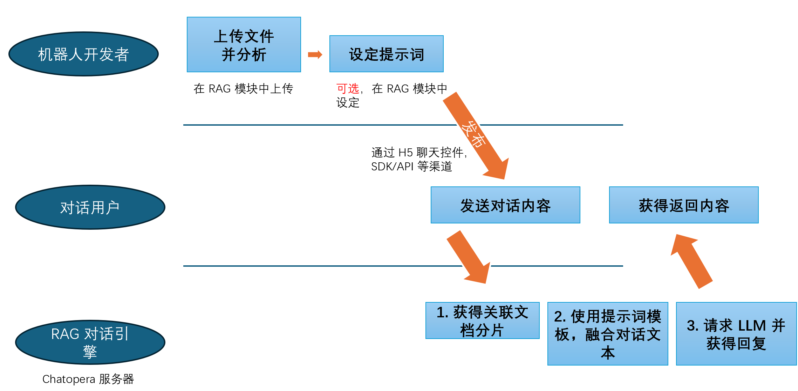

# 修改 RAG 知识库提示词模板

## 提示词模板

每个机器人，都可以独立的设置提示词模板。提示词是 Chatopera 机器人在和 LLM 大语言模型交互时，发送的文本内容。

提示词模板，是将机器人角色、答案约束、关联文档等融合成为提示词的模板。比如，默认的中文的提示词模板是：

```
1. 使用下面的上下文信息回答末尾的问题
2. 如果你不知道，就说"I_DONT_KNOW", 不要胡说.
3. 让答案尽量的简洁，只用3、4个句子回答问题.

上下文信息: 
{context}
问题: {question}
答案:
```

其中，有两个固定的占位符：

* `{context}` - RAG 召回的关联文档分片。Chatopera 机器人平台 RAG 模块，将上传的文档按照每 300 个字切分为一个分片；
* `{question}` - 对话用户发送的文本。


## 修改提示词模板

作为 Chatopera 机器人开发者，可以修改提示词模板，在 RAG 模块中，有修改【提示词模板】的按钮。



在修改提示词时，有以下注意事项：

* 在模板中，必须包含 `{context}` 和 `{question}`
* 在模板中，比如包含 `如果你不知道，就说"I_DONT_KNOW", 不要胡说.` 这个约定，因为 Chatopera 机器人平台将会使用这个字符串判断机器人是否找到答案；在没有找到答案的时候，会在机器人的对话技能中，继续挖掘答案。




在了解了注意事项后，您可以灵活的设计提示词模板，比如：

```
假设你是一个小说家，擅长写科幻小说，请根据以下要求写一篇新的小说

1. 如果你不知道，就说"I_DONT_KNOW", 不要胡说.
2. 行文的风格，尽量模仿鲁迅

上下文信息: 
{context}
小说情节概述: {question}
答案:
```

## RAG 模块工作模式

为了进一步的帮助您使用 Chatopera 机器人平台 RAG 服务，以下是 Chatopera RAG 模块的工作原理：

