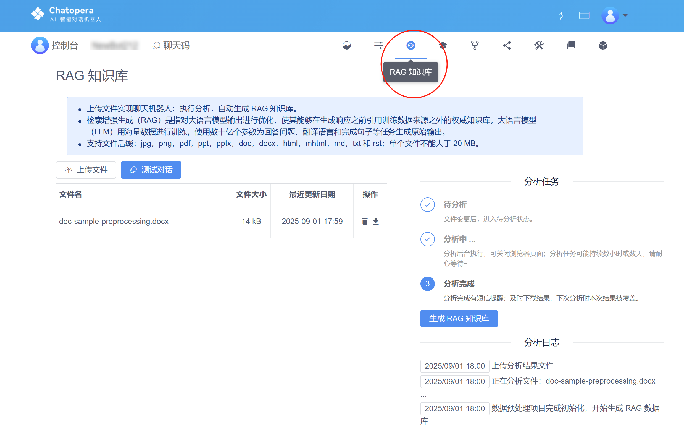

# 生成 RAG 知识库

## RAG 检索增强

RAG (Retrieval-Augmented Generation) ，检索增强服务，是利用大语言模型的语义理解能力，处理用户上传的文档，生成回复内容的服务。

Chatopera 云服务内置了 RAG 服务，支持用户上传多种格式的文件，生成 RAG 知识库问答。

在创建好的机器人中，进入 【RAG 知识库】，并上传文件，生成知识库。

在聊天机器人的多轮对话中，会调用 RAG 知识库，并利用其产生的回答回复给访客。
具体过程参考：[多轮对话的检索](/products/chatbot-platform/explanations/query.html)。