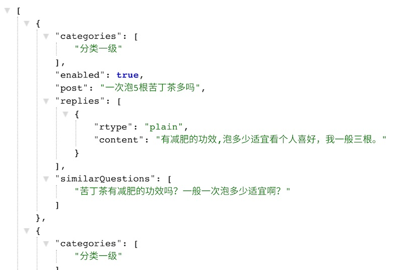
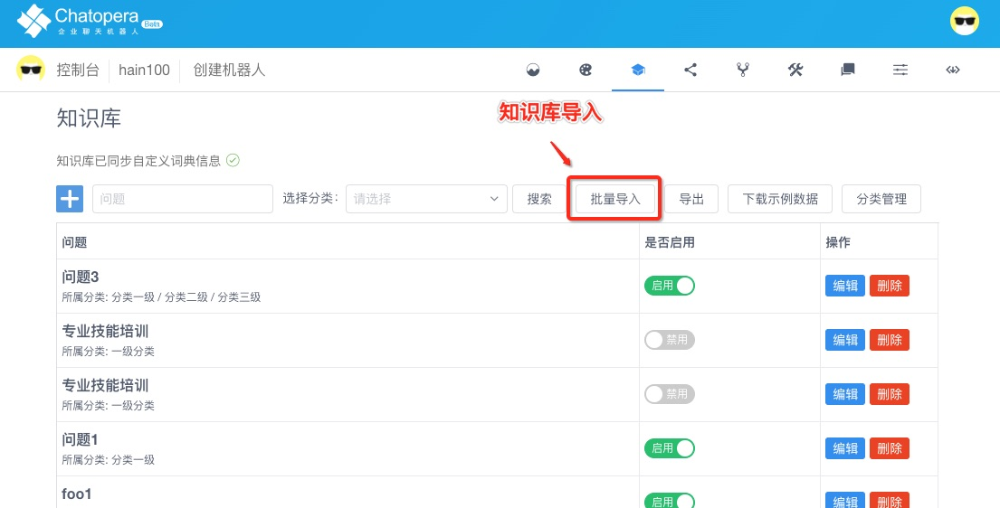

# 系统集成

## 概述

[**Chatopera 云服务**](https://bot.chatopera.com/)提供一站式实现智能对话机器人的按量付费的云服务，企业或开发者可以使用 SDK 集成 Chatopera 云服务。Chatopera 云服务是 **Chatopera 机器人平台**的**软件即服务**版本，软件即服务也被称为[**SaaS（Software as a Service）**](https://baike.baidu.com/item/saas/6703273?fromtitle=%E8%BD%AF%E4%BB%B6%E5%8D%B3%E6%9C%8D%E5%8A%A1)。

SDK 是面向不同编程语言和 Chatopera 云服务集成的工具库，包括 Node.js、Go、PHP、Python、Java 等，SDK 简化了集成的复杂度，某些语言可以通过包管理工具安装。

## 下载 SDK

下载地址参考列表：

| 语言    | 下载地址                                                                      | 使用指南                                                                                                                                                                                                                              |
| ------- | ----------------------------------------------------------------------------- | ------------------------------------------------------------------------------------------------------------------------------------------------------------------------------------------------------------------------------------- |
| Python  | [chatopera-py-sdk](https://pypi.org/project/chatopera/)                       | [示例程序](https://github.com/chatopera/chatopera-py-sdk/blob/master/demo.py) / [技术支持](https://github.com/chatopera/status/issues/new/choose)                                                                                     |
| Java    | [chatopera-java-sdk](https://github.com/chatopera/chatopera-sample-java/wiki) | [示例程序](https://github.com/chatopera/chatopera-sample-java) / [技术支持](https://github.com/chatopera/status/issues/new/choose) / [JavaDocs](https://chatopera.github.io/chatopera-sample-java/com/chatopera/bot/sdk/Chatbot.html) |
| Go      | [chatopera-go-sdk](https://github.com/chatopera/chatopera-go-sdk)             | [示例程序](https://github.com/chatopera/chatopera-go-sdk/blob/master/chatopera_test.go) / [技术支持](https://github.com/chatopera/status/issues/new/choose)                                                                           |
| PHP     | [chatopera-php-sdk](https://packagist.org/packages/chatopera/sdk)             | [示例程序](https://github.com/chatopera/chatopera-php-sdk) / [技术支持](https://github.com/chatopera/status/issues/new/choose)                                                                                                        |
| Node.js | [chatopera-nodejs-sdk](https://www.npmjs.com/package/@chatopera/sdk)          | [示例程序](https://github.com/chatopera/chatopera-sample-node) / [技术支持](https://github.com/chatopera/status/issues/new/choose)                                                                                                    |

为了方便开发者调用 SDK，每个 SDK 内均有示例程序或测试程序作为参考。

> **提示：** 以上 SDK 同时支持私有部署的 Chatopera 机器人平台。

在聊天机器人的一级菜单，可以进入**集成页面**查看。

<table class="image">
    <caption align="bottom">集成</caption>
    <tr>
        <td></td>
    </tr>
</table>

<font color="blue">如不能满足您使用环境或者语言的 SDK，请[创建工单](https://github.com/chatopera/docs/issues/new?template=1_help.md)进行描述，Chatopera 将尽快满足您的需求。</font>

## 快速开始

SDK 的下载链接在上一节中介绍了，本节以[Node.js SDK](https://www.npmjs.com/package/@chatopera/sdk) 为例子演示使用流程，

> **提示：** [Node.js](https://nodejs.org/en/) 是 JavaScript 运行时环境，面向服务器端应用开发，底层使用 Google V8 引擎。[Node.js](https://nodejs.org/en/) 尤其被前端开发者偏爱，因为它让前端开发者以“熟悉”的方式开发后端应用。[Node.js](https://nodejs.org/en/) 的出现一度降低了开发成本，并且成为“快应用”开发趋势出现，[Node.js](https://nodejs.org/en/) 包管理工具 [Npm 站点](https://www.npmjs.com/) 是开源领域最大的包管理服务。不同语言的 SDK 使用细节大同小异， 因为它们都是调用**Chatopera 云服务**的[RestAPIs](https://baike.baidu.com/item/RESTful)，这些 RestAPIs 是标准一致的。每种语言的 SDK 使用流程按照顺序包括：下载 SDK，实例化`Chatbot`类为对象，请求接口和处理返回结果。

### 注册账号

首先注册[Chatopera 云服务](https://bot.chatopera.com)的账号，如果您已经注册，直接进入下一步：创建机器人。

<table class="image">
    <caption align="bottom">登陆 https://bot.chatopera.com</caption>
    <tr>
        <td></td>
    </tr>
</table>

点击“[立即使用](https://bot.chatopera.com)”，初次登录输入“邮箱”和“密码”，点击“回车键”，完成账户创建。

### 创建机器人

登陆完成进入首页，点击“创建机器人”。

| 项目       | 值         | 描述                                                            |
| ---------- | ---------- | --------------------------------------------------------------- |
| 机器人名称 | 小松       | 机器人的名字                                                    |
| 描述       | 机器人示例 | 机器人的描述                                                    |
| 语言       | zh_CN      | 机器人的语言，目前支持中文(zh_CN)、繁体中文(zh_TW)和英文(en_US) |

其它项如兜底回复，问候语可以在创建后，设置页面修改。

### 导入知识库文件

接着，导入一些示例数据到知识库，作为体验用途，下载知识库示例文件[chatopera_faq_samples.json](https://static-public.chatopera.com/bot/faq/chatopera_faq_samples.json)，保存文件名为*chatopera_faq_samples.json*。

<p align="center">
  <b>知识库文件格式</b><br>
      
</p>

在该示例文件中，用 JSON 数组的形式存储了 100 个问答对，字段含义如下：

| key              | type     | required | description                                                                                                                    |
| ---------------- | -------- | -------- | ------------------------------------------------------------------------------------------------------------------------------ |
| categories       | [string] | false    | 分类名称，支持层级比如 `["一级", "二级"]`，服务器端自动创建对应分类                                                            |
| enabled          | boolean  | true     | 是否启用，代表该问答对导入后是否支持来访者检索                                                                                 |
| post             | string   | true     | 问答对的标准问                                                                                                                 |
| replies          | [object] | true     | 问答对的回答，数组长度大于 0, `content`是文本内容，`rtype`为`plain`表示`content`为纯文本; `rtype`为`html`表示`content`为富文本 |
| similarQuestions | [string] | false    | 问答对里的相似问                                                                                                               |

<p align="center">
  <b>上传知识库文件</b><br>
  <a href="http://bot.chatopera.com/" target="_blank">
      
  </a>
</p>

选择*chatopera_faq_samples.json*，这时，会显示问答对列表，点击“提交”，在进度条完成后，知识库导入成功。

### 获取*ClientId*和*Secret*

`SDK`中每个机器人实例需要通过*ClientId*和*Secret*初始化，这两个字段是认证和授权用途。打开机器人【设置】页面，拷贝*ClientId*和*Secret*。

<p align="center">
  <b>显示Secret</b><br>
  <a href="http://bot.chatopera.com/" target="_blank">
      
  </a>
</p>

### 安装 SDK

```
npm install @chatopera/sdk --save
```

### 实例化`Chatbot`类为对象

```
var Chatbot = require("@chatopera/sdk").Chatbot;
var chatbot = new Chatbot(clientId, secret [, serviceProvider]);
```

<h4><font color="purple">参数说明</font></h4>

| name            | type   | required | description                                                                                                                      |
| --------------- | ------ | -------- | -------------------------------------------------------------------------------------------------------------------------------- |
| clientId        | string | &#10004; | 在[机器人控制台/机器人/设置](https://bot.chatopera.com/dashboard)中获取                                                          |
| secret          | string | &#10004; | 获取办法同上                                                                                                                     |
| serviceProvider | string | &#10008; | Chatopera 机器人平台地址，<br><font color="green">当使用 Chatopera 云服务时，该值为 https://bot.chatopera.com，也是默认值</font> |

<!--  对号和差号， https://www.w3schools.com/charsets/ref_utf_dingbats.asp -->

> **提示：** 参数列表中，写在 `[]` 内的部分是选填参数，如果不填写使用默认值，下同。

### 调用接口示例

得到`Chatbot`实例后，怎么样请求接口服务呢？假设对该机器人的基本信息感兴趣，获取基本信息方式如下：

```
var response = await chatbot.command("POST", "/faq/query", {
  query: "不锈钢板现在是什么价格",
  fromUserId: "sdktest1",
});
console.log("response: ", response)
```

或者获取 `Promise` 返回

```
chatbot.command("GET", "/").then(
  (response) => {
    console.log("机器人名称：", response.data.name);
  },
  (err) => {}
);
```

此处，不深入探讨`await`和`Promise`的相关知识，它们是和 JavaScript 语言相关的内容。在这个例子中，我们请读者注意，给定一个机器人类的实例，再请求 API 服务是多么的简单，`Chatbot#command`接口提供了一系列的方法，也是下文给您详细介绍的重点。

## `Chatbot`类

### 实例化

`Chatbot`类是与 Chatopera 云服务集成的一个核心类，因为 Chatopera 云服务为开发者提供聊天机器人服务，`Chatbot`类的对象就是 Chatopera 云服务中一个聊天机器人的代理。

<h4><font color="purple">构造函数</font></h4>

```
Chatbot(clientId, secret [, serviceProvider])
```

<h4><font color="purple">参数说明</font></h4>

| name            | type   | required | description                                                                                                                      |
| --------------- | ------ | -------- | -------------------------------------------------------------------------------------------------------------------------------- |
| clientId        | string | &#10004; | 在[机器人控制台/机器人/设置](https://bot.chatopera.com/dashboard)中获取                                                          |
| secret          | string | &#10004; | 获取办法同上                                                                                                                     |
| serviceProvider | string | &#10008; | Chatopera 机器人平台地址，<br><font color="green">当使用 Chatopera 云服务时，该值为 https://bot.chatopera.com，也是默认值</font> |

<h4><font color="purple">更多实例化例子</font></h4>

不同语言下，`Chatbot`类的包名或引用方式不同，Node.js SDK 的实例化上文已经表述，以下再介绍其它语言。

<h5><font color="purple">Java</font></h5>

```
import com.chatopera.bot.sdk.Chatbot;
...
Chatbot chatbot = new Chatbot(clientId, secret);
```

<h5><font color="purple">Python</font></h5>

```
from chatopera import Chatbot
bot = Chatbot(clientId, secret)
```

<h5><font color="purple">PHP</font></h5>

假设使用[composer](https://getcomposer.org/)作为包管理工具，其它安装方式参考[chatopera-php-sdk](https://github.com/chatopera/chatopera-php-sdk)。

```
<?php

include_once **DIR** . "/vendor/autoload.php";
$chatbot = new Chatopera\SDK\Chatbot($appId, \$secret);

```

<h5><font color="purple">Go</font></h5>

```
import (
	"github.com/chatopera/chatopera-go-sdk"
)
...
var chatbot = chatopera.Chatbot(clientId, secret)
```

### 发送请求

`Chatbot`实例的核心接口是`command`，以下也使用`Chatbot#command`来指这个接口，该接口是对 RestAPI Request 的高级封装，内部完成**签名认证**，**RequestHeaders**和**RequestBody**等处理。

<h4><font color="purple">接口规范</font></h4>

```
result = chatbot.command(method, path [, body])
```

> **提示：** result 返回在 Node.js 中使用`await`或`Promise`，参考[快速开始](/products/chatbot-platform/integration.html#调用接口示例)；其它语言直接用 `=` 便可获取。

<h4><font color="purple">参数说明</font></h4>

| name   | type           | required | description                                                                                  |
| ------ | -------------- | -------- | -------------------------------------------------------------------------------------------- |
| method | string         | &#10004; | 对于资源的具体操作类型，由 HTTP 动词表示。有效值包括`GET`，`POST`，`PUT`，`DELETE`和`HEAD`等 |
| path   | string         | &#10004; | 资源的执行路径，通常包含资源实体名称或唯一标识，也可能在 `path`中使用`queryString`传递参数   |
| body   | `JSON`数据结构 | &#10067; | `body` 是请求中的数据，对应 RestAPI 中的 Http Body                                           |

`method`不同动词代表的含义一般如下：

- GET - 从服务器取出一项或多项资源；
- POST - 在服务器创建一个资源；
- PUT - 在服务器更新一个资源；
- DELETE - 在服务器删除一个资源。

还有更多类型的`method`，没有上述几种常用，在此不进行赘述。

`queryString`是 URL 的一部分。典型的 URL 看起来像这样: <font color="green">http://server/resource?</font><font color="blue">foo=A&bar=B</font>。其中，<font color="blue">foo=A&bar=B</font>就是`queryString`，通常用来传递参数，这个例子中包含两个参数：`foo`值为`A`；`bar`值为`B`。在下文中，`path`参数中可能包含`queryString`，形式如<font color="blue">foo={{var1}}&bar={{var2}}</font>，需要把`{{var1}}`和`{{var2}}`替换为实际值。

`body`数据是 JSON 格式的，不同语言对于 JSON 格式支持方式不同。[JSON](https://www.json.org/json-en.html)是一种轻量级的数据交换格式，描述了使用键值对、数组、字符串、数字、日期和布尔类型等值存储对象。[JSON](https://www.json.org/json-en.html)在不同语言下，等价数据结构如下。

| 语言       | JSON Object                                                                            | JSON Array                                                                            |
| ---------- | -------------------------------------------------------------------------------------- | ------------------------------------------------------------------------------------- |
| JavaScript | `{...}`                                                                                | `[...]`                                                                               |
| Java       | [org.json.JSONObject](https://www.tutorialspoint.com/org_json/org_json_jsonobject.htm) | [org.json.JSONArray](https://www.tutorialspoint.com/org_json/org_json_jsonobject.htm) |
| PHP        | 基本类型`array`                                                                        | 基本类型`array`                                                                       |
| Python     | 基本类型`dict`                                                                         | 基本类型`list`                                                                        |
| Go         | `map[string]interface{}`                                                               | `[]map[string]interface{}`                                                            |

**下文表述时，统一使用`JSON`，`JSON Object`和`JSON Array`代表 JSON 数据结构和其不同语言下的等价数据结构。**

> **提示：** 相对而言，JSON 等价的数据结构，在获取`JSON Object`的键值或`JSON Array`的长度和成员时，语法不同，但都易于掌握。在使用时，参考不同 SDK 的[示例程序](/products/chatbot-platform/integration.html#下载-sdk)。

**`body`是否必填以及是`JSON Object`还是`JSON Array`，取决于`method`和`path`的值，不同`method`和`path`的组合对应了不同的接口功能，满足不同需求，下文将介绍满足各种需求的`method`和`path`，并各个说明`body`参数。**

### 返回值

**返回值**即请求结果，针对接口定义，`Chatbot#command`的返回值`result`是 `JSON Object`，并有以下属性。

| key            | type   | description                                                                                                           |
| -------------- | ------ | --------------------------------------------------------------------------------------------------------------------- |
| `rc`           | int    | response code，返回码，大于等于 0 的正整型。`0`代表服务器端按照请求描述，正常返回结果；`rc` 不等于 0 是代表异常返回。 |
| `data`         | JSON   | 数据资源。正常返回时，服务器端执行逻辑成功，比如查询时，`data`就是查询结果。                                          |
| `msg`          | string | 消息，当服务器端执行请求成功，并且不需要返回数据资源时，通过 `msg`代表文本信息，比如提示信息。                        |
| `error`        | string | 异常消息，当服务器端返回异常时，具体出错信息包含在`error`中。                                                         |
| `status`       | JSON   | 全局任务的状态信息。                                                                                                  |
| `total`        | int    | 分页，所有数据记录条数。                                                                                              |
| `current_page` | int    | 分页，当前页码，（分页从 1 开始）。                                                                                   |
| `total_page`   | int    | 分页，所有页数。                                                                                                      |

每次请求结果中，`rc`是必含有的属性，其它属性为可能含有。不同`rc`的正整数形代表不同的异常，`data`、`status`以及分页信息，则因`method`和`path`而异，以下进行详细介绍。

> **提示：** 不同语言对返回值可能进行了封装，但是不离其宗，都是基于以上定义，比如 Java SDK 中，定义`com.chatopera.bot.sdk.Response`作为`Chatbot#command`接口返回值，`Response`类提供`getRc`、`getData`和`toJSON`等方法，提升代码可读性。在使用时，参考不同 SDK 的[示例程序](/products/chatbot-platform/integration.html#下载-sdk)。

下文中使用的`method`，`path`，`body`和`result`等均代表以上介绍的概念。

## 机器人画像

### 获取机器人画像

```
Chatbot#command("GET", "/")
```

<h4><font color="purple">result / JSON Object</font></h4>

```
{
    "rc": 0,
    "data": {
        "name": "小巴巴",
        "fallback": "请联系客服。",
        "description": "Performs Tasks or retrieves FAQ.",
        "welcome": "你好，我是机器人小巴巴",
        "primaryLanguage": "zh_CN",
        "status": {
            "reindex": 0,
            "retrain": 0
        }
    }
}
```

| key               | type        | description                                                                                              |
| ----------------- | ----------- | -------------------------------------------------------------------------------------------------------- |
| `name`            | string      | 机器人名字。                                                                                             |
| `fallback`        | string      | 兜底回复，当请求机器人对话时，没有得到来自多轮对话、知识库或意图识别回复时，回复此内容。                 |
| `welcome`         | string      | 机器人问候语。                                                                                           |
| `description`     | string      | 机器人描述。                                                                                             |
| `primaryLanguage` | string      | 机器人语言。                                                                                             |
| `status`          | JSON Object | 全局任务的执行状态，`reindex`代表知识库同步自定义词典的状态；`retrain`代表意图识别同步自定义词典的状态。 |

### 更新机器人画像

```
Chatbot#command("PUT", "/", body)
```

<h4><font color="purple">body / JSON Object</font></h4>

```
{
 "fallback": "请联系客服。",
 "description": "我的超级能力是对话",
 "welcome": "你好，我是机器人小巴巴"
}
```

<h4><font color="purple">result / JSON Object</font></h4>

```
{
 "rc": 0,
 "data": {
  "name": "小巴巴",
  "fallback": "请联系客服。",
  "description": "Performs Tasks or retrieves FAQ.",
  "welcome": "你好，我是机器人小巴巴"
}
```

### 获取全局任务状态

```
Chatbot#command("GET", "/status")
```

<h4><font color="purple">result / JSON Object</font></h4>

```
{
 "rc": 0,
 "data": {
  "status": {
   "reindex": 0,
   "retrain": 0
  }
}
```

## 对话检索

### 检索知识库

```
Chatbot#command("POST", "/faq/query", body)
```

<h4><font color="purple">body / JSON Object</font></h4>

```
{
	"query": "查找相似的问题",
	"fromUserId": "{{userId}}",
	"faqBestReplyThreshold": 0.5,
	"faqSuggReplyThreshold": 0.1
}
```

<h4><font color="purple">result/ JSON Object</font></h4>

```
{
    "rc": 0,
    "data": [
        {
            "id": "{{docId}}",
            "score": 0.48534,
            "post": "查看相似问题不可能的",
            "replies": [
                {
                    "rtype": "plain",
                    "enabled": true,
                    "content": "方法"
                }
            ]
        },
        {
            "id": "{{docId}}",
            "score": 0.32699,
            "post": "聊天",
            "replies": [
                {
                    "rtype": "plain",
                    "content": "foo",
                    "enabled": true
                },
                {
                    "rtype": "plain",
                    "content": "bar",
                    "enabled": true
                }
            ]
        }
    ]
}
```

### 检索意图识别

意图识别是基于请求者的文本内容分析意图，然后基于意图追问意图槽位信息的对话，这部分的详细介绍参考[https://docs.chatopera.com/products/chatbot-platform/intent.html](/products/chatbot-platform/intent.html)，下面重点介绍在系统集成中，通过意图识别服务提供智能问答。

#### 什么是“会话”

“会话”(session)在代表一个用户对话的周期，认为用户在这个周期内是为了完成某个任务的。从确定任务，到得到和这个任务相关的信息，这个 session 就正常结束了，但是如果用户变化了任务，这个 session 就不能正常结束。开发者选择什么时候创建新的 session，但是服务器端决定什么时候完成这个 session，session 的管理涉及：意图的确定，意图参数的确定，会话最大空闲时间，会话是否解决(resolved)。

- 训练完成后请求对话，需要先创建会话，会话会绑定 0-1 个任务：刚开始不知道用户意图，当确定用户意图后，该 session 就只和这个意图相关；
- 会话有最大空闲日期，如果在半个小时内没有更新，会被服务器删除；
- 会话可以任意创建，只要没有超过最大空闲日期都是有效的；
- 不同的用户使用不同的会话，同一个用户可以同时有多个会话，但是为了实际效果，用户最好同时只使用一个会话；
- 当用户的意图和槽位信息被全部确认，会话包含的 resolved 字段会被设置为 true，这时开发者可以再次创建一个新的会话。

#### 创建会话

```
Chatbot#command("POST", "/clause/prover/session", body)
```

<h4><font color="purple">body / JSON Object</font></h4>

```
{
	"uid": "{{userId}}",
	"channel": "{{channelId}}"
}
```

| key       | type   | required | description                                                                    |
| --------- | ------ | -------- | ------------------------------------------------------------------------------ |
| userID    | string | &#10004; | 用户标识，由字母和数字组成的字符串。开发者自定义，保证每个用户唯一             |
| channelId | string | &#10004; | 用户来源的渠道标识，由字母和数字组成的字符串。由开发者自定义，保证每个渠道唯一 |

<h4><font color="purple">result/ JSON Object</font></h4>

```
{
    "rc": 0,
    "data": {
        "intent_name": null,
        "uid": "{{userId}}",
        "channel": "{{channelId}}",
        "resolved": null,
        "id": "{{sessionId}}",
        "entities": null,
        "createdate": "2019-08-28 18:08:51",
        "updatedate": "2019-08-28 18:08:51"
    },
    "error": null
}
```

#### 检索意图识别

```
Chatbot#command("POST", "/clause/prover/chat", body)
```

<h4><font color="purple">body / JSON Object</font></h4>

```
{
	"fromUserId": "{{userId}}",
	"session": {
		"id": "{{sessionId}}"
	},
	"message": {
		"textMessage": "我想购买明天火车票"
	}
}
```

| key         | type   | required | description                                                         |
| ----------- | ------ | -------- | ------------------------------------------------------------------- |
| userId      | string | &#10004; | 用户唯一 ID，用户 ID 由业务系统传递或生成，保证每个用户用唯一字符串 |
| sessionId   | string | &#10004; | 使用创建会话接口创建                                                |
| textMessage | string | &#10004; | 用户输入的对话文字                                                  |

<h4><font color="purple">result/ JSON Object</font></h4>

```
{
    "rc": 0,
    "data": {
        "session": {
            "intent_name": "{{intentName}}",
            "uid": "{{userId}}",
            "channel": "{{channelId}}",
            "resolved": false,
            "id": "{{sessionId}}",
            "entities": [
                {
                    "name": "cityName",
                    "val": "中国首都"
                }
            ],
            "createdate": "2019-08-28 18:15:24",
            "updatedate": "2019-08-28 18:15:24"
        },
        "message": {
            "textMessage": "你想做什么工具",
            "is_fallback": null,
            "is_proactive": true
        }
    },
    "error": null
}
```

#### 查看会话详情

```
Chatbot#command("GET", "/clause/prover/session/{{sessionId}}")
```

<h4><font color="purple">result/ JSON Object</font></h4>

```
{
    "rc": 0,
    "data": {
        "intent_name": "{{intentName}}",
        "uid": "{{userId}}",
        "channel": "{{channelId}}",
        "resolved": false,
        "id": "{{sessionId}}",
        "entities": null,
        "createdate": "2019-08-28 18:41:56",
        "updatedate": "2019-08-28 18:41:56"
    },
    "error": null
}
```

### 检索多轮对话

多轮对话是通过脚本规则、函数编程实现问答服务，在*检索多轮对话*接口中，同时融合了知识库参与回复决策，返回结果，尤其是通过知识库答案路由到指定话题的指定触发器，非常实用。

```
Chatbot#command("POST", "/conversation/query", body)
```

<h4><font color="purple">body / JSON Object</font></h4>

```
{
    "fromUserId": "{{userId}}",
    "textMessage": "想要说些什么",
    "faqBestReplyThreshold": 0.6,
    "faqSuggReplyThreshold": 0.35
}
```

| key                   | type   | required | description                                                                                       |
| --------------------- | ------ | -------- | ------------------------------------------------------------------------------------------------- |
| userId                | string | &#10004; | 用户唯一 ID，用户 ID 由业务系统传递或生成，保证每个用户用唯一字符串                               |
| textMessage           | string | &#10004; | 用户输入的对话文字                                                                                |
| faqBestReplyThreshold | number | &#10008; | 知识库最佳回复， 默认 0.8，知识库建议回复，知识库中置信度超过该值通过返回值`string`和`params`返回 |
| faqSuggReplyThreshold | number | &#10008; | 知识库建议回复，默认 0.6，知识库中置信度超过该值的问答对通过返回值`faq`属性返回                   |

<h4><font color="purple">result/ JSON Object</font></h4>

```
{
    "rc": 0,
    "data": {
        "state": "default",
        "string": "方法",
        "logic_is_unexpected": false,
        "logic_is_fallback": false,
        "service": {
            "provider": "faq",
            "docId": "{{doctId}}",
            "score": 0.3781,
            "threshold": 0.37
        },
        "botName": "小巴巴",
        "faq": [
            {
                "id": "{{doctId}}",
                "score": 0.3781,
                "post": "查看相似问题不可能的",
                "replies": [
                    {
                        "rtype": "plain",
                        "enabled": true,
                        "content": "方法"
                    }
                ]
            }
        ]
    }
}
```

_state_: 业务字段，可以在多轮对话脚本中设置

_string_: 机器人回复的文本内容

_topicName_: 机器人会话主题

_logic_is_fallback_: 是否是兜底回复

_botName_: 机器人的名字

_faq_: 知识库中匹配 textMessage 的相似度超过 **faqSuggReplyThreshold**的记录，数组类型

`service`代表返回的数据来源，**provider:script**指**多轮对话**，**provider:faq**指**知识库**；不同数据来源也会提供相应信息。

| provider     | key                  | 解释    |
| ------------ | -------------------- | ------- |
| faq          |                      |         |
|              | docId                | 文档 ID |
|              | post                 | 标准问  |
|              | score                | 分数    |
|              | threshold            | 阀值    |
| conversation | 多轮对话             |         |
| fallback     | 兜底回复             |         |
| mute         | 该用户被该机器人屏蔽 |         |

<h4><font color="purple">服务器端逻辑</font></h4>

多轮对话获取回复的逻辑解释如下：

<table class="image">
    <caption align="bottom">查询逻辑</caption>
    <tr>
        <td></td>
    </tr>
</table>

1. 用户输入，以文本的形式输入，语音输入也需要转化成文字。
2. [知识库检索] 如果知识库检索出相似度大于 `faqBestReplyThreshold` 的问答对，直接返回得分最高的问题的答案。
3. [多轮对话检索] 如果知识库没有检索出相似度大于 `faqBestReplyThreshold` 的问答对，检索多轮对话，如果命中了一个规则，直接返回答案。
4. [兜底回复] 如果多轮对话也没有检索出答案，返回兜底回复。

<h4><font color="purple">知识库路由</font></h4>

在[知识库的答案](/products/chatbot-platform/faq.html#设定答案)或[多轮对话的函数](/products/chatbot-platform/conversation.html#函数)中设置回复时，可以用 **routeDirectReply** 来检索一个指定的[多轮对话名称](/products/chatbot-platform/conversation.html#术语)和[触发器](/products/chatbot-platform/conversation.html#触发器)。

语法：

```
routeDirectReply#["TOPIC_NAME", "TOPIC_GAMBIT_ID" [,INHERIT_PARAMS]]
```

其中，_INHERIT_PARAMS_ 是可选参数，决定当前对话取得的 `params` 是否覆盖接下来对话的 `params`，值为`[true|false]`，默认为 `false`。

另外，当 `TOPIC_GAMBIT_ID` 的值为 `$ctx.textMessage$` 时，则使用当前对话的用户输入，在 `TOPIC_NAME` 中进行检索。

比如

```
routeDirectReply#["class_001_pre", "__C1PRE_GAMBIT_003",true]
```

提示：**routeDirectReply**需要设定为知识库问答对里的第一个答案，答案类型为 纯文本`plain`。

## 词典管理

### 创建自定义词典

```
Chatbot#command("POST", "/clause/customdicts", body)
```

<h4><font color="purple">body / JSON Object</font></h4>

```
{
	"name": "{{customDictName}}",
	"type": "vocab"
}
```

| key  | type   | required | description                                    |
| ---- | ------ | -------- | ---------------------------------------------- |
| name | string | &#10004; | 自定词典名称，使用`小写字母和数据`组成的字符串 |

<h4><font color="purple">result/ JSON Object</font></h4>

```
{
    "rc": 0,
    "data": {
        "name": "{{customDictName}}",
        "description": "",
        "samples": null,
        "createdate": "2019-08-07 19:59:14",
        "updatedate": "2019-08-07 19:59:14"
    }
}
```

### 获取自定义词典列表

```
Chatbot#command("GET", "/clause/customdicts?limit={{limit}}&page={{page}}")
```

<h4><font color="purple">result/ JSON Object</font></h4>

```
{
    "rc": 0,
    "total": 3,
    "current_page": 1,
    "total_page": 3,
    "data": [
        {
            "name": "{{customDictName}}",
            "description": "",
            "samples": null,
            "createdate": "2019-08-07 19:58:08",
            "updatedate": "2019-08-07 19:58:08"
        }
    ]
}
```

### 更新自定义词典

```
Chatbot#command("PUT", "/clause/customdicts/{{customDictName}}", body)
```

<h4><font color="purple">path</font></h4>

| key            | type   | default        | description    |
| -------------- | ------ | -------------- | -------------- |
| customDictName | string | 无默认值, 必填 | 自定义词典标识 |

<h4><font color="purple">body / JSON Object</font></h4>

```
{
    "description": "高级轿车品牌"
}
```

<h4><font color="purple">result/ JSON Object</font></h4>

```
{
    "rc": 0,
    "data": {
        "name": "pizza",
        "description": "",
        "samples": null,
        "createdate": "2020-07-20 20:52:00",
        "updatedate": "2020-07-20 20:51:59",
        "type": "vocab",
    }
}
```

### 删除自定义词典

```
Chatbot#command("DELETE", "/clause/customdicts/{{customDictName}}")
```

<h4><font color="purple">path</font></h4>

| key            | type   | default        | description    |
| -------------- | ------ | -------------- | -------------- |
| customDictName | string | 无默认值, 必填 | 自定义词典标识 |

<h4><font color="purple">result/ JSON Object</font></h4>

```
{
    "rc": 0,
    "msg": "success",
    "error": null,
    "data": {
        "status": {
            "needReindex": 2,
            "needRetrain": 2
        }
    }
}
```

## 知识库管理

### 创建知识库分类

```
Chatbot#command("POST", "/faq/categories", body)
```

<h4><font color="purple">body / JSON Object</font></h4>

```
{
	"label": "{{categoryText}}"
}
```

<h4><font color="purple">result/ JSON Object</font></h4>

```
{
    "rc": 0,
    "data": {
        "value": "{{categoryId}}",
        "categories": [
            {
                "value": "{{categoryId}}",
                "label": "{{categoryText}}",
                "children": [
                    {
                        "value": "I7vfx47i5I",
                        "label": "二级分类名"
                    }
                ]
            },
            {
                "value": "{{categoryId}}",
                "label": "x2"
            }
        ]
    }
}
```

### 获取知识库分类信息

```
Chatbot#command("GET", "/faq/categories")
```

<h4><font color="purple">body / JSON Object</font></h4>

```
{
    "rc": 0,
    "data": [
        {
            "value": "{{categoryId}}",
            "label": "{{categoryText}}",
            "children": [
                {
                    "value": "{{categoryId}}",
                    "label": "{{categoryText}}"
                }
            ]
        }
    ]
}
```

### 更新知识库分类

```
Chatbot#command("", "/faq/categories", body)
```

<h4><font color="purple">body / JSON Object</font></h4>

```
{
	"value": "{{categoryId}}",
	"label": "新的名字"
}
```

<h4><font color="purple">result/ JSON Object</font></h4>

```
{
    "rc": 0,
    "data": [
        {
            "value": "wwQyjS310",
            "label": "一级分类名",
            "children": [
                {
                    "value": "{{categoryId}}",
                    "label": "新的名字"
                }
            ]
        }
    ]
}
```

### 删除知识库分类

```
Chatbot#command("DELETE", "/faq/categories/{{categoryId}}")
```

<h4><font color="purple">path</font></h4>

| key        | type   | default        | description  |
| ---------- | ------ | -------------- | ------------ |
| categoryId | string | 无默认值，必填 | 分类唯一标识 |

<h4><font color="purple">result/ JSON Object</font></h4>

```
{
    "rc": 0,
    "data": [
        {
            "value": "TSDD-W6T9",
            "label": "x2"
        }
    ]
}
```

### 创建问答对

```
Chatbot#command("post", "/faq/database", body)
```

<h4><font color="purple">body / JSON Object</font></h4>

```
{
 "post": "如何查看快递单号",
 "replies": [
  {
   "rtype": "plain",
   "content": "foo",
   "enabled": true
  },
  {
   "rtype": "plain",
   "content": "bar",
   "enabled": true
  }
 ],
 "enabled": true,
 "categoryTexts": [
  "一级分类名",
  "二级分类名"
 ]
}
```

<h4><font color="purple">result / JSON Object</font></h4>

```
{
 "rc": 0,
 "data": {
  "id": "{docId}",
  "replyLastUpdate": "{{replyLastUpdate}}"
 }
}
```

### 更新知识库问答对

```
Chatbot#command("PUT", "/faq/database/{{docId}}", body)
```

<h4><font color="purple">path</font></h4>

| key   | type   | default        | description |
| ----- | ------ | -------------- | ----------- |
| docId | string | 无默认值, 必填 | 问答对标识  |

<h4><font color="purple">body / JSON Object</font></h4>

```
{
	"post": "怎么开通微信支付?",
	"replyLastUpdate": "{{replyLastUpdate}}",
	"replies": [
		{
			"rtype": "plain",
			"content": "foo2",
			"enabled": true
		},
		{
			"rtype": "plain",
			"content": "bar2",
			"enabled": true
		}
	],
	"enabled": true
}
```

<h4><font color="purple">result / JSON Object</font></h4>

```
{
    "rc": 0,
    "data": {
        "id": "{{docId}}",
        "replyLastUpdate": "{{replyLastUpdate}}"
    }
}
```

### 获取问答对列表

```
Chatbot#command("GET", "/faq/database?limit={{limit}}&page={{page}}&q={{q}}")
```

<h4><font color="purple">path</font></h4>

| key   | type   | default | description                      |
| ----- | ------ | ------- | -------------------------------- |
| limit | int    | 1       | 返回最多多少条数据               |
| page  | int    | 20      | 返回第多少页                     |
| q     | string | 空      | 问答对匹配时，问题应包含的关键字 |

<h4><font color="purple">result / JSON Object</font></h4>

```
{
    "total": 3,
    "current_page": 1,
    "total_page": 1,
    "data": [
        {
            "post": "如何查看快递单号",
            "categories": [
                "wwQyjS310",
                "I7vfx47i5I"
            ],
            "enabled": true,
            "id": "{{docId}}"
        }
    ],
    "rc": 0,
    "status": {
        "reindex": 0,
        "retrain": 0
    }
}
```

### 创建问答对相似问

```
Chatbot#command("POST", "/faq/database/{{docId}}/extend", body)
```

<h4><font color="purple">path</font></h4>

| key   | type   | default        | description |
| ----- | ------ | -------------- | ----------- |
| docId | string | 无默认值, 必填 | 问答对标识  |

<h4><font color="purple">body / JSON Object</font></h4>

```
{
	"post": "怎样支持微信支付?"
}
```

<h4><font color="purple">result / JSON Object</font></h4>

```
{
    "rc": 0,
    "data": {
        "id": "{{extendId}}"
    }
}
```

### 获取问答对相似问列表

```
Chatbot#command("GET", "/faq/database/{{docId}}/extend")
```

<h4><font color="purple">path</font></h4>

| key   | type   | default        | description |
| ----- | ------ | -------------- | ----------- |
| docId | string | 无默认值, 必填 | 问答对标识  |

<h4><font color="purple">result / JSON Object</font></h4>

```
{
    "total": 1,
    "current_page": 1,
    "total_page": 1,
    "data": [
        {
            "post": "怎样支持微信支付?",
            "postId": "{{docId}}",
            "enabled": true,
            "id": "{{extendId}}"
        }
    ],
    "rc": 0
}
```

### 更新问答对相似问

```
Chatbot#command("PUT", "/faq/database/{{docId}}/extend/{{extendId}}", body)
```

<h4><font color="purple">path</font></h4>

| key      | type   | default        | description |
| -------- | ------ | -------------- | ----------- |
| docId    | string | 无默认值, 必填 | 问答对标识  |
| extendId | string | 无默认值, 必填 | 扩展问标识  |

<h4><font color="purple">body / JSON Object</font></h4>

```
{
	"post": "怎样支持微信支付?"
}
```

<h4><font color="purple">result / JSON Object</font></h4>

```
{
    "rc": 0,
    "data": {
        "id": "{{extendId}}"
    }
}
```

### 删除问答对相似问

```
Chatbot#command("DELETE", "/faq/database/{{docId}}/extend/{{extendId}}")
```

<h4><font color="purple">path</font></h4>

| key      | type   | default        | description |
| -------- | ------ | -------------- | ----------- |
| docId    | string | 无默认值, 必填 | 问答对标识  |
| extendId | string | 无默认值, 必填 | 扩展问标识  |

<h4><font color="purple">result / JSON Object</font></h4>

```
{
    "rc": 0,
    "msg": "done"
}
```

### 删除问答对

```
Chatbot#command("DELETE", "/faq/database/{{docId}}")
```

<h4><font color="purple">result / JSON Object</font></h4>

```
{
    "rc": 0,
    "msg": "done"
}
```

## 用户管理

### 获取用户列表

```
Chatbot#command("GET", "/users")
```

<h4><font color="purple">path</font></h4>

| key   | type | default | description        |
| ----- | ---- | ------- | ------------------ |
| limit | int  | 1       | 返回最多多少条数据 |
| page  | int  | 20      | 返回第多少页       |

<h4><font color="purple">result / JSON Object</font></h4>

```
{
    "rc": 0,
    "total": 5,
    "current_page": 1,
    "total_page": 1,
    "data": [
        {
            "userId": "{{userId}}",
            "lasttime": "2020-07-19T14:12:13.690Z",
            "created": "2020-07-19T13:48:02.225Z"
        }
    ]
}
```

_userId_: 和机器人对话的用户标识

_lasttime_: 最后沟通时间

_created_: 第一次沟通时间

### 屏蔽用户

```
Chatbot#command("POST", "/users/{{userId}}/mute")
```

<h4><font color="purple">path</font></h4>

| key    | type   | default        | description  |
| ------ | ------ | -------------- | ------------ |
| userId | string | 无默认值, 必填 | 用户唯一标识 |

<h4><font color="purple">result / JSON Object</font></h4>

```
{
    "rc": 0,
    "data": {}
}
```

### 取消屏蔽

```
Chatbot#command("POST", "/users/{{userId}}/unmute")
```

<h4><font color="purple">path</font></h4>

| key    | type   | default        | description  |
| ------ | ------ | -------------- | ------------ |
| userId | string | 无默认值, 必填 | 用户唯一标识 |

<h4><font color="purple">result / JSON Object</font></h4>

```
{
    "rc": 0,
    "data": {}
}
```

### 是否被屏蔽

```
Chatbot#command("POST", "/users/{{userId}}/ismute")
```

<h4><font color="purple">result / JSON Object</font></h4>

```
{
    "rc": 0,
    "data": {
        "mute": false
    }
}
```

`data.mute`返回 boolean 类型值。

### 获取用户画像信息

```
Chatbot#command("GET", "/users/{{userId}}/profile")
```

<h4><font color="purple">path</font></h4>

| key    | type   | default        | description  |
| ------ | ------ | -------------- | ------------ |
| userId | string | 无默认值, 必填 | 用户唯一标识 |

<h4><font color="purple">result/ JSON Object</font></h4>

```
{
    "rc": 0,
    "data": {
        "userId": "postman9",
        "name": null,
        "lasttime": "2020-07-19T14:12:13.690Z",
        "created": "2020-07-19T13:48:02.225Z",
        "profile": {},
        "mute": false
    }
}
```

### 获取聊天历史

```
Chatbot#command("GET", "/users/{{userId}}/chats?limit={{limit}}&page={{page}}")
```

<h4><font color="purple">path</font></h4>

| key    | type   | default        | description        |
| ------ | ------ | -------------- | ------------------ |
| userId | string | 无默认值, 必填 | 用户唯一标识       |
| limit  | int    | 1              | 返回最多多少条数据 |
| page   | int    | 20             | 返回第多少页       |

<h4><font color="purple">result / JSON Object</font></h4>

```
{
    "rc": 0,
    "total": 16,
    "current_page": 1,
    "total_page": 1,
    "data": [
        {
            "userId": "postman9",
            "textMessage": "方法",
            "direction": "outbound",
            "service": "faq",
            "confidence": 0.3781,
            "docId": "AXNCspoufXOJhfysI3-Z",
            "created": "2020-07-19T14:12:13.802Z"
        }
    ]
}
```

_total_: 该用户和机器人之间对话总数

_current_page_： 当前页

_total_page_: 总页数

_userId_: 用户标识

_textMessage_: 文本内容

_direction_: 消息传递方向，【inbound】为消费者发送，【outbound】为机器人发送

_service_: 提供回复的服务

_confidence_: 置信度

_created_: 消息创建时间

## 常见问题

### SDK / 返回错误 invalid appId

```
{"rc":1,"error":"invalid appId."}
```

这是因为`clientId`和`secret`配置不正确。

### SDK / 返回错误 invalid timestamp

```
{"rc":1,"error":"invalid timestamp."}
```

操作系统需要设置的时间同步为互联网时间，参考

[https://www.sysgeek.cn/manage-time-server-windows-10/](https://www.sysgeek.cn/manage-time-server-windows-10/)

也可以设置为阿里云时间同步器

[https://blog.csdn.net/qq_35448976/article/details/78977164](https://blog.csdn.net/qq_35448976/article/details/78977164)

### Java SDK / Maven 执行抛出异常

`mvn install`抛出异常，SunCertPathBuilderException

```
sun.security.provider.certpath.SunCertPathBuilderException: unable to find valid certification path to requested target
```

[解决方案](https://github.com/chatopera/chatopera-sample-java/issues/1)

## 评论

<script src="https://utteranc.es/client.js"
        repo="chatopera/docs"
        issue-term="pathname"
        label="Comment"
        theme="github-light"
        crossorigin="anonymous"
        async>
</script>
