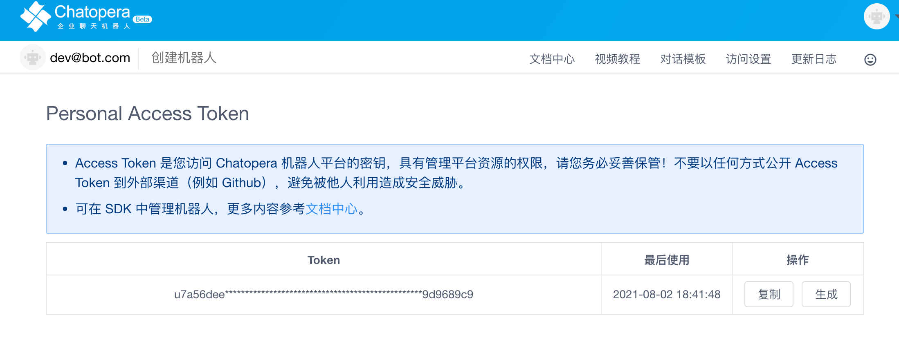

## `Chatopera` 类

### 实例化

`Chatopera`类是与 Chatopera 机器人平台集成的一个高级类，因为 Chatopera 云服务为开发者提供聊天机器人服务，`Chatopera`类的对象就是 Chatopera 云服务中一个注册账户的代理。

<h4><font color="purple">构造函数</font></h4>

```
Chatopera(accessToken [, botProvider])
```

<h4><font color="purple">参数说明</font></h4>

| name        | type   | required | description                                                                                                                      |
| ----------- | ------ | -------- | -------------------------------------------------------------------------------------------------------------------------------- |
| accessToken | string | &#10004; | 在[机器人控制台/访问设置](https://bot.chatopera.com/dashboard/accesssettings)中获取，即 `Personal Access Token`                  |
| botProvider | string | &#10008; | Chatopera 机器人平台地址，<br><font color="green">当使用 Chatopera 云服务时，该值为 https://bot.chatopera.com，也是默认值</font> |

在机器人控制台，打开【访问设置】:

<table class="image">
    <tr>
        <td></td>
    </tr>
</table>

刚刚注册的账户需要点击`生成`进行初始化；点击`复制`将 Token 值复制到粘贴板。

注意：**Personal Access Token(简称：Access Token) 是您访问 Chatopera 机器人平台的密钥，具有管理平台资源的权限，请您务必妥善保管！不要以任何方式公开 Access Token 到外部渠道（例如 Github），避免被他人利用造成安全威胁。**

<h4><font color="purple">更多实例化例子</font></h4>

不同语言下，`Chatopera` 类的包名或引用方式不同。

<h5><font color="purple">Node.js</font></h5>

```
const { Chatopera } = require('@chatopera/sdk');
...
const chatopera = new Chatopera(accessToken[, botProvider]);
```

<h5><font color="purple">Java</font></h5>

```
import com.chatopera.bot.sdk.Chatopera;
...
Chatopera chatopera = new Chatopera(accessToken[, botProvider]);
```

<h5><font color="purple">Python</font></h5>

```
from chatopera import Chatopera
co = Chatopera(accessToken[, botProvider])
```

<h5><font color="purple">PHP</font></h5>

假设使用[composer](https://getcomposer.org/)作为包管理工具，其它安装方式参考[chatopera-php-sdk](https://github.com/chatopera/chatopera-php-sdk)。

```
<?php

include_once **DIR** . "/vendor/autoload.php";
$chatopera = new Chatopera\SDK\Chatopera($accessToken[, $botProvider]);

```

<h5><font color="purple">Go</font></h5>

```
import (
	"github.com/chatopera/chatopera-go-sdk"
)
...
var co = chatopera.Chatopera(accessToken[, botProvider])
```

### 发送请求

`Chatopera`实例的核心接口是`command`，以下也使用`Chatopera#command`来指这个接口，该接口是对 RestAPI Request 的高级封装，内部完成**签名认证**，**RequestHeaders**和**RequestBody**等处理。

<h4><font color="purple">接口规范</font></h4>

```
result = chatopera.command(method, path [, body])
```

> **提示：** result 返回在 Node.js 中使用`await`或`Promise`，参考[快速开始](/products/chatbot-platform/integration/quick-get-start.html)；其它语言直接用 `=` 便可获取。

<h4><font color="purple">参数说明</font></h4>

| name   | type           | required | description                                                                                  |
| ------ | -------------- | -------- | -------------------------------------------------------------------------------------------- |
| method | string         | &#10004; | 对于资源的具体操作类型，由 HTTP 动词表示。有效值包括`GET`，`POST`，`PUT`，`DELETE`和`HEAD`等 |
| path   | string         | &#10004; | 资源的执行路径，通常包含资源实体名称或唯一标识，也可能在 `path`中使用`queryString`传递参数   |
| body   | `JSON`数据结构 | &#10067; | `body` 是请求中的数据，对应 RestAPI 中的 Http Body                                           |

`method`不同动词代表的含义一般如下：

- GET - 从服务器取出一项或多项资源；
- POST - 在服务器创建一个资源；
- PUT - 在服务器更新一个资源；
- DELETE - 在服务器删除一个资源。

还有更多类型的`method`，没有上述几种常用，在此不进行赘述。

`queryString`是 URL 的一部分。典型的 URL 看起来像这样: <font color="green">http://server/resource?</font><font color="blue">foo=A&bar=B</font>。其中，<font color="blue">foo=A&bar=B</font>就是`queryString`，通常用来传递参数，这个例子中包含两个参数：`foo`值为`A`；`bar`值为`B`。在下文中，`path`参数中可能包含`queryString`，形式如<font color="blue">foo={{var1}}&bar={{var2}}</font>，需要把`{{var1}}`和`{{var2}}`替换为实际值。

`body`数据是 JSON 格式的，不同语言对于 JSON 格式支持方式不同。[JSON](https://www.json.org/json-en.html)是一种轻量级的数据交换格式，描述了使用键值对、数组、字符串、数字、日期和布尔类型等值存储对象。[JSON](https://www.json.org/json-en.html)在不同语言下，等价数据结构如下。

| 语言       | JSON Object                                                                            | JSON Array                                                                            |
| ---------- | -------------------------------------------------------------------------------------- | ------------------------------------------------------------------------------------- |
| JavaScript | `{...}`                                                                                | `[...]`                                                                               |
| Java       | [org.json.JSONObject](https://www.tutorialspoint.com/org_json/org_json_jsonobject.htm) | [org.json.JSONArray](https://www.tutorialspoint.com/org_json/org_json_jsonobject.htm) |
| PHP        | 基本类型`array`                                                                        | 基本类型`array`                                                                       |
| Python     | 基本类型`dict`                                                                         | 基本类型`list`                                                                        |
| Go         | `map[string]interface{}`                                                               | `[]map[string]interface{}`                                                            |

**下文表述时，统一使用`JSON`，`JSON Object`和`JSON Array`代表 JSON 数据结构和其不同语言下的等价数据结构。**

> **提示：** 相对而言，JSON 等价的数据结构，在获取`JSON Object`的键值或`JSON Array`的长度和成员时，语法不同，但都易于掌握。在使用时，参考不同 SDK 的[示例程序](/products/chatbot-platform/integration/index.html#下载-sdk)。

**`body`是否必填以及是`JSON Object`还是`JSON Array`，取决于`method`和`path`的值，不同`method`和`path`的组合对应了不同的接口功能，满足不同需求，下文将介绍满足各种需求的`method`和`path`，并各个说明`body`参数。**

### 返回值

**返回值**即请求结果，针对接口定义，`Chatopera#command`的返回值`result`是 `JSON Object`，并有以下属性。

| key            | type   | description                                                                                                           |
| -------------- | ------ | --------------------------------------------------------------------------------------------------------------------- |
| `rc`           | int    | response code，返回码，大于等于 0 的正整型。`0`代表服务器端按照请求描述，正常返回结果；`rc` 不等于 0 是代表异常返回。 |
| `data`         | JSON   | 数据资源。正常返回时，服务器端执行逻辑成功，比如查询时，`data`就是查询结果。                                          |
| `msg`          | string | 消息，当服务器端执行请求成功，并且不需要返回数据资源时，通过 `msg`代表文本信息，比如提示信息。                        |
| `error`        | string | 异常消息，当服务器端返回异常时，具体出错信息包含在`error`中。                                                         |
| `total`        | int    | 分页，所有数据记录条数。                                                                                              |
| `current_page` | int    | 分页，当前页码，（分页从 1 开始）。                                                                                   |
| `total_page`   | int    | 分页，所有页数。                                                                                                      |

每次请求结果中，`rc`是必含有的属性，其它属性为可能含有。不同`rc`的正整数形代表不同的异常，`data`、`status`以及分页信息，则因`method`和`path`而异，以下进行详细介绍。

> **提示：** 不同语言对返回值可能进行了封装，但是不离其宗，都是基于以上定义，比如 Java SDK 中，定义`com.chatopera.bot.sdk.Response`作为`Chatopera#command`接口返回值，`Response`类提供`getRc`、`getData`和`toJSON`等方法，提升代码可读性。在使用时，参考不同 SDK 的[示例程序](/products/chatbot-platform/integration/index.html#下载-sdk)。

下文中使用的`method`，`path`，`body`和`result`等均代表以上介绍的概念。

## 机器人管理

### 创建聊天机器人

```
Chatopera#command("POST", "/chatbot", body)
```

示例代码：[Node.js](https://github.com/chatopera/chatopera-nodejs-sdk/blob/master/test/chatopera.test.js) | [Java](https://github.com/chatopera/chatopera-java-sdk/blob/master/src/test/java/com/chatopera/bot/sdk/ChatoperaTest.java)

<h4><font color="purple">body / JSON Object</font></h4>

```
{
 "name": "小巴",
 "primaryLanguage": "zh_CN",
 "fallback": "请联系客服。",
 "description": "我的超级能力是对话",
 "welcome": "你好，我是机器人小巴巴",
 "trans_zhCN_ZhTw2ZhCn": false
}
```

| key               | type   | required | description                                                                                                                                                                                                           |
| ----------------- | ------ | -------- | --------------------------------------------------------------------------------------------------------------------------------------------------------------------------------------------------------------------- |
| `name`            | string | &#10004; | 机器人名字。                                                                                                                                                                                                          |
| `primaryLanguage` | string | &#10008; | 聊天机器人语言，目前支持简体中文（`zh_CN`）、繁体中文(`zh_TW`)、英文（`en_US`）、日语（`ja`）、泰语（`th`）。 默认为 `zh_CN` .当使用 `zh_CN` 时可开启自动识别繁体并翻译(`trans_zhCN_ZhTw2ZhCn`: true)，默认为 false。 |
| `fallback`        | string | &#10008; | 兜底回复，当请求机器人对话时，没有得到来自多轮对话、知识库或意图识别回复时，回复此内容。                                                                                                                              |
| `welcome`         | string | &#10008; | 机器人问候语。                                                                                                                                                                                                        |
| `description`     | string | &#10008; | 机器人描述。                                                                                                                                                                                                          |

<h4><font color="purple">result / JSON Object</font></h4>

```
{
 "rc": 0,
 "data": {
  "clientId": "{{clientId}}",
  "secret": "{{secret}}",
  "name": "小巴",
  "description": "Test",
  "primaryLanguage": "zh_CN",
  "createdAt": "Mon Aug 02 2021 20:35:23 GMT+0800 (CST)"
 }
}
```

_clientId_: 初始化 [Chatbot 类](/products/chatbot-platform/integration/api.html) 的信息

_secret_: 初始化 [Chatbot 类](/products/chatbot-platform/integration/api.html) 的信息

### 获得聊天机器人列表

```
Chatopera#command("GET", "/chatbot?limit={{limit}}&page={{page}}")
```

示例代码：[Node.js](https://github.com/chatopera/chatopera-nodejs-sdk/blob/master/test/chatopera.test.js) | [Java](https://github.com/chatopera/chatopera-java-sdk/blob/master/src/test/java/com/chatopera/bot/sdk/ChatoperaTest.java)

<h4><font color="purple">path</font></h4>

| key   | type | default         | description      |
| ----- | ---- | --------------- | ---------------- |
| limit | int  | 默认值 20, 选填 | 返回数据条数     |
| page  | int  | 默认值 1, 选填  | 返回数据页面索引 |

<h4><font color="purple">result/ JSON Object</font></h4>

```
{
    "rc": 0,
    "total": 3,
    "total_page": 3,
    "data": [
      {
        "clientId": "{{clientId}}",
        "name": "TestBot1627889023922",
        "description": "",
        "primaryLanguage": "zh_CN",
        "createdAt": "Mon Aug 02 2021 15:23:44 GMT+0800 (CST)",
        "secret": "{{secret}}",
      },
      ...
    ]
```

_total_: 所有数据条数

_total_page_: 所有页面数

## 下一步

- [SDK 安装](/products/chatbot-platform/integration/index.html#sdk)

- [`Chatbot` 类详细说明：对话检索、机器人信息及更新，etc.](/products/chatbot-platform/integration/api.html)

## 评论

<script src="https://utteranc.es/client.js"
        repo="chatopera/docs"
        issue-term="pathname"
        label="Comment"
        theme="github-light"
        crossorigin="anonymous"
        async>
</script>
