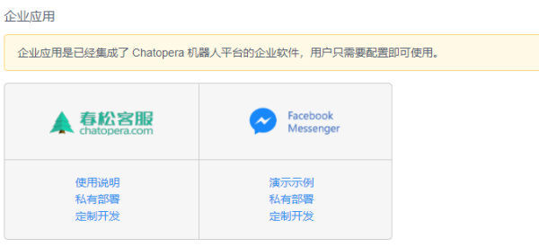
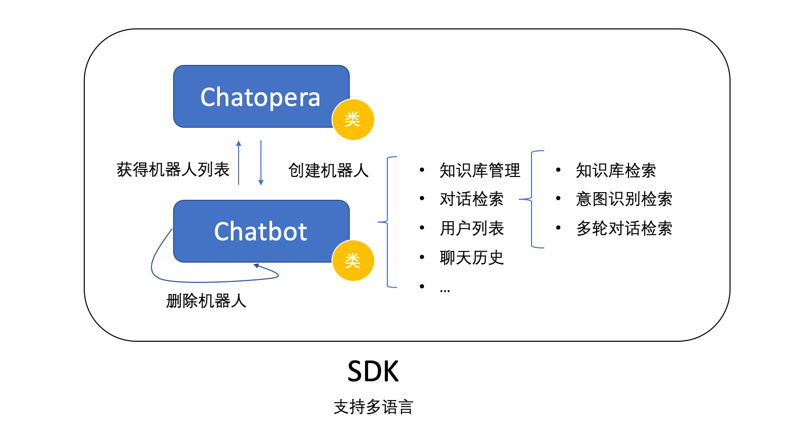
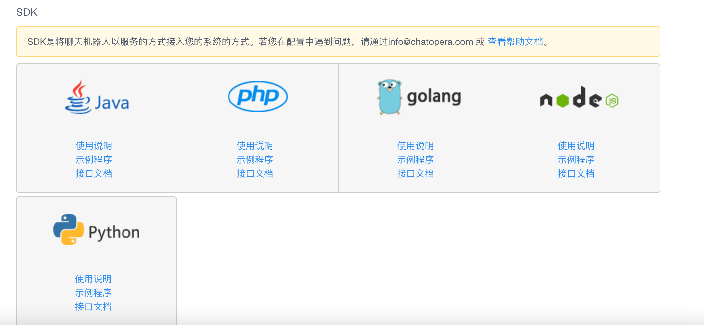

# 系统集成

## 概述

[**Chatopera 云服务**](https://bot.chatopera.com/)提供一站式实现聊天机器人的按量付费的云服务，企业或开发者可以使用 SDK 集成 Chatopera 云服务。Chatopera 云服务是 **Chatopera 机器人平台**的**软件即服务**版本，软件即服务也被称为[**SaaS（Software as a Service）**](https://baike.baidu.com/item/saas/6703273?fromtitle=%E8%BD%AF%E4%BB%B6%E5%8D%B3%E6%9C%8D%E5%8A%A1)。

## 企业应用

已支持的企业应用，Chatopera 机器人平台对春松客服和 Facebook Messenger 已经支持，在系统集成中，提供了完善的资料进行介绍。它们都是基于 Chatopera SDK 访问 Chatopera 云服务的，用户可以不用再开发，但 Chatopera 提供了开源码，在必要的时候，用户可以修改它们。

<table class="image">
    <caption align="bottom">企业应用</caption>
    <tr>
        <td></td>
    </tr>
</table>

## 飞书

Chatopera 云服务支持一键集成飞书，在飞书应用目录安装 Chatopera 应用后绑定 Chatopera 机器人到群聊或私聊。

<iframe src="//player.bilibili.com/player.html?aid=332580547&bvid=BV15A411L7Cn&cid=323563068&page=1" scrolling="no" border="0" frameborder="no" framespacing="0" allowfullscreen="true" width="600" height="400"> </iframe>

详细使用说明：[https://chatopera.feishu.cn/docs/doccnnLcv5AuenV1HHSvgVWbJmd](https://chatopera.feishu.cn/docs/doccnnLcv5AuenV1HHSvgVWbJmd)

## SDK

Chatopera 机器人平台用户可以在不同的软件系统、程序中接入 Chatopera 机器人。 SDK 是面向不同编程语言和 Chatopera 机器人平台集成的工具库，包括 Node.js、Go、PHP、Python、Java 等。

### 能力概述

SDK 能力概述：使用 `Chatopera` 类创建机器人、获得机器人信息；使用 `Chatbot` 类管理某一机器人的资源； `Chatopera` 类是系统账户级别，`Chatbot` 是单个机器人级别。

`Chatopera` 类使用控制台中【[访问设置](https://bot.chatopera.com/dashboard/accesssettings)】的 `Personal Access Token` 实例化，`Chatbot` 类使用每个机器人的 `clientId` 和 `secret` 初始化。

<table class="image">
    <tr>
        <td></td>
    </tr>
</table>

### 下载安装

SDK 简化了集成的复杂度，某些语言可以通过包管理工具安装。SDK 下载地址参考列表：

| 语言    | 下载地址                                                                      | 使用指南                                                                                                                                                                                            |
| ------- | ----------------------------------------------------------------------------- | --------------------------------------------------------------------------------------------------------------------------------------------------------------------------------------------------- |
| Python  | [chatopera-py-sdk](https://pypi.org/project/chatopera/)                       | [示例程序](https://github.com/chatopera/chatopera-py-sdk/blob/master/demo.py) / [技术支持](https://github.com/chatopera/status/issues/new/choose)                                                   |
| Java    | [chatopera-java-sdk](https://github.com/chatopera/chatopera-sample-java/wiki) | [示例程序](https://github.com/chatopera/chatopera-sample-java) / [技术支持](https://github.com/chatopera/status/issues/new/choose) / [JavaDocs](https://chatopera.github.io/chatopera-sample-java/) |
| Go      | [chatopera-go-sdk](https://github.com/chatopera/chatopera-go-sdk)             | [示例程序](https://github.com/chatopera/chatopera-go-sdk/blob/master/chatopera_test.go) / [技术支持](https://github.com/chatopera/status/issues/new/choose)                                         |
| PHP     | [chatopera-php-sdk](https://packagist.org/packages/chatopera/sdk)             | [示例程序](https://github.com/chatopera/chatopera-php-sdk) / [技术支持](https://github.com/chatopera/status/issues/new/choose)                                                                      |
| Node.js | [chatopera-nodejs-sdk](https://www.npmjs.com/package/@chatopera/sdk)          | [示例程序](https://github.com/chatopera/chatopera-sample-node) / [技术支持](https://github.com/chatopera/status/issues/new/choose)                                                                  |

为了方便开发者调用 SDK，每个 SDK 内均有示例程序或测试程序作为参考。

> **提示：** 以上 SDK 同时支持私有部署的 Chatopera 机器人平台。

在聊天机器人的一级菜单，可以进入**集成页面**查看。

<table class="image">
    <caption align="bottom">集成</caption>
    <tr>
        <td></td>
    </tr>
</table>

如不能满足您使用环境或者语言的 SDK，请[创建工单](https://github.com/chatopera/docs/issues/new?template=1_help.md)进行描述，Chatopera 将尽快满足您的需求。

### 下一步

- [`Chatopera` 类详细说明：创建聊天机器人、获得聊天机器人列表，etc.](/products/chatbot-platform/integration/accesssettings.html)

- [`Chatbot` 类详细说明：对话检索、机器人信息及更新，etc.](/products/chatbot-platform/integration/api.html)

## 评论

