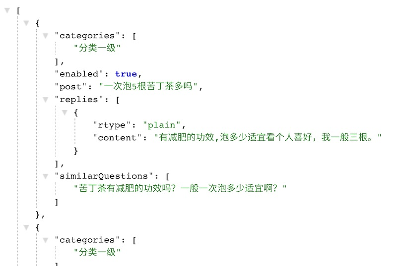
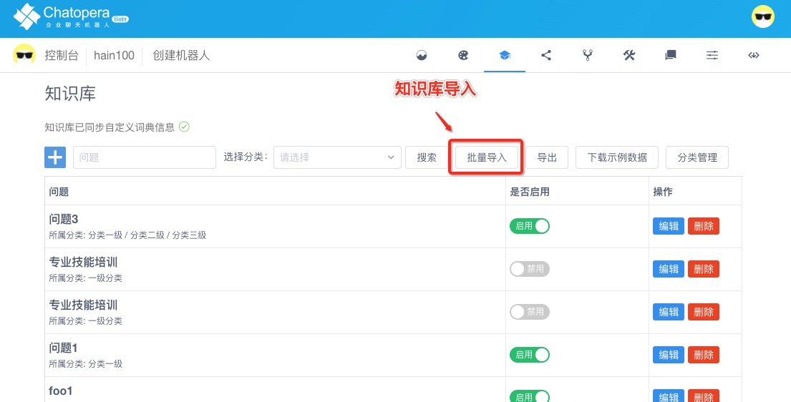
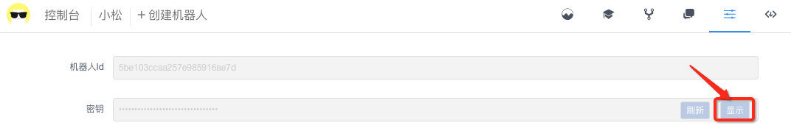

## 快速开始

本节以[Node.js SDK](https://www.npmjs.com/package/@chatopera/sdk) 为例子演示使用流程，更多 SDK 下载参考[链接](/products/chatbot-platform/integration/index.html#sdk)。

> **提示：** [Node.js](https://nodejs.org/en/) 是 JavaScript 运行时环境，面向服务器端应用开发，底层使用 Google V8 引擎。[Node.js](https://nodejs.org/en/) 尤其被前端开发者偏爱，因为它让前端开发者以“熟悉”的方式开发后端应用。[Node.js](https://nodejs.org/en/) 的出现一度降低了开发成本，并且成为“快应用”开发趋势出现，[Node.js](https://nodejs.org/en/) 包管理工具 [Npm 站点](https://www.npmjs.com/) 是开源领域最大的包管理服务。不同语言的 SDK 使用细节大同小异， 因为它们都是调用**Chatopera 机器人平台**的[RestAPIs](https://baike.baidu.com/item/RESTful)，这些 RestAPIs 是标准一致的。每种语言的 SDK 使用流程按照顺序包括：下载 SDK，实例化`Chatbot`类为对象，请求接口和处理返回结果。

## 注册账号

首先注册[Chatopera 云服务](https://bot.chatopera.com)的账号，如果您已经注册，直接进入下一步：创建机器人。

<table class="image">
    <caption align="bottom">登陆 https://bot.chatopera.com</caption>
    <tr>
        <td></td>
    </tr>
</table>

点击“[立即使用](https://bot.chatopera.com)”，初次登录输入“邮箱”和“密码”，点击“回车键”，完成账户创建。

## 创建机器人

登陆完成进入首页，点击“创建机器人”。

| 项目       | 值         | 描述                                                            |
| ---------- | ---------- | --------------------------------------------------------------- |
| 机器人名称 | 小松       | 机器人的名字                                                    |
| 描述       | 机器人示例 | 机器人的描述                                                    |
| 语言       | zh_CN      | 机器人的语言，目前支持中文(zh_CN)、繁体中文(zh_TW)和英文(en_US) |

其它项如兜底回复，问候语可以在创建后，设置页面修改。

## 导入知识库文件

接着，导入一些示例数据到知识库，作为体验用途，下载知识库示例文件[chatopera_faq_samples.json](https://static-public.chatopera.com/bot/faq/chatopera_faq_samples.json)，保存文件名为*chatopera_faq_samples.json*。

<p align="center">
  <b>知识库文件格式</b><br>
      
</p>

在该示例文件中，用 JSON 数组的形式存储了 100 个问答对，字段含义如下：

| key              | type     | required | description                                                                                                                    |
| ---------------- | -------- | -------- | ------------------------------------------------------------------------------------------------------------------------------ |
| categories       | [string] | false    | 分类名称，支持层级比如 `["一级", "二级"]`，服务器端自动创建对应分类                                                            |
| enabled          | boolean  | true     | 是否启用，代表该问答对导入后是否支持来访者检索                                                                                 |
| post             | string   | true     | 问答对的标准问                                                                                                                 |
| replies          | [object] | true     | 问答对的回答，数组长度大于 0, `content`是文本内容，`rtype`为`plain`表示`content`为纯文本; `rtype`为`html`表示`content`为富文本 |
| similarQuestions | [string] | false    | 问答对里的相似问                                                                                                               |

<p align="center">
  <b>上传知识库文件</b><br>
  <a href="http://bot.chatopera.com/" target="_blank">
      
  </a>
</p>

选择*chatopera_faq_samples.json*，这时，会显示问答对列表，点击“提交”，在进度条完成后，知识库导入成功。

## 获取*ClientId*和*Secret*

`SDK`中每个机器人实例需要通过*ClientId*和*Secret*初始化，这两个字段是认证和授权用途。打开机器人【设置】页面，拷贝*ClientId*和*Secret*。

<p align="center">
  <b>显示Secret</b><br>
  <a href="http://bot.chatopera.com/" target="_blank">
      
  </a>
</p>

## 安装 SDK

```
npm install @chatopera/sdk --save
```

## 实例化`Chatbot`类为对象

```
var Chatbot = require("@chatopera/sdk").Chatbot;
var chatbot = new Chatbot(clientId, secret [, serviceProvider]);
```

<h4><font color="purple">参数说明</font></h4>

| name            | type   | required | description                                                                                                                      |
| --------------- | ------ | -------- | -------------------------------------------------------------------------------------------------------------------------------- |
| clientId        | string | &#10004; | 在[机器人控制台/机器人/设置](https://bot.chatopera.com/dashboard)中获取                                                          |
| secret          | string | &#10004; | 获取办法同上                                                                                                                     |
| serviceProvider | string | &#10008; | Chatopera 机器人平台地址，<br><font color="green">当使用 Chatopera 云服务时，该值为 https://bot.chatopera.com，也是默认值</font> |

<!--  对号和差号， https://www.w3schools.com/charsets/ref_utf_dingbats.asp -->

> **提示：** 参数列表中，写在 `[]` 内的部分是选填参数，如果不填写使用默认值，下同。

## 调用接口示例

得到`Chatbot`实例后，怎么样请求接口服务呢？假设对该机器人的基本信息感兴趣，获取基本信息方式如下：

```
var response = await chatbot.command("POST", "/faq/query", {
  query: "不锈钢板现在是什么价格",
  fromUserId: "sdktest1",
});
console.log("response: ", response)
```

或者获取 `Promise` 返回

```
chatbot.command("GET", "/").then(
  (response) => {
    console.log("机器人名称：", response.data.name);
  },
  (err) => {}
);
```

此处，不深入探讨`await`和`Promise`的相关知识，它们是和 JavaScript 语言相关的内容。在这个例子中，我们请读者注意，给定一个机器人类的实例，再请求 API 服务是多么的简单，`Chatbot#command`接口提供了一系列的方法，也是下文给您详细介绍的重点。

## 评论

<script src="https://utteranc.es/client.js"
        repo="chatopera/docs"
        issue-term="pathname"
        label="Comment"
        theme="github-light"
        crossorigin="anonymous"
        async>
</script>
